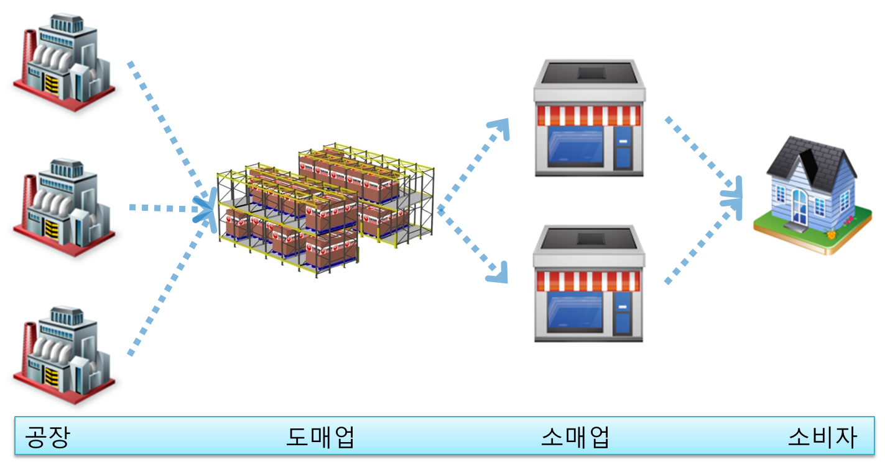

# DW, DM, OLAP의 이해

 

> 출처: https://unabated.tistory.com/entry/DW-DM-OLAP%EC%9D%98-%EC%9D%B4%ED%95%B4

 

이번 시간에서는 BI를 구축하기 위해서는 알아야 할 몇 가지 개념에 대해서 알아 보겠습니다.

아래 그림만 잘 이해할 수 있다면, 쉽게 이해가 되실 것 입니다.

 

 

공장에서 생산한 물건은 도매시장으로 넘어 오게 됩니다. 도매시장에서 다시 소매시장인 슈퍼마켓 등에서 물건을 구입하여 가정으로 오게 됩니다. 여러분들도 아시는 이러한 전통적인 프로세스는 물건이 공장에서 집으로까지 오는 일반적인 과정입니다.이러한 일련의 프로세스를 그대로 물건이 아니라 데이터에 비유하면 됩니다.

 

 

먼저, 정보를 생성하는 공장의 역할은 OLTP(On-Line Transaction Processing) 입니다. 기업 운영에 필요한 비즈니스 프로세스를 자동화한 시스템으로 인사, 급여, 구매, 생산, 재고, 물류 등 기업 운영의 전반적인 측면을 포함하고 있습니다. OLTP 시스템은 정보를 트랜잭션단위로 수집하고 분류, 저장, 유지보수, 갱신, 검색하는 기능을 빈번히 일어나는 수행 하는 시스템들입니다.

생산한 물건을 도매시장으로 모두 옮겼듯이, OLTP에서 발생한 데이터들을 모두 DW(Data Warehouse)라는 곳에 저장 합니다.사용자의 의사결정을 지원하기 위해 기업이 축적한 많은 데이터를 사용자 관점에서 주제별로 통합하여 아래와 같이 별도의 장소에 저장해 놓은 데이터베이스 입니다.

DW는 데이터 창고와 같은 개념이므로 몇 가지 특성이 있습니다.

- 정보데이터를 위한 중립적인 저장영역
- 의사결정을 지원하기 위한 정제된 데이터
- 데이터의 단일공급원
- 데이터에 기반한 의사결정의 효율성향상

 

 

DW는 과거에서는 구축실패가 많았다고 합니다. Enterprise Data Warehouse(EDW)라고 하여 전사적으로 빅뱅방식으로 한번에 모두 구축하려다 보니, 노하우부족과 성숙되지 않은 설계가 주된 이유였습니다. 현재는 모델링부터 데이터이관을 위한 시스템까지 체계적으로 되어 있어 과거와는 달리 많은 기업들이 DW를 구축하고 있으며 다음과 같은 장점을 얻게 됩니다.

- OLTP(운영시스템)을 보호하고 사용자 질의에 신속한 응답성능을 제공할 수 있다.
- 여러 시스템에 산재된 데이터들이 DW로 취합되고 통합되므로 사용자는 자신들이 필요로 하는 데이터를 쉽게 가져다 쓸 수 있다.
- 데이터는 DW로 옮겨오기 전에 정제 및 검증과정을 거치게 되며, 따라서 사용자는 양질의 데이터를 사용할 수 있다

소매업인 DM(Data Mart)는 이해관계가 동일한 사용자 집단의 특화된 사용자 중심의 데이터장고로서, 동질적인 사용자 집단에게 유사한 비즈니스 모델과 비즈니스 언어를 제공함으로써 데이터에 대한 가 독성을 높이는데 초점을 맞춰져 있습니다. 이러한DM에는 다음과 같은 특징을 가지고 있습니다.

- 부서나 사용자집단의 필요에 맞게 자유롭게 가공
- 각 부서는 다른 부서에 영향을 주지 않고 필요한 시점에서 원하는 어떠한 프로세스도 가능
- DM에 없는 데이터를 필요로 할 경우 DW에 드릴스루(Drill-Through)할 수 있는 환경도 고려

 

 

그러면 DW와는 무슨 차이가 있는 것일까요? DW는 최종사용자와의 인터페이스보다는 방대한 분량의 데이터를 효율적으로 통합하고 관리하는 측면에 보다 초점을 맞춘다. 따라서 사용자 측면에서 편리한 형태로 설계되지 않을 수 있습니다. 그리고 전사적인 용도로 구축되기 때문에 각 개별부서나 사용자 집단에 적합한 형태로 데이터가 저장되지 않는다. 따라서 사용자 질의에 최적의 성능을 제공하지 못할 수도 있습니다. 대부분의 사용자들은 DW의 전체 데이터 중 일부분만을 주로 사용할 것이며, 기업의 모든 사용자들이 DW에 대해 직접 질의를 수행하는 것은 많은 시스템 자원을 필요로 하며 시스템 성능에 심각한 부하를 줄 수 있기 때문에 분산된 DB영역에서 구축 하는 것이 바람직합니다.

OLAP에 대해서 한번 알아 볼까요?

RDB와 OLAP의 창시자인 E.F CODD 박사가 10년전 돌아 가셨는데, 대용량에서 다양한 쿼리 후 결과를 얻는 것에 대해서 RDB의 한계를 느끼고 20여년전에 12개의 제언을 하였습니다. 이후 이러한 사상을 바탕으로 OLAP제품이 만들어지고 COGNOS, MSTR, BO, SQL SSAS등이 각축을 벌이고 있으며, 지금은 사상이나 처리방법에 대해서 OLAP에 대한 방향이 어느 정도 자리가 잡혀있는 상황입니다.

OLAP(On-Line Analytical Processing)은 OLTP에 상대되는 개념으로써, 최종 사용자가 다차원 정보에 직접 접근하여 대화식으로 정보를 분석하고 의사결정에 활용하는 과정입니다.

 

 

오른쪽과 같은 내용의 질의를 OLTP에서 쿼리로 만든다면 시간도 오래 걸리고, 빠른 결과를 낼 수가 없으며, 결정적으로 2년치의 판매테이블을 모두 읽어서 결과를 보기 위해서는 OLTP시스템에 영향을 줄 수 밖에 없을 것입니다. 그렇다고 OLTP에서 모든 것을 예측해서 리포트를 만들거나 할 수 없으므로, 업무 담당자가 원하는 관점에 따라 자유자재로 만들기가 어렵습니다. 또한 별도의 집계테이블을 가지고 있지 않는 이상 10초 안에 답을 구하기란 어려운 일입니다. 10초의 기준은 아래 같습니다.

- 0.1초 : 시스템이 즉시반응 한다고 느끼는 한계
- 1초 : 사용자가 지연은 느끼나, 사고의 흐름이 중단되지 않는 단계,
- 2초 : 응답속도 지연에 대한 불만을 느끼지 않는 한계
- 3초 : 응답속도 기준의 품질 기준
- 10초 : 사용자가 현재의 작업에 주의를 집중할 수 있는 한계 
  (지연이 10초이상 될 경우 사용자는 다른 일을 하고 싶어함)

사고의 흐름이 끊기지 않고 계속 분석하여 원하는 답을 얻어내는 것이 중요 합니다. 그리고 여기서 사용자는 매출액을 기간, 매장, 제품, 실적이라는 네 가지 각도에서 분석하였는데, 그림으로 표현하면 다음과 같습니다.

 

 

이러한 다양한 차원으로, 분석 목적에 적합하게 사용자의 관점에서 설정하게 되는데 이를 다차원분석이라고 합니다.

OLAP의 목표는 다음과 같습니다.

- 직접접근

  전산 부서와 같은 정보 매개자를 거치지 않고 원하는 정보에 직접 접근하는 것입니다.

   

  

   

  직접접근의 필요성은 전산부서에 요청 후 리포트를 얻기까지의 시간이 걸리며, 정형화된 양식이나 정보를 가공하려면 다시 의뢰해야 하는 번거로움이 발생할 수 있습니다. 의사결정에 활용하기 위해서는 사용자가 쉽게 이해할 수 있고, 조조작하기 쉬운 형태로 존재 사용자의 관점으로 보여줘야 학 때문입니다. 그러므로 사용자가 필요한 시점에 정보 매개자의 도움 없이 정보원에 직접 접근하여 다양한 각도에서 분석을 수행 할 수 있어야 합니다.

- 대화식 분석

  하나의 질문에 대한 답은 또 다른 질문을 이끌어 냄으로써 사고의 흐름이 중간에 끊어지지 않도록 사용자 질의에 신속한 답을 제공해야 합니다

   

  

   

- 의사결정에 활용

  기존 OLTP는 실제로 발생하고 기록되는 시스템으로 무엇(What)초점이 맞춰져 있는 반면, OLAP은 다차원 정보분석을 하여 왜(Why)라는 의사결정 활용 과점으로 시스템이 구축되어야 합니다.

  BI프로젝트를 진행하다 보면, 일단 데이터를 모두 수집해와야 하고 모든 OLTP비즈니스를 담으려고 하는 강박관념에 빠지게 되면 자칫 프로젝트를 실패하게 됩니다. 항상 의사결정에 활용할 수 있는 것에 초점을 맞춰야 합니다. 리포트가 아무리 많아도 소용없으며, 단 하나의 리포트가 회사의 중요한 의사결정에 활용된다면, 100개의 리포트보다도 더 중요 합니다.

OLTP에서DW, DM, OLAP에 이르기까지의 과정에서 중간 중간에서 데이터를 이관하는 과정을 ETL이라고 합니다. E(Extraction – 추출), T(Transformation – 변형), L(Load – 적재)의 3가지 과정을 거치게 됩니다.ETL은 또는 ETT라고 합니다. 마지막에 T는 Transportation(수송) 입니다.

 

 

다음 그림과 같이 도식화할 수 있습니다. 중간에 변형작업에서 주로 하는 일은 바로 정제 입니다. OLTP에서 발생한 데이터를 그대로 이관하여 DW, DM을 만들게 될 때 가장 먼저 부딪히는 벽이 바로 데이터의 정합성 문제 입니다. 이를 해결하기 위해서 DQ(Data Quality)를 하게 되는데 다음에 알아 보도록 하겠습니다.

OLTP에서 DW로 바로 데이터를 넣기 전에 임시 영역이 있습니다. 이를 영어로 Staging 영역이라고 하며, 데이터베이스나 파일 시스템 기반의 물리적 저장소로서 각 영역 간의 데이터 이전/통합/가공을 원활히 하고 안정적으로 수행하기 위해 임시적으로 사용하는 영역이라고 할 수 있습니다.

DW에서 ODS(Operational data store)라고 하는 운영 데이터 영역은 분리된 각각의 원천 시스템으로부터 운영 데이터를 통합한 저장소를 말합니다. ODS에는 트랜잭션 레벨의 상세한 데이터가 전사적인 데이터 수요를 만족하는 일반적이고 통합된 데이터를 저장하고 있어 전사적인 정보가 트랜잭션 레벨의 상세한 형태로 중복이 제거되어 통합 저장되기 때문에, 운영 리포트를 제공할 수 있는 소스가 될 뿐 아니라 하나의 업무가 아닌 여러 업무에 걸친 현재 시점의 데이터를 통한 리포트 제공에도 활용됩니다. 이 영역은 때로는 고객이나 상품과 같은 핵심 주제 영역의 데이터 추출 용도의 마스터 데이터 관리 허브로 사용되기도 합니다.

이렇게 용어에 대해서 알아보았습니다. OLTP에서ODS, DW, DM, OLAP까지 한번에 오류 없이 데이터를 전송하기란 쉬운 일은 아닙니다. OLTP를 위한 시스템의 개발과는 달리 BI의 구축은 특히Data 에 관한 구체적인 지식이 요구되므로 데이터를 찾고, 품질을 높이고 데이터를 정련하는데 많은 시간이 소요됩니다. OLTP운영에서는 이상이 없지만, BI구축의 데이터 정합성 문제는 가장 큰 이슈입니다. 또 BI 개발이 끝났다 하더라도 OLTP에서 DB정보를 변경하는 일(컬럼 추가/삭제, 테이블 추가/삭제)은 비일비재합니다. 가장 안 좋은 케이스는 OLTP에서 제대로 된 ER-Diagram조차 없었을 때 입니다. 시스템의 분석을 위해 필요한 산출물이 없는 경우Reverse Engineering을 하기도 합니다. OLAP구축 전 단계인 DM까지 데이터를 이관하고 정합성을 체크하는데, 전체 개발기간의60% 이상이 할애되기도 합니다.

이번 시간에서는DW, DM, OLAP등 BI를 구축하기 위해서 필요한 용어 대해서 알아 보았습니다. BI를 구축하기 위해서는 많은 부서와의 협력이 필요 합니다. 특히 초기 구축에서는 정보부서의 도움이 필요하기 때문에, 기본적인 의사소통을 위해서는 정보부서를 포함하여, BI 구축과 연관된 부서에 이러한 용어 또는 개념에 대한 정보를 전달하는 것이 좋습니다.
