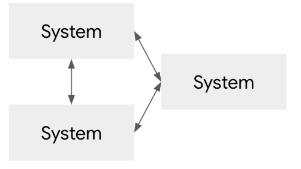
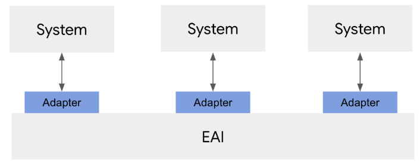
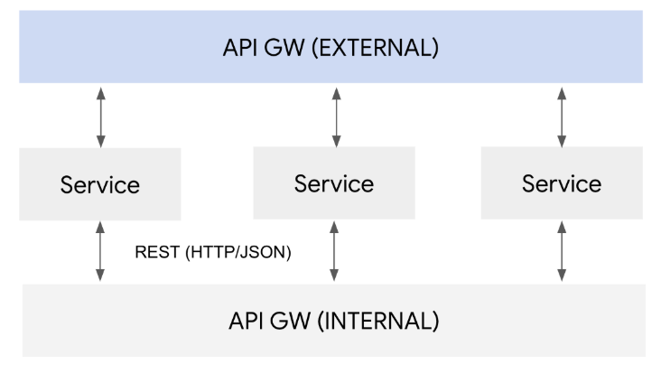
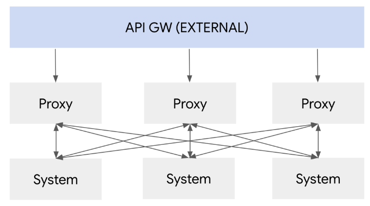
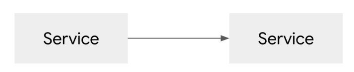
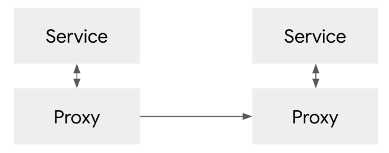
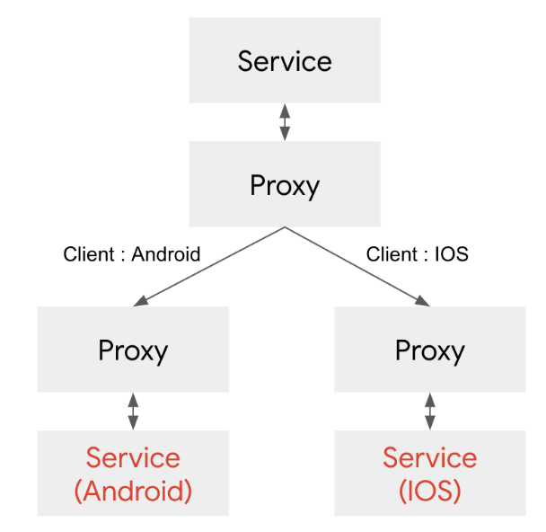

# EAI, ESB, API 게이트 웨이,서비스 매쉬

서비스간의 연동은 작게 보면 마이크로 서비스 아키텍쳐로 인한 문제 같지만,
서비스간의 연동은 마이크로 서비스 아키텍쳐 이전에도 자주 있어왔던 전통적인 문제이다.
이러한 문제를 소프트웨어 개발 프레임웍이 아니라, 솔루션 차원에서 풀기 위한 여러가지 노력들이 있었다.

## 시스템 통합 문제

메인 프레임 시대에서 유닉스 시스템으로 내려오면서 부터 시스템들은 업무 단위로 분리가 되기 시작했다.
ERP,CRM 등과 같은 시스템으로, 은행은 대내,대외,정보계와 같이 시스템으로 잘게 잘게 나눠지기 시작했는데,
당연히 이렇게 나눠진 시스템 사이에는 통신이 필요하게 되었고, 시스템이 거대화 되가면서,
시스템간에 직접 P2P로 통신하는 구조는 한계에 다다르기 시작하였다.

시스템이 서로 얽히고 어느 시스템이 어떤 시스템과 통신하는지 통제가 어렵게 되는 상황이 되었다.

## EAI (Enterprise Application Integration)

이러한 시스템간의 문제를 해결하기 위해서 등장한 솔루션이 EAI인데, 통합을 원하는 시스템을 기존에는 직접 1:1로 붙였다면,
EAI는 EAI가 중앙에 허브 역할을 하면서, 모든 통신을 EAI를 거치도록 하였다.

EAI의 가장 큰 특징은 표준화 되지 않은 이기종 시스템간의 연동을 가능하게 해준다는 것이다.
메인프레임 → Unix ERP 시스템으로 데이타를 전송하게 한다던지 Oracle → CRM 시스템으로 데이타를 전송해주는 것과 같은 시스템 통합을 지원했는데,
이는 이기종간에 통신 프로토콜이나 통합 방식을 변경할 수 있는 아답터를 제공하기 때문이다.

EAI는 복잡한 메세지 처리나 변동, 라우팅같은 다양한 기능을 가지고 있었지만, 주로 이 기종간의 메세지 변환이 가장 많이 사용되었다.
어쨌거나 이런 EAI는 중앙 통제를 통해서 1:1 / 다:다로 통신되는 복잡한 토폴로지를 통합하는 의미가 있다.

EAI 시스템이 점점 더 많아지자, 시스템 통합 아키텍쳐도 패턴화 되었다.
EIP (Enterprise Integration Pattern)이라는 형태로 정리되었는데, 아직도 참고할만한 구조가 많으니 관심이 있으면 참고하기 바란다.

https://www.enterpriseintegrationpatterns.com/patterns/messaging/toc.html

## SOA / ESB

이 기종간의 통합이 많아지고, 시스템이 점점 분리되다 보니, 아예 이를 표준화하고자 하는 작업이 진행되었는데,
이것이 바로 SOA (Service Oriented Archtiecture / 서비스 지향 아키텍쳐) 이다.

SOA 아키텍쳐의 컨셉 자체는 MSA와 유사하지만, XML 기반의 웹서비스와 맞춰져서 웹서비스를 대표하는 아키텍쳐가 되어버렸다.

(사실 SOA는 아키텍쳐 구현 컨셉이지 XML/HTTP를 대표하는 것이 아니지만, 시대적으로 벤더들에 의해 웹서비스로 포장되었다.
SOA는 시스템을 서비스로 나눈 다음 표준화된 인터페이스로 통신한다는 컨셉으로, 요즘의 MSA도 이 SOA의 부분 집합이라고 할 수 있다. )

웹서비스 기반으로 통신이 표준화되었기 때문에 서비스간의 통신은 EAI처럼 별도의 아답터가 필요없어졌다.
대신 서비스간의 통신을 서비스 버스라는 통신 백본을 이용하여 통신을 하는 구조가 되었다.

이론적으로는 매우 좋은 구조지만 웹서비스 자체가 스펙이 너무 복잡했고, 그 당시의 컴퓨팅 파워가 복잡한 XML을 파싱하기에는 충분하지 않았기 때문에
그다지 성공하지는 못한 아키텍쳐가 되었다.

특히나 ESB내에서 서비스간의 통신시에, 복잡한 XML 변환등을 사용하다가 ESB에 부하가 걸리게 되고, 제대로된 성능을 내지 못하는 결과를 낳게 되었다.

## API Gateway

엔터프라이즈에 의해서 IT가 주도되는 시대가 끝나고 웹과 서비스의 시대가 오면서 개방형 API 즉, 오픈 API가 각광 받는 시대가 오면서
시스템 내부간의 통합도 중요했지만 외부로 API를 서비스 하는 클라이언트 대 서버간의 통합 그리고 외부 서버와 내부 서버와의 통합이
중요한 요건으로 대두되었다.

웹 기반의 서비스들은 복잡한 형태의 메세징을 필요로하지 않았기 때문에 XML을 버리고 상대적으로 간단한 JSON이 메인으로 사용되었고,
이를 HTTP 통신에 사용하면서 HTTP/JSON 기반의 REST 아키텍쳐가 유행하기 시작했다.

그래서 API 게이트 웨이가 외부로 서비스를 제공하기 위한 솔루션으로 제공되고, 시스템 내부간의 통합도 HTTP REST 를 이용하여 마치 ESB처럼
내부 버스로써 내부 시스템 통합을 지원하였다.

그러나 API 게이트웨이의 주요 목적은 앞에서 언급한 시스템간의 통합보다는, 클라이언트와 서버 중간에서 API에 대한 라우팅이나 인증 처리와 같이
내부 API를 외부 서비스로 제공하는데 촛점이 맞추어졌다.

물론 API에 대한 중간 통로 역할을 한다는 의미에서 ESB의 대안 모델로 사용이 가능하기 때문에,
API 게이트웨이를 내부 서비스간 통신용으로 위치시키는 아키텍쳐도 있지만,  
원래 목적 자체가 API를 외부에 서비스 하기 위한 목적으로 디자인된 아키텍쳐이기 때문에 여러모로 맞지 않는 부분이 있다.

특히나 대부분의 API 게이트 웨이는 게이트 웨이 인스턴스(클러스터)를 포진 시키는 방식이라서
서비스간의 통합 포인트가 많아서 복잡도가 올라가는 경우 API 게이트 웨이에 많은 부하가 걸려서 성능 저하가 발생하고,
API 게이트 웨이가 장애가 날 경우 전체 서비스에 영향을 주는 (SPOF : Single Point of Failure) 가 된다는 단점이 있다.

## Service Mesh

이런 단점을 보안한 아키텍쳐가 서비스 매쉬 아키텍쳐이다.

API 게이트웨이와는 달리 외부로 서비스를 노출하기 보다는 내부 서비스간의 통신을 조율에 중점을 둔다.

구조적으로 중앙 집중화 구조를 벗어나서, 분산형 아키텍쳐를 취하는 구조이다. 그래서 SPOF를 생성하지 않고 스케일한 서비스를 지원하기 좋다.

그래서 근래의 마이크로 서비스 아키텍쳐에서 안정적인 구조는 외부 서비스는 API 게이트 웨이를 통해서 노출하고,
내부 서비스는 서비스 매쉬를 통해서 통제하는 구조가 된다.

서비스 매쉬의 개념은 다음과 같다.

서비스가 서비스를 호출 하는 구조가 있을때

위의 그림과 같이 서비스가 서비스를 바로 직접 호출 하는 것이 아니라, 아래 그림과 같이 프록시를 둬서, 프록시를 통해서 호출을 하게 하는 구조이다.

이러한 구조를 가지게 되면, 네트워크 트래픽을 컨트롤 하는 것을 서비스의 소스 코드 변경없이도 가능하다.
예를 들어 서비스가 다른 대상 서비스를 호출할때 아래 그림과 같이, HTTP 헤더에서, 클라이언트의 종류에 따라
트래픽을 안드로이드용 서비스나 IOS용 서비스로 라우팅을 할 수 있다.

이러한 구조의 장점은 서비스를 호출하는 쪽이나 호출 받는 쪽이나 소스 코드 변환이 필요 없이 가능하다는 것이다.

서비스 매쉬의 가장 대표적인 솔루션은 istio 라는 솔루션으로 다음 글에서는 Istio에 대해서 설명하도록 하겠다.

출처: https://bcho.tistory.com/1292 [조대협의 블로그]
