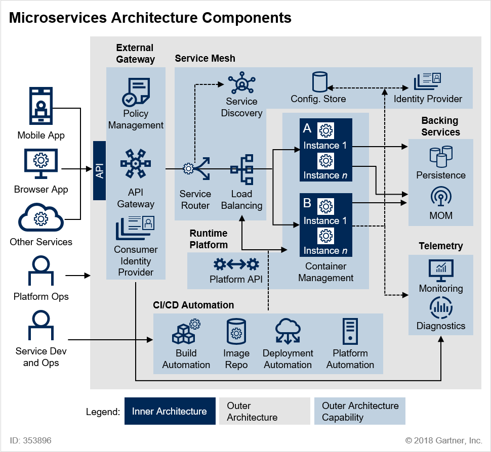
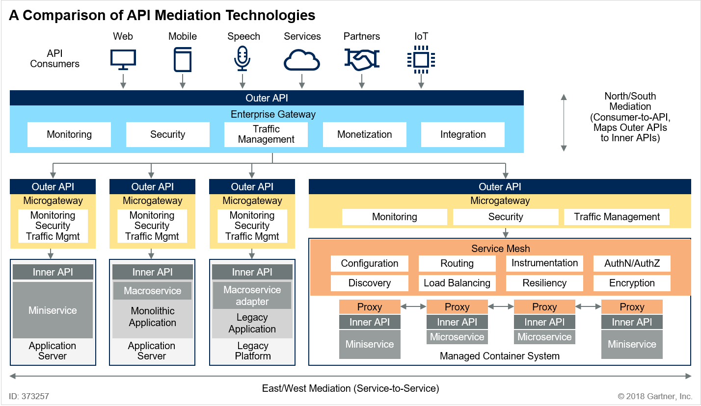
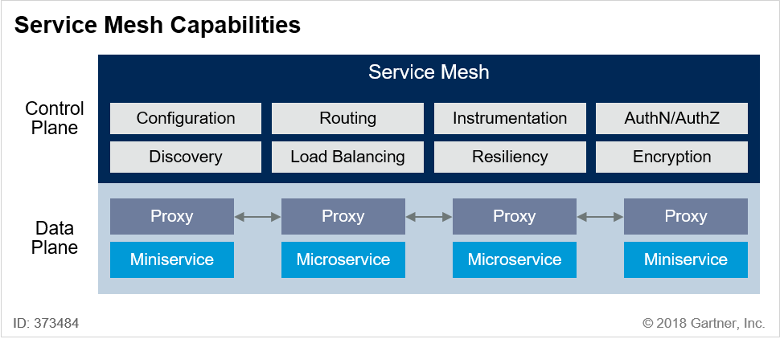
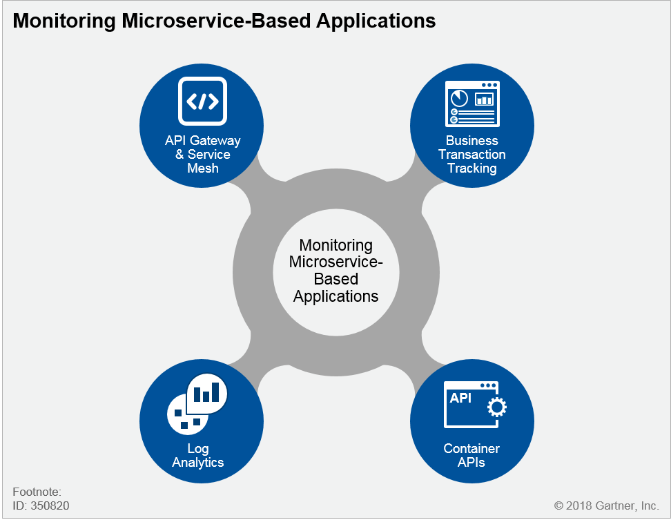

# [MSA 개념 정립하기] MSA 아키텍처 패턴 (Client, 운영자, 개발자 측면의 흐름)

 

출처 - [나라의 IT 잡아먹기 / [MSA 개념 정립하기] MSA 아키텍처 패턴 (Client, 운영자, 개발자 측면의 흐름)](https://waspro.tistory.com/432?category=857035)

 

본 포스팅에서는 MSA에 접근하는 Client, 운영자, 개발자측면의 흐름도를 살펴보도록 하겠습니다.

Microservice는 SOA(Service Oriented Architecture)의 경량화 버전으로 (Service: 특정 기능의 집합, service의 범위 정의가 중요) 모놀리틱 아키텍처(monolithic architecture)를 쪼개서 독립적으로 구분합니다.

Microservice는 독립적으로 디플로이/확장될 수 있는 서비스들을 조합하여 large 어플리케이션을 구성하는 아키텍처 패턴입니다.

일반적으로 Service Discovery, API Gateway, Orchestration, Choreography, Context Boundary등의 서비스들의 조합으로 이루어져있습니다.

Netflix, Twitter, Amazon, Nike 등의 회사에서 채택한 아키텍처로 소개되면서 '14년 초반부터 현재까지 주목 받고 있습니다.
아키텍처 관련 기술 표준은 없으며 SW벤더들이 기존 제품군(SOA, PaaS, ...)을 Microservices를 지원하기 위한 플랫폼으로서 rebrand하는 추세로 전환되고 있습니다.

 

>  **MSA 상세 아키텍처 패턴 분석 (gartner 자료)**  

 

**[그림 1] Microservices Architecture Components @ 2018 Gartner, Inc.**

 

본 이미지는 Gartner에 게시된 Microservice Architecture Components입니다.

앞서 살펴보았단 표준 아키텍처(개인적인 생각)를 보다 도식화하여 상세히 풀어 놓았습니다.

 

**1. 관리 컨테이너** : 개별 서비스 인스턴스에는 작동 할 컨텍스트가 필요합니다. 가상 컴퓨터, Docker 컨테이너 또는 조정 된 프로세스로 구현 된 관리 컨테이너는 이러한 기능을 제공합니다.
이 구성 요소는 인스턴스 관리 및 조정을 제공하고 필요에 따라 새 인스턴스를 회전하며 개별 인스턴스의 수명주기를 관리합니다.

**2. 외부 게이트웨이** : MSA 구현은 비즈니스 응용 프로그램 및 응용 프로그램에서 사용할 수있는 API 형태로 기능을 노출 할 수 있습니다.
서비스 외부 게이트웨이는 이러한 서비스에 대한 액세스를 관리하고 트래픽 관리 및 보안 정책을 적용하여 마이크로 서비스 환경을 보호합니다.
외부 게이트웨이 기능은 종종 API 관리 제품을 사용하여 구현됩니다.

**3. 서비스 메쉬 기능** : 서비스 메쉬는 서비스 간의 통신을 느슨하게 결합, 신뢰성 및 유연성을 유지하는 데 도움이되는 기능으로 구성됩니다.
이러한 기능을 통해 서비스 분리, 버전 관리 전략 지원 및 부하시 탄성 확장 성 관리가 가능합니다.

- 서비스 라우팅 : 클라이언트 응용 프로그램에서 또는 마이크로 서비스 사이의 요청은 구성 및 정책에 따라 올바른 마이크로 서비스로 라우팅해야합니다.

- 로드 밸런싱 : 각 마이크로 서비스의 인스턴스는 확장 성을 지원하기 위해로드 밸런싱이 필요하며로드 밸런싱의 세밀성 및 구성은 각 서비스를 관리하는 팀에 의해 제어되어야합니다.

- 서비스 발견 : 서비스는 느슨하게 결합 된 방식으로 검색 가능해야합니다.
  서비스 검색은 일반적으로 서비스 레지스트리를 사용하여 구현되며,이 서비스 레지스트리에서 마이크로 서비스 소유자는 런타임에 다른 서비스가 필요로하는 정보를 등록 및 구성하여 찾아서 호출 할 수 있습니다.
  이것을 네트워크 수준의 DNS와 유사하게 생각할 수 있습니다.
  서비스 발견은 또한 마이크로 서비스간에 존재할 종속성을 관리하는 데 도움을 주며 환경 변화를 관리 할 때 중요합니다.

- 구성 저장소 : 서비스 인스턴스는 마이크로 서비스와 전체 환경과 관련된 구성을 공유해야합니다.
  예를 들어 환경에 배포 된 마이크로 서비스에는 서비스 검색 레지스트리의 위치와 로그 이벤트를 내보내는 위치를 파악하는 방법이 필요합니다.
  마이크로 서비스 환경의 분산 특성으로 인해 분산 키 - 값 저장소를 사용하여 구현되는 경우가 많습니다.

- ID 공급자 : 서비스 인스턴스는 신뢰할 수있는 ID를 사용하여 통신해야합니다 ( "ID를 Microservices로 작성"참조 ).
  서비스 메시는 이러한 ID를 제공하고 유효성을 검사합니다. 여기에는 외부 ID 공급자 또는 디렉터리와의 통합이 포함될 수 있습니다.

**4. 서비스 이미지 레지스트리** : 사용자 환경의 어딘가에는 빌드되고 테스트 된 서비스의 불변 이미지를 저장하는 레지스트리가 있습니다.
이 저장소에 사용되는 기술은 사용하는 배포 단위에 따라 다릅니다.
코드 저장소 (동적으로 생성 된 서비스의 경우), Docker 이미지 레지스트리, 이진 아티팩트 저장소 또는 VM 이미지의 BLOB (Binary Large Object) 기반 저장소 일 수 있습니다.

**5. 메시지 지향 미들웨어** : 가장 간단한 MSA 구현은 HTTP와 같은 동기식 프로토콜 또는 gRPC 또는 Thrift와 같은보다 효율적인 프로토콜을 사용하여 지속 가능할 수 있습니다.
그러나 대부분의 MSA는 게시 / 가입 및 화재 및 잊어 버리기와 같은 이벤트 및 메시지 중심 패턴을 지원하기 위해 비동기 메시징 채널이 필요합니다.

**6. 빌드 및 테스트 자동화** : MSA의 개발 민첩성 이점은 개발 출력 품질을 극대화하고 전달을 간소화하기 위해 개발주기에서 높은 수준의 빌드 및 테스트 자동화가 필요합니다.

**7. 배포 자동화** : 개발 민첩성 이점을 완전히 실현하려면 배포를 자동화해야합니다.
새롭거나 향상된 마이크로 서비스의 배포를 자동화 할뿐만 아니라 외부 아키텍처 자체의 변경 자동화 (예 : 배포의 일부로 서비스 라우팅,로드 균형 조정, 서비스 검색 및 서비스 구성 데이터 업데이트)를 지원해야합니다.

**8. 플랫폼 자동화** : 마이크로 서비스의 런타임 확장 성과 적응성 이점을 실현하려면 외부 아키텍처에 기본 플랫폼과 관련된 자동화 기능 지원이 포함되어야합니다.
여기에는 VM 또는 컨테이너의 프로비저닝 및 각 마이크로 서비스의 실행중인 인스턴스 관리가 포함됩니다.

**9. 모니터링 및 경고** : 분산 환경은 환경에서 문제가 발생할 때 모니터링 및 경고의 복잡성을 증가시킵니다.
외부 아키텍처는 일관되고 효율적으로이를 수행 할 수있는 기능을 제공해야합니다.

**10. 로깅 및 진단** : 분산 환경에서 문제가 발생하면 근본 원인을 식별하고 격리하기가 어려울 수 있습니다.
분산 된 프로세스의 추적을 포함하여 자세한 계측 및 진단 분석을 지원함으로써 외부 아키텍처는 마이크로 서비스 팀이 문제를보다 신속하게 분류하고 해결할 수 있도록 지원합니다.

**11. ID 제공** : 토큰 기반 서비스를 사용하여 인증 및 권한 부여를 외부화하는 것은 안전한 고객 대 서비스 및 서비스 대 서비스 상호 작용을 보장하는 것이 좋습니다.

 

>  **Client 편**  

 

마이크로서비스에 접근할 수 있는 API는 Web, Mobile, Speech, Services, Partners, IoT 등 다양합니다.

Client는 이런 다양한 형태의 API 서비스로 호출할 수 있으며 이를 통합하여 처리하는 서비스가 API Gateway입니다.

 

**1. API Gateway는 다음과 같은 형태의 Mediation을 제공합니다.**

 

**[그림 2] A Comparison of API Mediation Technologies @ 2018 Gartner, Inc.**

 

위 이미지는 Consumer API vs Inner API간의 Mediation 그리고 Service to Service 간의 Mediation을 설명하고 있습니다.

Consumer API vs Inner API간의 Mediation은 모니터링, 보안, 트래픽 관리, 경량 통합 및 수익 창출 기능이 포함됩니다.

Service to Service 간의 Mediation은 분산 구성 관리, 동적 검색, 요청 라우팅, 로드 균형 조정, 모니터링, 자가 치유 복원 서비스, 인증 및 권한 부여 및 메시지 암호화가 포함됩니다.

**Enterprise Gateway**는 서비스 주변 진입 점에서 방어의 첫 번째 라인을 제공하고, API 소비자 사이의 트래픽을 관리하고 백엔드 중앙 집중식 모델을 사용합니다.
엔터프라이즈 게이트웨이의 예로는 **Google Apigee** 및 **CA API** 관리가 있습니다.

**microgateway**는 API를 엔드 포인트에서 last-mile 방어를 제공하기 위해 분산 모델을 사용합니다.
서비스가 어플리케이션 서버에 전개 될 때 API 소비자와 백엔드 서비스와 서비스사이의 트래픽을 관리합니다.
microgateway의 예로 **Kong**과 **Tyk**가 있습니다.

**Service Mesh**는 클러스터 컨테이너 시스템에 배치 miniservices 및 microservices에 대한 서비스 간 통신을 관리하는 분산 모델을 사용합니다.
서비스 메쉬 기술의 예로는 **Istio**와 **Linkerd**가 있습니다.

 

**2. Service Mesh는 사실상 마이크로서비스의 핵심이라고 볼 수 있습니다.**

 

**[그림 3] Service Mesh Capabilities @ 2018 Gartner, Inc.**

 

Service Mesh는 Miniservice 및 Microservice 환경 내에서 보안, 확장성 및 가용성을 향상시킵니다.

Service Discovery는 동적 발견을 지원하고 트래픽을 가로 채고 정책을 적용함으로써 마이크로 서비스 간의 경량 조정을 제공합니다.

현재 Service Mesh에는 Kerbernetes, PaaS (Service Platform as a PaaS) 또는 유사 탄력적으로 확장 가능한 환경과 같은 관리 컨테이너 클러스터 내의 Miniservice 및 Microservice에 대한 서비스 간 통신 관리가 있습니다.

다만, Service Mesh 기술은 비교적 새롭고 미성숙하는 점과 많은 주류 기업은 서비스 메시 기술에 대한 경험이 없으며 필요한 전문 지식이 유기적으로 개발하기 쉽지 않은지 확실하지 않다는 문제가 있습니다.

 

**[그림 4] A Spectrum of Service Mesh Technologies Based on Code Coupling @ 2018 Gartner, Inc.**

 

무엇보다 큰 문제는 Lock-in 이슈입니다.
Service Mesh는 특히 프레임 워크 또는 라이브러리 기반 솔루션을 사용할 때 lock-in을 생성 할 수 있습니다.
Linkerd 또는 Istio와 같은 사이드 카 패턴을 사용하여 배치되는 서비스 메시는 lock-in을 감소시키기 때문에 좋습니다.

사실상 Service Mesh를 대체할 수 있는 기술이 없기 때문에 마이크로서비스를 접하는 모든 IT인이 다루어야 할 기술입니다.

Service Mesh에 대한 설명이 길어졌지만, 결국 API Gateway를 통해 Service Mesh로 전달되면, Service Router를 통해 내부 로드밸러싱을 수행합니다.

이후에는 기존 레가시 서비스와 같이 서비스가 배포 된 Container에서 API를 처리합니다.

이때 성능상의 문제가 생겨서 Container가 또는 Instance가 다운되었을 경우 또는 신규로 생성되었을 경우 Automation 할 수 있는 Service Discovery의 역할을 수행합니다.

 

>  **Operator 편**  

 

운영자는 관리자 계정, 그리고 모니터링, 로깅, 트랜잭션의 관리 조금 더 나아가서 config 관리 및 사용자 관리 수준까지 접근하게 됩니다.

**1. Consumer Identity Provider를 통해 관리자 인증을 승인합니다.**

**2. Telemetry를 통해 Monitoring, Logging, Tracing을 관리하고 제어합니다.**

사실상 마이크로서비스를 전환하기위한 요건의 weakness 중 하나인 Monitoring & Diagnostics에 대한 방안을 제시하는 Telemetry입니다.

 

**[그림 5] Monitoring Microservice-Based Applications @ 2018 Gartner, Inc.**

 

Business Transaction Tracking을 어떻게 접근해 나갈 것인가에 대한 고민과 Log를 어떻게 분석해 나갈 것인가에 대한 커다란 문제를 가지고 가지고 접근하게 됩니다. API Gateway이 갖추고 있는 서비스를 연결해 주는 트랜잭션 기능과 sleuth & brave와 같은 application dependency가 추가 되는 방법 중 선택해야 하며, 이중 어떤 기준으로 모니터링하고 로그에 쌓으며 어떠한 로그를 뽑아 낼 것인가에 대한 ELK, EFK등의 추적 방식을 결정해야 합니다.

**3. 그밖에 configMap과 같은 configuration을 관리하여 이미지를 재생성하지 않고 컨피그 저장소에 업데이 후 참조하는 방식으로 관리할 수 있는 Service Mesh를 사용합니다.**

**4. 마지막으로 사용자를 관리하는 Identity Provider를 관리하는 역할을 수행합니다.**

 

>  **개발자 편**  

 

개발자는 가장 단순한 프로세스를 갖고 있습니다. CI/CD에 대한 설계가 나오면 생성 / 배포 하면 끝이기 때문이죠.

**1. 먼저 CI/CD Automation을 위한 Build Automation, Image Repository, Deploy Automation을 구축합니다.**

다양한 구축 관련 툴을 제시할 수 있지만, 일단 github, jenkins에 대한 범 공용성이 뛰어나니 그 이상의 이야기는 이후 CI/CD를 풀어 낼때 해보도록 하겠습니다.

**2. 생성된 이미지를 직접 Instance에 배포하거나 LoadBalancer를 통해 배포하면 모든 과정이 완료됩니다.**

이번 포스팅에서는 MSA가 진행될때 운영자, 개발자, Client는 각각 어떠한 마이크로서비스를 타고 수행되는지에 대해 알아보았습니다.
