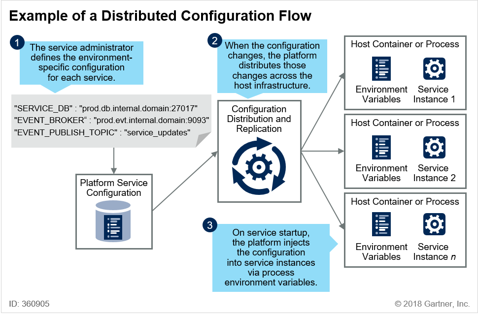

# [MSA 개념 정립하기] Service Mesh (Service Discovery, Service Router, Configuration)

 

출처 - [나라의 IT 잡아먹기 / [MSA 개념 정립하기] Service Mesh (Service Discovery, Service Router, Configuration)](https://waspro.tistory.com/435?category=857035)

 

본 포스팅에서는 Service Mesh의 다양한 구성 요소에 대해 알아보겠습니다.

먼저 Service Discovery는 Service Mesh의 주요 기능 중 하나로 분산 환경에서 동적으로 생성, 변경, 삭제되는 서비스 인스턴스의 접속정보를

자동으로 등록하고 삭제하고 관리하는 기능을 담당합니다.
Service Router는 Service Discovery와 연동하여 적절한 서비스 인스턴스로 API 요청을 전달하는 역할을 담당합니다.
마지막으로 Configuration은 동적으로 생성, 변경, 삭제 되는 서비스 인스턴스가 각종 설정 정보를 공유 저장소에서 가져와서 적용할 수 있도록 하는 요소입니다.

대표적인 제품으로 Service Mesh와 동일합니다.

|              |             오픈소스 직접 구현              |                                          상용 솔루션 활용                                          |                        Public Cloud 서비스                        |
| :----------: | :-----------------------------------------: | :------------------------------------------------------------------------------------------------: | :---------------------------------------------------------------: |
| Service Mesh | Netflix OSS Istio Linkerd Envoy | Pivotal PAS/PKA 제품에 MSA 관련 오픈소스 패킹하여 제공 (구현은 고객이 직접 해야 할 영역임) | AWS API Gateway ELB StepFunction Azure Service Fabric |

- Netflix OSS (오픈 소스, Spring Cloud Netflix 및 Steeltoe 프레임 워크 포함), Istio (오픈 소스)

- Buoyant Linkerd (오픈 소스 및 상용 라이센스), HashiCorp Consul (오픈 소스 및 상업 라이센스), Lightbend Lagom (오픈 소스 및 상용 라이센스)

- Aspen Mesh (상업용, Istio 기반), Microsoft Azure 서비스 패브릭 (상업용), AVI 네트워크 (상업용), Red Hat OpenShift Service Mesh (미리보기 : Istio의 상용 배포판)

 

OSS를 사용할 경우 기술 자유도와 자산화를 할 수 있다는 장점이 있지만, MSA를 구현하기 위한 노력과 투자가 필요하며, CSP의 경우 MSA를 구현하기 쉽고 인프라를 CSP에서 관리 해 줄수 있다는 차이가 있습니다.
상용 솔루션은 그 중간 정도로 개발 가이드와 컨설팅이 제공되어 MSA를 구현해 나갈 수 있습니다.

 

**[서비스 메쉬 기능]**

서비스 메쉬는 서비스 간의 통신을 느슨하게 결합, 신뢰성 및 유연성을 유지하는 데 도움이되는 기능으로 구성됩니다.
이러한 기능을 통해 서비스 분리, 버전 관리 전략 지원 및 부하시 탄성 확장 성 관리가 가능합니다.

 

---

 

㉠ 서비스 라우팅 : Service Router는 Clinet의 요청을 적절한 서비스 인스턴스로 전달합니다. External LoadBalancer의 역할을 수행하는 API Gateway이와 같이 Internal LoadBalancer의 역할을 수행합니다.

여기서 Client Side 방식의 Router는 API 클라이언에서 직접 Service Registry에 Query하여 서비스 인스턴스를 찾아가는 방식이며, Server Side 방식의 Router는 LoadBalancer에서 Service Registry를 확인하여 서비스 접속 인스턴스 위치를 판단하고 전달하는 방식입니다.

㉡ 로드 밸런싱 : 각 마이크로 서비스의 인스턴스는 확장성을 지원하기 위해 로드밸런싱이 필요하며 로드밸런싱의 세밀성 및 구성은 각 서비스를 관리하는 팀에 의해 제어되어야 합니다.

㉢ 서비스 발견 : 서비스는 느슨하게 결합 된 방식으로 검색 가능해야 합니다. Service Discovery는 일반적으로 서비스 레지스트리를 사용하여 구현되며, 이 서비스 레지스트리에서 마이크로 서비스 소유자는 런타임에 다른 서비스가 필요로하는 정보를 등록 및 구성하여 찾아서 호출 할 수 있습니다. 이것을 네트워크 수준의 DNS와 유사하게 생각할 수 있습니다. 서비스 발견은 또한 마이크로 서비스간에 존재할 종속성을 관리하는데 도움을 주며 환경 변화를 관리 할 때 중요합니다.

㉣ 구성 저장소 : 서비스 인스턴스는 마이크로 서비스와 전체 환경과 관련된 구성을 공유해야 합니다. 예를 들어 환경에 배포 된 마이크로 서비스에는 Service Discovery 레지스트리의 위치와 로그 이벤트를 내보내는 위치를 파악하는 방법이 필요합니다. 마이크로 서비스 환경의 분산 특성으로 인해 분산 키 - 값 저장소를 사용하여 구현되는 경우가 많습니다. Configuration은 동적으로 생성/변경/삭제되는 서비스 인스턴스가 설정정보를 공유저장소에서 가져오도록 하는 아키텍처 방식입니다. Configuration 저장소로 Git 형태의 공유저장소(웹 저장소)나 File Store를 사용할 수 있습니다. 컨테이너 플랫폼에서 제공하는 형태이며, Spring Cloud 등 개발 플랫폼에서 제공하는 다양한 형태가 있습니다.

㉤ ID 공급자 : 서비스 인스턴스는 신뢰할 수있는 ID를 사용하여 통신해야합니다. 서비스 메시는 이러한 ID를 제공하고 유효성을 검사합니다. 여기에는 외부 ID 공급자 또는 디렉터리와의 통합이 포함될 수 있습니다.

 

---

 

이상적인 마이크로서비스는 서비스간에 아무 것도 공유하지 않는 것입니다.
설계, 개발, 배치, 플랫폼 및 운영 관점에서 서로 분리 될 것입니다.
이러한 디커플링은 서비스의 설계 및 구현에 대한 결정을 다른 서비스와 완전히 독립적으로 만들 수 있습니다.

실제로 가장 잘 설계된 MSA 조차도 일부 서비스는 다른 서비스의 처리 및 데이터에 의존하며 모든 서비스는 운영 환경에서 제공하는 기능에 따라 달라집니다.
느슨하게 연결되고 늦게 묶일수록 이러한 의존성을 줄일 수 있습니다.

선택한 솔루션이 구성, 레지스트리 및 검색 기능을 구현하는 방법을 이해하면 응용 프로그램 아키텍처에 영향을 미칩니다.

서비스는 일반적으로 요청-응답 스타일의 인터페이스 또는 메시지 기반 인터페이스를 사용하여 서로 상호 작용합니다.
두 가지 스타일의 상호 작용에서 서비스 구현의 느슨한 결합에는 서비스의 늦은 바인딩에 도움이되는 도구가 필요합니다.

분산 구성 도구를 사용하면 구성 데이터를 서비스 코드 인스턴스와 분리 할 수 ​​있습니다.

Service Discovery 도구는 새로 시작된 서비스가 스스로 등록하고 소비자가 서비스에 액세스하고 사용하는데 필요한 정보를 (직접 또는 간접적으로) 발견 할 수 있는 메커니즘을 제공합니다.

 

**[분산 환경을 사용하여 서비스 분리]**

구성 데이터를 서비스 코드 인스턴스와 분리하면 서비스가 환경과 분리되어 이식성과 자동화가 향상됩니다.
구성 정보에는 다른 서비스의 위치 또는 주제, 대기열 및 데이터베이스의 이름과 같이 서비스 인스턴스가 작동하기 위해 필요로하는 환경 세부 정보가 포함됩니다.

 

[그림 1] 단일 마이크로 서비스의 기본 분산 구성 플로우 @ 2018 Gartner, Inc.

 

대부분의 플랫폼에서는 시작 후에 서비스 인스턴스가 변경되지 않는다고 가정합니다.

선택한 플랫폼에서 분산 구성 기능을 제공하는 경우 환경 구성을 제공하는 구체적인 방법은 플랫폼마다 다릅니다.

예 :

㉠ Cloud Foundary IBM 클라우드, Pivotal Cloud Foundary 및 SAP 클라우드 플랫폼에서 사용하는 프레임워크는 응용 프로그램 매니페스트에 응용 프로그램 별 환경 변수를 정의합니다.

㉡ Microsoft Azure Service Fabric을 사용하면 Azure Service Fabric 서비스 또는 actor 모델 프로젝트의 ApplicationManifest 매개 변수에 매핑 할 수 있는 Settings.xml 파일의 사용자 지정 구성 매개 변수를 정의 할 수 있습니다.

㉢ Kubernetes 위에 구축 된 Red Hat OpenShift 에는 "응용 프로그램 런타임"이라는 개념이 추가되었습니다. 응용 프로그램 런타임을 사용하면 템플릿 내의 pod 정의에 선언 된 환경 변수를 채우는 데 사용할 수있는 재정의 가능한 매개 변수를 정의 할 수 있습니다.

 

선택한 플랫폼이 분산 구성 기능을 제공하지 않거나 자신 만의 플랫폼을 구성하는 경우 Apache ZooKeeper , CoreOS 등의 기능 또는 HashiCorp Consul 과 같은 기능을 제공하는 서비스를 배포해야 합니다 .
그런 다음 서비스는 구성 데이터를 검색하기 위해 이 서비스가 제공하는 로컬 인터페이스를 사용해야 합니다.

 

**[Service Discovery를 사용하여 서비스를 서로 분리]**

서비스 레지스트리는 제공자 서비스 인스턴스가 가용성을 등록 할 수 있게 해주는 API를 제공합니다.
또한 레지스트리는 소비자가 서비스에 대한 미리 결정된 식별자를 기반으로 서비스 엔드 포인트를 검색하고 연결할 수 있도록 합니다.
서비스 엔드 포인트는 클라이언트 측 또는 서비스 측에서 관리 될 수 있습니다.
두 모델 모두 가능한 한 늦게 링크를 유지하고 소비자 및 공급자 인스턴스의 수명주기가 분리되도록 합니다.

 

[그림 2] 요청 - 응답 마이크로 서비스 통신을 위한 Service Discovery 패턴 @ 2018 Gartner, Inc.

 

서버 측 Service Discovery는 로드밸런서가 해결하는 단일 요청만 하면 되기 때문에 클라이언트 응용 프로그램보다 더 간단합니다.
그러나 시스템에 필요한 구성 요소의 수를 늘리고 부하 분산 장치가 서비스 및 클라이언트가 사용하는 모든 프로토콜을 지원해야 합니다.
클라이언트 측 Service Discovery는 유동성이 적지만 이는 클라이언트를 서비스 레지스트리에 연결하고 응용 프로그램 코드의 복잡성을 증가시킵니다.

 

서비스 레지스트리와 상호 작용하기위한 세 가지 공통 모델이 있습니다.

㉠ DNS : 이 모델은 동적 호스트 검색을 사용하기 위해 DNS 호스트 이름을 분석하는 기능을 가진 모든 사용자를 허용하지만 플랫폼간에 다를 수 있는 "수명"을 엄격하게 제어해야 합니다. 클라이언트 프로세스에 의해 해결 된 주소를 캐시하면 오래된 주소가 사용될 수 있습니다.

㉡ 플랫폼 관리 환경 변수 : 이 모델을 통해 소비자는 환경 변수를 쿼리하여 서비스 주소를 조회 할 수 있습니다.

㉢ 웹 API : 이 모델을 사용하면 클라이언트가 서비스 이름과 주소를 확인하기 위해 HTTP API (또는 API를 래핑하는 SDK (Software Development Kit))를 사용할 수 있습니다. 그러나 이 접근법은 서비스가 레지스트리에 대해 알고 있어야합니다.

 

과거 MSA를 선도적으로 도입한 기업들은 오픈소스 솔루션인 Netflix OSS를 사용하였습니다.
최근에는 Istio가 급격히 성장하고 있으며, Google, IBM, Amazon에서도 다양한 제품을 선보이고 있습니다.
Pivotal, RadHat 등에서도 상용화 제품을 계획하고 있습니다.

유명한 제품으로는 Istio, Linkerd, Netflix Common Runtime Services & Library가 있습니다.

 

다음시간에는 MSA를 구성할 경우 서비스 간의 Transaction과 관련된 모니터링/로깅/분석 분야를 살펴보도록 하겠습니다.
