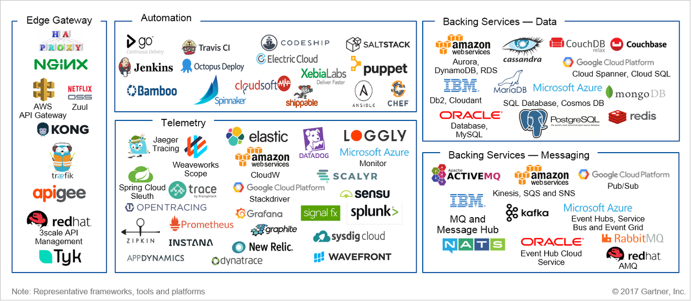

# [MSA 개념 정립하기] Telemetry

 

출처 - [나라의 IT 잡아먹기 / [MSA 개념 정립하기] Telemetry](https://waspro.tistory.com/443?category=857035)

 

본 포스팅에서는 Monitoring과 Diagnostics를 관리하는 Telemetry에 대해 알아보겠습니다.

마이크로서비스 아키텍처에서 Telemetry는 다양하게 발생가능한 이슈를 대비하기 위해 반드시 필요한 요소입니다.
분산 환경내에서는 이슈가 발생할 경우 Root cause를 밝히는데 어려움이 있습니다.
각 서비스별 발생가능한 이슈를 Composition하여 Tracing 해 나가는 다양한 리소스가 필요한 이유입니다.
Monitoring, Logging을 포함하여 Alerting 기능과 각 서비스 간 Tracing이 가능한 도구를 제공하여 지속적이고 효과적으로 모니터링하고 이슈에 대응할 수 있도록 하는 것이 중요합니다.

대표적인 제품으로

|                    |                                              오픈소스 직접 구현                                              |                           상용 솔루션 활용                            |      Public Cloud 서비스      |
| :----------------: | :----------------------------------------------------------------------------------------------------------: | :-------------------------------------------------------------------: | :---------------------------: |
| 모니터링/로깅/분석 | ELK, Grafana, Graphite,  Splunk, Fluentd, Logstash,  Kibana, Prometheus, Jaeger,  Zipkin, Squash | Datadog, Elastic, Sysdig,  AppDynamics, Dynatrace,  New Relic | AWS CloudWatch, Azure Monitor |

등이 있습니다.

MSA를 선도적으로 도입한 기업에게 자체적으로 만들어낸 솔루션을 포함하여 수많은 오픈소스 솔루션이 존재합니다.
전통적인 APM 벤더들이 빠르게 마이크로서비스용도의 상용제품을 내놓고 있는 상황입니다.

 

**1) Telemetry 주요 기능**

① Monitoring

모니터링은 MSA 구조에서 대상의 성능이나 효율성을 확인하는 서비스로, AWS에서는 AWS CloudWatch가 있고, OSS로는 Prometheus등이 있습니다.
모니터링은 각 대상에게서 수집한 Metric을 통해 대상 리소스의 사용률 등을 수치로 표현하는 기능을 수행합니다.

② Logging

Logging은 MSA 구조에서 대상의 log들을 수집해서 보여주는 서비스로, AWS에서는 AWS ElasticSearch가 있고, OSS로는 EFK 혹은 ELK가 있습니다.
각 대상에 배포된 Agent 역할을 하는 forwarder들이 로그를 수집해 aggregator가 그 로그를 쉬합하고, aggregator가 취합한 로그를 저장한 것을 Kibana등의 Visualization tool을 사용해 사용자 혹은 관리자에게 보여줍니다.

ex) Log aggregation, storage and analysis tools - for example, AWS CloudWatch, Microsoft Azure Monitor, Datadog, Elastic (ELK — ElasticCache/Logstash/Kibana), Google Stackdriver, Grafana, Graphite, Loggly, Prometheus, RisingStack Trace, Scalyr, Sensu, SignalFx, Splunk, Sysdig and VMware Wavefront

③ Tracing

Tracing은 MSA 구조에서 Event를 일어난 순서대로 나열해서 보여주는 서비스입니다.
AWS에서는 AWS X-Ray가 있고, OSS로는 Zipkin이나 Jaeger, Spring Cloud Sleuth, OpenTracing 등이 있습니다.
시간 순으로 요청을 보여주고 어떤 단계에서 성공 혹은 실패를 했는지 보여주기 때문에, MSA에서 어떤 부분에 오류가 발생했는지를 쉽게 파악할 수 있습니다.

 

**2) Telemetry 솔루션 비교**

수많은 제품의 비교 분석으로 사이트에 맞는 제품을 선정해 나가는 것은 매우 중요한 일입니다.

로깅 수집/분석 용도로는 ELK(Elastic Search, Logstash, Kibana)가 많이 사용되고 있으며, Datadog 같은 상용 솔루션도 시장을 확대해 가고 있습니다.

트랜잭션 추적 용도로는 Zipkin이 많이 사용되고 있습니다. Zipkin은 Pivotal의 상용 플랫폼에 패키징되어 제공되고 있습니다.

지금부터는 몇몇 주요 제품을 비교해 보도록 하겠습니다. 선택의 몫은 본인입니다.

① Monitoring

㉠ AWS CloudWatch

AWS CloudWatch는 AWS 클라우드 리소스 및 AWS에서 실행하는 어플리케이션을 모니터링 해주는 서비스입니다.
CloudWatch를 사용하여 각 지표를 수집하고, 추적하고, 로그파일을 수집하여 모니터링하며 Alert을 설정할 수 있습니다.
CloudWatch를 이용해 AWS 환경 내 각종리소스는 물론 어플리케이션과 서비스에서 생성된 사용자 지정지표와 어플리케이션에서 생성된 모든 로그파일을 모니터링할 수 있습니다.

CloudWatch를 사용하면 시스템 전반의 리소스 사용률, 어플리케이션의 성능, 운영 상태를 파악할 수 있습니다.
CloudWatch를 사용하면 자체 모니터링 시스템 및 인프라를 설정, 관리할 필요가 없습니다.

 

[그림 1] Amazon CloudWatch 작동 방식 @ 2018 Gartner, Inc.

 

하지만, 현재 EKS에 대한 수집은 되고 있지 않으며, Worker Node로 쓰이는 EC2 리소스의 정보만 수집이 됩니다. Node별 Container 배포 현황 등 컨테이너의 상세 정보 조회를 위해서는 별도의 솔루션 사용이 필요합니다.

㉡ Prometheus

Prometheus는 각 서버에 클라이언트를 띄우고, 서버가 클라이언트에 주기적으로 접속해 데이터를 가져오는 pull 방식을 통해 metric을 가져옵니다.
가져온 metric을 Prometheus 자체 UI 혹은 Grafana등을 사용해 Visualize합니다.

 

[그림 2] Prometheus Architecture @ 2018 Gartner, Inc.

 

Prometheus는 단순히 정보를 반복적으로 기록하는데 적합한 제품입니다.
고도의 다이나믹서비스 지향 아키텍처 모니터링뿐만 아니라 기계 중심 모니터링에도 적합합니다.

Prometheus는 장애 발생시 신속하게 문제를 진단 할 수 있도록 안정성을 위해 설계되었습니다.
각 Prometheus서버는 네트워크 저장소나 다른 원격 서비스에 의존하지않는 독립형 서버입니다.
따라서 Prometheus를 사용하려면 광범위한 인프라를 설정할 필요가 없습니다.

다만 Prometheus는 신뢰성을 중요시 합니다.
실패 조건에서도 시스템에 대해 사용 가능한 통계를 항상 볼 수 있습니다.
요청 별 청구와 같이 100%의 정확성이 필요한 경우 수집된 데이터가 상세하고 충분히 완벽하지 않기 때문에 Prometheus는 좋은 선택이 아닙니다.

② Logging

㉠ AWS ElasticSearch

Amazon Elasticsearch(Amazon ES)는 로그 분석, 어플리케이션 모니터링을 위해 Elasticsearch를 손쉽게 배포, 운영 및 확장해주는 완전 관리형 서비스입니다.
ES는 오픈소스 Elasticearch API, Kibana 관리 및 Logstash와 기타 AWS Services와의 통합을 제공하므로 모든 소스의 데이터를 안전하게 수집하여 검색하고 분석하고 실시간으로 시각화할 수 있습니다.
사용자는 CloudEWatch Logs 구독을 통해 빠르게 로그 항목을 Amazon ES로 스트리밍하도록 구성할 수 있습니다.
Kibana는 데이터를 시각화하여 검색할 수 있도록 해줍니다.

 

[그림 3] Elasticsearch Logging & Monitoring @ 2018 Gartner, Inc.

 

Elasticsearch는 정형데이터, 비정형데이터, 위치정보, 메트릭 등 다양한 유형의 데이터를 사용자가 원하는 방식으로 검색하고 결합할 수 있도록 지원합니다.
검색 쿼리와 일치하는 10개의 도큐먼트를 찾는 것과 수십억 줄의 로그를 이해하는 것은 별개의 문제입니다.
Elasticsearch 집계는 데이터를 확대하여 추이와 패턴을 살펴볼 수 있도록 지원합니다.

문제에 대한 답을 얻게 되면 데이터와의 관계도 즉시 바뀌게 됩니다. 사용자는 반복적인 작업을 통해 범위를 더욱 확장할 수 있습니다.

또한, Elasticsearch는 지금까지 경험할 수 없었던 환상적인 속도를 제공합니다.
Elasticsearch는 전문 검색 쿼리를 위해 유한 상태 변환기를 통한 역 인덱스를 구현하고, 숫자 및 위치 데이터 저장을 위해 BKD tree를 구현하였으며, 분석을 위해 열 저장을 구현했습니다.

㉡ ELK, EFK

EFK는 Elasticsearch(E), Fluentd(F), Kibana(k)로 이루어졌으며, Logging의 목적으로 사용됩니다.
Fluentd가 배포된 호스트에서 로그를 필터링하고 모으는 aggregator 역할을 하고, Elasticsearch가 모인 로그를 저장합니다.
저장된 로그를 Kibana가 Visualize하는 역할을 수행합니다.

Fluentd 대신 Logstash를 사용할 경우 ELK 조합이 됩니다.

|          구분          |          Logstash           |           Fluentd           |
| :--------------------: | :-------------------------: | :-------------------------: |
|       **강조점**       |      유연성/상호운영성      |        단순함/안정성        |
| **Event Routing 기준** |   Algorithmic statements    |            Tags             |
|    **Plugin 지원**     |            많음             |          매우 많음          |
|    **Plugin 설치**     |       쉬움 (jar 배포)       |          다소 복잡          |
|        **성능**        | 상대적으로 메모리 많이 사용 | 상대적으로 메모리 적게 사용 |
|       **신뢰성**       |   메시지 loss 가능성 있음   |      메시지 loss 없음       |
|     **Forwarder**      |        Elastic Beats        |    Fluent Bit & Fluentd     |

Aggregator를 지원하는 Plugin의 종류, 성능, 신뢰성 등이 Logstash보다 Fluentd가 낫기 때문에 AWS 기반이 아닌 OpenSource 기반으로 구축한다면 ELK Stack 보다는 EFK Stack을 권장합니다.

③ Tracing

㉠ AWS X-Ray

AWS X-Ray는 개발자가 마이크로 서비스 아키텍처를 사용해 구축된 애플리케이션과 같은 프로덕션 분산 애플리케이션을 분석하고 디버그하는 데 도움이 됩니다.

X-Ray를 사용해 자신이 개발한 애플리케이션과 기본 서비스가 성능 문제와 오류의 근본 원인 식별과 문제 해결을 올바로 수행하는지 파악할 수 있습니다.
X-Ray는 Request가 애플리케이션을 처리함에 따라 요청에 대한 End-to-End 뷰를 제공하고 애플리케이션의 기본 구성 요소를 맵으로 보여줍니다.
X-Ray를 사용하여 간단한 3-티어 애플리케이션에서부터 수천 개의 서비스로 구성된 복잡한 마이크로 서비스 애플리케이션에 이르기까지 개발 중인 애플리케이션과 프로덕션에 적용된 애플리케이션 모두 분석할 수 있습니다.

 

[그림 4] AWS X-Ray 작동방식 @ 2018 Gartner, Inc.

 

AWS X-Ray는 사용자 요청이 애플리케이션을 통과하는 전체 과정을 추적합니다.
X-Ray는 애플리케이션을 구성하는 개별 서비스 및 리소스에 의해 생성되는 데이터를 집계하여 애플리케이션 작동 상태에 대한 종단간 뷰를 제공합니다.

또한 AWS X-Ray를 사용하여 애플리케이션이 어떻게 작동 중인지에 대한 통찰을 얻고 근본 원인을 파악할 수 있습니다.
X-Ray의 추적 기능을 통해 요청 경로를 따라가며 애플리케이션의 어느 위치에서 무엇이 성능 문제를 유발하는지 정확히 파악할 수 있습니다.
X-Ray는 사용자가 트레이스에 메타데이터를 첨부할 수 있도록 주석을 제공합니다.
그러므로 트레이스 데이터 태깅 및 필터링을 통해 패턴을 확인하고 문제를 진단할 수 있습니다.

개발자 측면에서 성능에 대한 병목 현상을 식별하는데 유용합니다.
X-Ray의 서비스 맵을 통해 애플리케이션의 서비스와 리소스 간 관계를 실시간으로 확인할 수 있습니다.
손쉽게 지연 시간이 길어지는 지점을 확인하고, 서비스의 노드와 엣지 지연 시간 분포를 시각화한 후, 애플리케이션 성능에 영향을 주는 특정 서비스와 경로로 드릴 다운할 수 있습니다.

㉡ Zipkin

Zipkin은 마이크로서비스 기반 분산 시스템에서 Timing Data를 수집해 각각의 Latency를 분석해 문제해결을 할 수 있도록 해주는 분산 추적시스템입니다.
Application이 Zipkin 서버로 Time Data를 전달하면 Zipkin UI는 각각의 어플리케이션의 Request Tracing Data, Dependency Diagram을 보여 줍니다.
만약 Problem, Error를 가질 경우, Zipkin UI에서 어플리케이션 Trace의 Length, Annotation, Timestamp를 기준으로 Filtering하거나 Sort하는 기능을 사용할 수 있습니다.

 

[그림 5] Zipkin UI @ 2018 Gartner, Inc.

 

Zipkin을 구성하는 4 가지 구성 요소가 있습니다.

- Zipkin Collector : 추적 데이터가 Zipkin 수집기 데몬에 도착하면 Zipkin 수집기에서 조회를 위해 유효성을 검사하고 저장하고 색인을 생성합니다.

- Storage : Zipkin은 Cassandra가 확장 가능하고 유연한 스키마를 가지고 있으며 ElasticSearch 및 MySQL을 기본적으로 지원합니다. 다른 백엔드는 타사 확장으로 제공 될 수 있습니다.

- Zipkin Query Service : 데이터가 저장되고 색인이 생성되면 이를 추출해야합니다. 쿼리 데몬은 추적을 찾고 검색하기위한 간단한 JSON API를 제공합니다.

- Web UI : 웹 UI는 서비스, 시간 및 주석을 기반으로 추적을 보는 방법을 제공합니다.

㉢ Jaeger

Jaeger는 Uber Technologies에서 오픈소스로 배포한 분산형 추적시스템입니다.
마이크로서비스 기반 분산시스템(분산 컨텍스트 전파, 분산 트랜잭션 모니터링, 근본 원인 분석, 서비스 의존성 분석, 성능 / 대기 시간 최적화) 모니터링에 사용할 수 있습니다.

 

[그림 6] Jaeger UI Tracing @ 2018 Gartner, Inc.

 

Jaeger 백엔드는 단일 실패지점이 없고, 비즈니스 요구사항에 맞게 확장 할 수 있도록 설계되었습니다.
예를 들어 Uber의 모든 Jaeger 설치는 일반적으로 하루에 수십억 개의 기간을 처리합니다.

또한, Jaeger 백엔드는 Docker 이미지 컬렉션으로 배포됩니다.
바이너리는 명령행 옵션, 환경변수 및 여러형식(yaml, toml 등)의 구성 파일을 포함한 다양한 구성 방법을 지원합니다.
Kubernetes 클러스터 배포는 Kubernetes 템플릿 과 Helm 차트가 지원합니다 .

OpenTracing API를 사용하여 응용 프로그램을 설치하고 다른 곳에서는 사용할 수 없는 고급기능을 활용하기 위해 Jaeger 클라이언트 라이브러리에 바인딩하는 것이 좋지만 조직에서 이미 Zipkin 라이브러리를 사용하여 계측에 투자한 경우 모든 코드를 다시 작성할 필요가 없습니다.
Jaeger는 HTTP를 통해 Zipkin 형식 (Thrift 또는 JSON v1 / v2)의 범위를 허용하여 Zipkin과의 하위 호환성을 제공합니다.
Zipkin 백엔드에서 전환하는 것은 Zipkin 라이브러리에서 Jaeger 백엔드로 트래픽을 라우팅하는 것입니다.

마이크로서비스 전체를 효과적으로 모니터링하는 것은 매우 복잡한 일이며, 아키텍처 요소별 적절한 방안과 제품을 찾아 내는것은 매우 어려운 일입니다.

다만 서비스가 구분되면서 생기는 장점을 극대화하기 위해서는 각 서비스간의 연계 이슈 + Issue Tracking을 어떻게 효율적으로 해나갈 것인가를 고민하는 것입니다.

 

[그림 7] Representative Tools for Completing or Consolidating Your Microservice Outer Architecture @ 2018 Gartner, Inc.

 

Telemetry의 모든 솔루션을 비교하고 다루는 것도 중요하지만, 주요 서비스를 이해하고 본인만의 선택기준을 잡아나가는 것이 무엇보다 중요할 것입니다.

다음시간에는 Managed Container에 대해 살펴보도록 하겠습니다.
