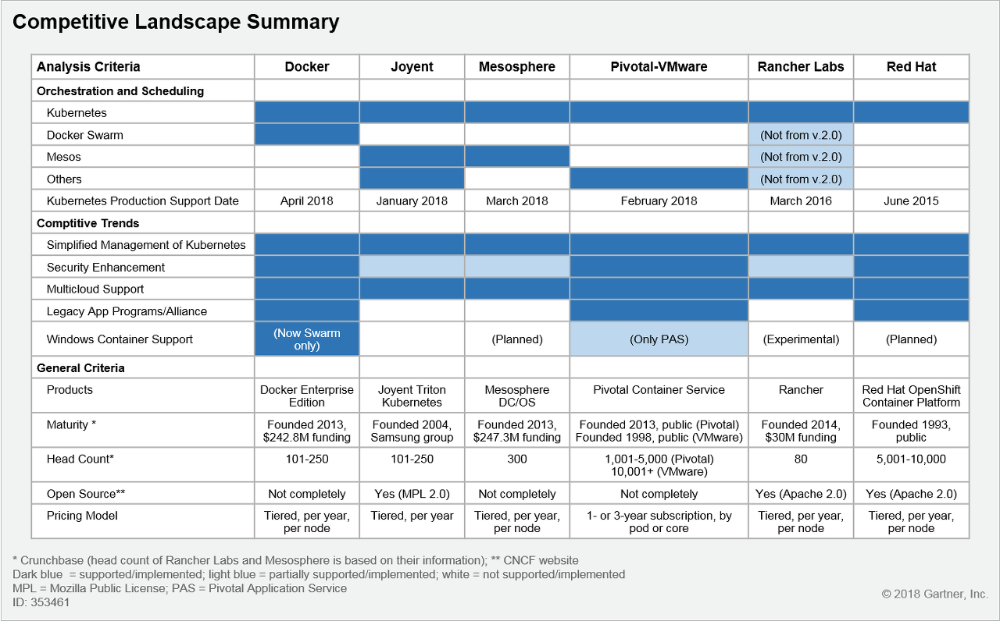

# [MSA 개념 정립하기] Managed Container

 

출처 - [나라의 IT 잡아먹기 / [MSA 개념 정립하기] Managed Container](https://waspro.tistory.com/446?category=857035)

 

본 포스팅에서는 Orchestration을 관장하는 Managed Container에 대해 알아보겠습니다.

마이크로서비스에서 Managed Container는 많은 개별 마이크로서비스 인스턴스의 실행을 관리하는 플랫폼입니다.
이 플랫폼은 자동화 도구를 이용한 서비스 프로비저닝 (CI/CD) 및 기본 물리적 인프라에 대한 서비스 인스턴스 할당을 관리 할 수 ​​있습니다.
또한 다른 Outer 아키텍처 기능을 구현하는 서비스를 Managed Container 플랫폼에서 호스팅 할 수도 있습니다.

마이크로서비스 아키텍처에서 Managed Container는 Docker 컨테이너, 가상머신, Orchestration Process로 구현되어 있습니다.

Managed Container는 인스턴스 관리, 오케스트레이션을 제공하고 필요에 따라 새 인스턴스를 구동하며 개별 인스턴스의 Life Cycle을 관리합니다.

최근 오픈하는 다양한 분야의 시스템들은 레거시 환경을 클라우드 환경으로 전환하거나, 클라우드 적용을 위한 응용프로그램 개발에 열을 올리고 있습니다.
특히 다양한 컨테이너 서비스 중 Kubernetes의 채택이 증가하고 있는 추세입니다.

엔터프라이즈 시스템의 운영배포를 위한 컨테이너 사용은 보안, 모니터링, 데이터 관리 및 네트워킹과 관련된 문제로 여전히 제약을 받습니다.

클라우드 응용 프로그램에는 높은수준의 인프라 자동화와 특수한 운영기술이 필요합니다.

**[Managed Container 소개]**

컨테이너에 대한 관심과 채택 속도가 빨라지지만 정작 해당 기술을 습득하고 반영하는 일은 매우 어렵습니다. 급격한 기술 성장 및 전문 인력 부족으로 인해 정확한 분석없이 남들 다 하는 클라우드 우리도 적용해 보자는 정도의 마음가짐으로는 역효과를 내기 충분하기 때문이죠.

즉 운영환경에 컨테이너를 실행하려면 Cloud 기술 및 DevOps에 대한 학습이 선행되어야 합니다. 컨테이너화를 요구하는 비즈니스 요구 사항을 현실적으로 파악하고, 적절한 기술을 보유하고 있는지 여부를 평가하는 것은 매우 중요합니다.

 

[그림 1] 컨테이너 작업 부하를 프로덕션 환경으로 이동할 준비가되었는지 판단 @Gartner (2019년 2월)

 

**[ Managed Container의 구성요소]**

컨테이너를 대규모로 전개 할 수 있게 해주는 컨테이너 관리 소프트웨어는 다음과 같은 구성 요소가 필요합니다.

 

[그림 2] 컨테이너 관리 시스템의 속성 @Gartner (2018년 8월)

 

① 이미지 레지스트리 - 컨테이너 이미지를 저장하고 검색하는 중앙 레지스트리입니다. 주요 고려 사항은 다음과 같습니다.

(1) 지원되는 응용 프로그램 개발 도구에 대한 개방성

(2) 응용 프로그램 인프라 이미지를 로드하거나 수정할 수 있는지에 대한 관리부여

(3) ID 및 액세스 관리 (IAM) 시스템과의 인터페이스

② API, 명령 행 인터페이스(CLI) 및 GUI(Graphical User Interface) - 컨테이너 서비스의 게이트웨이입니다. 다양한 수준의 추상화가 필요할 수 있습니다. 또한 개발자는 종종 CLI를 사용하여 도구 체인의 자동화 된 부분으로 만듭니다. 중요한 고려 사항은 사용의 용이성입니다.

③ 스케줄링, 오케스트레이션 및 클러스터 관리 - 이 기능을 사용하면 단일 호스트 이상으로 서비스를 확장 할 수 있습니다. 다른 솔루션은 Kubernetes 또는 Docker Swarm과 같은 오픈 소스 소프트웨어를 사용하는 반면 일부 솔루션은 독점 기술을 통해 이를 수행합니다. 일부는 고객에게 스케줄러를 선택할 수 있는 옵션을 제공합니다. 주요 고려 사항에는 툴링의 유연성과 다른 툴과의 통합 방법이 포함됩니다. 또 다른 중요한 고려 사항은 공유 된 테넌트 또는 개별 클러스터를 배포 할 것인지 여부입니다. 이 결정은 최종 사용자의 요구 사항에 따라 다릅니다.

④ 상태 보존형 응용 프로그램 지원 - 상태 비 저장 응용 프로그램을 지원 하는 것은 컨테이너 관련 기술에 고유한 기능입니다. 컨테이너는 이미지 형식의 불변 설계와 프로세스의 일시적인 특성뿐만 아니라 컨테이너 볼륨을 엔터프라이즈 스토리지에 매핑하는 기술 미숙 상태로 인해 상태 보존형 응용 프로그램에 고유한 문제를 제기합니다. 주요 고려 사항은 데이터 제공 기능이 데이터 지속성 및 보호 기능을 지원하고 타사 컨테이너 스토리지 솔루션과 통합 할 수 있는 능력입니다.

⑤ 모니터링 및 로그 관리 - 애플리케이션을 모니터링하고 관리해야 합니다. 원격 측정 서비스에는 모니터링, 경고, 로깅 및 진단이 포함됩니다. 기능의 폭과 깊이 외에도 주요 고려 사항은 텔레메트리 서비스를 얼마나 쉽게 사용할 수 있는지 입니다. 추가적인 핵심 고려 사항은 이미 사용중인 도구 또는 컨테이너 사용 사례를 특별히 충족시키는 타사 도구와의 호환성입니다.

⑥ 보안 및 통제 - 자원 수준 보안 및 IAM과 같은 컨테이너 별 보안 기능이 있어야 합니다. 예를 들어 개인 레지스트리 이미지에서 취약점을 검색해야 합니다. 필요한 경우 암호화가 옵션이어야 합니다. 불변 인프라의 사용, 보안 DevOps (DevSecOps) workflow를 지원하는 API기능 및 컨테이너를 네트워크 보안 기능에 통합해야하는 지원이 있어야합니다. 추가적인 주요 고려 사항은 액세스 할 여러 당사자 간의 직무 분리를 지원하는 기능입니다. 관리 구성 요소는 환경 자원 활용 및 액세스를 기반으로 정책을 정의하고 중앙 집중화하고 보고합니다.

⑦ DevOps Workflow - DevOps 툴링, CI/CD(Continuous Integration/Continuous Delivery) 파이프라인 툴 체인 및 컨테이너 이미지를 생성, 컨테이너 이미지를 이미지 레지스트리에 저장하고 검색합니다. 도구는 컨테이너 관리 소프트웨어와 통합됩니다.

⑧ 컨테이너 런타임 - 컨테이너 런타임은 레지스트리에서 컨테이너 이미지를 가져오는 클러스터 노드의 기능을 제공합니다. 호스트에서 컨테이너를 실행하기 위한 올바른 파일 구조를 배치하고, 네트워크 및 저장 장치 플러그인과 상호 작용할 수 있습니다. 컨테이너를 생성, 시작 및 중지 할 수 있습니다.

⑨ 네트워킹 및 로드밸런싱 - 컨테이너 기술(특히 컨테이너 오케스트레이션)은 네트워킹 및 로드밸런싱에 고유한 문제를 제시합니다. 레이어4에서의 로드밸런싱을 지원하지만 조직에서는 로드밸런싱을 구현하기 위해 레이어7 로드밸런서(게이트웨이), Kubernetes 입구 서비스 및 서비스메시를 구현하는 경우가 더 많습니다. 핵심 고려 사항으로는 네트워크 통합의 심도, 네트워크 정책 사양 및 적용, 구성 유연성 및 구현 용이성을 정의하는 기능이 있습니다.

⑩ Multicloud Capabilities - Multi-Cloud 계획이 있는 경우 특히 중요합니다. 주요 고려 사항에는 CSP 서비스와 어떻게 상호 작용하는지가 포함됩니다. 또한 여러 클라우드 환경을 사용하는 경우 페더레이션 수준과 함께 지원되는 클라우드 환경도 핵심입니다.

>  **Managed Container를 구성하는 전략적인 요소**  

운영환경에서 컨테이너를 배포하는 조직은 이에 상응하는 플랫폼 전략을 작성해야합니다.

① 보안 및 관리

② 모니터링

③ 스토리지

④ 네트워킹

⑤ 컨테이너 Life Cycle

⑥ 컨테이너 Orchestration

 

[그림 3] 플랫폼 전략의 요소 @Gartner (2019년 2월)

 

① 보안 및 관리

조직은 전체 라이프사이클에 걸쳐 컨테이너화 환경을 보호할 계획을 세워야합니다. 여기에는 응용 프로그램의 빌드 및 개발 프로세스, 배포 및 실행 단계가 포함됩니다.

- 업무처리 프로세스를 통합하여 소프트웨어 개발 수명주기를 빌드하고 실행하는 동안 응용프로그램을 검사하는 엔터프라이즈의 지속적인 통합/배포 (CI/CD) 프로세스의 일부로 취약점을 예방합니다. 오픈소스 구성요소, 라이브러리 및 프레임워크의 취약버전을 판단하는 것이 중요합니다.

- Docker 런타임 및 Kubernetes에서 사용할 수있는 CIS (Center for Internet Security ) 벤치마크를 사용하여 구성을 강화합니다.

- 의무적인 접근 통제를 설정하고 직무를 분리하며 비밀 관리 정책을 수립합니다. SSL(Secure Sockets Layer)키나 데이터베이스 자격 증명과 같은 중요한 정보는 오케스트레이터 또는 타사 관리서비스에서 암호화되며 런타임에 프로비저닝됩니다.

② 모니터링

개발자는 응용프로그램 컨테이너의 기능적 측면에 초점을 맞추고 있습니다. 일반적으로 모니터링 도구는 CPU 사용률, 메모리 사용률, 초당 입출력, 대기시간 및 네트워크 대역폭과 같은 호스트 수준의 Metric에 중점을 둡니다. 이러한 측정 항목은 운영팀에서 여전히 중요하지만 컨테이너 또는 서비스 수준에서 세분화 된 세부정보가 없기때문에 자체적으로 전체 그림을 그릴 수는 없습니다.

- 물리적 호스트가 아닌 "응용 프로그램"을 모니터링 할 수 있도록 서비스 수준에서 컨테이너 및 컨테이너 전반의 모니터링에 집중하는 것이 중요합니다.

- 컨테이너 오케스트레이션, 특히 Kubernetes와의 긴밀한 통합을 제공하는 도구와 공급 업체에 우선 순위를 부여합니다.

- 세분화된 로깅을 제공하고 자동화된 서비스 검색을 제공하며, 실시간으로 권장 사항을 제공 할 수있는 도구를 선택합니다.

③ 스토리지

파일 저장형태의 작업부하에 대한 컨테이너 채택이 증가함에 따라 고객은 호스트를 넘어 데이터 지속성은 물론 데이터 보호 필요성을 고려해야합니다. 응용프로그램이 크게 리팩터링되거나 새로운 마이크로서비스 중심의 상태 저장 응용 프로그램인 경우 인프라 및 운영 등의 작업 부하의 가용성, 민첩성 및 성능을 극대화 할 수있는 저장소 플랫폼이 필요합니다.

- 마이크로서비스 아키텍처 원칙에 부합하는 스토리지 솔루션을 선택합니다. 컨테이너 고유 데이터 서비스의 요구사항을 준수하고 API 중심적이며 분산된 아키텍처를 갖추고 Private 및 Public 클라우드 배치를 지원하는 아키텍처를 선택합니다.

- Lock-in에 주의합니다. 종속적인 플러그인과 인터페이스를 사용을 줄이고, 대신 컨테이너 스토리지 인터페이스 (CSI)와 같은 표준 인터페이스를 사용합니다.

④ 네트워킹

Agility와 Portability는 개발자의 최대 관심사이며 소프트웨어 개발의 Life Cycle 전반에 걸쳐 응용프로그램을 이식할 수 있어야 합니다. Private 및 Public 클라우드 인프라스트럭처로 확장 될 수 있습니다. IT가 모든 프로젝트의 개발, 테스트, 품질보증 및 생산을 위한 네트워크 환경을 만드는 전통적인 엔터프라이즈 네트워크 모델은 대부분 workflow와 일치하지 않습니다. 네트워킹 솔루션은 Kubernetes의 프리미티브 및 정책 엔진과 긴밀하게 통합되어야합니다.

- 서비스(CaaS) 또는 소프트웨어 정의 네트워킹(SDN) 솔루션으로 기존 컨테이너가 Kubernetes 네트워킹을 지원하는지 여부를 조사합니다. 지원하지 않는다면 컨테이너 네트워킹 인터페이스(CNI) 통합 네트워크 오버레이 및 정책 엔진을 선택합니다.

- 서비스(PaaS) 도구로 CaaS 또는 플랫폼을 선택하면 클러스터의 호스트에서 로드밸런싱 조정을 위한 컨트롤러가 지원됩니다. 지원되지 않을 경우 프록시 또는 서비스메시 기술을 고려합니다.

⑤ 컨테이너 Life Cycle

자동화되고 원활한 응용 프로그램 제공 파이프 라인을 위해 조직은 IaC (infrastructure-as-code) 제품과 같은 다른 자동화 도구로 컨테이너 조정을 보완해야합니다. 이러한 도구와 CaaS 제품이 겹칠지라도 오늘날 경쟁 제품보다 보완적입니다. 또한 컨테이너는 가상 머신 (VM) 배치와 비슷한 무분별한 전개 가능성을 제시합니다.

- 이미지 크기, 구성 요소를 추가하는 유연성 및 라이센스를 고려하여 컨테이너 기본 이미지에 대한 표준을 수립합니다.

- 컨테이너 구성관리시스템을 사용하여 Public 및 Private 저장소의 기본이미지 위에 구성되고 계층화되는 컨테이너 이미지의 수명주기를 관리합니다.

- CaaS 플랫폼을 응용 프로그램 자동화 도구와 통합합니다.

⑥ 컨테이너 Orchestration

오케스트레이션 및 스케줄링 레이어에는 컨테이너 배포의 주요기능이 제공됩니다. 컨테이너를 원하는 상태로 유지하고 SLA를 유지관리합니다. 스케줄링은 컨테이너를 오케스트레이션 계층의 요구 사항에 따라 클러스터의 최적 호스트에 배치합니다. 이 레이어는 다른 툴링 (예 : Apache Mesos가 스케줄링을 제공하고, Marathon이 오케스트레이션을 제공) 또는 단일 도구 (Kubernetes 또는 Docker Swarm)를 통해 제공 될 수 있습니다. Kubernetes는 컨테이너 오케스트레이션을 위한 사실상의 표준으로 떠오르고 있으며, 활발한 커뮤니티와 주요 상용 공급 업체의 지원을 받고 있습니다.

컨테이너의 보안 제어, 모니터링, 정책 관리, 데이터 지속성, 네트워킹 및 수명주기 관리에 대한 기본 요구 사항을 정의하고, 이를 지원하는 가장 잘 맞는 도구를 선택합니다.

- OS 및 컨테이너 런타임에 대한 깊이와 폭 넓은 지원

- 전체 제품의 런타임 안정성

- 확장성

- 상태 저장 응용 프로그램에 대한 지원 등급

- 운영상의 단순성과 벤더 지원 품질

- 오픈 소스에 대한 리더십, 참여 및 지원

- 구현 및 라이센스 비용

- 하이브리드 및 멀티 사운드 지원

>  **Orchestration을 위한 Managed Container 비교**  

제품을 선정하기 위한 기준은 너무나 많습니다. 단순히 OSS 제품을 사용한다면 얻을 수 있는 이득은 가격적인 측면과 종속성을 줄일 수 있다는 장점이 있지만, 유지보수의 단점이 있고, 반대로 CSP 제품의 경우 가격적인 부담과 Lock-in에 대한 문제가 있지만, 지속적인 지원을 받을 수 있다는 장점이 있습니다. 따라서 최근에는 서로 다른 제품을 혼합하여 배치하는데 관심이 커지고 있습니다.

클라우드 IaaS는 인프라 통합, 관리 및 심층적인 노하우를 제거 할 수있는 자원의 신속한 확장과 관리 서비스를 주문형으로 제공합니다. 대부분의 클라우드 제공 업체는 Managed Container 서비스를 제공하고 일부는 여러 오케스트레이터를 제공합니다. 네이티브 서비스 외에도 사내 구축 업체 (예 : Red Hat 및 VMware)는 클라우드 기반 제품을 완벽한 호스팅 서비스로 제공합니다. Platform9 및 Giant Swarm과 같은 타사 MDS (Managed Service Provider)도 유사한 서비스를 On-prem 및 클라우드에 제공합니다.

 

 

[그림 4] 클라우드에서 관리되는 컨테이너 서비스 @Gartner (2019년 2월)

 

Docker 런타임 및 관리 Kubernetes가 On-prem 및 Public 클라우드 환경에서 유비쿼터스화되고 있지만 원활한 하이브리드 환경에서는 현재 사용 가능한 것보다 향상된 연합 및 서비스 중개가 필요합니다. Docker, Mesosphere, Rancher Labs, Red Hat 및 VMware / Pivotal과 같은 CaaS 공급 업체는 다양한 수준의 통합과 지원을 통해 클라우드 기반 서비스를 제공합니다. 퍼블릭 클라우드 제공 업체는 Azure 스택의 AKS와 같은 기능을 공개하거나 2019 년에 온 프레미스 제품에 대한 가용성 발표를했습니다. 하이브리드 및 Multi-Cloud 지원은 이후 핵심 영역으로 설정할 것입니다.

 

[그림 5] Competitive Landscape 개요 @Gartner (2018년 5월)

 

지금부터 Managed Container에 대해 하나씩 살펴보겠습니다.

㉠ Docker

Docker는 엔터프라이즈 응용프로그램 개발과 On-premise 및 클라우드의 다양한 응용 프로그램을 관리하고 보호 할 수있게 설계된 컨테이너 플랫폼인 Docker Enterprise Edition(EE)을 제공합니다. Docker EE는 여러 Linux 배포판과 Windows Server를 호스트 OS로 지원하며 Linux 및 Windows 컨테이너의 다양한 사용 사례에 적용 할 수 있습니다.

Docker에는 Docker Engine의 대규모 설치 기반이 있습니다. Datadog의 조사에 따르면 Docker는 Datadog가 모니터링 한 호스트 중 15 %에서 실행되었습니다. Docker의 기본 전략은 Docker EE를 더 많이 판매하기 위해 애플리케이션 개발자와 IT 팀 전반에 설치된 기본 및 브랜드 인지도를 활용하는 것입니다.

Docker는 처음에 Docker EE와 Docker Swarm 오케스트레이션을 제공했지만 2017년 10월 Kubernetes에 대한 지원을 발표했습니다. 2018년 4월에 출시된 Docker EE 2.0은 Kubernetes 지원을 추가했습니다. 이를 통해 사용자는 Kubernetes와 Docker Swarm을 오케스트레이션에 사용할 수 있습니다. Docker EE는 CNCF의 Certified Kubernetes Conformance Program을 통과했습니다.

파트너 생태계와 관련하여 Docker는 두 가지 유형의 파트너 프로그램을 제공합니다. 기술 파트너에게 Docker는 인프라, 컨테이너 및 플러그인이라는 세 가지 인증 프로그램을 제공합니다. 프로그램은 기본 컨테이너 호스트 OS, ISV 소프트웨어 구성 요소 및 네트워킹 및 저장 장치 플러그 인을 각각 인증합니다. 리셀러, 시스템 통합자 및 컨설팅 파트너와 같은 비즈니스 파트너의 경우 Docker의 비즈니스 파트너 프로그램은 인증/교육, 공동 마케팅 및 파트너 포털에 대한 할인을 제공합니다.

Docker는 Microsoft와 협력하여 Docker Engine 및 CLI를 Windows Server 2016부터 Windows Server 환경으로 이식합니다. Windows 컨테이너는 Docker Engine을 통해 관리되며 Docker 컨테이너 도구 모음을 기본 Windows 응용 프로그램에 제공합니다. Docker EE는

㉡ Joyent

Joyent는 2016년 6월 삼성전자가 인수하여 Joyent 퍼블릭 클라우드 컨테이너 서비스에서 실행되는 동일한 소프트웨어 (Triton)를 사내에서 실행할 수 있습니다. Joyent의 컨테이너 관리 기술은 illumos (OpenSolaris 파생물) 및 Linux KVM을 기반으로하는 오픈 소스 유형 하이퍼 바이저 인 SmartOS에 기반을 두고 있습니다. Triton은 VM 및 컨테이너를 관리하기 위한 공통 사용자인터페이스를 제공합니다. Docker 이미지 실행을 위해 Docker 고유도구가 지원됩니다. Triton은 오케 스트레이터 및 스케줄러를 배포 할 때 선택의 여지가 있습니다.

삼성의 인수 이후 Joyent는 Public 클라우드 서비스만을 판매하는 것보다는 Private 또는 하이브리드 클라우드 솔루션에 중점을 두었습니다. Private/하이브리드 솔루션을 위한 전략적 제품은 2017년 9월에 발표 된 Triton Private Regions입니다.

Joyent는 컨테이너 관리와 관련하여 여러 환경에서 Kubernetes의 관리를 간소화하는데 중점을 둡니다. Joyent는 2018년 1월에 Tricon Kubernetes를 멀티 쿠어 Kubernetes 솔루션으로 도입했습니다. Triton Kubernetes는 글로벌 클라우드 관리자를 사용하여 지원되는 모든 클라우드에서 실행되는 여러 Kubernetes 클러스터를 제어함으로써 여러 클라우드 Kubernetes를 단순화합니다. Triton Kubernetes의 현재 버전은 AWS, Microsoft Azure, Google Cloud Platform (GCP), Triton 및 기존 Private 시스템을 지원합니다.

Joyent는 아마존 API 게이트웨이, 서버리스 컴퓨팅 (예 : OpenFaaS) 및 대용량 데이터 분석 (예 : TensorFlow)과 같은 오픈 소스 및 ISV 소프트웨어 구성 요소를 Joyent Triton에 미리 통합함으로써 기술 생태계를 구축하고 있습니다.

㉢ Mesosphere

Mesosphere는 오픈소스 클러스터 관리 플랫폼인 Apache Mesos를 기반으로하는 컨테이너 및 데이터 서비스 오케스트레이션을 위한 하이브리드 클라우드 플랫폼인 Mesosphere Enterprise DC/OS를 제공합니다. Red Hat Enterprise Linux (RHEL)/CentOS 또는 Oracle Linux를 포함하여 다양한 Linux 배포판에서 실행되는 물리적 또는 클라우드 기반 데이터 센터의 모든 서버를 망라합니다. Mesosphere DC/OS는 분산 시스템 커널 (Apache Mesos), 컨테이너 오케스트레이션 엔진 (Marathon and Kubernetes) 및 프레임 워크(Spark 및 Kafka 등)와 같은 많은 구성 요소로 이루어져 있습니다.

Mesosphere DC/OS는 다른 컨테이너 관리 소프트웨어보다 더 긴 역사를 가지고 있으며 업무 핵심 업무를 수행하고 대규모 생산을 수행합니다.

Mesosphere의 강점 중 하나는 큰 데이터, 기계 학습, 레거시 작업 부하 및 컨테이너에서 광범위한 유형의 작업을 지원할 수 있다는 것입니다. 따라서 다른 컨테이너 전문 제품과 달리 Mesosphere는 보다 통일된 관리기능을 제공 할 수 있다는 장점이 있습니다.

Mesosphere는 컨테이너 오케스트레이션 프레임워크인 Marathon에 의존했습니다. Mesosphere DC/OS는 CNCF의 Certified Kubernetes Conformance Program을 통과했습니다.

㉣ Pivotal Software - VMware

Pivotal Software와 VMware는 Google과 공동으로 VMware vSphere 또는 GCP에서 Kubernetes 클러스터를 제공, 운영 및 관리하기 위해 Pivotal Container Service (PKS)를 공동으로 개발 및 출시했습니다. PKS는 2018년 2월 GA되었습니다. PKS는 독점적인 확장없이 오픈소스를 사용하며 CNCF의 Kubernetes 소프트웨어 적합성 인증 프로그램의 인증을 받았습니다. PKS는 클라우드기반 컴퓨팅 플랫폼 인 Pivotal Cloud Foundry (PCF) 제품군 내의 독립 실행형 제품입니다. PKS 이외에 PCF에는 기존 PaaS용 Pivotal Application Service (PAS), PaaS용 기능, Pivotal Services Marketplace 및 BOSH라는 구성 자동화 도구가 포함됩니다. PAS에는 또한 Diego and Garden에 기반한 컨테이너 관리 시스템이 포함되어 있습니다.

Pivotal Software와 VMware는 PKS를 엔터프라이즈 고객에게 제공하여 새로운 컨테이너 기반 응용 프로그램 및 마이크로 서비스 요구 사항을 해결하고 기존 VMware 인프라스트럭처 위에 컨테이너 관리 솔루션을 제공합니다.

Pivotal Software는 전통적인 PaaS 및 PaaS 기능과 컨테이너 관리를 포함한 보다 포괄적인 클라우드 기반 응용 프로그램 플랫폼을 제공함으로써 다른 회사와 차별화하려고 합니다. PAS와 PKS는 현재 동일한 기초 및 분산 시스템 구성 도구 인 BOSH를 사용하지만 별도의 제품 구성 요소입니다.

Pivotal Software는 Java PaaS 및 Spring Framework의 기존 설치 기반을 활용합니다. Pivotal Software는 전략적 전문서비스를 사용하여 DevOps 및 응용 프로그램 현대화와 같은 고객 비즈니스 목표를 해결합니다.

㉤ Rancher Labs

Rancher Labs는 컨테이너 관리 프레임워크, Rancher 및 컨테이너 최적화 운영체제인 RancherOS를 제공합니다. Rancher와 RancherOS는 모두 오픈소스이며, Rancher Labs는 상업적 지원을 제공합니다. 가격은 Rancher 관리 서버 클러스터의 수와 Rancher 또는 RancherOS를 실행하는 호스트 수를 기반으로합니다.

컨테이너 오케스트레이션과 관련하여 Rancher Labs는 Docker 's Swarm, Kubernetes, Mesos 및 자체 오케스트레이션 엔진인 Cattle과 같은 광범위한 옵션을 지원합니다.

Rancher Labs는 개발작업 흐름관리 기능을 향상시키고 있습니다. 일부 기능은 해당 생태계와의 통합을 통해 제공됩니다. Rancher Labs는 또한 오픈소스 커뮤니티 및 ISV와 협력하여 CI/CD, 모니터링, 액세스제어, 구성DB, 보안 및 네트워킹과 같은 다양한 유형의 구성 요소를 사전 통합합니다.

㉥ Red Hat

Red Hat은 2011년에 OpenShift 제품 라인을 발표했습니다. Red Hat은 2015 년에 플랫폼을 재설계하고 자체 개발한 컨테이너 엔진 일정 및 오케스트레이션 프레임워크를 Docker 형식 컨테이너 및 Kubernetes 컨테이너 오케스트레이션으로 대체하였습니다. Red Hat의 OpenShift Container Platform은 RHEL 및 CentOS를 지원합니다. 개인용 또는 공용, 관리형 또는 관리되지 않는 클라우드로 사용할 수 있습니다. Red Hat은 네 가지 제품을 제공합니다. OpenShift Origin은 상업용 제품이 기반으로 하는 업스트림 커뮤니티 프로젝트입니다. OpenShift Online은 개별 개발자를 대상으로하는 공개 클라우드 서비스입니다. OpenShift Dedicated는 AWS, Azure 및 GCP에서 사용 가능한 엔터프라이즈 고객용 관리 Kubernetes 서비스입니다.

Red Hat은 컨테이너 관리 소프트웨어 시장에서 큰 존재감을 드러내고 있습니다. 다른 컨테이너 전문 회사와 달리 Red Hat은 이미 기업 고객과의 긴밀한 관계를 RHEL에 두고 있으며 기업 고객을 대상으로 판매를 하고있습니다. RHEL이 설치된 기본 및 현장 조직을 통해 Red Hat은 다른 경쟁 업체보다 더 널리 기업 고객과 소통 할 수 있습니다.

Red Hat의 또 다른 장점은 초기부터 Kubernetes에 전념 해 왔으며 Kubernetes의 가장 큰 개발자 중 하나입니다. 최근 Kubernetes를 지원하기 시작한 다른 플랫폼과 달리 Red Hat은 Kubernetes 기반에서 약 3 년 동안 제품과 비즈니스를 개발 한 경험이 있습니다. Red Hat은 보안 강화와 같은 Kubernetes 관리를 단순화하고 보완하기 위해 이미 몇 가지 기능을 추가했습니다.

수직적 산업 관점에서 볼 때, 금융 산업은 OpenShift를 가장 많이 사용하고 공공 부문이 뒤를 잇습니다.

Red Hat은 OpenShift Commons를 성장시켜 왔습니다. OpenShift Commons는 다양한 이해 관계자를 연결하고 OpenShift의 업스트림에서 일하는 커뮤니티를 제공합니다.

 

[그림 6] 컨테이너 기술 스택의 공급 업체 및 프로젝트 대표 표본 @Gartner (2017년 11월)

 

Cloud에서 Managed Container는 리소스를 배포하고 관리한다는 측면에서 핵심적인 요소라고 할 수 있습니다. Container에 배포된 리소스를 관리하고, 접근을 인증하며, Orchestration & Choreography 등 주요한 기능을 판단하기 위해서는 다양한 종류의 Managed Container를 이해하고 활용해야합니다.
