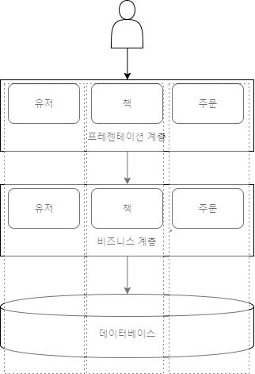
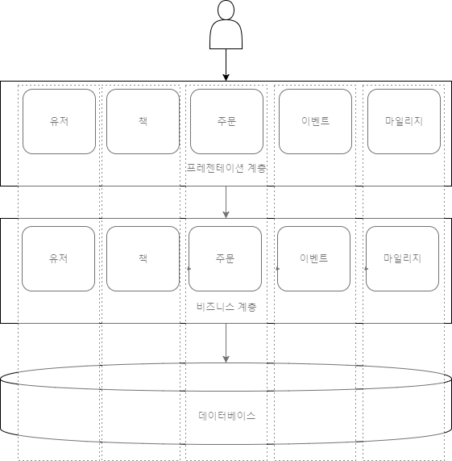

# [MSA] #1 Monolithic Architecture 란?

<br/>

출처 - [[MSA] #1 Monolithic Architecture 란?](https://alwayspr.tistory.com/19)

<br/>

요즘은 Microservice Architecture(이하 MSA)가 항상 화두에 올라있는 것 같습니다. 그래서 MSA가 도입된 배경과 갖가지 이슈를 어떻게 해결했는지에 대해 차근차근 써보려고 합니다.

Monolithic이라는 단어를 들어보셨나요? 생소해서 구글에게 한번 물어봤습니다.

```
Monolithic

단단히 짜여 하나로 되어 있는
```

개인적으로 '단단히 짜여 하나로 되어 있는'라는 어감은 참 부정적인 인상을 주네요. 왜냐하면 더 나은 코드와 설계를 위해서는 책이나 선배 개발자분들이 분리를 강조하셨기 때문이죠. "응집도를 높이고 결합도를 낮춰라", "클래스를 분리해서 SRP를 준수하라" 등등. 이런 껄끄러운 마음을 가지고 Monolithic에 대해서 알아보도록 하겠습니다.

Monolithic Architecture는 모든 것이 하나의 프로젝트에 묶여있는 것을 말합니다. 일반적으로는 MSA가 아니면 Monolithic으로 개발하고 있다고 생각하시면 됩니다. 이해가 잘 안되시더라도 천천히 글을 읽으시면 자연스럽게 이해하게 되실 겁니다.

온라인 서점을 만든다고 가정을 해보겠습니다. 초기 단계이니 작게 유저, 책, 주문 3가지의 서비스로 시작하고, MVC로 계층을 나누겠습니다.



위의 구조로 해당 사이트는 아무 문제 없이 잘 동작할 것입니다. 프로젝트, 데이터베이스 서버 총 2개의 서버만 관리하면 되기 때문에 편하게 운영을 할 수 있습니다. 그러나 이 온라인 서점 서비스가 점차 성장하기 시작했고, 많은 고객을 얻음과 동시에 그에 상응하는 갖가지 요구 사항으로 인해 서비스는 점차 복잡해져갑니다. 새로운 기능들도 생기고, 기존에 있던 기능들도 커져가죠.



위의 그림처럼 점점 서비스가 커져가면서 갖가지 이슈가 생깁니다.

<br/>

### 1. 빌드 시간, 테스트 시간이 길어진다.

처음에는 전혀 문제가 되지 않던 빌드와 테스트가 서비스가 커짐에 따라 점점 오래 걸립니다.

CI / CD (지속적 통합 / 지속적 배포)가 강조되고 있고, 페이스북 같은 경우는 하루에도 수십 번을 프로덕션에 배포를 한다고 합니다. (참고)

<br/>

### 2. 개발 언어에 종속적이다.

상황에 맞게 기술을 유연하게 적용하지 못합니다. Java + Spring으로 구현이 되어있다면, 선택의 여지없이 Java + Spring으로 구현을 해야 합니다.

<br/>

### 3. 선택적으로 확장할 수 없다.

이벤트 서비스와 주문 서비스의 사용률이 90 : 10이더라도, 원하는 서비스만 확장할 수 없고, 프로젝트 하나를 통째로 확장해야 합니다.

<br/>

### 4. 하나의 서비스가 모든 서비스에 영향을 준다.

하나의 서비스에 문제가 생기면 Monolithic은 구조상 모든 서비스에 영향을 줄 수밖에 없습니다. 이벤트 서비스에 트래픽이 몰려 해당 서버가 죽게 된다고 가정을 해보겠습니다. Monolithic에서는 하나의 서버에 모든 서비스가 있기 때문에 하나의 서비스의 트래픽 폭주로 인해 다른 서비스도 마비되는 상황이 옵니다.

<br/>

이것 외에도 많은 분들이 서비스가 커져 감에 따라 Monolithic구조의 불편함을 많이 경험하셨을 거라 생각이 듭니다. 2편에서 MSA를 소개하고 위의 이슈를 어떻게 해결하는지 생각해보겠습니다.
