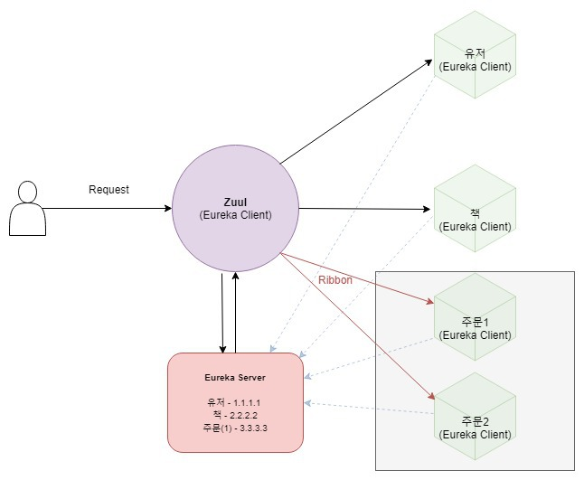

# [MSA] #6 Spring Cloud Netflix

 

출처 - [[MSA] #6 Spring Cloud Netflix](https://alwayspr.tistory.com/22)

 

스프링과 전 세계에서 MSA를 제일 잘하는 기업 중 하나인 Netflix에선 이미 MSA 구축을 편하게 하는 많은 기술과, 갖가지 이슈에 대한 해결책 또한 제공을 하고 있습니다.

 

> [Spring Cloud Netflix](https://cloud.spring.io/spring-cloud-netflix/reference/html/)는 자동 환경 설정과 Spring Environment 및 다른 Spring 프로그래밍 모델 관념의 바인딩을 바탕으로 Spring Boot 어플리케이션을 위한 Netflix OSS(Open Source Software) 통합을 제공합니다. 몇 가지 간단한 어노테이션을 사용하여 어플리케이션 내부의 공통 패턴을 신속하게 사용하고 설정할 수 있습니다. 그리고 battle-tested를 거친 Netflix component를 통해 대규모 분산 시스템을 구축할 수 있습니다. 제공되는 패턴에는 Service Discovery (Eureka), Circuit Breaker (Hystrix), Intelligent Routing (Zuul) and Client Side Load Balancing (Ribbon) 등을 제공합니다.

 

기능

- Service Discovery : Eureka 인스턴스를 등록할 수 있으며, client는 Spring이 관리하는 빈을 사용하여 탐지할 수 있습니다.
- Service Discovery : 내장된 Eureka Server는 선언적 java config를 통하여 생성될 수 있습니다.
- Circuit Breaker : Hystrix clients는 간단한 어노테이션 기반으로 구축될 수 있습니다.
- Circuit Breaker : 선언적 java config로 내장된 Hystrix dashboard
- 선언적 REST Client : Feign은 JAX-RS 또는 Spring MVC 어노테이션으로 인터페이스를 동적으로 구현합니다.
- Client Side Load Balancer: Ribbon
- External Configuration : Spring 환경에서 Archaius로 연결 (Spring Boot를 사용하여 Netflix 구성 요소를 설정 가능)
- Router and Filter : Zuul 필터의 자동 등록 및 Reverse Proxy 생성 설정 접근에 대한 간단한 규칙

 

Zuul, Eureka, Ribbon을 위주로 Spring Cloud Netflix 생태계가 어떻게 돌아가는지 알아보겠습니다.

Zuul은 API Gateway입니다. 외부에서 들어오는 모든 요청은 Zuul로 들어오고, URL에 맞는 서비스로 라우팅을 시켜줍니다. 만약 동일한 서비스가 여러 개의 인스턴스에 있는 경우에는 로드밸런싱을 통해 트래픽을 나눕니다. 이는 Zuul에 내장된 Ribbon이 하는 기능이며, Default는 라운드로빈 방식에 의해 분산이 됩니다.

또한 Filter 기능을 통하여 로깅, 인증, 모니터링, CORS 정책 같은 서비스 간의 공통된 기능을 처리할 수 있습니다. 이외의 기능은 이곳을 통해 확인해주세요.

위에서 Zuul이 URL에 맞는 서비스로 라우팅을 시켜준다고 했습니다. 이 과정에서 Eureka는 URL을 해석하여 해당 서비스의 서버 정보를 Zuul에게 전달합니다. 그럼 이를 통해서 Zuul이 해당 서버에 라우팅을 해주는 것이지요.

그럼 우리의 도서사이트에 Spring Cloud Netflix를 최종적으로 적용해 보겠습니다.

 

 
