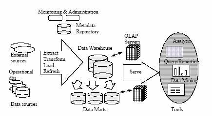
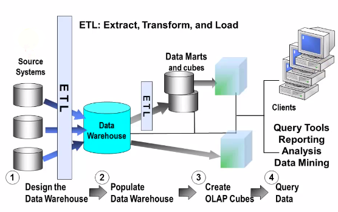
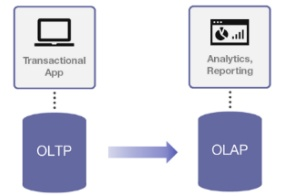

# [대용량DB] OLAP 이해하기

 

> 출처 - https://12bme.tistory.com/144

 

## OLAP 이해하기

**OLAP(Online Analytical Processing)의 종류는 선계산된 값들을 어떻게 저장하느냐에 따라 구분을 짓습니다.** 크게는 ROLAP와 MOLAP으로 구분을 지을 수 있으며 DOLAP이라던지 HOLAP라는 것이 존재합니다. OLAP의 종류를 설명하기 전에 OLAP에서 사용되는 대부분의 소스는 릴레이션(테이블)을 기반으로 하고 있습니다.

**OLTP 시스템의 다양한 원천 데이터에서 데이터 웨어하우스라는 것을 1차적으로 구축하게 됩니다. 데이터웨어하우스는 다양한 원천 데이터에서 필요로 하는 데이터들을 수정, 가공하여 저장해 둔 것입니다.**

이렇게 가공된 웨어하우스의 데이터들은 OLAP이나 마이닝 등을 통해 DSS, ERP 등의 분야에서 사용하게 됩니다. 다음은 OLAP 시스템의 기본적인 구조입니다. 이러한 데이터 웨어하우스 또한 릴레이션을 기반으로 하고 있는 경우가 많습니다.

 

 

이러한 데이터 웨어하우스 또한 릴레이션을 기반으로 하고 있는 경우가 많습니다. 그럼 일반적으로 OLAP 시스템의 소스는 릴레이션을 기반으로 한다는 것을 알 수 있습니다. **이러한 릴레이션 기반의 소스에서 다양한 정보에 대한 선계산 값을 미리 산출하여 저장하는 연산이 CUBE입니다.** CUBE에서 생성된 값들을 저장하는 방법에 따라 `OLAP은 ROLAP과 MOLAP으로 나뉘며 ROLAP는 릴레이션 기반으로 선계산된 결과 값을 저장하는 방식이며, MOLAP은 결과 값을 다차원 배열로 저장하는 방식입니다.`

ROLAP의 경우 릴레이션으로 된 소스를 릴레이션으로 저장하므로 계산된 결과 값의 저장에 있어 유용합니다. `하지만 결과값을 리포팅하는 경우 대부분이 최종사용자가 다차원 정보를 다양한 관점에서 찾아보기 위해서는 릴레이션으로 저장된 경우 부가적인 연산을 거쳐야 하며 이 부분의 비용이 만만치 않습니다. 또한 릴레이션 베이스의 소스를 큐브에서 처리시 릴레이션으로 처리하는 경우 정렬 비용 등 많은 문제가 있습니다.`

MOLAP의 경우 결과값을 다차원 배열로 저장하므로 사용자에게 리포팅 할 경우 유리하며 결과값을 산출하는 과정에서 다차원 배열을 이용하는 경우 릴레이션을 이용하는 경우에 비해 비용이 적게 들어간다는 연구 결과가 있습니다. `하지만 릴레이션 소스를 다차원 배열로 변경하는 로딩 비용이 들어가며 결과 값의 저장에 있어 다차원 배열의 경우 빈셀이 많이 발생(희박성) 하므로 저장 공간의 낭비를 초래할 수 있습니다. (데이터 폭발 문제)`

이러한 문제들을 해결하기 위하여 두가지 경우의 OLAP 시스템의 장점을 모아 HOLAP라는 방법이 나왔으며 HOLAP은 결과값의 저장을 MOLAP으로 할것인지 ROLAP로 할 것인지 선택이 가능합니다.

다른 방법으로는 결과 값을 선계산하는 방식이 아닌 최종 사용자의 요청이 있는 경우 실시간으로 집게 처리하는 DOLAP 방식이 있습니다.

 

 

**OLAP(On-Line Analytical Processing)은 다차원적 정보를 관련자들이 공유해 빠르게 분석하는 과정을 뜻하며, 이 과정에서 사용되는 도구가 OLAP 툴입니다.** 기술적으로는 크게 MOLAP, ROLAP, DOLAP, HOLAP로 구분되며 최근에는 ROLAP과 MOLAP으로 양분돼 있던 제품 수요가 HOLAP 제품과 웹OLAP제품으로 바뀌고 있습니다. 즉 종전에는 다차원 데이터베이스에는 MOLAP을, 관계형 데이터베이스에는 ROLAP만을 써왔으나 HOLAP 툴의 등장으로 RDB에서도 MOLAP을 사용할 수 있게 되었습니다. 특히 HOLAP 툴은 대규모 데이터 분석 기능 뿐 아니라 복잡하고 중층적인 계산 수행능력을 제공합니다.

DW는 어떻게 데이터를 구축할 것이가에 초점이 맞춰져 있었고, OLAP은 기업들이 DW 를 어떻게 활용할 것인가에 대해 초점이 맞춰 있었습니다. 그러나 오늘날 DW가 구축 단계에서 활용단계로 급속히 확산됨에 따라 OLAP는 일반적으로 DW 환경에 통합되어 함께 취급되고 있습니다. `DW는 OLAP를 위한 주요 데이터 원천으로 OLAP는 DW 정보를 분석하는 역할을 합니다.`

웹 OLAP의 장점은 클라이언트 서버형 OLAP에 비해 클라이언트 부분의 SW 설치비가 안들어가기 때문에 가격이 저렴하며, 메타데이터를 OLAP 서버, DW 서버, 웹 서버 등에서 생성할 수 있어 시스템 다운으로 메타 데이터를 재생성하는 시간이 감소됩니다.

## OLAP 제품 분류

일반적으로 OLAP 제품들은 MOLAP, ROLAP, DOLAP, HOLAP으로 구분됩니다.

### 1. MOLAP(Multimensinal OLAP)

다차원 데이터베이스에 기반한 OLAP 아키텍처입니다. 다차원 데이터의 저장과 프로세싱에 MDB가 사용됩니다. 타 아키텍처에 비해 네트워크 상의 데이터 이동이 최소화되었습니다. 다차원 데이터의 저장과 프로세싱에 동일한 엔진이 사용됩니다.

### 2. ROLAP(Relational OLAP)

관계형 데이터베이스에 기반한 OLAP 아케틱처, 관계형 데이터와 클라이언트 사이의 연결역할을 수행합니다.

### 3. DOLAP(Desktop OLAP)

다차원 데이터의 저장 및 프로세싱이 모두 클라이언트에서 이루어지는 데이터 베이스입니다. 타 OLAP제품에 비해 비교적 설치와 관리가 쉽고 유지 보수가 용이하다는 장점이 있으나, 필요한 데이터가 모두 클라이언트로 이동하게 되어 대용량 데이터 처리에 한계가 있습니다.

### 4. HOLAP(Hybrid OLAP)

다차원 데이터의 저장 공간으로 다차원 데이터베이스와 관계형 데이터 베이스가 함께 사용될 수 있는 제품을 말합니다. 일반적으로 요약된 데이터나 관계식에 의해 새로 계산된 데이터는 다차원 데이터베이스에 저장되며, 상세데이터는 관계형 데이터베이스에 저장됩니다.

## OLAP의 정의와 목적

`최종 사용자가 다차원 정보에 직접 접근하여 대화식으로 정보를 분석하고 의사결정에 활용하는 과정을 OLAP라고 합니다. OLAP는 최종 사용자가 다차원 정보에 직접 접근하여 대화식으로 정보를 분석하고 의사결정에 활용하는 과정입니다.` 정보의 다차원성은 OLAP 시스템을 다른 시스템과 구분하는 중요한 개념입니다. 최종 사용자는 온라인상에서 직접 데이터에 접근하며, 대화식으로 정보를 분석하므로 최종 사용자가 기업의 전반적인 상황을 이해할 수 있게 하고 의사결정을 지원하는 데 그 목적이 있습니다.

### OLAP와 OLTP의 관계

 

 

`은행의 창구 업무나 항공사의 예약 업무 등이 전형적인 OLTP의 예라 하며, OLAP는 OLTP에서 발생한 원시 데이터를 활용할 수 있도록 가공하고 분석하는 과정을 뜻합니다.`

일반적으로 기업의 데이터는 전산 부서에 의해 관리되며 기업의 전산 시스템은 데이터의 수집과 갱신에 초점을 맞추어 설계되어 최종 사용자가 직접 사용하기는 불편합니다. 이에 비해 OLAP 환경에서 사용자가 쉽게 이해할 수 있고 조작하기 쉬운 형태로 존재하게 됩니다. 즉 사용자는 필요한 시점에 정보 매개자 없이 정보원에 직접 접근하여 다양한 각도에서 분석을 수행할 수 있습니다.
