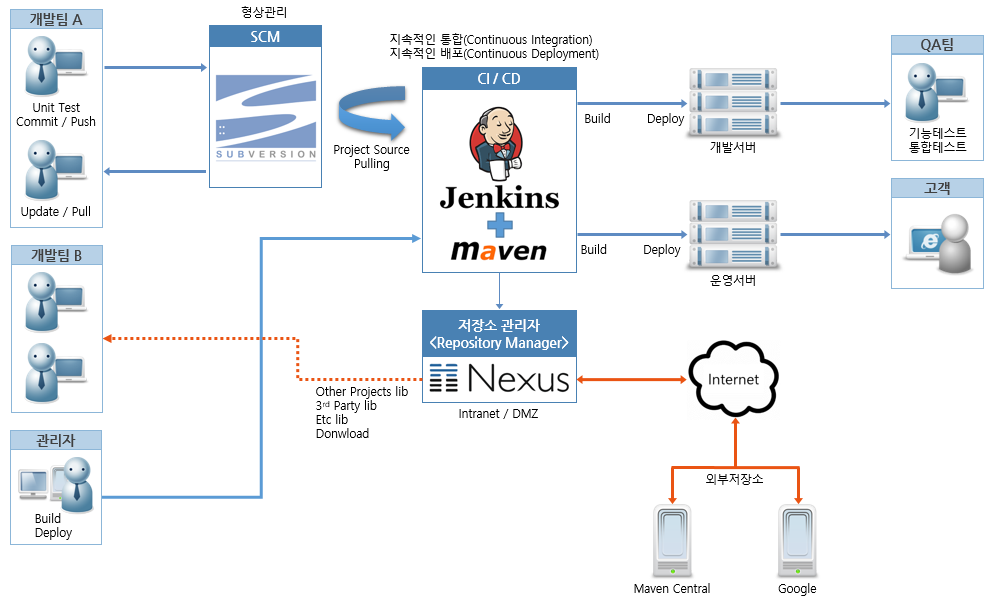

# 프로젝트 개발환경 구성.

 

일반적으로 프로젝트 수행 시 개발자 투입전 개발서버에 대한 전반적인 구성을 하게 됩니다.

개발에 필요한 환경은 일반적으로 아래와 같습니다.

- 형상관리 : SVN
- 빌드 및 배포 (CI/CD) : Maven + Jenkins
- 저장소 관리자 : Nuxus
- 개발서버
- DB서버

이외에 프로젝트에 따라 추가로 구성이 될수 있습니다.

 

[그림 1] 개발환경 구성도

 

위 구성도를 기준으로 개발환경 구성을 해보겠습니다.

개발환경 구성 실습을 위해 로컬 PC 에 VirtualBox 설치 후 Linux(Ubuntu) 가상머신을 만들어 구성을 하도록 하겠습니다.

VirtualBox, Ubuntu 설치관련 설명은 아래 링크를 보고 따라 하시면 됩니다.

 

Step 1. VirtualBox 설치.

- [VirtualBox 6.0 설치하기](../../../VirtualBox/VirtualBox_6.0_설치하기.md)

Step 2. Linux(Ubuntu) 설치.

- [Ubuntu 18.04 설치하기](../../../VirtualBox/Ubuntu_18.04_설치하기.md)

Step 3. OpenJDK 설치.

- [OpenJDK 수동설치](../../../OS/Linux/Ubuntu/Ubuntu_18.04_OpenJDK_수동설치.md)

Step 4. 형상관리 및 CI/CD 구성하기 - Subversion 설치.

- [Subversion(SVN) 설치](<../../../OS/Linux/Ubuntu/Ubuntu_18.04_Subversion(SVN)_설치.md>)

Step 5. 형상관리 및 CI/CD 구성하기 - Jenkins 설치.

- [jenkins.war 설치](../../../OS/Linux/Ubuntu/Ubuntu_18.04_jenkins.war_설치.md)

Step 6. 형상관리 및 CI/CD 구성하기 - Maven 설치.

- [Maven 수동설치](../../../OS/Linux/Ubuntu/Ubuntu_18.04_Maven_수동설치.md)

Step 7. 형상관리 및 CI/CD 구성하기 - Nexus 설치.

Step 8. 연동 테스트 - Eclipse + Subversion 설정 및 테스트.

Step 9. 연동 테스트 - Jenkins 빌드 테스트.

Step 10. 연동 테스트 - Jenkins 배포 테스트.

Step 11. 연동 테스트 - Eclipse + Maven Repository Nexus 설정 및 테스트.
