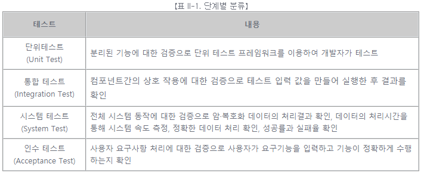
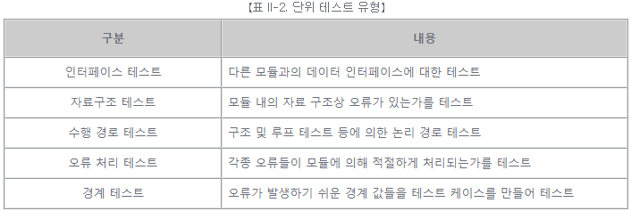
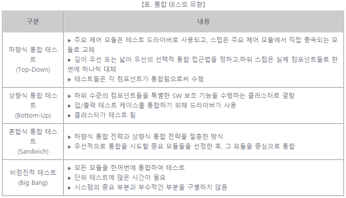
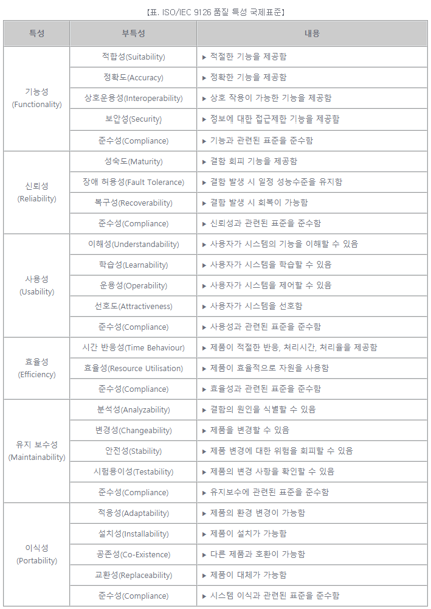
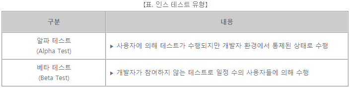

# [공개SW 테스트 가이드] 4. SW 프로세스와 테스트 (2)

 

출처 - [OSS / [공개SW 테스트 가이드] ④ SW 프로세스와 테스트 (2)](https://www.oss.kr/info_test/show/2ca348d0-d597-4606-971e-4bdc91bed442?search_keyword=sw+%ED%85%8C%EC%8A%A4%ED%8A%B8&page=5)

 

### ▣ SW 테스트의 단계별 분류

현재 현업에서 시행되고 있는 SW 테스트의 분류를 단계별 기준에 따라 분류하면 다음과 같다.

 

 

- 단위 테스트(Unit Test)

  개별적으로 테스트할 수 있는 SW 기능만을 분리하여 검증하며, 일반적으로 코드 접근을 허용하고, 디버깅 도구의 지원 하에 실행한다.

 

 

- 통합 테스트(Integration Test)

  SW 컴포넌트 간의 상호 작용을 검증하는 프로세스로 엔지니어가 하위 수준 관점을 배제하고, 컴포넌트 간, 서브시스템 간의 통합에 중점을 둔 테스트이다.

 

 

- 시스템 테스트(System Test)

  SW 시스템의 특정 요구 사항을 완벽하게 통합된 시스템에서, 시스템의 준수 여부를 평가하는 테스트이다. 시스템의 기능 측면뿐만 아니라 비기능적 요구사항을 시스템이 만족하는지 여부를 검증한다.

 

 

- 인수 테스트(Acceptance Test)

  개발된 시스템이 고객의 요구사항과 일치하는지 확인하기 위해 고객의 입장에서 수행하는 테스트이다. XP(eXtream Programming)에서는 애자일 개발 방법론의 XP 구현 단계에서 개발팀이 사용자 스토리 기반의 기능을 테스트하는 것으로 정의하고 있다.

 

 
