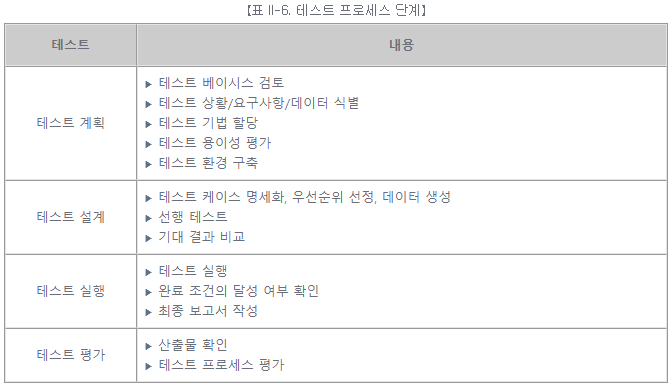
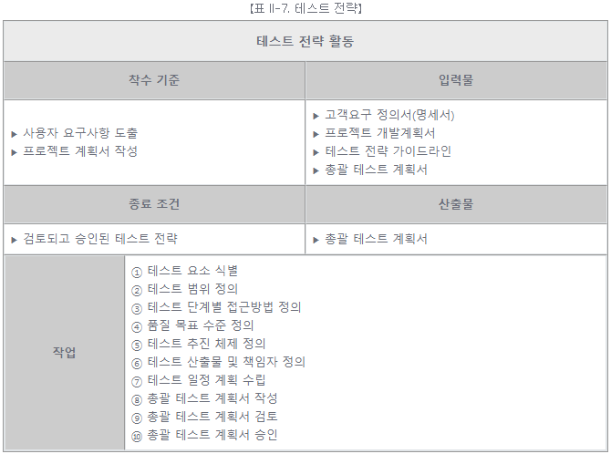
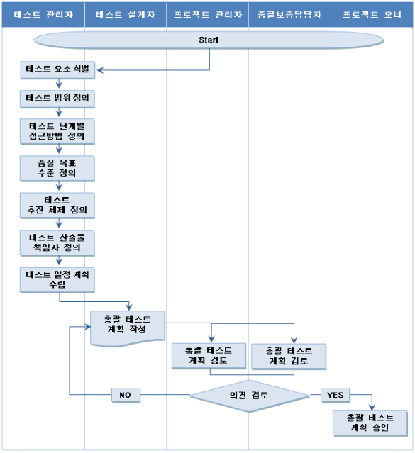
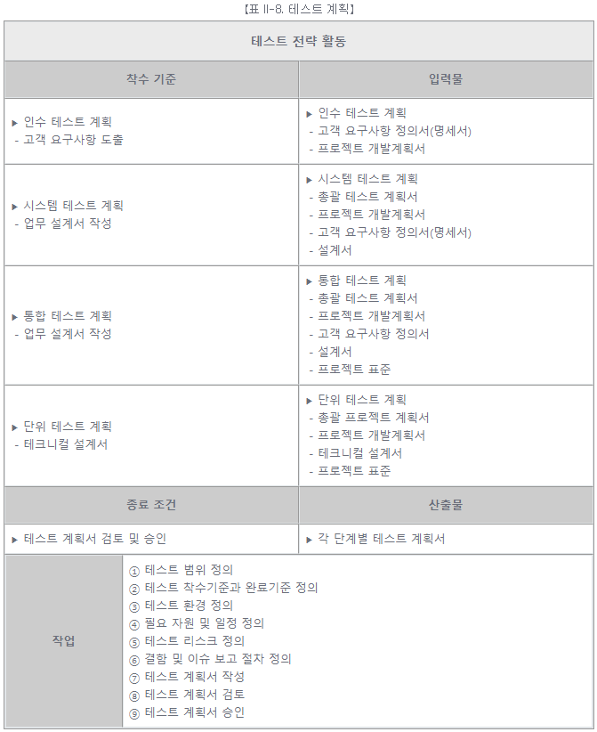
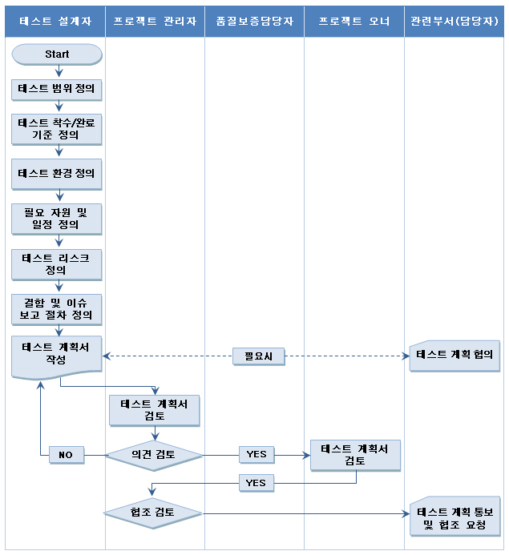

# [공개SW 테스트 가이드] 5. SW 테스트 프로세스 (1) - 테스트 계획

<br/>

출처 - [OSS / [공개SW 테스트 가이드] ⑤ SW 테스트 프로세스 (1) - 테스트 계획](https://www.oss.kr/info_test/show/2925ef2f-8686-4388-a192-3bd1d70eb700?search_keyword=sw+%ED%85%8C%EC%8A%A4%ED%8A%B8&page=5)

<br/>

## 5. SW 테스트 프로세스 (1)

개발 SW의 품질 기준을 만족하기 위한 테스트를 수행함에 있어, 실행조직의 역할과 책임, 필요 작업과 절차 및 산출물을 정의한다.
테스트 프로세스의 제공으로 SW의 품질과 테스트 커버리지를 측정하고, 현 시스템의 특징을 파악하여 현재 구현되어 있는 SW의 모습과 기대치와의 차이점을 판별할 수 있도록 각 테스트 단계의 활동을 정의하는 것이 목적이다.
단, 논리적으로는 순차적이지만 프로세스 내의 활동들은 중첩되거나 동시에 진행될 수 있다.

<br/>



<br/>

### ▣ 테스트 계획

테스트의 목표를 달성하기 위해 필요한 활동 내역을 정의하는 단계이다.

- 테스트 전략

  SW 개발 프로세스 요구사항 분석의 마지막 단계에서 이루어지며, 사용자의 요구사항이 파악되는 시점에 개발시스템의 리스크 범위, 담당자 지정, 확보된 예산 등을 고려하여 향후 수행될 필요가 있는 테스트에 대한 전체 설계를 구상하는 활동이다.

<br/>



<br/>

- 테스트 전략 활동의 상세 절차

```
① 테스트 요소 식별

  개발 시스템에 관련된 위험을 평가하고, 그 위험과 관련된 테스트 요소를 정의한다.

  - 테스트 요소 식별

    ▶ 테스트 대상 시스템 및 관련 비즈니스 위험을 식별
    ▶ 테스트 수행 중에 평가되어야 하는 위험을 기반으로 테스트 요소를 식별
    ▶ 심각도 및 위험도를 고려하여 테스트 요소를 분류


  - 식별된 테스트 요소에 대해 테스트 단계/유형별로 테스트 전략을 정의

    ▶ 개발 프로젝트의 생명주기를 파악
    ▶ 테스트 요소와 관련된 위험을 최소화하기 위해, 개발프로젝트 생명주기의 각 단계에 적합한 테스트 유형을 정의
    ▶ 테스트의 유형별로 테스트 방법을 정의

② 테스트 범위 정의

  개발 프로젝트의 범위 및 상위 요구사항을 분석하여 테스트 범위를 설정한다.
  설정된 테스트 범위는 단계별 테스트에 대한 상세 계획 수립 시, 요구분석 및 설계단계에서 정의된 각 테스트 요구사항 등을 검토하여
  테스트 항목, 테스트 항목의 특성, 테스트 하지 않을 항목의 특성을 명세화 하는 기반 자료로서 활용된다.

③ 테스트 단계별 접근방법 정의

  프로젝트에서 적용할 테스트 단계와 단계별 테스트에 대한 수행방안을 정의한다.


  - 개발생명주기별 테스트 단계 정의

    ▶ 개발 프로젝트에서 수행할 테스트 단계를 정의
    ▶ 시스템의 크기와 복잡도, 중요도, 개발 성숙도, 고객 요청사항, 테스트 일정, 테스트환경 등을 고려


  - 각 단계별 테스트 수행방안 정의

    ▶ 개발 프로젝트의 생명주기를 파악
    ▶ 단계별로 필요한 테스트 유형 및 수행 방안을 정의

④ 품질 목표 수준 정의

  테스트 단계에서 수집 및 관리가 필요한 품질 지표와 목표 수준을 정의한다.

⑤ 테스트 추진 체제 정의

  상위 단계에서 정의한 테스트 단계 및 접근 방안을 기반으로, 테스트를 수행할 추진 조직 및 역할을 정의한다.

⑥ 테스트 산출물 책임자 정의

  테스트 종류별 산출물을 선정하고, 작성 시점 및 책임자를 정의한다.

⑦ 테스트 일정 계획 수립

  각 테스트 단계에 대한 전체적인 일정을 기술한다. 상세 일정 수립이 어려운 경우는 각 테스트 전체 일정을 기술하고,
  상세 일정은 단계별 테스트 계획 활동에서 수립한다.

⑧ 총괄 테스트 계획서 작성

  상위 단계를 기반으로 하여, 총괄 테스트 계획서를 작성한다. 총괄 테스트 계획서에는
  식별한 테스트의 범위, 단계, 수행방안, 추진 체제, 산출물, 책임자, 일정과 같은 테스트 전략에 대한 내용을 기술한다.

⑨ 총괄 테스트 계획서 검토(테스트 전략 협의)

  테스트 설계자는 총괄 테스트 계획서에 기술된 테스트 전략에 대하여, 프로젝트 관리자 및 품질보증 담당자와 검토 및 협의를 수행한다.

⑩ 총괄 테스트 계획서 승인

  프로젝트 책임자는 총괄 테스트 계획서대로 테스트가 수행되면, 프로젝트 및 제품의 품질을 보증할 수 있는지 여부를 판단하고,
  작성된 총괄 테스트 계획에 대하여 승인을 요청한다.
```

<br/>



<br/>

- 테스트 계획

  각 단계별 상세 테스트 계획을 수립하는 활동으로 각 단계별 테스트에 대한 계획은 개발 단계에 따라 작성되는 시점과 산출물이 다르다.

<br/>



<br/>

- 테스트 계획 활동의 상세 절차

```
① 테스트 범위 정의

  테스트 전략을 기반으로 테스트 범위를 정의한다. 모든 대상 영역을 테스트 하지 않을 경우, 테스트 제외 범위와 제외 사유를 기술한다.

② 테스트 착수 기준과 완료 기준 정의

  테스트를 시작하기 전에 완료되어야 할 활동들과, 테스트 활동이 종료되어야 할 시점을 정의한다.

③ 테스트 환경 정의

  테스트를 수행할 환경을 정의한다.

  - 테스트 환경에 대한 HW 및 SW 구성을 기술한다.

  - 테스트에 필요한 테스트 데이터 생성 및 유지 절차를 정의한다.

④ 필요 자원과 일정 정의

  자원은 HW, SW, 인력으로 구분하여 정의하며 기존 보유 자원도 기술한다. 테스트 일정은 테스트 단계의 주요 활동 및 시작/완료 일자를 정의한다. 일반적으로 프로젝트 수행 일정과 함께 수립된다.

⑤ 테스트 리스크 정의

  테스트 수행 시 고려되어야 할 사항과 위험 요소를 기술한다.

⑥ 결함 및 이슈 보고 절차 정의

  테스트과정에서 발견된 결함 및 이슈 보고 절차를 정의한다. 보고 절차에는 발견된 결함 기록, 관련자의 정보 공유, 해결하기 위한 절차가 포함된다.

⑦ 테스트 계획서 작성

  테스트 단계별로 상위 단계의 적업을 기반으로 하여, 상세한 테스트 계획서를 기술한다.

⑧ 테스트 계획서 검토

  프로젝트 관리자 및 품질보증 담당자와 검토 및 협의를 수행한다.

⑨ 테스트 계획서 승인

  테스트 계획서가 프로젝트 및 제품의 품질을 보증할 수 있도록 작성되었는지 여부를 판단하고 작성된 테스트 계획에 대하여 승인을 요청한다.
```

<br/>



【그림 II-5. 테스트 계획 활동 작업 흐름도】

<br/>
