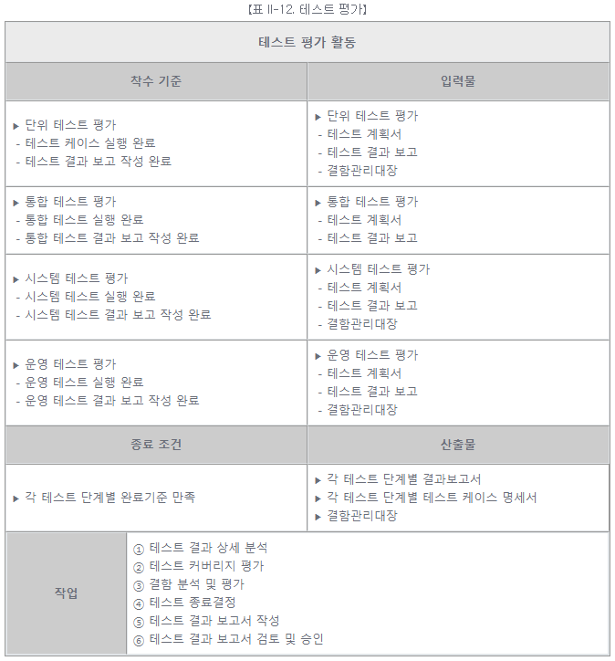
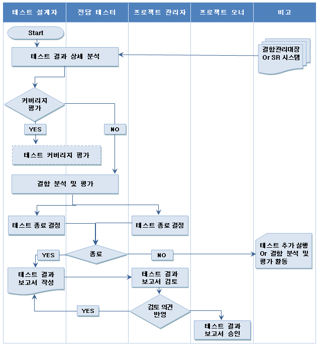

# [공개SW 테스트 가이드] 5. SW 테스트 프로세스 (5) - 테스트 평가

<br/>

출처 - [OSS / [공개SW 테스트 가이드] ⑤ SW 테스트 프로세스 (5) - 테스트 평가](https://www.oss.kr/info_test/show/7b5ad114-6cce-47d2-bd8c-72f3c315c572?search_keyword=sw+%ED%85%8C%EC%8A%A4%ED%8A%B8&page=5)

<br/>

## 5. SW 테스트 프로세스 (5)

<br/>

### ▣ 테스트 평가

완료된 테스트 활동에서 데이터를 수집하여, 테스트에서 발견된 수치적 데이터와 함께 테스트 경험을 축적하는 단계이다.

- 테스트 평가

  각 테스트 레벨 및 유형 별 테스트 결과를 상세히 분석하여 해당 테스트 활동의 종료 기준에 적합한지를 판단하는 활동이다.

<br/>



<br/>

- 테스트 평가 활동의 상세 절차

```
① 테스트 결과 상세분석

  테스트 수행 결과로 작성된 모든 테스트 결과 보고와 결함관리대장을 검토한다.

② 테스트 커버리지 평가

  실제로 제품의 모든 기능을 100% 테스트할 수 없으므로,
  어느 정도 테스트가 수행 되었는지 파악하기 위해 커버리지를 측정한다.

③ 결함 분석 및 평가

  - 테스트 수행 시 발견된 결함을 분석하여 의미 있는 정보를 도출한다.

    • 발견된 결함 평가는 SW 품질 및 신뢰성에 대한 정보를 제공한다.
    • 결함 분석 및 평가는 단순히 결함 수의 계산에서부터 통계 모델링 적용까지
      다양한 방법을 적용하여 수행할 수 있다.

  - 결함 분석을 위해 측정치를 작성하고, 결과에 대한 검토 및 분석을 수행한다.

    • 결함 분포: 특정 속성에 해당되는 결함 수
    • 결함 추세: 시간 흐름에 따른 결함 수에 대한 추이
    • 결함 에이징: 특정 결함 상태에 머물러 있는 시간

  - 결함 분석에서는 하나 또는 그 이상의 결함 관련 파라미터와 연관하여,
    결함 분포를 분석하는데, 가장 일반적으로 사용하는 결함 파라미터는 다음과 같다.

    • 우선순위(Priority): 결함 해결의 상대적인 중요성
    • 심각도(Severity): 결함의 상대적인 영향 정도
    • 근원(Source): 결함의 원인이 된 위치 및 근본적인 원인

④ 테스트 종료 결정

  테스트가 수행되고 테스트 종료 조건을 만족할 경우 테스트 활동을 종료한다.

⑤ 테스트 결과 보고서 작성

  테스트 결과 보고서는 테스트 대상 시스템의 품질과 테스트 상태에 대해 객관적인 평가를 내리고,
  모든 이해관계자들과 의사소통 하는 수단으로 사용하기 위하여 작성된다.
  경우에 따라 여러 관계자를 위한 문서를 만들 수 있는데,
  대상이 누구냐에 따라 양식과 보고의 내용이 달라질 수 있다.
  단, 테스트 결과는 다르게 왜곡해서는 안 되며, 독자의 수준에 따라 결과 보고서의
  전문 용어의 사용 여부, 표현 방법 등이 달라질 수 있다.

⑥ 테스트 결과 보고서 검토 및 승인

  작성된 테스트 결과 보고서를 프로젝트 관리자 및 품질보증 담당자등과 검토 및 협의를 수행한다.
```

<br/>



【그림 II-9. 테스트 평가 활동 작업 흐름도】

<br/>
