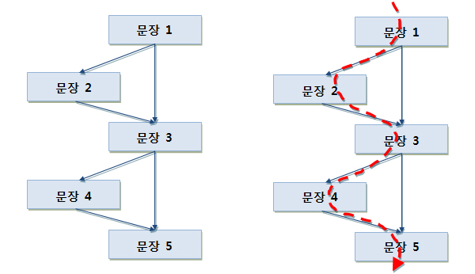
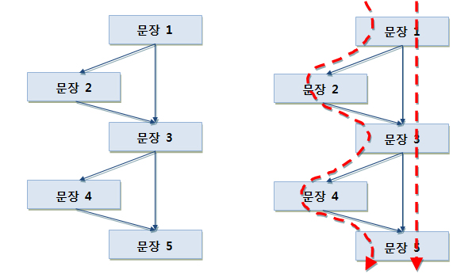
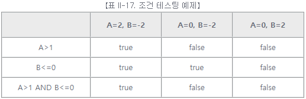
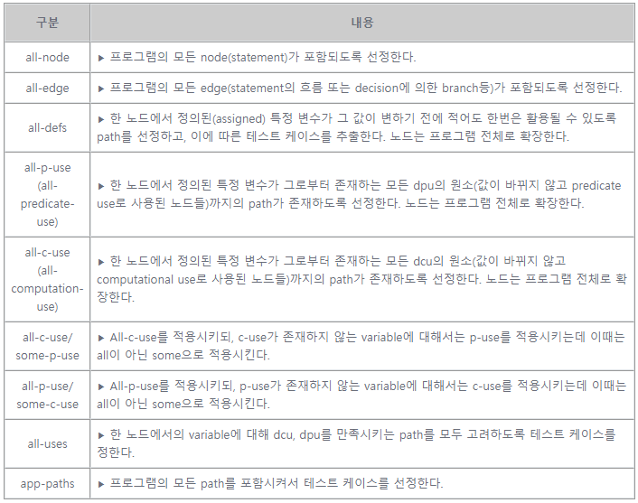

# [공개SW 테스트 가이드] 6. SW 테스트 기법 (2) - 구조기반 기법

<br/>

출처 - [OSS / [공개SW 테스트 가이드] ⑥ SW 테스트 기법 (2) - 구조기반 기법](https://www.oss.kr/info_test/show/1595590a-a702-41e9-b55d-f1d82e14e8cc?search_keyword=sw+%ED%85%8C%EC%8A%A4%ED%8A%B8&page=4)

<br/>

## 6. SW 테스트 기법 (2)

<br/>

### ▣ 구조기반 기법

코드와 개발 설계 등의 SW 구현 정보를 기반으로 테스트 케이스를 설계하는 기법이다.

- 구문 테스팅(Statement Testing)

  프로그램 내의 모든 문장들을 한번 이상 수행하도록 테스트 케이스를 설계하는 기법이다.

  [예제]

  다음과 같은 제어 흐름도를 커버하는 구문 테스팅 테스트 케이스를 설계하기 위해서는 제어 흐름도의 모든 문장들을 통과하는 1개의 테스트 케이스가 필요하다.

  

  【그림 II-17. 구문 테스팅 예제】

<br/>

- 결정 테스팅(Decision Testing)

  프로그램 내의 각 분기들을 한번 이상 수행하도록 테스트 케이스를 설계하는 기법이다.

  [예제]

  다음과 같은 제어 흐름도를 커버하는 결정 테스팅 테스트 케이스를 설계하기 위해서는 제어 흐름도의 모든 분기들을 통과하는 2개의 테스트 케이스가 필요하다.

  

  【그림 II-18. 결정 테스팅 예제】

- 조건 테스팅(Condition Testing)

  프로그램 내의 각 조건들을 보장하기 위해 조건들이 참이 되는 경우와 거짓이 되는 경우를 모두 수행하도록 테스트 케이스를 설계하는 기법이다.

  [예제]

  다음과 같은 조건을 커버하는 조건 테스팅 테스트 케이스를 설계하기 위해서는 3개의 테스트 케이스가 필요하다.

  ```
  if(A>1 AND B<=0){
    A=B+4;
  }
  ```

  

- 데이터 흐름 테스팅(Data Flow Testing)

  프로그램 내에서 변수들이 값을 할당 받은 지점이나 사용된 지점에 따라, 프로그램의 테스트 경로들을 선택하는 방법이다.

  【표 II-18. 데이터 흐름 테스팅 예제】

  
