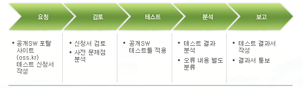
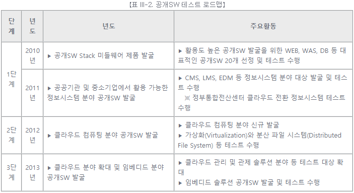
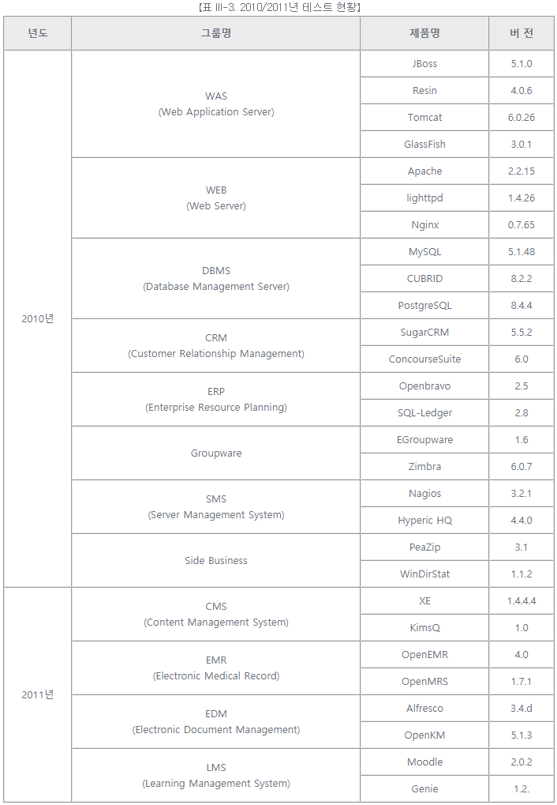

# [공개SW 테스트 가이드] 8. 공개SW 테스트

 

출처 - [OSS / [공개SW 테스트 가이드] ⑧ 공개SW 테스트](https://www.oss.kr/info_test/show/29efc809-8142-4838-b3bb-6128562291ed?search_keyword=sw+%ED%85%8C%EC%8A%A4%ED%8A%B8&page=4)

 

## 8. 공개SW 테스트

 

국내 공공기관이나 기업 등 공개SW를 도입하여 활용하는 사례가 크게 늘어났으며, 공개SW를 기반으로 새로운 SW를 만들어 이용하거나 상업적으로 제공하는 경우도 늘어나고 있어, 공개SW에 대한 기능 및 성능관련 품질에 대한 요구사항이 증대되었다.

이에 공개SW 역량프라자에서는 관련 체계 및 장비를 구비하여 공개SW 테스트에 대한 요청이 있을 경우 테스트 서비스를 신청 받아 지원하며, 신뢰성 있는 공개SW 발굴을 위한 3단계 로드맵을 수립하여 공개SW에 대한 테스트를 수행한다.

 

### ▣ 공개SW 테스트 서비스 지원

테스트 서비스 신청은 공개SW 포털(http://www.oss.kr) 웹사이트에 접속 후 ‘주요지원사업>공개SW 역량프라자 운영> 공개SW 테스트’에서 신청할 수 있으며, 테스트 지원 절차는 아래와 같다.

【그림 III-5. 테스트 지원 절차】

 

### ▣ 공개SW Stack 통합 테스트

공개SW 역량프라자에서는 신뢰성 있는 공개SW 발굴을 위해 공개SW 관련 선정지표를 활용하여 공개SW를 선정하고, 체계적인 테스트를 수행하여 공개SW의 신뢰성을 제고한다.

- 공개SW 테스트 로드맵

  공개SW 역량프라자 테스트 로드맵은 총 3단계로 구성된다. 1단계는 정보시스템 분야에서 즉시 도입 가능한 공개SW 발굴, 2단계는 클라우드 컴퓨팅 솔루션 분야 확대, 그리고 3단계는 모바일을 포함한 임베디드 분야 솔루션에 대한 신뢰성 및 통합 테스트를 진행하여 공개SW 기술참조모델(Technical Reference Model)을 구축하는 것이 목표이다.

  

- 공개SW 테스트 현황

  공개SW 역량프라자에서 1단계 로드맵 진행 결과 발굴된 미들웨어와 정보시스템분야에서 발굴된 공개SW는 아래와 같다. 공개SW 발굴은 다음 장에 소개하는 공개SW 테스트 프로세스의 절차에 따라 진행된다.

  
