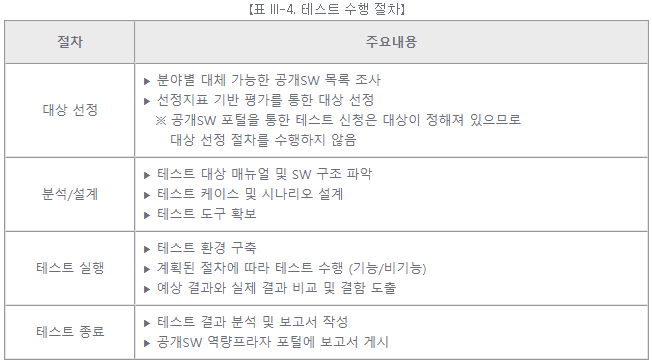
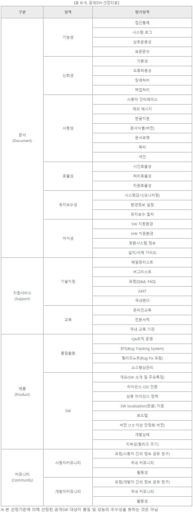
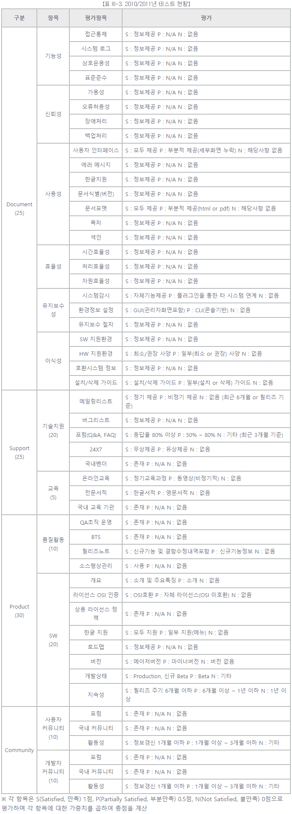
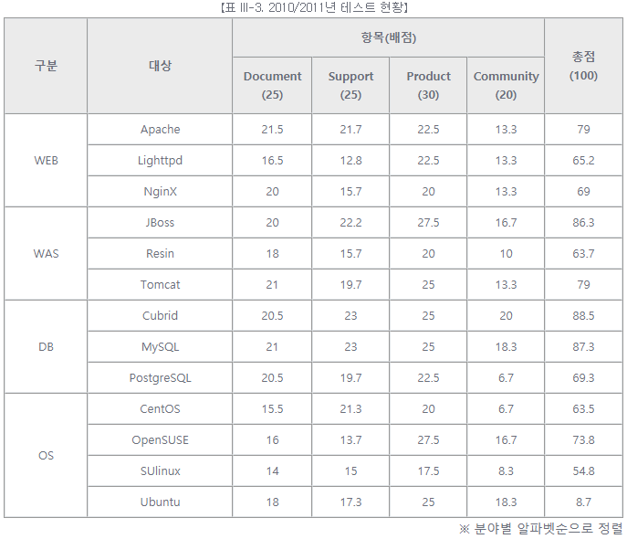

# [공개SW 테스트 가이드] 9. 공개SW 테스트 프로세스 (1) - 소개, 대상선정

 

출처 - [OSS / [공개SW 테스트 가이드] ⑨ 공개SW 테스트 프로세스 (1) - 소개, 대상선정](https://www.oss.kr/info_test/show/6df581f5-b44d-41f7-9c85-b43e20db3b18?search_keyword=sw+%ED%85%8C%EC%8A%A4%ED%8A%B8&page=4)

 

## 9. 공개SW 테스트 프로세스

 

### ▣ 공개SW 테스트 프로세스 소개

공개SW 프로젝트의 경우 비교적 폐쇄적인 초기 개발 단계를 거쳐 공개된 뒤에, 커뮤니티와 호흡하는 공개SW 순환구조에 들어간다. 이러한 공개SW의 프로젝트 특성에 따라 공개SW 역량프라자에서는 시스템이 사용자의 요구사항에 맞게 동작하는지 확인하는 기능 테스트와, 동시 단말 사용자가 동시에 거래를 발생시키도록 하여 시스템의 상황을 점검하는 Spike 성능시험, 오랫동안 거래를 발생 시켰을 때의 시스템 상황을 점검하는 가용성 성능시험을 진행한다.

공개SW 테스트 수행절차는 다음과 같으며, 공개SW 역량프라자에서 수행하는 모든 테스트 활동에 기반이 된다.

 

### ▣ 대상 선정

수많은 공개SW 중 활용도 높은 공개SW를 선정하기 위해서는 객관적인 기준이 필요하다. 이에 공개SW 역량프라자에서는 공개SW 커뮤니티 및 기업에서 제공하는 다양한 정보를 기반으로 선정지표(표 III-5. 공개SW 선정지표 참조)를 개발하였다.
선정지표는 문서, 지원서비스, 제품, 커뮤니티 4개의 카테고리로 분류하였으며, 세부항목으로 51개 평가항목(표 III-6. 평가항목 참조)을 선정하여 공개SW 대상선정을 위한 평가 자료로 활용된다.

- 선정지표

  

- 평가항목

  

- 평가항목

  
