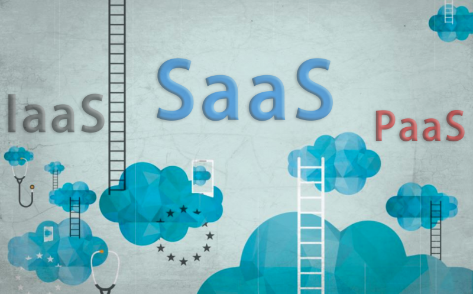
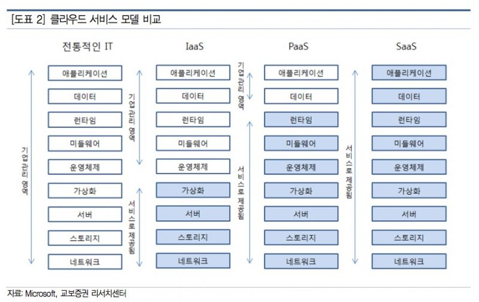
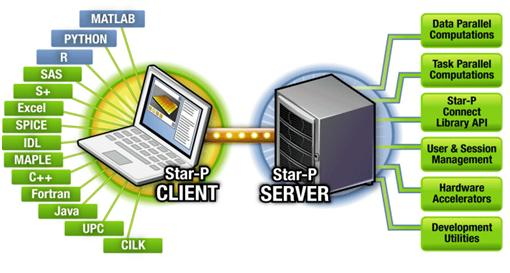
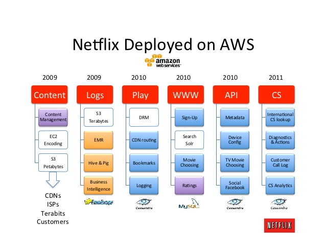
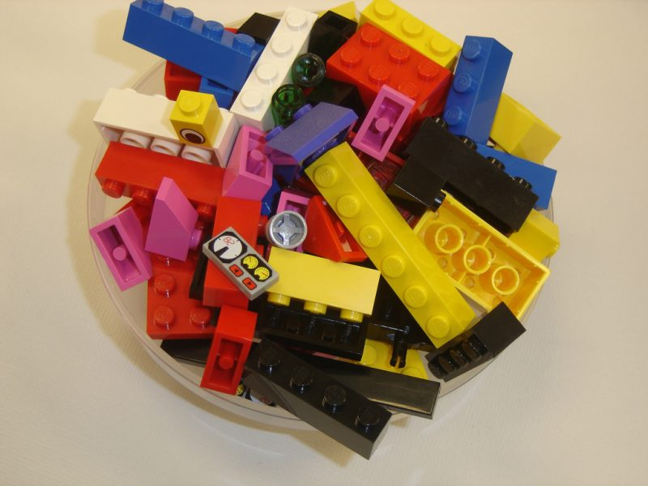

# SaaS, IaaS, PaaS

 

출처 :: [[IT열쇳말] SaaS, IaaS, PaaS](http://www.bloter.net/archives/259518)

 

지난 1월, 세계적인 인터넷 기반 TV 서비스 기업인 넷플릭스가 모든 서비스를 아마존웹서비스(AWS) 클라우드에서 운영한다고 밝혔다. AWS 클라우드로 사내 모든 컴퓨팅 인프라를 옮겼다. 넷플릭스는 직접 데이터센터를 구축해서 운영하는 대신 클라우드에서 컴퓨팅 인프라 자원을 빌려 서비스를 운영하겠다고 나섰다.

넷플릭스 뿐 아니다. BMW는 마이크로소프트(MS) ‘애저’ 클라우드를 이용해 차랑 소유자를 위한 서비스 ‘오픈 모빌리티 클라우드’를 선보였다. 어도비시스템즈는 클라우드에서 포토샵과 일러스트레이터 등을 이용할 수 있는 ‘어도비 크리에이티브 클라우드(CC)’를 출시했다. 액토즈소프트, 웹젠, 넥슨아메리카 등 다양한 게임 업체도 클라우드 서비스를 이용해 게임 서비스를 운영 중이다. 이미 많은 영역에서 클라우드를 도입해 활용하고 있다.

 

▲ 클라우드 컴퓨팅 서비스 종류 (출처: 플리커, 아토스. CC BY-SA)

 

## ‘필요한 만큼만 쓰자’, 빌려쓰는 클라우드

 

미래학자 니콜라스 카의 정의에 따르면 클라우드 컴퓨팅은 IT 자원을 구매하거나 소유할 필요 없이 필요한 만큼 사용료를 주고 쓰는 서비스를 말한다. 중앙 집중화된 대형 데이터센터에서 서비스를 받고 소프트웨어나 프로그램을 인터넷을 통해 자유롭게 빌려쓰는 방식을 가리킨다.

최초의 클라우드 컴퓨팅 서비스는 1995년 미국 제너럴 매직에서 AT&T 등 다른 여러 통신사와 제휴를 맺으면서 시작했다. 그러나 제대로 자리잡기까지는 10여년이 걸렸다. 2005년이 돼서야 특정 소프트웨어를 필요한 시기에 인터넷으로 접속해 쓰고, 사용한 만큼 요금을 내는 제도가 정착됐다.

 

▲ 클라우드 서비스 모델 비교 (출처: 교보증권)

 

최초 클라우드 서비스는 지메일이나 드롭박스, 네이버 클라우드처럼 소프트웨어를 웹에서 쓸 수 있는 SaaS(Software as a Service, 서비스로서의 소프트웨어)가 대부분이었다. 그러다가 서버와 스토리지, 네트워크 같은 컴퓨팅 인프라 장비를 빌려주는 IaaS(Infrastracture as a Service, 서비스로서의 인프라스트럭처), 플랫폼을 빌려주는 PaaS(Platform as a Service, 서비스로서의 플랫폼)으로 늘어났다. 클라우드 서비스는 어떤 자원을 제공하느냐에 따라 이처럼 크게 3가지로 나뉜다.

 

## SaaS : 필요한 소프트웨어, 설치 없이 웹에서 뚝딱

 

SaaS는 클라우드 환경에서 운영되는 애플리케이션 서비스를 말한다. 모든 서비스가 클라우드에서 이뤄진다. 소프트웨어를 구입해서 PC에 설치하지 않아도 웹에서 소프트웨어를 빌려 쓸 수 있다.

웹메일 서비스를 떠올려보자. e메일을 보내고 받는 과정에서 따로 소프트웨어를 PC에 설치하지 않는다. 웹사이트에 들어가서 주소를 입력하고 로그인하면 끝이다. 유클라우드나 네이버 클라우드, 드롭박스 같은 클라우드 서비스도 마찬가지다. PC에 별도로 프로그램을 설치할 필요 없이 인터넷에 접속하면 바로 주요 기능을 쓸 수 있다.

 

▲ SaaS (출처: 위키백과)

 

SaaS는 필요할 때 원하는 비용만 내면 어디서든 곧바로 쓸 수 있다는 장점이 있다. PC나 기업 서버에 소프트웨어를 설치할 필요가 없다. 소프트웨어 설치를 위해 비용과 시간을 들이지 않아도 된다. SaaS는 중앙에서 해당 소프트웨어를 관리하기 때문에 사용자가 일일이 업그레이드나 패치 작업을 할 필요도 없다.

대표적인 SaaS 서비스는 구글 앱스, 세일즈포스닷컴, MS오피스 365, 드롭박스와 같은 클라우드 스토리지 서비스 등이 있다. 이 중 세일즈포스닷컴은 고객관리솔루션(CRM)을 최초로 SaaS 방식으로 서비스한 회사다. 미국뿐 아니라 아니라 일본, 유럽 등 다양한 지역에서 세일즈포스닷컴 CRM 솔루션을 사용하고 있다.

국내에서는 한글과컴퓨터가 SaaS 형태의 오피스 솔루션인 ‘넷피스’를, 인프라웨어는 클라우드 오피스인 ‘폴라리스 오피스’를 선보였다. 그 외에도 다양한 클라우드 스토리지 서비스가 SaaS에 포함된다.

 

## IaaS : 필요한 만큼, 원하는 만큼 컴퓨팅 인프라를 쓰자

 

(요약) 데이터센터를 구축하는 대신 클라우드를 이용해 필요한 컴퓨팅 인프라를 사용하는 걸 IaaS라고 부른다. 이용자는 서버나 스토리지를 구입·운영하는 비용을 줄일 수 있다. AWS, MS, 구글, IBM, 오라클 등이 서비스를 제공하고 있다.

IaaS는 인터넷을 통해 서버와 스토리지 등 데이터센터 자원을 빌려 쓸 수 있는 서비스를 일컫는다. 이용자는 직접 데이터센터를 구축할 필요 없이 클라우드 환경에서 필요한 인프라를 꺼내 쓰면 된다. 이렇게 빌려온 인프라에서 사용자는 운영체제를 설치하고, 애플리케이션 등을 설치한 다음 원하는 서비스를 운영할 수 있다.

앞서 언급한 넷플릭스 사례가 대표적이다. 넷플릭스는 자체 데이터센터를 구축한 다음 서비스를 운영하는 대신 AWS의 IaaS 서비스를 이용하는 방식을 택했다. 전세계에 보다 빠른 서비스를 제공하기 위해 AWS에서 필요한 컴퓨팅 자원을 빌려서 서비스를 운영한다. 때에 따라 필요한 컴퓨팅 인프라를 몇 분 또는 몇 시간 안에 IaaS로 꾸려 운영할 수 있다. 만약 기존 데이터센터 환경이었다면 서버를 추가로 들이거나 스토리지를 구입하는 과정에서 시간이 며칠 또는 몆 주 더 걸릴 수 있다.

 

▲ 넷플릭스 AWS 클라우드 도입 과정. (출처: 슬라이드쉐어)

 

IaaS는 가상 서버, 데이터 스토리지 같은 기존 데이터센터가 제공하는 서비스를 제공한다. 사용자는 이런 서비스를 조합해 애플리케이션을 실행하거나 운영할 수 있다. 게다가 물리적으로 만들어진 환경이 아니기 때문에 사용하지 않을 때 시스템을 해체하는 것도 손쉽다.

대표 Iaas 서비스로는 AWS를 꼽는다. AWS는 2002년 7월 ‘아마존 E-커머스 서비스(ECS)’란 이름으로 처음 클라우드 서비스를 시작했다. AWS는 2014년 말 기준으로 이용 고객이 100만 곳을 넘어섰으며 CIA, 미국 항공우주국 등 다양한 기관과 계약을 맺어 서비스를 제공하고 있다. AWS 뿐 아니라 MS, 구글, IBM, 오라클 등 다양한 회사가 IaaS 서비스를 운영 중이다. 국내에서는 KT, LG유플러스 등이 IaaS 서비스를 운영하고 있다.

 

## PaaS : 기호에 맞춰 SW 개발 돕는, 개발자를 위한 서비스

 

PaaS는 소프트웨어 서비스를 개발할 때 필요한 플랫폼을 제공하는 서비스다. 사용자는 PaaS에서 필요한 서비스를 선택해 애플리케이션을 개발하면 된다. PaaS 운영 업체는 개발자가 소프트웨어를 개발할 때 필요한 API를 제공해 개발자가 좀 더 편하게 앱을 개발할 수 있게 돕는다. 일종의 레고 블럭같은 서비스다.

앞서 설명한 SaaS가 이미 만들어진 레고 모형, IaaS가 레고 공장이라면, PaaS는 레고 블럭이라 할 수 있다. PaaS 서비스 업체는 레고 블럭을 개발자에게 제공하고, 개발자는 각 레고 블럭을 바탕으로 자신만의 레고 모형을 만든다. 레고 블럭이 SW 개발도구라면, 레고 모형이 완성된 SW나 서비스가 된다. PaaS를 이용하면 개발자는 모형을 만들기 위해서 직접 레고 블럭을 설계하거나 만들 필요가 없다. 자신에게 필요한 블럭 조각만 고르고, 그 비용을 치르면 된다.

 

▲PaaS는 일종의 레고 블록이다. 블록을 통해 원하는 모형을 만들듯, PaaS에서 앱을 개발에 필요한 자원을 빌려 사용할 수 있다. (출처: 플리커, 조나단 스튜어트. CC-BY)

 

개발자가 개발을 하는 데 필요한 도구와 환경을 사용하고, 사용한 만큼만 비용을 내기 때문에 개발자로선 비용 부담을 덜 수 있다. 단, 플랫폼 기반으로 애플리케이션을 개발하기 때문에 특정 플랫폼에 종속될 수 있다는 단점이 있다. A 서비스 업체의 PaaS에서 앱을 개발하고 이 작업을 이어서 B 회사의 Paas에서 하기가 쉽지 않다는 뜻이다. 다양한 플랫폼에서 작업하려면 이에 맞게 앱을 수정하는 과정이 필요하다. 대표 PaaS 서비스 기업으로는 세일즈포스닷컴, 구글 앱엔진 등이 있다.
