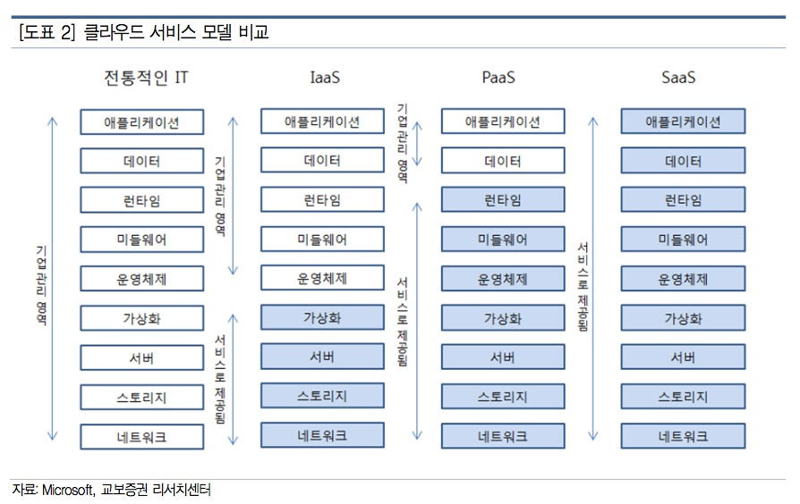

# SaaS, PaaS, IaaS ?

 

출처 :: [SaaS, PaaS, IaaS](https://ojava.tistory.com/146)

 

▲ 클라우드 서비스 모델 비교 (출처: 교보증권)

 

## 1. SaaS (Software as a Service)

 

서비스로서의 소프트웨어.

소프트웨어 자체를 서비스로 제공하는 것으로 가장 익숙한 개념.

Evernot 같은 서비스가 대표적이고, 이제는 설치 개념도 없이 모두 인터넷 브라우저에 접속해서 클라우드 형태로 관리 및 제공되는 서비스들이 더 많아졌다.
Google apps 나 Dropbox, 네이버 클라우드 등이 SaaS 로 볼 수 있는 서비스 이다.
서비스를 이요하고자 할 때 언제 어디서든 접속해서 사용하면 되는 구조이고 소프트웨어의 업데이트 및 보안 팿치 관리 등은 사용자가 신경쓸 필요가 없다. 소프트웨어를 사용하기 위해 필요한 A to Z 를 모두 관리해주는 서비스다.
사용방법은 소프트웨어 서비스에 접속해서 계정을 만들고 얼마의 기간동안 사용할건지를 선택하고 비용을 지불하는 방식이다.

우리가 이미 알고있는 개념가 결합하여 생각해보면 SaaS 의 경우는, 가전렌탈과 비슷하다.
공기청정기나 정수기 같은 가전 렌탈은 청정이 얼마나 되었는지, 물을 얼마나 사용했는지에 비례하여 사용 금액을 산정하는 것이 아니라 사용기간을 약정하여 비용을 청구한다.
렌탈비용에 관리비까지 포함되어 있기 때문에 필터 교체 등도 모두 관리해주는 개념마저도 비슷하다.

 

## 2. IaaS (Infrastructure as a Service)

 

서비스로서의 인프라스트럭처.

서버나 스토리지 등의 인프라 장비를 빌려주는 형태.

Amazon의 AWS, MS의 Azure 등. 요즘 언급되는 클라우드 서비스는 다 IaaS를 말한다.
기존의 IDC(Internet Data Center)에서 관리하던 인프라 자원 관리 등의 서비스를 인터넷에서 클릭만 하면 상태 확인 등이 가능해졌고, 물리적인 서버 한 대 추가 시 발생하던 시간과 비용에 비해 훨씬 더 빠른 시간과 비용으로(물론 사용량에 비례) 유연한 대응이 가능해졌다.
IaaS를 이용함으로써 시간과 공간에 대한 제약이 사라졌다.
초기 구축비용이 크다는 생각이 있었던 인프라 시장에서 IaaS 방식으로 구축하는 경우, 초기 구축 비용이나 시간이 매우 절약된다.
또한 인프라 증설이나 점검 등의 작업이 있는 경우 IDC 에서 밤을 새워가며 작업하던 것이 예전 방식이라면, 이제는 클릭 몇번으로 서버 및 스토리지의 전체적인 상태 확인이 가능하고 서비스 중단시간(다운타임) 없이 서버 복제나 스토리지 확장 등이 가능해졌다.

Iaas 의 경우는, 서비스로 제공되는 모든 자원들을 사용한 기간보다는 실제적으로 사용한 용량으로 가격을 산정한다.
SaaS가 사용기간에 따른 비용 지불방식임을 생각하면 실 사용량에 비례하는 비용은 좀 더 효율적으로 느껴진다.

우리가 잘 알고 있는 쏘카(Socar) 서비스의 경우도 원하는 차종, 원하는 시간만큼 비용을 지불한다.
물론 이용 시간에는 차를 안타고 있는 시간까지 포함될 수도 있지만, 차량 리스 등의 개념보다는 훨씬 합리적이고 이용 시간 단위로 비용 산정이 가능하다는 개념에서 어느 정도 비슷한 개념으로 보여진다.

 

## 3. PaaS (Platform as a Service)

 

서비스로서의 플랫폼.

플랫폼을 빌려주는 형태.

마지막으로 플랫폼을 빌려서 개발할 수 있는 서비스로, 세가지 개념 중 가장 생소한 개념이다.
개발자가 소프트웨어 개발을 위한 툴을 제공하는 서비스고, 개발자들은 PaaS 서비스 업체에서 제공하는 API를 원한는 대로 조합해서 개발을 진행할 수 있다.
개발에 필요한 도구와 환경을 제공하고 사용한 내용에 대해서만 비용을 지불하므로 합리적이나, 플랫폼에 종속된다는 단점이 있고 다른 플랫폼에서 구동되도록 하려면 수정과정이 필요하다.

SaaS 와 IaaS 의 중가정도로 보여져서 순차적으로 작성하다가, 순서를 바꾸어 두 개념을 설명한 뒤 마지막으로 정리하였다. 접목할 만한 예시가 없어서 걱정했는데, 해당 개념을 정리하면서 참고했던 자료인 블로터에서는 언급한 레고 블럭이 딱 맞는 예시로 생각된다. 플랫폼에 종속되는 부분이며 원하는 대로 조합하는 부분 등이 딱 맞는다.

PaaS 의 사례를 찾아보니, 대부분의 IaaS 기업에서 PaaS 형태의 서비스도 제공한다.
Google App Engine, Window Azure, ASW Elastic beanstalk 등.
인프라만 제공하는 IaaS의 역할이고, 소프트웨어까지 완벽하게 다 만들어져서 제공한 것이 SaaS 라면 PaaS 는 그 중간 단계로, 인프라 구조에 개발 내용을 구현할 수 있는 개발환경까지 포함된 것으로 볼 수 있다. 그래서 IaaS 업체에서 PaaS 서비스도 제공하는 것이 가능하다.
