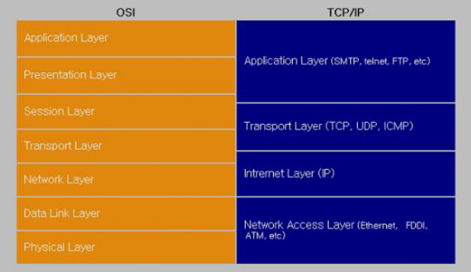

# TP-Monitor

 

> 출처: https://www.kdata.or.kr/info/info_04_view.html?field=&keyword=&type=techreport&page=18&dbnum=183712&mode=detail&type=techreport

 

## 개요

TP - Monitor(Transaction Processing Monitor) 는 각종 프로토콜에서 동작하는 세션과 시스템 및 데이터베이스 사이의 최소 처리단위인 트랜잭션을 감시하여 일관성 있게 보관 및 유지하는 역할을 하는 트랜잭션 관리 Middleware 이다.
TP 모니터는 Web Application Server 와 Web Transaction Gateway 와 같이 Middleware 의 범주에 속하며, 금용, 공공, 통신, 제조, 유통 등 하루 수천만 건의 트랜잭션이 발생하는 부하가 높은 시스템에서 부하를 조절하고 시스템의 안정 성을 확보하는 역할을 한다.
이러한 TP-Montitor 의 역할에 대해 알아보도록 하며 나아가 대표 적인 TP-Monitor 시스템인 TMAX 와 Tuxedo 의 기능과 구조, 차이점에 대해서도 알아보기로 한다.

## Middleware

클라이언트/서버 환경에서 분산된 애플리케이션과 분산된 데이터를 투명하게 연결하는 역할을 담당하는 것을 Middleware 라 한다.
Middleware 는 서로 다른 커뮤니케이션 프로토콜, 시스템 아키텍처, 운영체제, 데이터베이스와 다양한 애플리케이션 서비스를 지원하기 위해서 network 을 따라 하드웨어에 독립적으로 연결하여 주는 소프트웨어를 의미한다.
즉 클라이언트/서버를 물리적으로 연결하여 주는 것이 아닌 애플리케이션 내에서 논리적으로 연결을 의미한다.

Middleware 의 목표는 "Any-to-Any Operability" 로서 파일 교환 및 공유, 트랜잭션, RPC(Remote Procedure Call) 등의 다양한 방법을 사용하여 애플리케이션 모듈간 호환성을 가 지고 운영되도록 도와준다.
결론적으로 Middleware 는 애플리케이션 프로그램이 어떤 정보시스템 환경에서도 작동할 수 있도록 도와준다.
네트워크의 7 계층 중 5 층 ( 세션층 ) 과 6 층 ( 표현층 ) 에 존재하면서 컴퓨터와 컴퓨터 간의 통신을 쉽고 안전하게 할 수 있도록 해주며 이에 대한 관리 를 도와주는 소프트웨어라고 볼 수 있다.
궁극적으로 Middleware 의 가장 큰 역할은 클라이언트 와 서버 사이의 데이터를 교환해주는 것이기 때문이다.
즉 Middleware는 클라이언트와 서버 사이에(혹은 컴퓨터와 컴퓨터 사이) 통신 기능을 제공해주는 제품이며 이 기능을 제공한다면 아무리 간단하더라도 Middleware라고 부를 수 있는 것이다.
따라서 상당히 많은 범주의 Middleware 제품군이 존재할 수밖에 없다. 이러한 측면에서 TCP/IP도 Middleware로 볼 수 있다.

그러나 본고에서는 현재 시중에 선보이고 있는 상용 Middleware를 중심으로 소개할 예정이다. 이러한 상용 Middleware에는 통신을 제공하는 방법이나 특화된 기능에 따라서 DB 게이트웨이, TP 모니터, ORB 등 3 ～ 4가지로 나뉜다.
하지만 통신 기능을 제공한다는 표현은 오해를 불러올 소지가 많다. Middleware만 있으면 통신할 수 있는 것은 아니기 때문이다.
네트워크 통신에서 거론되는 OSI의 네트워크 7계층 모형을 보자. 「그림」에서 보듯이 가장 아래에 있는 물리층(Physical Layer)에서부터 가장 상단에 있는 응용 프로그램층(Application Layer)까지 모든 단계를 만족해야만 통신이 제대로 이뤄진다. 이 중 Middleware는 5번째인 `세션층(Session Layer)`과 6번째인 `표현층(Presentaion Layer)`에 존재하고 있다.
따라서 Middleware가 제공하는 통신 기능 역시 OSI 스펙의 5층과 6층에서 제시하고 있는 통신 사양에 의해 규정된다.

[그림 1] OSI와 TCP/IP Network Architectures

## 역할

간단히 말하면 네트워크상에서 구동되는 프로그램을 보다 쉽게 작성할 수 있도록 해준다.
즉 사 용하기 쉽고 관리하기 편한 중간층을 제공함으로써 사용자가 원하는 애플리케이션을 「빠르고 안전하게」 개발할 수 있도록 해준다는 것이다.
이러한 Middleware 의 특성은 기업에서 많은 사람들이 사용하는 대형의 업무 프로그램을 작성할 때 특히 중요한 역할을 한다.
빠르게 작성할 수 있다는 것 은 통신을 위해 쉽고 간단한 함수들을 제공해 개발 생산성을 높여준다는 의미며 안전 하다는 것은 기업의 핵심 업무가 문제 없이 돌아가도록 지원한다는 것이다.
사실 네트워크상에서 돌아가는 통신 프로그램을 작성하는 것 자체는 그다지 어려운 일이 아니지만 많은 사용자들이 범용적으로 사용할 수 있는 「안전한」 통신 프로그램을 만든다는 것은 결코 쉬운 일이 아니다.
네트워크상에서는 예측불허의 상황들이 일어날 가능성이 항상 존재하기 때문에 이에 대한 처리 가 미리 돼 있 어야만 안전한 프로그램이라고 말할 수 있는 것이다.
특히 기업에서 사용되는 프로 그램들은 대부분 기업 경쟁력과 직결되기 때문에 업무 프로그램이 오작동을 일으킬 경우에는 업 무상 상당한 피해를 초래하게 된다.
그렇다고 실수나 오류를 완전히 막을 수는 없는데 이러한 피 해를 최소화시키거나 잘못된 부분을 빠르게 찾아 수정할 수 있도록 지원해주는 것이 Middleware 인 것이다.

또한 기업의 업무 시스템에서는 해당 업무를 관리하는 관리자가 있기 마련인데 이들 관리 자가 담당하고 있는 업무가 문제 없이 운영되기 위해서는 동작 상태를 감시할 수 있는 모니터링 기능 역시 필요하다.
Middleware 에서는 이런 관리자의 요구를 수용할 수 있는 기능도 함께 제공해준다.

결론적으로 Middleware 는 애플리케이션의 기반을 제공하는 것으로 Middleware 상에서 작성 된 프로그램은 보다 쉽고 효과적으로 통신할 수 있는 기능을 갖게 되며 관리 및 감시도 훨씬 수월해지게 된다.

## Middleware의 종류

### DB Middleware

DB Middleware 는 오라클이나 인포믹스 등의 DB 에 바로 접속해 SQL 을 사용할 수 있도록 해 주는 제품을 일컫는다.
DB Middleware 는 다른 Middleware 와는 달리 2 계층 클라이언트 서버 (CS) 구조에서 사용된다는 특징을 지니고 있으며 대표적인 제품으로는 오라클 SQL 넷 등을 들 수 있다.
특히 DB Middleware 의 경우 DB 업체마다 전용 기술을 채택하고 있어 호환 문제가 발 생하는 데 이를 해결하기 위해 나온 표준 기 술이 개방형 DB 연결 (ODBC) 이다.
DB Middleware 는 2 층 CS 프로그램의 주류를 차지했지만 최근들어 컴퓨팅 환경이 3 층 구조로 이전함에 따라 점차 밀려나는 추세에 있다.

### 원격 프로시져 호출 (RPC:Remote Procedure Call)

기반 Middleware RPC 란 네트워크상의 다른 컴퓨터에 있는 프로그램을 실행시키는 작업을 말 한다.
요즘은 일반적으로 RPC 기능이 운용체계 (OS) 에 포함돼 제공되는 경우가 많다.
따라서 RPC 기반 Middleware 제품군은 OS 에서 제공되는 RPC 기능을 보다 편하게 사용할 수 있도록 도와주는 역할을 한다.
RPC 는 컴퓨터간 통신에 있어서 가장 단순한 형태인 만큼 단순한 형태의 프로그램 제작에는 가장 쉽고 편하게 사용할 수 있다.
그러나 복잡한 형태의 환경을 위한 기능을 구현하기에는 역부족이다.
이러한 제품에는 인프라이즈로 인수된 OEC 의 엔테라가 대표적이다.

### Message 지향 Middleware(MOM:Message - Oriented Middle ware)

RPC 가 동기 (Syncronous: 요청을 보낸 후 응답이 있을 때까지 기다리는 것을 의미 ) 형의 특징을 갖춘 반면 MOM 은 비동기 (Asyncronous: 응답이 있을 때까지 기다리지 않고 나중에 결과를 확인) 적이라는 특징을 갖는다. MOM 은 일반적으로 메시지를 큐 (Queue) 라고 불리는 전달 중계소 에 넣어 처리하고 큐에 의한 메시지 관리 기능을 제공한다. 따라서 즉각적인 응답을 원하는 경우 가 아니라 다소 느리고 안정적인 응답을 필요로 하는 경우에 많이 사용된다. 대표적인 제품으로 는 IBM MQ 시리즈가 있다.

### 트랜잭션 처리 (TP:Transaction Processing) 모니터

TP 모니터는 가장 대표적인 Middleware 로 주로 사용자가 많고 안정적이면서도 즉각적인 처리 가 필요한 업무 프로그램의 개발에 많이 사용된다. 제한적인 컴퓨터의 자원을 보다 많은 사용자 가 사용할 수 있도록 효율적인 관리 및 안정적인 운영을 지원하며 운영상태 감시 기능 등을 제공 한다. 주로 은행의 창구업무 프로그램 작성에 많이 사용되며 메인프레임 영역에서 IBM 「 CICS 」 나 「 IMS 」 유닉스 및 윈도 NT 영역에서는 BEA 의 턱시도와 톱엔드 등이 있다.

### ORB(Object Request Brokers) 기반 Middleware

ORB Middleware 는 현재 가장 주목받고 있는 객체 기반의 Middleware 다. 여러 개의 컴퓨터에 분산돼 있는 프로그램과 데이터들을 각각의 독립된 가상적인 물체처럼 편리하게 사용하는 길을 제공하는 것이 ORB Middleware 의 궁극적인 목표다. Middleware 영역 중 이론상으로 가장 앞 서 있으며 그만큼 경쟁도 가장 치열한 부분이다. 표준 문제 전사적인 규모의 적용 등에서 아직 미흡한 부분도 많지만 이를 해결하기 위해 MS 「 DCOM 」 OMG 그룹의 「코바 (CORBA) 」 등 표준 기술이 나와 있다. 아이오나사의 「오빅스」, BEA 시스템스의 「 M3 」 등이 대표적이다.

### TP-Monitor

초기에 대부분의 업무 시스템은 메인 프레임 기반의 중앙 집중식 환경으로 구성되어 있었다. 중앙 집중식 환경은 비용이나 관리상의 여러 가지 단점을 나타내기 시작했다. 이러한 중앙 집중식 환경의 문제점을 보완하기 위해 대두된 것이 개방형 분산 시스템이다. 그러나 개방형 분산 시스템 또한 시스템 운영이나 관리상에 또 다른 문제가 나타났다. 이러한 문제점을 해결하기 위해서 도입된 소프트웨어가 Middleware 다. Middleware 중에 TP-Monitor 는 프로토콜에서 동작하는 세션과 시스템 및 데이터베이스 사이의 최소 처리 단위인 트랜잭션을 감시하여 일관성 있게 보관 및 유지하는 역할을 하는 트랜잭션 관리 Middleware 다.

다음은 TP-Monitor 의 주요 기능이다.

- 애플리케이션 개발에 용이하다. 복잡합 업무 프로세스를 개발할 때 데이터 중심에서 기능 중심으로 분산해서 개발한다. 기존 메인 프레임 환경은 비즈니스 로직과 데이터 처리 로직 이 혼재되어 개발되었다. 따라서 메인 프레임 환경에서 애플리케이션의 개발은 상당히 어려웠다. 그러나 TP - Montior 를 사용하면 Middleware 에는 비즈니스 로직을 구현하고 클라 이언트 프로그램은 사용자에게 제공하는 모듈만 구현하면 된다. 그리고 데이터베이스 서버 프로그램은 데이터 관리에 대한 기능만 구현하면 된다. 이러한 기능의 분리는 애플리케 이션의 개발을 쉽게 한다.

- 효율적인 애플리케이션 관리에 용이하다. 분산된 각 업무 시스템을 TP-Monitor 를 통해서 관리하므로 각 애플리케이션을 효율적으로 관리할 수 있다.

- 이기종 DBMS 자원관리에 용이하다. DBMS 의 트랜잭션을 통합 관리하므로 이기종 데이 터베이스 간의 자원 관리가 가능하다.

- 부하 조절에 용이하다. 최적의 자원 사용에 대해 관리하므로 부하를 분산하고 분산 트랜잭션을 지원한다.

- 수행 속도와 신뢰성이 높다. 적은 서버 자원으로 많은 클라이언트를 관리하여 DBMS 의 오버헤드를 줄이고 응답시간을 향상시킨다.

### TMAX

Tmax 는 Transaction Maximization 의 약어로 트랜잭션 처리 극대화를 의미한다. Tmax 는 시스템의 분산 환경에서 이기종 컴퓨터 간의 트랜잭션 처리를 완벽 히 보장하면서 부하를 분산시키고 에러 발생 시 적절한 조치를 담당하는 TP-Monitor 이다. 트랜잭션의 특성을 지원하면서 사용자에게는 최적의 개발환경을 제공하고 클라이언트 / 서버 환경에서 최적의 솔루션을 제공하며 성능 개선은 물론 모든 장애에 완벽하게 대처한다. Tmax 는 분산 트랜잭션 프로세싱의 국제 표준인 X/Open DTP(Distributed Transaction Processing) 모델을 준수하고 국제 표준기구인 OSI(Open System s Interconnection group) 의 DTP 서비스에 대한 기능적 분산과 기능 구성 요소 간 API 및 시스템 인터페이스 정의에 따라 개발되었다.

또한 분산 환경에서 이기종 간의 투명한 업무 처리 및 OLTP(On-Line Transaction Processing) 를 지원하고 트랜잭션 처리의 ACID(Atomic, Consistent, Isolated, Durable: transaction properties) 특성을 만족하게 한다. Tmax 는 투명한 업무처리를 통해 성능을 극대화하고 중요도가 높은 기간계 업무를 완벽하게 처리하여 개발자와 시스템 관리자에게 최적화된 컴퓨팅 환경을 제공한다. 또한 금융 공공 통신 제조 유통 등 전 산업 분야에서 하루 수천만 건의 트랜잭션이 발생하는 중요도 높은 시스템에서 부하를 조절하고 장애발생을 방지하여 고객 시스템의 안정성을 보장한다. Tmax 는 Large - scale OLTP 애플리케이션 개발이나 항공 및 호텔 병원 국방 분야나 은행 온라인 업 무나 신용카드 승인 업무 고객 및 판매 관리 업무와 같은 다양한 사업분야와 업무에서 사용되고 있다.

## Tmax 구조

AP 시스템을 구성하면서 Middleware 제품을 많이 선택 한다. Tmax 제품을 사용 하면서 AP 프로그램 이외에 내부적 프로세스와 관리 명령어들에 대해서 많이 보게 된다. Tmax 에는 내부적 으로 7 개의 운용 프로세스 (TMM, TMS, CLL, CLH, RQS, GW, CAS) 와 4 개의 관리 명령어 (tmadmin, racd, tmboot, tmdown) 가 존재합니다. 이 중에서 CLH 는 Transaction 량이 많이 증가 함에 따라서 메모리에 많은 영향을 준 다.

- TMM(Tmax Manager) 
  Tmax 시스템을 운영 관리하는 핵심 프로세스로 Tmax 시스템의 모든 공유 정보와 CLL, CLH, TMS 및 AP(Application Program) 서버 프로세스를 관리한다.

- Note  
  공유 메모리(Shared Memory) 할당 : 설정한 환경 정보를 cfl 명령어로 컴파일한 바이너리는 엔진이 기동되는 시점에 TMM 프로세스가 공유 메모리에 로딩을 한다. TMM은 로딩된 운영 정보를 이용해서 시스템을 운영한다. 
  프로세스 관리 : TMM은 모든 시스템에 대한 운영과 종료의 주체가 된다. 
  로그 관리 : Tmax에서 발생하는 시스템 로그(slog)와 사용자 로그(ulog)를 관리한다.

### CLL(Client Listener)

CLL 은 클라이언트와 Tmax 간의 연결을 관리하는 Listener 프로세스입니다. 클라이언트가 처음 Tmax 에 접속할 때에는 CLL 과 연결을 맺어 통신이 이루어지나 서비스 요청이 있을 경우, 내부적으로 CLH 와 연결이 되어 모든 서비스 처리가 이루어집니다.

### CLH(Client Handler)

클라이언트 매니저라고도 하며 실질적으로 클라이언트와 서버의 업무처리 프로세스 사이를 중계하는 프로세스입니다. CLH 는 업무처리 프로세스들과 기타 게이트웨이, RQ 프로세스, TMAX 프로세스와 연결을 맺으며 이들과의 통신을 통해 모든 실제적인 데이터의 흐름을 관리합니다. 즉 클라이언트의 서비스요청을 받아 그에 해당하는 업무를 처리하며 그 결과를 수신하여 다시 클라이언트에게 되돌려줍니다.

### TMM(Tmax Manager)

Tmax 시스템을 운영 관리하는 핵심 프로세스로 Tmax 시스템의 모든 공유 정보와 CLL, CLH, TMS 및 AP(Application Program) 서버 프로세스를 관리한다.

### TMS(Transaction Management Server)

데이터베이스 관리 및 분산 트랜잭션 처리를 담당하는 프로세스로써 해당 데이터베이스 의 라이브러리를 이용하여 만들어 진다. Tmax 시스템의 운영에 필수적인 TMM, CLL, CLH 프로세스들과는 달리 TMS 는 DBMS 와 관련된 작업을 하는 Tmax 시스템에서만 동작 한 다.

### RQS(Reliable Queue Server)

Tmax 시스템의 디스크 큐를 관리하는 프로세스입니다. 일반적인 경우 데이터는 메모리에 저장되어 처리되므로 돌발적인 시스템 장애가 발생할 경우 메모리에 있는 데이터는 지워 지게 됩니다. 중요한 서비스 의 수행에 있어 데이터의 신뢰도를 높이기위해 Tmax 시스템이 제공하는 RQS 는 서비스 요청 전, 후의 데이터를 디스크에 저장하며 만일의 경우에도 시 스템이 재부팅 된후 장애 이전에 저장된 데이터를 다시 처리할 수 있도록 해줍니다. 서비스 수행 속도를 떨어뜨릴수 있으므로 Tmax 시스템의 기동시 기본적으로 동작하지는 않으며 사용자의 필요에 따라 환경파일에 정의된 시스템에서만 동작하게 됩니다.

### GW(Gateway)

멀티 도메인으로 시스템을 구축한 경우 도메인 간의 통신을 담당하는 프로세스로써 Tmax 시스템간에는 물론이고 TCP/IP, SNA/LU0, SNA/LU6, X.25 등 다양한 시스템과의 연동이 가능합니다. 실제 수행되는 프로세스명은 사용자가 환경파일에 정의하기에 따라 다르며 게이트웨이 종류에 따라 특별한 설정을 더 필요로 하는 경우도 있습니다. 이 프로세스 역시 Tmax 시스템에 항상 기본적으로 동작하는 프로세스가 아니고 환경파일에 GATEWAY 가 정 의된 시스템에서만 동작합니다.

### CAS (Client Authentication Server)

보안이 필요한 Tmax 시스템을 운영하는 경우에 사용되는 프로세스로 1 단계 및 2 단계 보 안을 담당하며 사용자의 신원을 확인하는 역할을 합니다.

### tmadmin (Tmas Administration)

tmadmin 은 Tmax 에서 제공하는 어드민 툴로써 운영중인 Tmax 시스템의 환경을 확인하거나 동적으로 변경하는 기능을 제공하며 현재 서버 프로세스의 동작 상태와 통계정보, 서비스나 큐의 상태 정보를 확인할 수 있습니다.

### Racd (Remote Access Control Daemon)

여러 개의 노드를 하나의 도메인으로 Tmax 시스템을 구축하였을 경우 한 노드에서 다른 시스템을 관리할 수 있도록 각각의 노드에 미리 기동시키는 데몬 프로세스입니다. racd 를 사용하여 도메인 내 한 노드에서 tmadmin 을 통하여 체 노드를 모니터링할 수 있으며 일일히 파일을 복사하지 않아도 하나의 환경파일을 모든 노드에 적용할 수 있습니다.

### Tmboot (Tmax Syst em Boot)

tmboot 는 환경파일에 정의된 내용에 따라 Tmax 시스템을 초기화하여 기동합니다. 가장 일반적으로 Tmax 시스템 프로세스 (TMM, CLL, CLH) 들이 먼저 기동되고 이후 부가적인 환경을 위한 RQ, TMS, GW 프로세스가 기동되며 마지막으로 개발된 서버 프로세스들이 기동됩니다. tmboot 는 다양한 옵션을 제공하여 다양한 방법으로 Tmax 시스템을 기동 할 수 있습니다.

### Tmdown (Tmax System Down)

tmdown 은 환경파일의 내용을 토대로 tmboot 로 기동된 시스템을 종료 시키는 명령어입 니다. 종료순서는 tmboot 와 반대로 먼저 모든 응용 서버 프로세스를 종료 시킨 후에 Tmax 시스템 관리 프로세스들을 종료합니다.

## Tmax 기능

다음은 Tmax 의 주요 기능에 대한 설명이다.

### 프로세스 관리

Tmax 는 3-tier 기반의 클라이언트 / 서버 환경을 제공하여 클라이언트마다 생성되는 서버의 업무처리 프로세스 수를 조절하여 시스템을 최적의 환경으로 활용할 수 있도록 관리한다.

### 트랜잭션 관리

클라이언트 분산 트랜잭션 처리될 때 2 단계 (2 Phase) commit 을 지원하여 데이터 무결성을 보장하고 간단한 몇 가지 함수 (tx_begin, tx_commit, tx_rollback 등 ) 를 제공하여 전역 트랜잭션을 용이하게 한다. 또한, 멀티스레드 방식의 트랜잭션 매니저를 제공하여 적은 자원 대비 높은 효율성을 제공하고 동적 로깅으로 에러 가 발생하는 경우 신속히 대응하므로 Recovery/Rollback 에 의한 안정성을 보장한다. 모든 트랜잭션은 중앙에서 관리하므로 트랜잭션에 대한 스케줄링이나 관리가 쉽다.

### 부하 조절

Tmax 는 SLM, DDR, DLM 방식을 통해 부하 조절 기능을 제공하여 전체 시스템의 처리량을 증대시키고 처리 시간을 단축 한다.

### 장애 대책

하드웨어적인 장애가 발생하는 경우 Load Balancing 을 통한 장애 대책과 서비스 백업에 의한 정상 운영이 가능하다. 서버 프로세스가 다운되는 소프트웨어적인 장애가 발행하는 경우 프로세스가 재시작 되므 로 중단 없는 서비스가 제공된다.

### 편리한 API 및 다양한 통신방식 지원

동기형 통신 (Synchronous), 비동기형 통신 (Asynchronous), 대화형 통신 (Conversational), 요구 재요청 (Request Forwarding), 알람 통지 (Notify), 메시지 동시전달 (Broadcasting) 과 같은 다양한 통신방식을 지원하며, 이를 위해 편리한 API 를 제공한다.

### 웹과의 연동

보안이 클라이언트/서버 환경과 웹 환경을 Java Applet/Servlet, PHP 등을 통해 연동함으로 써 빠른 응답시간 을 보장하고, 시스템 성능을 향상시킬 수 있다. Tmax 에서는 서비스 연>

- Note
- SLM(system Load Management) : 정의된 부하 비율로 분산 처리하는 방식
- DDR(Data Dependent Routing) : 데이터 값에 따라 분산 처리하는 방식
- DLM(Dynamic Load Management) : 부하 비율에 따라 동적으로 처리 그룹을 선택하는 방식

## Tuxedo 기능 및 구조

### 분산 트랜잭션 처리

실질적으로 무제한 확장이 가능하므로 피크 시의 트랜잭션 볼륨이 효율적 으로 관리되고 비즈니 스 민첩성이 향상되며 IT 기업은 비즈니스 요구사항 및 처리량의 변경에 신속하게 대처할 수 있습니다. Oracle Tuxedo 는 액세스 프로토콜에 상관 없이 여러 개의 데이터베이스에서 트랜잭션을 최적화하고 모든 연관 리소스의 데이터 무결성을 유지 한다. 시스템은 트랜잭션과 관련된 모든 요소를 추적하고 확장 주소 지정 (TXA) 2 단계 commit 프로토콜을 감시하며 모든 트랜잭션 commit 과 rollback 이 올바르게 처리되도록 한 다.

## Oracle TSAM

Oracle TSAM(Tuxedo System and Applications Monitor) 은 종단 간 트랜잭션 및 서비스 모니터링을 위해 설계되었으며, 이를 사용하여 응답 시간에 대한 SLA(Service - Level Agreements) 를 설정하고 모니터링하며 사용 중인 애플리케이션 서비스의 성능과 동작을 검사하고 Oracle Tuxedo 인프라의 모든 구성요소에 대한 활용 메트릭스를 통해 용량 계획을 개선할 수 있다. Oracle TSAM 을 사용하여 사용 중인 애플리케이션 요청, 서비스 활동, XA 트랜잭션 및 Oracle Tuxedo 서버의 처리량 등을 모니터링 할 수 있다. 사용들은 애플리케이션 요청 및 서 비스 실행 시간과 프로세스 간 통신 대기 열에 설정된 메시지 수 및 Oracle Tuxedo 도메인, 서버, 게이트웨이 및 기타 구성요소 상태에 대한 경고를 설정하고 모니터링 할 수 있다. Oracle TSAM 경고는 Oracle Tuxedo 이벤트 서버에서 이벤트를 trigger 하며 이를 통해 사용자 정의 서비스와 경고를 연관시킬 수 있다. 또한 사용자들은 서비스 요청 트리 상의 데이터를 통해 서비스 성능, 시스템 성능 및 특정 애플리케이션 패턴에 대한 통계를 질의할 수 있다.

### 리소스 관리

Oracle Tuxedo 를 사용하면 리소스 사용을 관리하여 지정된 애플리케 이션 인스턴스에서 실행 되는 모든 활동을 수행할 수 있을 만큼 용량이 충분한지 확인할 수 있으며, 요청이 사용 가능한 네트워크 자산으로 동적 routing 되어 트랜잭션을 성공적으로 수행할 수 있도록 지원할 수 있다. 기업은 강력한 통합 기능으로 기존 기술 투자를 활용하여 리소스 사용을 극대화할 수 있다.

## TP - Monitor 비교 (Tmax 와 Tuxedo)

TMAX 와 TUXEDO 는 기본적으로 OSI 의 TP 표준과 Xopen 의 DTP 표준을 준수하는 Middleware 이다. 두 가지 모두 표준을 준수하여 만들어진 Middleware 이며, 두 M/W 의 기본 골격이나 API 이름이나 구성요소는 거의 비슷하다. 특히 API 의 이름이 거의 대부분 같으며, 이름이 다르더라도 TMAX 쪽에서는 TUXEDO 의 API 와 같은 이름의 API 들을 부가적으로 갖고 있으므로, 프로그램 개발자 수준에서는 거의 아무런 걱정 없이 프로그램을 개발할 수 있다. 하지만, 몇몇 부분으로 들어가면 그 차이가 나타난다. 특히, 운영자 나 시스템관리자 입장에서 보면 차이 가 꽤 크다고 볼 수 있다. TUXEDO 는 시스템 작동의 중요한 수단으로 shared memory, semaphore, message queue 등의 IPC 자원을 사용한다. 또한, domain 내의 각 node 를 통제 하는 방법으로서 master node 를 설정하여, 이 곳에서 전체 node 에 대한 정보를 관리하게 된다. 때문에, multi node 의 경우를 보면 TUXEDO 와 TMAX 의 booting 시간이 차이가 꽤 많이 나는 것을 볼 수 있다. 이유는 TUXEDO 에서는 process 가 구동되는 시점에서 시스템으로부터 각 IPC 자원을 할당 받는 logic 을 수행하기 때문이며, 이것은 매우 중요하다.

하지만, TMAX 는 조금 다르다. TMAX 는 multi node 라도 모든 node 가 logical 하게 평등한 위치에서 작동 한다. 즉, 어떤 Node 에서도 admin 을 수행할 수 있다는 것을 의미한다. 이것은 master node 가 갑자기 down 될 경우 시스템상의 혼란이 초래되는 TUXEDO 와는 전혀 다른 조건이다. 또, 시스템 자원 측면도 다르다. 물론 TMAX 도 TMM 의 경우는 shared memory 를 사용하고, server AP 로 request 가 전달될 때에는 message queue 를 사용하지만, 기본적인 통신은 stream pipe 이다. 이것은, 처리 속도가 빨라지는 것을 의미하기도 하고, 또 시스템 자원을 적게 소모한다는 것을 의미하기도 한다. 실제로, TUXEDO 를 설치하기 위해서는 SHMMAX 를 위시한 몇 개의 system parameter 가 규격에 맞는지를 조사하고 이를 조정하여야 하지만, 대체로 nfiles 이외 의 다른 parameter 에 손을 댈 일이 없고, 그만큼 엔진이 가볍다는 소리이다. 구축하거나 운용 중인 시스템이 한 업무에 대한 backup node 를 갖고 있느냐 아니냐 하는 점이 TUXEDO 와 TMAX 의 차이를 가져올 수 있다.

TUXEDO 에서 다소 불편한 hot-standby 개념의 AP 설정이 TMAX 에서는 cousin 이라는 모드로 매우 간단히 구 현된다는 특징이 있는데, 이것은 Oracle 의 OPS 를 사용하여 평소에는 한쪽 장비를 hot stand by 로 구성하는 시스템이라면 TMAX 의 cousin 이 매우 편리한 특성이 될 수 있을 것이다. 하지만 상당수의 사이트는 사실상 backup node 가 없다시피 하므로 이 편리한 특성을 사용할 기회를 잡기가 쉽지 않다. 만약, 사실상 backup 이 없어서 장애가 터질 때엔 "30 분 내 복구" 등의 원칙을 갖고 운용 중이라면, backup node 를 구성하고 cluster 넘길 시간에 장애가 난 장비를 turn off/turn on 시키는 것이 나을 것이기 때문이다.

## C/S 환경에서 Tuxedo 의 사용 예

클라이언트 ( 주로 PC) / 서버 ( 주로 UNIX) 구조의 분산시스템 환경 ( ↔ Mainframe, 터미널 구조 의 중앙집중식 환경 ) 에서 클라이언트 개수가 많아짐에 따라 다음과 같은 문제점들이 생긴다. 즉, 보다 많은 user license 를 갖는 DB를 사용해야 되므로 DB 구축 비용이 많이 들고, process 가 많아지므로 메모리를 더욱 많이 필요로 하며, 네트워크 Traffic 증가함에 따라서 Transaction 속 도가 크게 떨어진다. 위와 같은 규모가 큰 분산시스템의 문제점을 해결하기 위해 기존의 2 단계 시스템 ( 클라이언트 - 서버 ) 에서 Middleware 를 도입한 3 단계 시스템 ( 클라이언트 - Middleware - 서버 ) 을 구성한다.

Middleware 는 넓은 의미로는 ODBC 같은 데이터베이스 Middleware 도 포함하지만 일반적으로 사용하는 Middleware 는 OLTP Middleware(OLTP: On Line Transaction Processing. 이것 을 흔히 TP Monitor 라고 부른다 ) 를 말한다. Middleware 의 구성을 보면 클라이언트에 위치하거나 또는 서버에 위치하거나 별도의 호스트에 위치하는 경우가 있을 수 있는데 예를 들면 C3I 체계 내에서 Tuxedo 사용형태는 클라이언트에는 Middleware 라이브러리 (Tuxedo 라이브러리 ) 만 존재하고 서버에 Middleware 가 위치한 경우이다. Tuxedo 와 같은 TP 모니터를 사용했을 때 의 이점을 일례로 들면 Middleware 없는 경우 1000 개의 process 관리를 50 개 정도의 process 관리로 줄일 수 있고 동시 사용자수를 줄이므로 DB 라이센스를 감소시키고 메모리가 적게 사용되어 약 30% 정도의 시스템 비용 절감이 가능하다고 한다.
