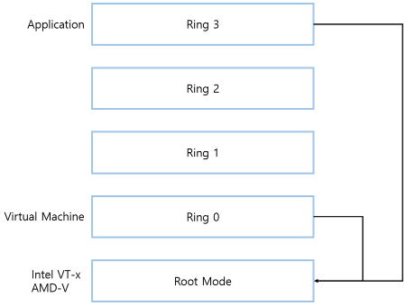

# x86 가상화를 이해하기 위한 기초지식

 

> 출처 - https://jmoon.co.kr/177

 

## x86 가상화란?

가상화는 매우 오래된 기술이다. 1960년대부터 시작된 IBM의 메인프레임 부터 가상화 기술은 탑재되어 왔다.
이후 유닉스 시스템을 거쳐 현재는 우리가 일반적으로 알고 있는 Intel 및 AMD CPU 가 탑재된 x86 서버 및 데스크톱에도 가상화가 탑재 되어 있다.
기업의 데이터센터에서만 사용되던 기술이 이제는 일반 사용자까지 내려오게 되었다.

이제 x86 가상화는 메인프레임과 유닉스를 넘어서 절대강자의 대중화된 기술이 되었다.
우리가 요즘 메일 듣는 클라우드 컴퓨팅기술은 바로 이 x86 가상화를 기반으로 이루어지고 있다.
아마존 웹 서비스, MS 애저, 구글 클라우드 등 현존하는 클라우드 컴퓨팅이라고 하는 것들은 대부분 x86 가상화 기반이라고 생각하면 된다.

x86 가상화는 x86 기반의 게스트 운영체제(윈도우, 리눅스)가 하이퍼바이저 라고 하는 가상화 레이어 위에서 구동하는 방식이다.

x86 아키텍쳐는 CISC(Complex Instruction Set Computer) 기반인데 CISC란 소프트웨어 특히, 컴파일러 작성을 쉽게 하기 위해 하드웨어화 할 수 있는 것들은 가능한 모두 하드웨어에게 맡긴다느느 원칙 아래 설계된 컴퓨터이다.

우리가 알고 있는 대중화된 Intel CPU 혹은 AMD가 장착된 PC는 모두 x86 계열이다.

x86 가상화 제품 종류

- VMware 의 vSphere
- Citrix 의 XenServer
- Microsoft 의 Hyper-V
- Linux 기반의 KVM

**x86 가상화 제품들은 유닉스 서버를 지원하지 않는다. CISC 와 RISC 칩의 설계 방식이 다르기 때문에.**

 

## 서버가상화란?

한대의 물리적인 서버에 여러 대의 논리적인 가상머신을 작동시키는 것이다.
각 가상머신에는 OS가 설치된다.(Guest OS).
게스트 OS는 각기 독자적으로 운영되며 어플리케이션도 독릭해서 설치할 수 있다.
각 VM은 완전히 독립되어 있으며 서로 직접적인 영향을 미치지 않는다.
이러한 가상머신들은 물리적인 서버에 설치된 하이퍼바이저(가상머신모니터(VMM) 라고도 부름)에 의해 관리된다.

### 서버가상화의 특징

- 격리

  가상머신을 물리 하드웨어로부터 완전히 분리할 수 있다.
  기존 전통적인 방식에서는 물리 서버에 OS를 직접 설치하는 방식이었기 때문에 물리 서버와 OS를 분리할 수 없었다.
  물리 서버와의 구속력이 아주 타이트 했다. 하지만 가상머신은 물리 서버와 OS사이에서 가상머신이라는 논리적인 형태를 생성함으로써 물리 서버와 OS를 쉽게 부리할 수 있다.

- 캡슐화

  물리적인 서버는 하나의 알약과 비슷하다.
  그 알약에 들어 있는 수많은 캡슐이 가상머신이라고 생각하면 된다.
  하나의 알약안에 여러 개의 캡슐이 존재하는 형태라고 보면 된다.
  하나의 캡슐은 각기 고유한 역할을 수행하지만 다른 캡슐과 분명히 다르다.

- 하드웨어 비의존성

  가상머신은 캡슐화와 격리에 의해 더이상 물리적인 서버에 종족되지 않는다.
  논리적인 서버인 가성머신으로 구성되기 때문에 논리적인 레벨에서 관리가 된다.
  심지어 서로 다른 물리적인 서버의 경계를 넘어 이동할 수 있다.

### 서버 가상화의 장점

- 서버 리소스를 공유하여 비용 절감 가능

  기존의 x86 서버는 실제 물리 서버의 평균 10~15 퍼센트의 리소스만을 사용한다.
  서버 가상화를 활용하면서 사용율이 낮은 서버들을 한 대의 가상화 서버로 통합할 수 있다.
  한대의 물리적인 서버에 여러 대의 가상 서버를 동시에 운영할 수 있으므로, 기존에 한 대의 서버에 들어가던 전력비용, 통신비용으로 다수의 서버를 운용할 수 있어서 비용 절감 효과를 누릴 수 있다.

- 유지보수의 편의성 증대

  기존 물리적인 서버의 경우 서버와 OS의 의존도가 높기 때문에 서버의 유지보수 및 장애가 발생하면 서버의 전원을 차단해야 하므로 OS의 가동이 중지된다.
  하지만 서버 가상화를 운영한다면, 그리고 서버 가상화 클러스터가 구축되어 있다면 가상머신을 다른 서버로 이동한 다음 장애가 발생한 물리 서버를 손쉽게 조치할 수 있다.

- 시스템 가용성 증대

  물리적인 서버에 장애가 발생하면 동작하던 OS의 가용성이 떨어진다.
  이때 클러스터로 구성된 가상머신 팜은 장애가 발생한 서버 위에서 동작하는 가상머신들을 다른 쪽으로 자동으로 이동시킨다.
  이런 기능을 이용해 관리의 개입이 없더라도 가상머신의 가용성을 보장할 수 있다.

 

## 하이퍼바이저 란?

`하이퍼바이저`를 그대로 번역하면 '무언가를 뛰어넘는 가리개 막' 정도로 해석할 수 있다.
위키에서는 `하이퍼바이저`를 `호스트 컴퓨터에서 다수의 운영체제를 동시에 실행시키기 위한 논리적 플랫폼을 말한다.`
`가상화 머신 모니터`라고 정의하고 있다.

하이퍼바이저를 이야기할 때 빠지지 않는 용어가 `베어메탈`이다.
베어메탈은 말 그대로 '헐벗은 금속' 이라는 의미이다. 의역하자면 빈 깡통이다.
빈 깡통이니까 OS가 설치되기 전의 서버라고 생각하면 된다.
예전엔 이 서버에 OS를 직접 설치했다. 윈도우 서버, 리눅스 서버 등 서버에 직접 설치를 했다.
그러나 일반적인 랙 서버에 탑재되는 범용 OS 들의 활용률은 낮았다.
x86서버가 유닉스 서버 대비 중요도가 덜한 서비스에 사용되니 OS의 사용률이 평균 10%가 넘어서는 일이 없었다.

데이터센터의 랙 서버는 늘어나는데 비효율적으로 사용되는 현상이 많아진 탓이다.
이런 상화에서 x86 가상화가 나왔고 x86 가상화를 구현하는 핵심이 바로 하이퍼바이저 이다.
하이퍼바이저는 기존 서버와 OS의 관계를 허무는 역할을 했다.
서버라는 하드웨어에 얇은 막을 하나 설치하고 그 막을 통해 물리적인 서버를 통제한다.
그리고 그 위에 여러 개의 OS가 동작할 수 있는 가상머신을 만들 수 있는 바탕을 이루는 역할을 했다.

### 하이퍼바이저의 종류

- bare-metal 방식

  서버에 하이퍼바이저 제품을 직접 설치하는 방식이다.
  VMware의 ESXi Server, Citrix의 XenServer, MS의 Hyper-V 서버 등이 베어메탈 방식의 하이퍼바이저다.
  OS 처럼 설치하는 가상화 제품이라고 생각하면 된다. 설치 CD 가 제공되고 OS 설치하듯이 진행하면 된다.

  대부분의 IT데이터센터에서는 이러한 방식으로 x86 가상화를 구축하고 있다.

- 호스티드(Hosted) 방식

  기존에 설치된 OS 위에 응용 어플리케이션으로 가상화 제품을 설치하고 그 위에 또 다시 가상머신을 만들어서 운영하는 방식이다.
  VMware 의 VMware Workstation Pro, VMware Player Pro, Oracle 의 Virtual Box 등이 대표적인 프로그램 이다.

  이러한 방식은 IT데이터센터에서는 사용되지 않는 방식이며 개인용 개발 및 테스트를 할 경우에 사용되고 있다.

### x86 가상화 아키텍쳐 구현 방식

하이퍼바이저를 이해하기 위해서는 운영체제의 `유저 모드`와 `커널 모드`를 이해해야한다.

가상화와 연관된 유저 모드와 커널 모드를 이해하기 위해서는 x86 CPU의 Protection Ring 모드를 이해해야한다.
유저모드와 커널모드가 Ring 모드의 전환과 밀접한 연관관계가 있기 때문이다.

베어메탈에 윈도우 OS, 리눅스 OS를 설치하면 하드웨어-운영체제 라는 2개의 층이 형성된다.
OS가 설치되면 하드웨어의 주소를 직접 다루는 부분과 어플리케이션을 다루는 부분이 분리된다.
OS에서 하드웨어를 직접 핸들링할 경우에 다루는 모드를 `커널모드`라고 부른다.
일반적 사용자 측면인 어플리케이션 측면에서 핸들링하는 부분을 `유저모드`라고 부른다.
커널모드는 사용자가 알 필요가 없다.
OS에서 디바이스 제어하는 경우에 주로 커널 모드가 동작한다.

가상화를 도입하게 되면 이부분에서 문제가 발생한다.
물리 서버에서 하나의 OS가 아닌 여러 개의 OS가 물리적인 하드웨어를 동시에 컨트롤해야한다.
만약 여러대의 OS가 같은 하드웨어 주소를 참조하여 핸들링한다고 하면 문제가 발생한다.
이런 문제를 막기위해 하이버파이저가 중간에서 중재역할을 해야한다.

이 중재역할을 어떻게 구현할 것인가? 처음에는 하이퍼바이저가 모든 OS의 커널 모드 콜을 중간에서 받아 에뮬레이션으로 처리했다.
하드웨어적인 도움을 받지 못하고 소프트웨어로 처리하려고 하니 전체적인 성능저하가 있었다.
하지만 현재는 CPU를 제조하는 업체에서 이 부분을 하드웨어적으로 지원하게 되었다.
그래서 만들어진 기능이 `Intel-VT`와 `AMD-V` 이다.

전통적인 방식에서는 `Ring0 이 OS의 커널모드와 대응`하고 `Ring3 이 유저모드와 대응`된다.
OS가 어플리케이션에 대한 명령어를 날리면 Ring3 이 동작하고 커널모드에 대한 명령이 오면 Ring0 이 대응한다.

Intel VT-x 및 AMD-V 환경에서는 이 Intel VT-x 및 AMD-V를 Ring -1 으로 설정하고 기존의 Ring 0 을 게스트 운영체제로, Ring 3을 어플리케이션으로 만들었다.
이렇게 만들어서 기존과 동일하게 하드웨어를 호출하고 어플리케이션 콜을 호출할 수 있도록 하였다. 이 것을 Root 모드라고 부른다.

