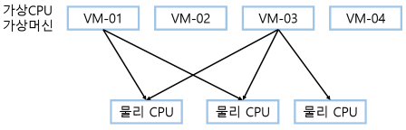
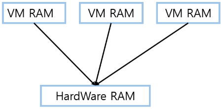
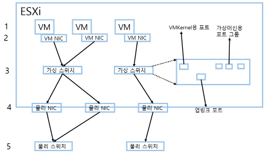

# VMware vSphere 가상화 기초 지식

 

> 출처 - https://jmoon.co.kr/179?category=756236

 

## vSphere CPU 가상화 동작 개요

vSphere의 하이퍼바이저, 즉 ESXi에서는 다음과 같이 물리적인 CPU를 가상화하여 가상머신에 할당할 수 있다.

특징은 다음과 같다.

### 첫번째, 물린 서버에 존재하는 복수의 논리 CPU의 부하를 동적으로 로드밸런싱이 가능하다.

물리 CPU는 소켓 단위로 존재한다. 소켓은 다시 코어로 나누어진다. 일반적인 PC 에서는 1개, 즉 1개의 소켓만이 존재한다. 전산센터에서 사용하는 x86 IU 서버에는 기본적으로 2개의 소켓이 탑재된다. 소켓은 흔히 코어라고 하는 작은 연산회로로 나누어진다. 서버용 CPU 는 적게는 쿼드코어 ~ 16코어까지 지원하는 제품이 출시되고 있다. 2소켓의 CPU 라면 최대 32코어까지 제공할 수 있다. 여기에 코어를 다시 쓰레드로 쪼개는 하이퍼쓰레드까지 지원하면 64쓰레드 까지 지원하는 엄청난 리소스가 된다.

이러한 리소스들을 ESXi가 가상 CPU로 할당하게 된다. 각 가상머신은 하이퍼바이저인 ESXi 서버로부터 가상 CPU(vCPU)를 할당받아 동작한다. 이때 여러대의 가상머신에 할당되는 CPU는 결국 물리적인 CPU의 리소스를 사용하게 되는데 여러 대의 가상머신들이 물리적인 CPU 코어를 할당 받을 수 있다. 이런 경우 물리적인 CPU, 코어의 리소스를 ESXi 서버가 실시간으로 여러 대의 가상 머신에 동적으로 분배한다. 이것을 CPU 리소스 로드 밸런싱 이라고 한다.

### 두번째, 가상머신이 이용하는 CPU 리소스를 동적으로 분배하여 특정 CPU에 부하가 집중되는 것을 방지한다.

ESXi 서버는 동적으로 물리 CPU와 가상 CPU에 대해 모니터링을 실시한다. 이때 부하가 발생하는지 확인한다. 부하가 발생하면 시분할 방식을 통해 프로세스를 처리하여 부하가 집중되는 것을 방지한다.

### 세번째, 수십 밀리 세컨드 단위로 전체의 CPU를 체크하여 가상머신의 워크로드를 이동한다.

ESXi 서버는 물리적인 CPU 상태를 체크하면서 여유가 있는 CPU 리소스를 확인하고 전체 가상머신에 골고로 할당한다.

 

## vSphere 메모리 가상화 기술 개요

물리적인 서버의 메모리를 가상화로 전환했을 때 효율적으로 운용하기 위해 네 가지의 메모리 가상화 기술을 제공한다. 이를 통해 전체 가상머신의 메모리 총합이 물리적인 서버의 메모리량을 초과하더라도 가상머신의 전원을 구동 하능하도록 하는 메모리 오버커밋 기능을 제공한다.

`투명한 페이지 공유` 기술과 `메모리 벌루닝` 기술은 메모리를 효율적으로 관리하기 위한 기술이고, `메모리 압축` 기술과 `VMKernel 스왑` 기술은 시스템을 보호하기 위한 기술이다.

### 투명한 페이지 공유

게스트 OS의 시스템 영역 등, 가상머신 사이에서 동일한 정적 페이지를 공유하는 기능이다. 여러 대의 가성머신이 하나의 물리적인 서버 위에서 운용될 때 동일한 종류의 가상머신일 경우 같은 페이지를 사용하기도 한다. 가상머신은 메모리를 자기 자신만 사용하고 있다고 착각한다. 하지만 하이퍼바이저 입장에서 본다면 게스트OS의 동일한 페이지가 각 가상머신마다 있기때문에 이런 동일한 가상 페이지를 물리적인 하드웨어의 같은 페이지를 참조하도록 설정한다.

### 메모리 벌루닝(Memory Ballooning)

동작을 멈추고 있는(Idle) 상태의 가상머신이 보유하고 있는 메모리 영역을 회수하여, 다른 가상머신에게 할당해주는 기능이다. 가상머신이 바쁜 경우 게스트 OS는 가상머신의 메모리를 일부 점유해서 사용한다. 여러 대의 가상머신이 구동되는 경우에 가상머신의 사용하지 않는 메모리를 모니터링하고 있다가 사용하지 않는 메모리 영역을 회수한다. 이는 다른 가상머신에서 메모리가 모자라 하이퍼바이저에게 요구할 때 발생한다.

하이퍼바이저는 현재 Active 하게 동작하고 있지 않는 가상머신에 대해 벌루닝작업을 수행한다. 가상머신의 메모리 공간에 실제 메모리를 전체 사용하는 것 처럼 조작한다. 이는 가상머신에 설치되어 있는 VMware Tool의 Driver를 통해 이루어진다. 명령을 받은 가상머신은 자신의 메모리가 가득 찬 것처럼 착각해 가상머신의 메모리를 Swap Out 하는 것처럼 착각하게 만드는 것이다. 이를 통해 가상머신의 메모리를 회수해 Busy 한 가상머신에게 할당한다. 이것이 메모리 벌루닝이다

### 메모리 압축

메모리 데이터를 압축해 VMKernel 스왑을 줄이고 퍼포먼스 저하를 방지하는 기능이다.

이 기능은 메모리에 동일한(중복된) 데이터가 있다면 동일한 데이터를 메모리 안에서 압축하는 기능이다. 메모리에 동일한 데이터가 있다면 동일한 데이터를 메모리안에서 압축하는 기능이다. 이를 통해 메모리를 절감할 수 있다. 이 기능은 메모리 요구가 발생하고 메모리를 회수할 수 없는 상황이 되었을 경우 발생한다. 가상머신들 중에서도 우선순위가 낮은 가상머신들의 메모리 영역을 압축해서 물리 메모리의 Compression Cache(압축 캐시)에 저장한다. 이를 통해 회수된 영역은 메모리가 모자란 가상머신에 할당된다. 압축된 영역에 물리 메모리상에 압축을 풀면서 접근해야하기 때문에 아주 약간의 성능저하가 있을 수 있지만 크게 영향을 주는 정도는 아니다.

### VMKernel 스왑

물리메모리가 부족한 경우 VMKernel 은 가상머신의 메모리를 디스크의 스왑파일에 Swap out 한다. VMKernel 스왑은 실제 하이퍼바이저에서 모든 가상머신이 Busy하여 메모리를 실제로 하드디스크로 Swap Out 할 때 발생하는 현상이다. 메모리에 있는 내용을 디스크에 Swap out 하기 때문에 성능에 영향을 미친다. 가능하면 하이퍼바이저는 이런 형태의 Swap out 을 방지하기 위해 모든 기능을 총동원한다. 그래도 힘든 경우에 어쩔 수 없이 Swap 을 발생시켜 디스크로 메모리의 내용을 Swap out 한다.

 

## 스토리지 가상화의 핵심 기술

스토리지의 가상화는 `하드웨어 방식`과 `소프트웨어 방식`으로 나눌 수 있다. 하드웨어 방식은 각 스토리지 하드웨어 벤더가 제공한다. 하드웨어 내부에 있는 컨트롤러 등을 통해 이기종 스토리지를 가상화하는 방식이다. 하지만 VMware 차원에서의 스토리지 가상화에 대해서만 알아볼 수 있도록 하겠다.

### RAID 기술 (Redundant Array of Independent Disks)

여러 개의 물리적인 디스크를 하나로 모아서 논리적인 유닛으로 만드는 것을 말한다. 이를 통해 하나의 논리적인 드라이브로 만들 수 있다. 이런 RAID 에는 다양한 구성 방식이 존재한다. 일반적으로 `RAID 0` 이 많이 쓰이며, 기업에서는 `RAID 5, 6` 등이 사용된다. 고가용성을 위해서 `RAID 1` 혹은 `RAID 0+1` 같은 변종도 사용한다.

### RAID 0 (Striping)

데이터를 두 개 이상의 디스크에 똑같이 분할하여 저장한다. 하나의 디스크에 장애가 발생하면 장애가 발생한 부분의 디스크는 복구가 불가능하다. 기업의 중요한 데이터를 저장하기에는 권장되지 않는 방식이다.

### RAID 1 (Mirroring)

데이터를 2개의 디스크에 동시 저장한다. 한 개의 데이터를 양쪽의 디스크에 동시에 저장해야 하기 때문에 RAID 0 보다는 성능적인 차원에서 느리다. 하지만 DISK 1 에서 장애가 발생해도 DISK 2 에 동일한 데이터가 있기때문에 가용성 부분에서는 안정적이다.

### RAID 1+0

RAID 0 과 1의 장점을 결합한 형태이다. RAID 1로 미러링한 다음 스프라이트 하는 방식이다. 물론 그 만큼의 디스크가 더 필요하게 되지만 기업환경에서는 안정적이며 성능에서도 떨어지지 않기때문에 RAID 5,6 과 더불어 많이 사용하는 형태이다.

### RAID 5 (Parity)

한동안 기업형 스토리지에서 가장 많이 사용하던 방식이다. 3개 이상의 디스크를 구성한다. 데이터를 RAID 0 방식으로 저정하지만 중간에 Parity 형태의 데이터를 동시에 저장한다. Parity 를 통해 각 블록의 정보를 저장하고 있다가 Disk 에 장애가 발생하면 나머지 디스크들에서 정보를 얻어서 복구하는 방식이다. 보통 RAID 5 는 Disk 1 개의 분량의 결함까지 보장할 수 있다. 2개 이상의 Disk 에 동시 장애가 발생하면 나머지 하나의 디스크의 데이터는 보장할 수 없다.

### RAid 6 (Double Parity)

RAID 5 에서 1개의 디스크 장애만 보장했다면 6 에서는 2개의 디스크의 장애까지 보장할 수 있다. 즉 Parity 형태의 복구 디스크가 2개가 필요하다. 전체 가용용량은 줄어들지만 최근 엔터프라이즈 스토리지에서는 대세가 되어가고 있다.

 

## 스토리지 연결 방식 - DAS, NAS, SAN

### DAS (Direct Attached Storage)

서버와 스토리지가 직접 연결되는 방식이다. 네트워크 상의 다른 서버는 저정된 데이터에 액세스할 수 없다. 서버와 스토리지는 FC(Fibre Channel) Cable 로 직접 연결된다.

### NAS (Network Attached Storage)

DAS 가 직접 연결된 것이라면 NAS는 네트워크로 저장소에 연결하는 방식이다. 여러 컴퓨터가 동일한 저장소 공간을 공유할 수 있다. 하드디스크를 중앙에서 관리할 수 있어서 오버헤드가 적게 걸린다. 구축이 용이하며 상대적으로 저렴하다.

### SAN (Storage Area Network)

디스크 어레이(외장 스토리지) 컨트롤러 및 테이프 라이브러리와 같은 컴퓨터 스토리지 디바이스를 서버와 연결하기 위해 설계된 방식이다. 컴퓨터 시스템과 스위치 사이에서 데이터를 전송한다. 스위치는 일반 네트워크 스위치가 아닌 SAN 방식을 지원하는 FC(Fibre CHannel) 스위치이다. 흔히 FC 케이블이라는 전용 케이블을 사용하여 서버와 스토리지 그리고 FC
스위치를 연결하여 FC 데이터 통신을 한다. 고가이며 구축이 까다롭다.

 

## VMware 에서 지원하는 전송방식

VMware vShpere 는 스토리지 접속을 위한 다양한 프로토콜을 지원하고 있다. 크게 4가지 `FC`, `iSCSI`, `FCoE`, `NFS` 프로토콜을 통한 전송 방식을 지원한다.

### FC (Fibre Channel)

일반적으로 기업 내부에서 SAN을 구축할 경우 가장 많이 사용하는 통신 방식이다. 흔히 FC SAN 이라고 부른다. FC SAN 은 서버 및 vSphere 의 하이퍼바이저인 ESXi 호스트를 고성능 스토리지에 연결하는 특수한 고속의 네트워크이다. 이 네트워크는 Fibre Channel 프로토콜을 통해 SCSI 트래픽을 가상 시스템에서 FC SAN 장비들로 전송한다.
FC SAN 에 연결하기 위해서 호스트에 HBA(Host Bus Adapter)라는 장비가 설치되어 있어야 한다. FC 포트 개수는 정해져 있다. 그래서 FC 방식에도 스위치가 있다. 이런 스위치를 통해 서버와 스토리지가 접속되며 DAS 방식이 아니더라도 FC 스위치에서 여러 대의 서버와 스토리지가 FC 프로토콜을 통해 데이터를 주고 받는다. 이러한 형태가 바로 SAN(Storage Area Network) 방식이다.
ESXi 호스트가 Fibre Channel 어댑터(HBA)를 통해 Fibre Channel 스위치와 스토리지 어레이로 구성된 SAN 에 연결이 된다. 이렇게 연결됨에 따라 스토리지 어레이(기업용 스토리지)에서 생성된 LUN을 서버에 할당하여 사용할 수 있다. NUN 에 액세스해서 vSphere 에서 사용할 데이터스토어를 생성할 수 있다.

- LUN (Logical Unit Number)

  SCSI 방식에서 논리적으로 사용되는 고유 식별자 번호이다. 일반적으로 스토리지에서 많이 사용되는 용어로서 호스트, 즉 서버가 외장형 스토리지에 접근하는 단위로 많이 사용 된다. 외장형 스토리지 어레이 장치는 서버에게 LUN 단위의 논리 디스크를 제공한다. 실무에서는 RAID를 스토리지 어레이 장치에서 생성하고(RAID 그룹) 이렇게 생성된 RAID 그룹에서 다시 LUN을 생성한다. 이렇게 생성된 LUN을 SAN Switch 등을 통해 호스트에 액세스 가능하도록 제공한다.

### iSCSI (Internet SCSI)

FC가 별도의 SAN 네트워크를 구축하는 형태였다면 iSCSI는 우리가 일반적으로 사용하는 기존 네트워크를 통해 스토리지를 연결하는 방식이다. iSCSI는 일반적인 RJ45 방식의 네트워크 케이블로 연결한 다음 네트워크 통신을 통해 SCSI 스토리지 트래픽을 TCP/IP 프로토콜로 패키징해서 전송하는 방식이다. iSCSI 연결해서 ESXi 호스트는 네트워크 상에 있는 iSCSI 스토리지 시스템과 통신하는 이니시에이터 역할을 수행한다. 또한 iSCS 스토리지는 타겟(Target) 이라고 부른다.
ESXi 호스트에서 iSCSI 연결방식은 두가지가 있다. 하드웨어 iSCSI는 ESXi 호스트가 iSCSI 및 네트워크 처리를 오프로드 할 수 있는 별도의 어댑터를 통해 스토리지에 연결되는 방식이다. 소프트웨어 iSCSI는 VMKernel 에 있는 소프트웨어 기반의 이니시에이터 프로그램을 사용하여 스토리지에 연결한다. vCenter 에서 Enable 하여 활성화 할 수 있다.

### FCoE (Fibre Channel over Ethernet)

SAN 방식이 FC Cable 을 이용해 별도의 SAN 네트워크를 구성하는 방식이었다면, FCoE 방식은 네트워크를 통해 Fibre Channel 프로토콜을 전송하는 방식이다. 별도의 SAN 네트워크를 위한 장비가 필요하지 않고 고속의 네트워크만 주어진다면 기존 네트워크 라인을 통해서도 SAN 형태의 스토리지를 연결할 수 있는 방식이다. 대부분의 10G 네트워크 라인을 전제로 하며 안정적인 FCoE 연결을 위한 별도의 스위치로 연결하는 방식이 대세로 자리잡고 있다.
FCoE는 일반 네트워크를 위한 연결 방식은 두가지가 있다. (iSCSI와 동일) 하드웨어 FCoE는 ESXi 호스트가 FCoE 및 네트워크 처리를 오프로드 할 수 있는 별도의 어댑터를 통해 스토리지에 연결된다. 소프트웨어 FCoE는 ESXi 호스트가 VMKernel 에 있는 소프트웨어 기반의 FCoE 연결 프로그램을 사용하여 스토리지에 연결한다. vCenter 에서 Enable 하여 활성화 할 수 있다.

### NFS (Network File Share)

NAS 방식으로 연결할 경우 NFS 프로토콜을 통해 스토리지에 접속한다. ESXi 호스트는 표준 TCP/IP 네트워크를 통해 원결 파일 서버에 연결하여 가상머신 및 데이터를 저장한다. ESXi 호스트에 NFS 클라이언트가 기본적으로 제공된다. 네트워크 연결이므로 별도의 HBA와 같은 장치가 필요치 않으며 서버에서 제공하는 네트워크 라인을 통해 NAS 장비에 접속할 수 있다. 이 구성에서는 VMFS 와 같은 데이터스토어를 생성하는 것이 아니라 NFS 영역에 가상머신 및 데이터를 직접 저장한다.

 

## VMware 의 (논리) 스토리지 가상화 방식

ESXi 호스트에서 여러 가지 프로토콜(FC, iSCSI, FCoE, NFS)을 통해 스토리지 어레이의 LUN을 인식한 후에 VMware 에서 인식할 수 있는 파일 포맷으로 LUN을 포맷한다. 즉, LIN을 VMware 의 파일시스템으로 포맷한다. 이렇게 VMware 의 파일시스템으로 포맷된 것을 VMware 에서는 데이터 스토어라고 한다. 그리고 그 파일 시스템을 VMFS(Virtual Machine File System) 이라고 한다. VMFS는 퍼포먼스 중심의 VMware 전용 클러스터 파일 시스템이다. 이 VMFS 파일시스템으로 포맷된 데이터 스토어에 가상머신 즉, Virtual Machine 이 저장된다.
VMware 는 각 ESXi 호스트를 여러대로 묶는 클러스터링을 구성할 수 있다. 클러스터링 구성을 통해 여러 대의 ESXi 호스트가 동일한 스토리지 볼륨(LUN)에 액세스 할 수 있다. 이는 ESXi 에서 베타적인 lock 관리가 가능하기 때문이다. 일반적인 OS는 동시에 동일한 스토리지 볼륨을 볼 수 있는 베타적인 lock 관리가 불가능하다. 하지만 VMware 에서는 베타적인 lock 관리 솔루션이 내장되어 있으므로 별도 솔루션의 도움 없이 ESXi 호스트가 동시에 여러 개의 스토리지 볼륨을 액세스 하도록 제어할 수 있다. 이 경우 가상머신에서 발행하는 SCSI 커맨드는 물리 스토리지에 직접 발행하게 된다.
VMware 에서 제공하는 가상 디스크 방식에는 VMDK 와 RDM 방식이 있다. VMDK는 VMware 에서 제공하는 전형적인 가상 디스크이다. VMFS 안에 파일 형태로 직접 저장된다.
이에 반해 RDM 은 가상머신이 실제 LUN에 액세스해야 할 필요가 있을 경우 사용한다. 이때 RDM은 가상머신과 물리 LUN을 연결하는 주소, 즉 포인터라고 생각하면 된다. RDM은 다시 물리 RDM 방식과 가상 RDM 방식으로 나누어진다.

 

## 네트워크 가상화의 핵심 기술

1. 가상머신 : 가상 네트워크 디바이스를 통해서 액세스를 요구한다.

2. 가상 NIC : VMKernel 과 가상머신 사이에 위치하여 네트워크 패킷을 전송하거나 수신하는 부분을 담당한다. 가상 NIC은 IP 및 MAC 주소를 가질 수 있다.

3. 가상 스위치 : vSphere 가상 네트워크 환경에서 핵심적인 역할을 수행하는 부분이다. 네트워크 I/O의 에뮬레이션을 담당한다. 가상머신 및 VMKernel 용의 포트 그룹을 설정한다. vSphere 에서의 가상 스위치는 표준 가상 스위치와 분산 가상 스위치, 두가지 형태가 존재한다. 역할과 기능이 각 스위치별로 차이가 있다.
     
   포트그룹 : vSphere 에서 중요한 개념이다. 포트 구룹은 VMKernel 이나 VM 들에 특화된 서비스르 제공하는 가상 스위치의 논리적인 그룹이다. 가상 스위치는 하나의 VMKernel 포트나 가상머신 포트 그룹을 가질 수 있다.
     
   VMKernel 포트 그룹 : 하이퍼바이저 관리 트래픽, vMotion, HA, FT, iSCSI 스토리지 연결, VSAN, NAS 연결 등의 다양한 구성을 만드는 특화된 포트 그룹이다. vSphere 가 가진 특화된 기능들을 구성하기 위해서는 반드시 VMKernel 포트 그룹을 통해 별도의 트래픽을 전송하도록 구성해야한다.
     
   VM 포트 구룹 : VM 들이 동일한 포트 그룹이나 물리 네트워크에 구성된 다른 가상머신에 접속할 수 있게 해주는 가상 스위치 안의 포트 그룹이다.

4. 물리 NIC : vSphere 가상화 환경에서 물리 NIC 는 어떤 역할도 수행하지 않는다. 가상 환경이 아닌 일반적인 구성에서는 물리 NIC에 IP 및 MAC 주소가 할당되지만 가상 환경에서는 IP 및 MAC 을 가지지 않는다. IP 및 MAC 주소는 가상머신의 가상 NIC에 할당 된다.

5. 물리 스위치 : 물리 네트워크 환경을 제공하는 스위치 장비. 고객이 보유한 스위치 장비라고 보면 된다. ESXi 서버는 네트워크 라인을 통해 고객의 네트워크 스위치 장비에 연결된다. 만약 물리적인 스위치에 VLAN 구성이 되어 있다면 vSphere 가상 네트워크 환경에서도 VLAn 설정을 해주어야 한다.

 

## vSphere 가상 네트워크 스위치의 특징

vSphere 에서 제공하는 가상 네트워크 스위치는 물리 스위치와는 구별되는 특징을 가지고 있다.

1. 물리 NIC은 IP Address 를 가지지 않는다.  
   통신에 필요한 IP와 MAC은 가상머신이 가지고 있다.

2. 가상 스위치는 Path-Through의 역할을 수행.  
   가상 스위치는 네트워크 패킷을 통과시키는 Path-Through 의 역할을 수행하는 Edge 스위치라고 생각하면 된다. 물리 NIC을 통해 내부로 들어온 네트워크 패킷은 가상 스위치를 통해 가상머신에 전달된다. 이때 가상 스위치와 물리 스위치는 물리 NIC 라는 케이블로 연결되어 있다고 생각하면 편하다. 스위치이므로 VLAN 설정도 가능하며 Ling Aggregation 설정도 가능핟.  
   하지만 물리적인 스위치와 비교하여 가상 스위치에는 다음과 같은 차이점이 있다.

   - Telnet 과 같은 접속을 통해 가상 스위치를 조작할 수 없다. 즉 커맨드를 통해 관리하는 형태가 아닌 vCenter 의 GUI를 통한 조작만 가능하다.
   - 내부적으로 생성하는 가상 스위치들은 서로 연결될 일이 없기 때문에 루프 현상에 빠질일이 없다. 이때문에 가상 스위치 환경에서는 복잡하게 STP를 위하나 설정을 할 필요가 없다.
   - 연결되어 있는 VM의 MAC 주소를 이미 알고 있기 때문에 MAC 주소를 학습할 필요가 없다.

 

## 가상화 환경에서 VLAN을 설정하는 방법

가상화 환경에서 VLAN은 중요한 역할을 수행한다. VLAN은 Virtual LAN, 즉 논리적인 가상의 LAN 환경을 구성할 수 있다. 트래픽이 동일하나 물리 VLAN 세그먼트나 동일한 물리 스위치를 공유하면서 트래픽을 효율적으로 분리하며, 브로드캐스트를 나누어주는 역할을 한다. 또한, 특정 VLAN에 속하는 트래픽 구별을 위해 태킹을 지원하기 위해 IEEE 802.lq 표준을 지원한다.

1. 가상 스위치의 배치

   가상 스위치를 어떻게 생성할 것인지 결정해야 한다. 목적별 트래픽을 분산할 수 있기 때문에 하나의 가상 스위치보다는 여러 개의 목적별 가상 스위치를 만들어서 적용하는 것이 좋다. 하지만 이렇게 가상 스위치를 나누기 위해서는 물리 NIC의 개수가 많아야 한다.

2. NIC 티밍의 설정

   NIC 티밍은 하나의 그룹으로 묶는다는 뜻이다. 네트워크의 로드밸런싱이나 Active-Standby 구성을 할 경우 사용한다. NIC 티밍은 ESXi 호스트 차원에서 수행하는 경우와 가상머신 차원에서 수행하는 경우가 있다. ESXi 호스트 차원에서 수행하는 타밍은 관리 포트라던지 HA, FT 등의 트래픽에 대한 로드 밸런싱 혹은 Active-Standby 구성이다. 이는 가상 스위치에서 구성할 수 있다. 또 하나의 티밍은 가상머신 차원에서의 NIC 티밍이며 이는 게스트 OS 안에서 수행한다. 게스트 OS 안에서도 티밍 설정을 해야하는 경우가 있다.

 

## 물리 스위치와의 접속시 고려사항

1. VLAN 구성여부

   가상머신들을 별도의 네트워크로 구분해야 한다면 VLAN 구성을 염두에 두어야 한다. 이를 위해서는 기업의 네트워크 담당자 들과 VLAN 구성에 대해 사전에 미리 협의해야 한다.

2. Link Aggregation 구성

   부족한 네트워크 트래픽을 보완하기 위해 여러 개의 네트워크 라인을 묶어서 하나의 라인처럼 제공하는 것을 Link Aggregation 이라고 한다. Link Aggregation 구성 시에도 네트워크 담당자들과 어떤 식으로 구성할지 논의해야 한다.

 

## vSphere 분산 스위치의 특징

vSphere 는 기본이 클러스터 환경이다. 클러스터 환경에서는 2대이상, 1000대나 10000대까지 ESXi 호스트를 구성할 수 있다. 1000대를 일일이 구현하려면 많은 번거로움이 있다. 이러한 번거로움을 줄이기 위해 vSphere 에서 제공하는 Host Profile 이라는 기능을 사용한다면 동일한 ESXi 서버에 동일한 Profile을 적용하여 같은 네트워크 구성을 자동으로 맞춰줄 수도 있다. 하지만 이것도 역시 번거로운 방법이다.
이렇게 ESXi 호스트마다 표준 스위치 설정을 하는 것은 상당히 번거로운 작업이다. 특히 호스트가 4대 이상을 넘어가면 가상 네트워크 설정이 변경될 때마다 다른 호스트에도 동일한 설정을 해야하기 때문에 상당한 시간이 소요된다.
그래서 VMware 에서는 여러 대의 ESXi 호스트를 동일하게 관리하기 위해 분산 스위치를 만들었다. 분산 스위치는 vCenter 에서 여러 대의 ESXi 호스트의 표준 스위치를 통합하여 하나의 거대한 스위치로 만드는 기능이다. 각 호스트의 표준 스위치들이 모여서 하나의 분산 스위치가 되는 것이다.

 

## 가상 네트워크 인프라(NSX)

NSX는 SDDC를 구성하는 VMware의 전략중에 SDN(Software Defined Network) 전략을 구현해주는 솔루션이다. 네트워크 가상화를 구현해주는 솔루션. 네트워크 가상화는 실제 네트워크 장비들을 가상으로 구현하는 것이다. 라우터, 방화벽, 스위치 같은 네트워크 장비들을 가상화 형태로 제공해주겠다는 것이다.
NSX는 네트워크를 구성하는 여러 계층의 서비스를 가상화 형태로 제공한다. 이를 통해 네트워크 운영 방식을 자동화 할 수 있고 다양한 기능을 애플리케이션이나 플랫폼 상에서 제공할 수 있다.

### NSX의 주요 기능

1. 보안

   마이크로 세분화라는 기능으로 가상머신 애플리케이션마다 세분화된 보안 정책을 적용할 수 있는 기능이다. 이를 통해 위협요소를 상호 격리함으로써 데이터센터에서 더 나은 보안 모델을 제공한다.

2. 가상 네트워크 자동화 프로비저닝

   하드웨어에 비해 가상 네트워크의 생성, 저장, 삭제 및 복원이 쉽기 때문에 가상 네트워크를 자동화할 수 있으며 탄력적이고 경제적인 데이터센터 운영이 가능하다. 하드웨어로는 며칠 혹은 몇 주나 걸리는 작업들이 가상 네트워크를 통하면 몇부 분이내로 단축할 수 있다. 네트워크 장비들의 연결을 데이터센터 내부에 들어가서 일일이 수작업으로 처리하지 않아도 된다. 클릭 몇번 이면 모든 장비들을 연결할 수 있기때문이다.

3. 네트워크 하드웨어의 소프트웨어화

   네트워크 장비가 소프트웨어가 되기 때문에 더이상 기존 애플리케이션 인프라의 확장 및 수정에 많은 시간 및 장비를 투입할 필요가 없다. 새로운 비즈니스 상황에 맞게 애플리케이션을 개발, 테스트, 구축하는 시간을 몇 분만에 구현이 가능하다.
