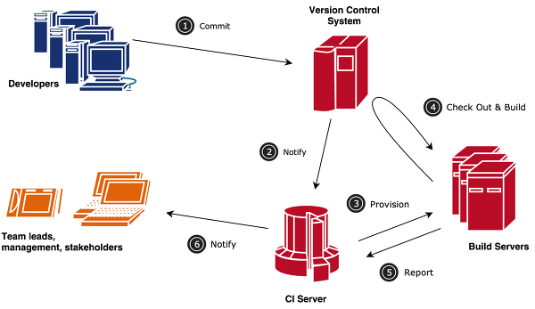
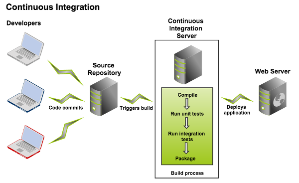
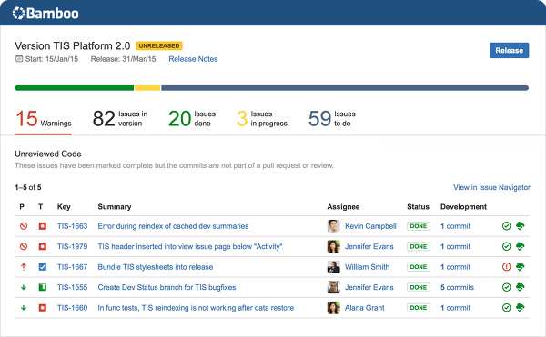

# [인프라] CI(지속적인 통합, Continuous Integration) 이해하기

 

출처 :: [[인프라] CI(지속적인 통합, Continuous Integration) 이해하기](https://12bme.tistory.com/151?category=739421)

 

## 지속적인 통합이란?

소프트웨어 개발 프로젝트는 `[분석/설계] → [코드 작성] → [빌드] → [테스트] → [릴리스] → [디플로이]` 와 같은 생명 주기를 지니고 있으며, 각 단계는 프로젝트가 진행되는 동안 `계속 반복적으로 실행`되는 경우가 많습니다. `또 개별 단계 내에서 진행되는 업무 내역을 자세히 분석해 보면 처리해야 할 업무가 생각보다 많고 복잡하며, 중간에 하나만 실수하거나 잘못돼도 이를 바로잡는 데 상당히 오랜 시간이 걸리는 경우가 많습니다.`

`이 같은 복잡성 및 시간이 많이 소요된다는 특성 때문에 반복적인 단계가 잘 진행되지 않고, 이로 인해 개별 개발자가 작업한 내용을 통합하고 테스트하는 작업을 드물게 수행하거나 심지어 프로젝트의 중반 이후에야 수행하는 경우가 많았습니다.` 그 결과, 소프트웨어 통합 작업은 매우 힘들고 고통스러우며 시간이 오래 걸리는 작업으로 여겨졌습니다.

 

 

`지속적인 통합(Continuous Integration)은 위와 같은 문제점을 해결하기 위해 개발 팀원들이 작성한 코드를 최대한 자주 통합하는 소프트웨어 개발 실천법 중 하나입니다.` 버전 관리와 자동화된 빌드, 테스트, 리포팅을 통해 최대한 빨리 오류를 발견하고 발생한 문제를 조기에 처리할 수 있습니다. 이로써 통합에 드는 시간을 줄이고 발생하는 문제를 최소화할 수 있으며, 고품질 소프트웨어를 개발할 수 있습니다.

 

### 지속적인 통합의 장점

지속적인 통합은 팀 단위로 일할 때 특히 참여자가 많고 규모가 큰 프로젝트일 경우 장점이 더욱 두드러지지만 설령 혼자 일하는 개발자라도 많은 이점을 가져다 줍니다. 다음은 지속적인 통합을 구축했을 때의 장점입니다.

- 빌드와 테스트 프로세스가 자동화되어 코드 작성에 더욱 집중할 수 있습니다.
- 자동화를 통해 수시로 통합할 수 있으며, 이를 통해 문제를 조기에 발견하고 조치할 수 있습니다.
- 빌드와 테스트를 개인 환경과 독립적으로 구성할 수 있습니다. 즉, 개발자가 코드를 수정하고 커밋하지 않아 개인 환경에서만 빌드되는 문제를 조기에 수정할 수 있습니다.
- 빌드한 결과를 톰캣이나 제티 등 WAS 서버나 기타 환경에 디플로이하는 업무를 자동화함으로써 프로세스를 간소화할 수 있습니다.
- 다른 개발자가 수정한 내용을 자동으로 빌드하고 통합 테스트를 진행할 수 있습니다.
- 현재 프로젝트의 코딩 표준과 모듈별 의존성 등의 보고서를 빌드 과정에서 자동화함으로써 개선 여부를 검토할 수 있습니다.

 

 

### 모범 사례

지속적인 통합을 잘 활용하려면 이미 사용하고 있는 곳에서 적용한 모범 사례를 참고하는 것이 좋습니다. 다음은 지속적인 통합을 적용할 때 일반적으로 반영한 것을 권장하는 사례입니다.

> 소스의 변경 내역은 버전 관리 서버를 통해 관리한다. 
> 소스가 변경되면 수시로 커밋한다. CVS나 서브버전은 브랜치와 병합이 어려워서 트렁크 트리에서만 커밋하는 경향이 있으므로 소스의 병합이 어렵고 충돌이 자주 발생하는 문제가 있다. 
> 또 미완성 소스 커밋으로 빌드가 깨질까봐 완성 전까지는 아예 커밋을 하지 않는 나쁜 습관을 갖게 되는 경우도 있다.  
> 이 문제는 깃 같은 분산 버전 관리를 도입하고 git flow 같은 검증된 브랜치 전략을 통해 해결하는 것이 좋다. 
> 수시로 빌드한다. 빌드는 매우 복잡한 절차를 거쳐야 하고 반복 작업 및 수작업을 통해 진행될 때가 많다.
> 빌드를 자동화하면 반복 작업이 줄어들고 프로세스가 단순해지므로 빌드를 자주 수행할 수 있다. 
> 빌드마다 자동화된 테스트를 구동하며 테스트가 100% 통과되게 한다. 테스트 환경은 실제 운영 환경과 최대한 유사하게 구축한다. 
> 모든 프로젝트 참여자가 빌드의 산출물과 빌드 결과를 확인할 수 있게 한다. 
> 빌드가 깨질 경우 테스트와 패키징 등 다음 단계로 진행할 수 없으므로 깨진 빌드를 수정하는 일에 우선순위를 높게 부여한다. 
> 빌드 결과물을 WAS 등 외부 서비스에 디플로이해야 할 경우 가급적 지속적인 통합 서버에서 이러한 작업을 자동화한다.  
> 단 운영 서버에 바로 디플로이하는 데는 고려해야 할 사항이 많으므로 충분히 검토해야 한다.

 

## 지속적인 통합을 위한 제품

 

현재 시장에는 다양한 지속적인 통합 도구가 출시돼 있습니다. 이 중에는 오픈소스 기반으로 무료로 사용할 수 있는 제품도 있고 비용을 지불해야 하는 상용 제품도 있습니다. 상용 제품의 경우 일반적인 소프트웨어 라이선스는 사용자 수에 따라 금액이 책정되는 경우가 많지만 지속적인 통합 제품은 이와는 약간 다르게 라이선스가 책정됩니다.

`빌드는 시스템 자원을 많이 소비하는 부하가 큰 작업이므로 분산 환경으로 여러 개의 빌드 서버를 동시에 운영하는 경우가 많습니다. 이러한 개별 빌드 서버에 설치되어 빌드를 진행하는 프로그램을 보통 빌드 에이전트라고 하며`, 이러한 에이전트를 몇 개 설치할 수 있느냐에 따라 라이선스가 달라지는 경우가 많습니다.

또 자바 외에 마이크로소프트의 비주얼 스튜디오와 .NET, 애플의 Xcode를 지원하는 제품도 있으므로 이러한 플랫폼에서도 지속적인 통합을 구축하겠다면 제품 지원 여부를 확인해야 합니다.

아울러 지속적인 통합은 이슈 관리와 밀접하게 연계해서 사용하는 경우가 많으므로 이슈 관리와 연계를 지원하는 제품이라면 다음과 같은 통합 관리가 가능합니다.

> 빌드가 실패했거나 특정 테스트가 제대로 동작하지 않을 경우 새로운 이슈를 등록하고 처리 내역을 추적  
> 새로운 기능으로 등록된 이슈를 구현한 빌드 번호가 무엇인지를 이슈 관리 시스템에서 바로 확인 
> 현재 빌드와 관련된 이슈가 어떤 것인지 지속적인 통합 시스템에서 확인 

상용 버전의 경우 자체적으로 이슈 관리 시스템을 제공하는 경우가 있으므로 기존에 이슈 관리 시스템을 사용하고 있었다면 같은 회사의 제품을 사용하는 것이 통합과 관리 측면에서 훨씬 유리합니다. 이 같은 필요성을 따져 본 후 예산이 충분하고 잘 활용할 자신이 있다면 상용 제품을 도입하는 것도 좋은 선택이 될 수 있습니다.

`이에 비해 오픈소스 제품은 라이선스 제한이 없으므로 비용이 발생하지 않는다는 장점이 있으며, 제품의 신뢰도와 안정성도 비교적 높아져서 기업 환경에서 사용해도 손색이 없습니다.` 하지만 관리 기능과 GUI가 상용 제품에 비해 떨어지는 경우가 있으며, `문서화가 빈약하고 별도의 기술 지원을 하지 않으므로 경험이 많고 기술력 있는 엔지니어가 없을 경우 도입시 갖가지 시행착오와 어려움을 겪을 우려가 있습니다.`

 

### 허드슨

허드슨(Hudson)은 썬 마이크로시스템즈의 엔지니어니 코수케 가와구치가 주도적으로 개발한 CI 제품입니다. 오라클이 썬을 인수한 이후로 허드슨 개발 커뮤니티에 많은 이슈가 있었고 주요 개발자들은 허드슨 프로젝트를 떠나서 젠킨스 프로젝트를 만들었습니다.

2011년에 오라클이 이클립스 재단에 프로젝트를 기증한 이후로 이클립스 재단에서 관리하고 있지만 프로젝트 창시자와 주요 개발자들은 별도로 갈라져 나와 젠킨스 프로젝트를 진행하고 있습니다. 따라서 특별한 이유가 있지 않은 이상 허드슨보다는 젠킨스를 사용하기를 권장합니다.

 

### 뱀부

뱀부(Bamboo)는 컨플루언스와 지라의 개발사인 아틀라시안의 제품입니다. 다른 아틀라시안 제품처럼 기업에서 사용하려면 돈을 주고 구매해야 하며, 오픈소스 프로젝트를 진행하면 무료로 제공합니다.

상용이라 비용이 발생한다는 단점이 있지만 자바 외에 .NET과 Xcode를 잘 설계되고 UI, 잘수성된 매뉴얼, 지라/피시아이와의 완벽한 통합을 지원한다는 등의 장점이 있습니다. 또 아마존의 EC2 서비스를 지원하므로 EC2 내 가상머신에 에이전트를 설치할 수 있습니다.

지라에서 뱀부의 빌드를 연결하거나 반대로 뱀부의 빌드에서 지라의 이슈와 연결할 수도 이씁니다. 따라서 지라의 특정 이슈를 해결하기 위한 빌드가 무엇인지 확인하거나 또는 현재 빌드에서 관련된 이슈가 무엇인지 손쉽게 확인할 수 있습니다.

 

 

### 젠킨스

젠킨스(Jenkins)는 허드슨의 주요 개발자가 나와서 만든 프로젝트로, 오픈소스 CI 솔루션 가운데 압도적인 사용자를 보유하고 있습니다. 사용자 및 플러그인 개발자가 많아서 다양한 기능이 제공되며, 관련자료도 많은 편입니다. 최근에는 오픈소스 클라우드 컴퓨팅 플랫폼인 오픈스택의 CI 솔루션으로 채택되기도 했습니다.

 

---

 

### WAS에 배포

개발과 빌드/테스트가 완료되면 아티팩트는 어딘가에 디플로이돼야 한다. 일반적인 jar 파일은 넥서스 같은 저장소 관리자에 배치되며 이를 사용하는 측에서는 메이븐 등의 빌드 도구를 이용해 가져가게 된다.

그런데 아티팩트가 war나 ear인 경우에는 어디에 디플로이해야 할까? 바로 톰캣이나 제이보스 같은 WAS에 올리게 된다. war나 ear을 WAS에 디플로이하는 것은 고려해야 할 사항도 많고 절차도 복잡하다. 한 예로 운영 서버의 경우 안정성을 위해 여러 대의 WAS 서버를 운영하는 것이 보통이다. 이때 N개의 WAS에 war를 배포하고 반영하는 것은 기술적으로 까다로운 문제이며, 이 문제의 해결책은 환경이나 업무에 따라 다를 수 있다.

운영 환경에 배포하는 것은 회사마다 환경과 절차, 요구사항과 보안 수준이 다르기 때문에 표준화할 수 없으며 각각에 맞게 특화해서 적용할 수 밖에 없다. 하지만 개발과 테스트 서버라면 빌드와 배포를 자동화하고 또 이 과정에서 빌드/배포가 실패하거나 WAS가 다운되는 것은 특별한 상황이 아니라면 별 문제가 안되는 경우가 많다.
