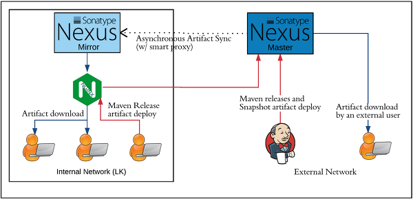
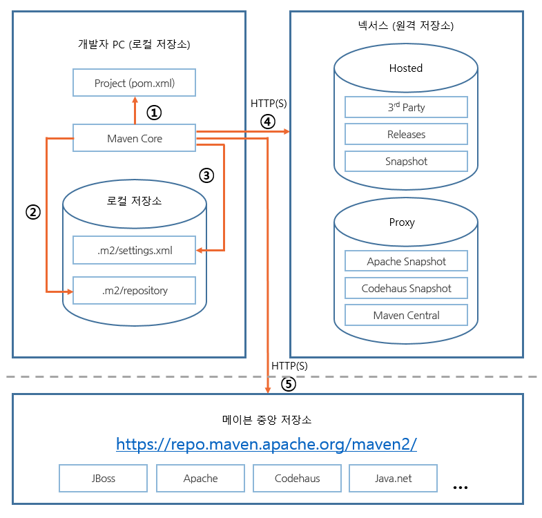

# [인프라] 아티팩트 저장소(artifact repository)

출처 :: [[인프라] 아티팩트 저장소(artifact repository)](https://12bme.tistory.com/454?category=739421)

---

<br/>

### [아티팩트: artifact]

**아티팩트(artifact)는 소프트웨어 개발 프로젝트를 진행하면서 생성하는 다양한 산출물을 의미한다.**
각종 설계문서, 유스 케이스, UML 다이어그램, 소스코드, 소스를 빌드해서 생성된 라이브러리나 실행 파일도 모두 아티팩트에 속한다.

자바 프로젝트를 빌드할때 많이 사용되는 maven에서는 빌드로 생성되는 프로젝트의 결과물을 의미한다.
아티팩트는 자바 프로젝트의 성격에 따라 다르지만 일반적으로는 .jar, .war, .ear 등의 확장자를 갖게 된다.
확장자가 .jar인 자바 라이브러리 역시 아티팩트의 일종이다.

- **아티팩트** <br/>
  소프트웨어 개발 프로젝트에서 생성되는 다양한 산출물 (e.g. maven에서 빌드로 생성되는 프로젝트의 jar 확장자 결과 등)

<br/>

### [아티팩트 저장소: artifact repository]

artifact repository는 아티팩트와 메타데이터를 저장/관리하는 장소를 의미한다.
아티팩트 저장소는 스프링 프레임워크나 JDBC 구현체, 아파티 재단 산하의 오픈소스 프로젝트 등 외부에서 개발된 라이브러리를 저장하기도 하지만 내부에서 개발됐거나 개발 중인 **라이브러리를 다른 개발자나 프로젝트와 공유하기 위한 배포 용도로도 사용한다.**
서브버전이나 깃 등의 버전 관리 시스템은 소스의 이력 및 공유 용도로 사용하지만 **저장소는 아티팩트를 공유하기 위한 용도로 사용되는 것이다.**

<br/>

---

<br/>

저장소가 없던 시절에는 프로젝트를 빌드하는데 주로 ant를 사용했는데, ant는 저장소 관련 기능이 없으므로 프로젝트에 필요한 라이브러리는 CVS나 서브버전에 라이브러리용 폴더(lib)를 만들고 커밋해서 관리했다. 즉, 일반적인 프로젝트에서 소스와 라이브러리를 모두 저장했다.

내부에서 만든 라이브러리가 추가/변경될 경우 버전관리 시스템에 커밋하고, 개발단계일 경우 이메일이나 파일 공유 서버를 통해 전달받아 테스트를 진행하였는데, 이 방식은 아래와 같은 단점이 존재한다.

- **많은 용량 차지** <br/>
  아파치 재단 라이브러리나 스프링 프레임워크 등 공통 라이브러리를 프로젝트마다 버전 관리 시스템에 추가해야 했다. 특히 프로젝트 소스의 브랜치를 만들 경우 라이브러리를 복사해야 하므로 브랜치 속도도 느려진다.

- **느린 빌드** <br/>
  버전 관리 시스템에서 차지하는 용량이 크다보니 빌드를 위해 체크아웃할 경우 시간이 더 걸리고 빌드도 느려진다.

- **의존성 관리가 어려움** <br/>
  사용하는 라이브러리가 다른 라이브러리를 참고할 경우 개발자가 의존성을 알아서 파악한 후 의존성 라이브러리를 직접 추가해야 한다. 특히 버전이 갱신되어 의존성이 변경되거나 신규로 추가된 라이브러리일 경우 의존성 관리는 매우 번거로운 작업니다.

아티팩트 저장소를 이용은 위의 문제점을 해결하기 위해 사용하며, 다음과 같은 장점이 있다.

- **적은 용량** <br/>
  저장소는 라이브러리를 보관하므로 프로젝트마다 필요한 라이브러리를 버전 관리에 추가할 필요가 없고 라이브러리에 대한 메타데이터만 설정하면 빌드할때 내려받으므로 적은 용량을 차지한다.

- **빠른 프로젝트 체크아웃과 빌드** <br/>
  버전 관리 툴을 이용해 프로젝트를 체크아웃할 경우 용량이 적으므로 빨리 체크아웃할 수 있으며 빌드 속도도 빨라진다.

- **라이브러리 버전 관리 용이** <br/>
  메타데이터를 기반으로 라이브러리의 정보와 버전을 관리하므로 라이브러리 자체의 버전을 관리하기가 쉽다.

- **공유 및 협업 강화** <br/>
  저장소를 통해 컴포넌트를 공유할 수 있으므로 개발자들끼리 손쉽게 산출물을 공유하고 협업할 수 있다.

저장소를 제대로 사용하려면 저장소를 지원하는 빌드 툴을 사용해야 한다.
메이븐 등의 빌드 툴은 메타데이터를 기반으로 저장소에서 라이브러리를 검색하고 내려받는다.

하지만 저장소 주소가 명시되지 않을 경우 메이븐 중앙 저장소에 연결하는데, 이 저장소는 외국에 위치하고 있어서 속도가 느리므로 저장소를 사용하더라도 빌드가 느려지는 원인으로 작용한다.
또 JDBC를 비롯한 기타 라이브러리는 메이븐 중앙 저장소와 별도의 저장소를 제공하는 경우가 있으므로 따로 저장소를 지정하지 않으면 빌드가 실패하는 원인이 되기도 한다.

<br/>

---

<br/>

저장소에 추가된 아티팩트는 디렉토리나 자바의 패키지처럼 계층적인 구조로 접근할 수 있다.
이러한 계층구조를 GAV(Group, Artifact, Version) 구조라고 하며 메이븐에서 의존성을 찾을 때 참고하는 구조이기도 하다.

<br/>

### Group Identifier(groupId)

그룹 ID는 아티팩트를 논리적인 그룹으로 묶기 위한 단위다. **보통 개발하는 회사나 기관명 뒤에 만드는 소프트웨어 컴포넌트명**을 붙여서 짓는다. (e.g. org.apache.maven)

<br/>

### Artifact Identifier(artifactId)

**아티팩트 ID는 프로젝트의 결과물인 애플리케이션이나 라이브러리의 이름을 의미**한다. 진행 중인 프로젝트가 'example webapp'이라면 아티팩트 ID는 example-webapp으로 짓는다. 그룹 ID와 아티팩트 ID를 합친 문자열은 유일한 식별자여야 하며, 다른 프로젝트일 경우 아티팩트 ID를 달리하여애 한다.

<br/>

### Version(version)

버전은 아티팩트의 버전이며, 일반적으로 major, miner, point로 나눠서 짓는다. example-webapp의 메이저 버전이 1이고 마이너가 2, 포인트 버전이 4일 경우 최종 버전은 1.2.4가 된다. 버전에는 구분이 용이하도록 문자열을 사용할 수 있다. 다음과 같은 버전(1.2.4-BETA3, 2.0.0-RC5)도 유효한 버전 명이다.

<br/>

### Packaging(packaging)

메이븐을 빌드 도구로 사용할 경우 기본 패키지 형식은 JAR 파일이지만 저장소에 아티팩트를 등록할때 명시적으로 패키지 형식을 알려줘야 한다. 사용 가능한 패키지 형식은 JAR, ZIP, WAR, SWC 등이 있다.

<br/>

---

<br/>

프로젝트에서 공통으로 사용되는 라이브러리를 개발하는 별도의 프로젝트가 있다고 해보자. 개발 단계의 라이브러리는 수시로 변경되며, 자주 테스트해야 하지만 안정화될때까지는 이 라이브러리를 참조하는 프로젝트에서는 사용하지 않는 것이 좋을때 가 많다.

이를 위해 안정 버전의 라이브러리와 개발 단계 라이브러리를 구분하고 저장소를 나눠서 관리하면 유용할 것이다. 즉, 개발 단계에서는 스냅샷 저장소를 통해 배포하고 테스트가 끝나고 안정화된 라이브러리는 릴리즈 저장소에 저장해서 배포하는데, 보통 스탭샷 아티팩트는 구분을 위해 파일명에 타임스탬프가 추가된다.

<br/>



<br/>

저장소 관리자(Repository Manager)는 저장소의 기능 및 관리자 기능을 제공하는 소프트웨어를 의미하며, 아티팩트를 저장/관리하고 컴포넌트의 생명주기를 관리하는 용도로 사용된다. 주요 제품으로는 아파치 재단의 archiva, JFrog의 Artifactory, 소나타입의 Nexus(가장 많이 사용)가 있다.

<br/>

---

<br/>

### 저장소 종류

<br/>

### 프록시 저장소

프록시 저장소(Proxy Repository)는 메이븐 중앙 저장소 등 원격지에 있는 저장소를 미러링한다. 넥서스에는 기본적으로 3개의 원격지 저장소가 등록돼 있다.

- **Apache Snapshots**: 아파치 재단의 스냅샷 아티팩트를 미러링

- **Codehaus Snapshots**: Codehaus 프로젝트의 스냅샷 아티팩트를 미러링

- **Central**: 중앙 저장소는 릴리스 아티팩트를 포함하는 저장소로, 메이븐 중앙저장소라고도 한다. 메이븐에 기본적으로 포함돼 있으므로 저장소를 특별히 지정하지 않으면 이 저장소에 연결하게 된다.

<br/>

### 호스트 저장소

호스트 저장소는 기업용 사설 저장소다. 넥서스에는 기본적으로 3개의 호스트 저장소가 설정돼 있다.

- **3rd Party**: 메이븐 중앙 저장소에 없는 아티팩트를 올리기 위한 저장소다. 기업에서 구매한 상용 라이브러리나 특정 벤더의 JDBC 드라이버 등을 이 저장소에 올리고 사용하면 된다.

- **Release**: 회사 내부에서 만든 아티팩트를 보관하는 저장소로, 릴리스 저장소를 통해 다른 개발자나 프로젝트 팀과 공유 및 협업할 수 있다.

- **Snapshot**: 회사 내부에서 만든 아티팩트 중 릴리스되기 전 개발 단계의 아티팩트를 보관한다.

<br/>

### 가상 저장소

가상 저장소(Virtual Repository)는 다른 유형의 저장소의 어댑터로 동작한다. 넥서스는 기본적으로 메이븐1 형식의 저장소를 메이븐2 형식의 저장소로 변환하는 기능을 제공한다.

<br/>

### 그룹 저장소

그룹 저장소(Group Repository)는 넥서스가 제공하는 기능으로서 저장소의 종류는 아니다.앞에서 설명한 여러 종류의 저장소를 논리적으로 묶어서 하나의 저장소처럼 사용하는 기능을 제공한다.

기본 탑재된 호스트 저장소(3개)와 프록시 저장소(3개)를 프로젝트에서 모두 사용하는 경우를 생각해보자. 각 저장소마다 고유의 URL이 있으므로 메이븐 등의 빌드 툴에서 총 6개의 저장소 URL을 설정해야 한다.

하지만 그룹 저장소 기능을 사용해 6개의 저장소를 하나의 저장소로 묶으면 빌드 툴에는 그룹 저장소의 URL만 설정하면 되며, 향후 저장소가 추가/변경돼도 메이븐 설정은 변경하지 않아도 되니 매우 편리하게 사용할 수 있다.

넥서스에는 Public Repositories라는 이름의 그룹 저장소가 기본 설정돼 있으며, 이 저장소에는 프록시 저장소 하나(메이븐 중앙 저장소)와 호스트 저장소 3개로 총 4개의 저장소가 포함돼 있다.

<br/>

---

<br/>

### Deployment Policy

아티팩트 디플로이 정책을 설정한다. 기본값은 Disable Redeploy이며, 이 경우 아티팩트의 버전을 디플로이했으면 다시 할 수는 없다. 아티팩트에 버그가 있거나 잘못 돼 있으면 버전을 변경해 다시 디플로이해야 한다.

Allow Redeploy로 설정하면 다시 디플로이할 수 있지만 이 경우 다양한 문제가 발생할 수 있다. 한 예로 아티팩트 ID가 my-lib이고 버전이 1.1인 아티팩트를 디플로이했다고 하자. 1.1 버전에 문제가 있다는 사실을 알고 이를 수정한 후 동일 버전으로 다시 디플로이하면 이미 1.1 버전을 받아간 개발자의 메이븐은 아티팩트가 변경되지 않았다고 판단하므로 이전과 같은 문제가 발생할 수 있다. 이는 컴포넌트 버전 관리에 맞지 않는 방법이므로 Redeploy로 설정하는 것은 충분히 그 영향을 숙지한 후 설정하는 것이 좋다.

<br/>

### Checksum Policy

저장소에 있는 아티팩트들이 체크섬이 잘못될 경우 어떻게 처리할지 설정한다. 기본값은 Warning이며, Ignore, StrictIfExists, Strict로 설정할 수 있다.

- **Ignore**: 체크섬이 잘못돼도 무시한다.

- **Warn**: 로그 파일에 경고 메시지를 남긴다.

- **StrictIfExists**: 체크섬 파일이 있을 경우에만 계산한 체크섬과 저장소의 체크섬이 일치하지 않을 경우 캐싱하지 않는다.

- **Strict**: 계산한 체크섬과 저장소의 체크섬이 일치하지 않을 경우나 체크섬 파일이 없다면 캐싱하지 않는다.

<br/>

### 아티팩트 추가 시점

ls -l 명령어로 넥서스 스토리지의 저장소 내 파일 목록을 확인해 본다면 의아한 부분이 하나 있다. 바로 프록시 저장소 내에 디렉터리나 파일이 거의 없다는 것이다. 넥서스는 중앙 저장소와 자동으로 아티팩트를 동기화하지 않는다. 단지 클라이언트가 아티팩트를 요청했을때 넥서스의 내부 저장소를 조회해보고 없을 경우 중앙 저장소에 요청하고 받아온 아티팩트를 스토리지 내 저장소에 저장한 후 클라이언트에게 서비스할 뿐이다. 그러므로 초기에는 용량이 작지만 클라이언트들이 다양한 아티팩트를 요청할수록 스토리지가 차지하는 용량이 점점 커진다.

따라서, 넥서스를 백업할 경우 파일 시스템 내 프록시 저장소는 제외해도 문제가 없다.

<br/>

---

<br/>

### 메이븐 저장소의 종류

메이븐도 넥서스처럼 여러 종류의 저장소를 갖고 있지만 의미는 약간 다르다. 메이븐은 총 3가지 저장소 방식이 존재한다.

<br/>

### 로컬 저장소(Local Repository)

메이븐은 내려받은 아티팩트를 메이븐이 실행된 PC 또는 서버의 파일 시스템에 캐싱하고 있으며, 이 파일 시스템을 로컬 저장소라고 한다. 넥서스처럼 패키지별로 별도의 디렉토리로 구성되어 있다. 로컬 저장소의 디렉토리명은 .m2이며, 위치는 운영체제에 따라 약간 다르다.

<br/>

### 원격 저장소(Remote Repository)

앞에서 구성한 넥서스처럼 메이븐이 구동되는 외부 서버는 원격 저장소가 된다. **메이븐은 원격 저장소의 위치를 모르므로 명시적으로 알려줘야 한다**. 이는 **메이븐으로 빌드하는 프로젝트 파일(pom.xml)에 기술하면 되며, 모든 프로젝트마다 적용되게 하려면 메이븐의 로컬 저장소에 settings.xml 파일에 설정해도 된다.**

<br/>

### 중앙 저장소(Central Repository)

메이븐에 기본 설정된 저장소다. **원격 저장소를 설정하지 않았다면 로컬 저장소에 없는 아티팩트가 필요할 경우 중앙 저장소에서 받게된다. 이렇게 하면 빌드 속도가 매우 느려지므로 꼭 원격 저장소를 설정해서 사용하는 것이 좋다.** 참고로 중앙 저장소의 URL은 http://repo1.maven.org/maven2/ 다.

<br/>



<br/>

### 저장소를 찾는 방법

메이븐의 세가지 저장소 가운데 로컬 저장소와 중앙 저장소는 메이븐에 기본으로 설정돼 있다. 그렇다면 메이븐에 앞에서 구축한 원격 저장소를 알려주려면 어떻게 해야할까? 바로 프로젝트마다 생성하는 pom.xml에 지정하는 것이다. pom.xml을 버전관리 시스템에 넣으면 체크아웃한 모든 개발자가 설정을 공유하므로 이 방법은 모든 개발자가 공유할 수 있다.

<br/>

---

<br/>

### 아티팩트 저장소 설정

프로젝트를 넥서스와 연계하려면, pom.xml의 `<project></project>` 사이에 저장소의 정보를 추가하면 된다. 메이븐은 아티팩트와 플러그인을 내려받는 설정이 각각 다른데, `<repositories>`는 아티팩트를 받아오는 저장소를 의미하며, `<pluginRepositories>`는 플러그인을 받아오는 저장소다.

```xml
<project>
  <repositories>
    <repository>
      <id>public</id>
      <name>maven central mirror Repository</name>
      <layout>default</layout>
      <url>http://nexus.example.com/content/groups/public/</url>
      <snapshots>
        <enabled>false</enabled>
      </snapshots>
    </repository>
  </repositories>
</project>
```

설정시 주의할 점은 `<pluginRepositories>`는 메이븐의 기본 플러그인 설정을 덮어써야 하므로 id가 반드시 central이어야 한다는 것이다. `<repository>`의 id는 이 같은 제한이 없으므로 식별하기 좋은 문자열을 지정하면 된다.

<br/>

### 아티팩트 저장소 설정 개인화

pom.xml에 저장소를 설정하면 된다는 것을 알았으니 이제 새로운 프로젝트가 생길때마다 pom.xml에 저장소를 설정해주고 빌드하면 되지만 동일한 설정을 반복하는 것은 번거로울 수 있다. 이를 해결하려면 사내 저장소 설정 같은 반복되는 설정을 개발자마다 기본 설정으로 만드록 프로젝트에서는 이것을 가져다 사용하면 된다.

개발자별 기본설정은 M2_HOME 환경변수에 지정된 경로에서 읽어보며, 설정되지 않았을 경우 기본 로컬 저장소인 사용자의 홈 디렉토리에서 .m2/settings.xml 파일에서 읽어온다.

내부 저장소 URL처럼 프로젝트마다 공통적인 정보는 settings.xml에 설정하는 것이 편리할 때가 많다. 그리고 아티팩트를 디플로이하려면 아티팩트 다운로드와는 달리 디플로이 권한이 있어야 하므로 디플로이용 저장소에는 접근 통제가 적용돼 있다. 이 경우 아이디와 암호 같은 중요정보는 개별 설정 파일인 settings.xml에 설정하는 것이 좋다.

pom.xml과 설정하는 내용과 비슷하지만 `<profile>` 항목에 설정하며, `<activeProfiles>`로 활성화해야 한다는 점만 다르다.

여기까지가 프로젝트를 빌드할때 사내에 구축된 넥서스 서버를 통해 아티팩트를 가져오는 방법이다. 몇가지 설정을 추가한다면 아티팩트를 넥서스에 디플로이하는 기능도 사용할 수 있을 것이다.

<br/>

---

<br/>

버전 관리 시스템은 소스코드를 공유하고 협업하는데 이바지함으로써 생산성을 높이고 리스크를 제거하지만 규모가 커지고 참여자가 늘면 다른 파트의 소스코드를 공유하고 협업하기가 쉽지 않다.

이 같은 상황에서 넥서스 저장소 관리자는 개발자 간에 아티팩트를 공유하고 협업할수 있게 함으로써 생산성을 높이고 필요한 아티팩트가 정확하게 전달되게 해주므로 복잡한 소프트웨어 개발 과정에서 잘못된 라이브러리 배포로 인한 실수와 혼란을 줄인다. 특히 상용 버전에 탑재된 아티팩트 조달 관리, 취약점 관리와 저장소 점검 기능은 상용 솔루션이나 패키지를 개발한다면 매우 유용한 기능이다.
