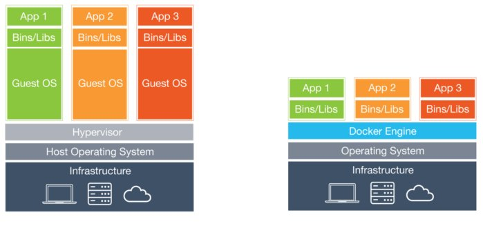

# 도커와 도커 컨테이너의 이해

 

> 출처: http://www.itworld.co.kr/news/110748

 

소프트웨어는 결코 단순하지 않다. 아주 기본적인 애플리케이션조차 종속성이 많고, 수 많은 패키지와 라이브러리, 기타 소프트웨어 구성 요소가 있어야 실행이 된다. 동일한 운영체제 환경에서 여러 애플리케이션을 실행시키려 시도할 때 일부 구성 요소에 문제가 발생할 수도 있다. 소프트웨어 스택을 최신 상태로 유지하고, 비즈니스 니즈에 맞춰 계속 변경할 때, 유지관리와 관련된 온갖 골칫거리를 안게 된다.

수년 동안 애플리케이션과 종속물(종속성)을 분리해 체계화할 때 많이 사용한 방법 중 하나는 각 애플리케이션을 각각 가상 머신에 배치하는 방법이었다. 가상 머신을 이용하면, 동일한 물리적 하드웨어에서 여러 애플리케이션을 실행시키고, 소프트웨어 구성 요소 간 충돌과 하드웨어 리소스 경합을 최소한으로 유지할 수 있다. 그러나 가상 머신은 그 크기가 일반적으로 기가바이트급이다. 이식성(이동성), 소프트웨어 업데이트, 지속적인 통합과 전달(Continuous Integration, CI/ Continuous Delivery, CD) 같은 문제 해결에도 도움을 주지 못한다.

여기에 도커(Docker) 컨테이너가 필요하다. 컨테이너를 활용하면, 운영체제 커널을 공유하는 작고 가벼운 실행 환경으로 애플리케이션을 분리시킬 수 있다. 통상 메가바이트급 크기인 컨테이너는 가상 머신 보다 리소스를 훨씬 적게 사용하고, 그 즉시 시작할 수 있다. 동일한 하드웨어에서 훨씬 더 높은 밀도로 패키징할 수 있으며, 훨씬 적은 노력과 비용으로 대량 축소 및 확장할 수 있다는 장점이 있다.

즉, 컨테이너는 소프트웨어 구성 요소를 현대적인 엔터프라이즈 환경에 필요한 다양한 애플리케이션과 서비스 스택으로 통합하고, 이런 소프트웨어 구성 요소를 계속 업데이트된 상태로 유지 및 관리할 수 있는 아주 효율적이고 점진적인 메카니즘을 제공한다.

## 도커 컨테이너의 '기초'

도커는 BSD와 솔라리스(Solaris)와 같은 유닉스(Unix) 운영체제에서 수십 년 간 사용되었던 개념이 현대적으로 재탄생된 최신 개념이다. 유닉스에서 사용되었던 개념이란 특정 프로세스를 운영체제의 나머지와 일정 수준 분리해 실행시킬 수 있다는 개념이다.

가상 머신은 운영체제 인스턴스 하나를 구획화(Compartmentalizing)가 필요한 애플리케이션 각각에 할당하는 방식으로 '분리(Isolation)'를 제공한다. 거의 완전하게 분리시킬 수 있는 방법이지만, 상당한 비용이 수반된다. 각 운영 인스턴스가 앱 자체에 더 효과적으로 할당할 수 있는 메모리와 프로세싱 파워를 소비하기 때문이다.

그런데 컨테이너는 접근법이 다르다. 각 애플리케이션과 종속물이 운영체제 리소스의 분리된 세그먼트를 사용하는 방식이다. (가장 많이 사용되는 도커를 중심으로) 컨테이너 런타임(container runtime)은 호스트 운영체제가 제공하는 저수준 컨테이너 서비스를 사용해 컨테이너를 셋업하거나 없앤다.

리눅스 컨테이너를 이해하기 위한 출발점은 cgroups(control groups) 및 네임스페이스(namespaces)이다. 컨테이너와 호스트에서 실행되는 다른 프로세스 사이에 벽을 만드는 리눅스 커널 기능들이다. IBM이 최초 개발한 리눅스 네임스페이스는 시스템 리소스들을 묶어, 프로세스에 전용 할당하는 방식으로 제공한다.

구글이 최초 개발한 리눅스 cgroups는 분리와 CPU, 메모리 등 프로세스 그룹의 시스템 리소스 사용량을 관리한다. 예를 들어, 과학용 컴퓨팅 애플리케이션 같이 많은 CPU 사이클과 메모리를 소비하는 애플리케이션을 운영하는 경우, 애플리케이션을 cgroup에 집어넣어 CPU와 메모리 사용량을 제한할 수 있다.

네임스페이스는 프로세스 하나의 리소스 분리를 처리하고, cgroups는 프로세스 그룹의 리소스를 관리한다. cgroups와 네임스페이스가 결합되면서 리눅스 컨테이너(Linux Containers, LXC)라는 컨테이너 기술이 탄생했다.

 

 

## 컨테이너에 변화를 가져온 도커

첫 번째 리눅스 컨테이너 기술인 LXC는 단일 호스트에서 여러 분리된 리눅스 시스템을 실행시키는 리눅스 운영체제 수준의 가상화 기법이다. 네임스페이스와 cgroups가 LXC를 작동하게 만든다.

컨테이너는 운영체제에서 애플리케이션을 분리시킨다. 사용자가 깔끔하고 최소화된 리눅스 운영체제를 운영하면서, 다른 모든 것을 하나 이상의 분리된 컨테이너에서 실행시킬 수 있다는 의미다. 컨테이너에서 운영체제를 분리하기 때문에 컨테이너 런타임 환경을 지원하는 모든 리눅스 서버로 컨테이너를 옮길 수도 있다.

도커는 LXC에 컨테이너의 이동성과 유연성을 높이는 몇 가지 중요한 변화를 가져왔다. 도커 컨테이너를 사용하면, 가상 머신을 사용했을 때보다 더 쉽고 빠르게 워크로드를 배포, 복제, 이동, 백업할 수 있다. 도커는 컨테이너를 실행시킬 수 있는 모든 인프라에 클라우드 같은 유연성을 제공한다.

도커는 또 특정 컨테이너에서 실행될 소프트웨어와 방식에 대한 ‘사양’인 컨테이너 이미지를 생성할 수 있는 기능을 제공한다. 개발자는 도커의 컨테이너 이미지 도구를 사용해 이미지 라이브러리를 빌드하고, 이미지들을 새 이미지로 변환하고, 로컬이나 원격 인프라에서 이미지로 앱을 런칭할 수 있다.

또 더 쉽게 컨테이너 간 동작을 조율하고, 이를 통해 컨테이너를 연결해 애플리케이션 스택을 빌드할 수 있다. 이것의 발전된 개념이 컨테이너 오케스트레이션(container orchestration)이다. 이는 쿠버네티스(Kubernetes) 같은 서드파티 제품들이 제공하지만 그 '토대'는 도커가 제공한다.

도커 개발자들은 LXC 개념을 토대로 API와 생태계를 구축, 개발자들이 컨테이너를 훨씬 더 쉽게 활용할 수 있도록 만들었다. 또 기업에는 유용성을 높였다. 마지막으로 도커 팀은 처음에는 LXC를 기반으로 도커를 개발했지만, 나중에 리브컨테이너(Libcontainer)라는 자체 런타임을 만들었다. 이 리브컨테이너는 컨테이너에 더 풍부한 서비스 계층을 제공하며, 도커 팀이 더 쉽게 리눅스와 별개로 도커 컨테이너 기술을 개발하도록 도와준다. 현재 도커는 효율적으로 컨테이너를 생성, 출하, 실행할 수 있는 리눅스나 윈도우 유틸리티다.

## 도커의 이점

도커 컨테이너는 기존 기술보다 더 쉽게 통합과 유지, 이동을 할 수 있는 엔터프라이즈 및 LoB 애플리케이션 빌드 방법을 제공한다.

- 도커 컨테이너, '분리'와 '조절' 기능 제공

  도커 컨테이너는 앱을 서로, 그리고 기반이 되는 시스템으로부터 계속 분리시킨다. 이런 방식으로 더 깔끔한 소프트웨어 스택을 구현한다. 동시에 더 쉽게 분리된 특정 애플리케이션의 CPU와 GPU, 메모리, I/O, 네트워킹 등 시스템 리소스 사용 방식을 규정할 수 있다. 데이터와 코드를 계속 분리해 유지하는 것도 훨씬 더 쉽다.

- 이식성을 제공하는 도커 컨테이너

  도커 컨테이너는 컨테이너 런타임 환경을 지원하는 모든 장치에서 실행된다. 애플리케이션을 호스트 운영체제와 연결할 필요가 없다. 따라서 애플리케이션 환경과 기반이 되는 운영 환경을 깔끔하게 최소한으로 유지할 수 있다.

  예를 들어, 리눅스 컨테이너용 MySQL은 컨테이너를 지원하는 거의 대부분의 리눅스 시스템에서 실행이 가능하다. 앱의 종속성은 일반적으로 동일한 컨테이너에서 전달한다.

  대상 시스템이나 도커와 함께 사용하는 쿠버네티스 같은 서드파티 도구를 지원하는 경우, 컨테이너 기반 앱을 쉽게 온프레미스 시스템에서 클라우드로 환경으로, 개발자 노트북 컴퓨터에서 서버로 옮길 수 있다.

  일반적으로 도커 컨테이너 이미지는 특정 플랫폼을 대상으로 빌드한다. 예를 들어, 윈도우 컨테이너는 리눅스에서 실행되지 않는다. 반대의 경우도 마찬가지다. 과거, 이런 제약을 우회하는 방법은 필요한 운영체제의 인스턴스를 실행하는 가상 머신을 런칭한 후, 이 가상 머신에서 컨테이너를 실행시키는 방법이었다.

  그러나 도커 팀은 이후 더 발전된 매니페스트(manifests)라는 솔루션을 고안했다. 여러 운영체제 이미지를 동일한 이미지로 나란히 패키징할 수 있는 솔루션이다. 매니페스트는 아직 테스트 단계다. 그러나 여러 플랫폼과 환경에서 사용할 수 있는 애플리케이션 솔루션에 대한 '힌트'를 제공하고 있다.

- 결합성(Composability)을 제공하는 도커 컨테이너

  대부분의 비즈니스 애플리케이션은 웹 서버, 데이터베이스, 인-메모리 캐시 등 하나의 스택으로 구성되는 여러 별개의 구성 요소로 구성된다. 컨테이너는 이런 조각들을 쉽게 변경할 수 있는 부품으로 구성된 기능 유닛으로 결합한다. 여러 컨테이너가 각 조각들을 제공하며, 독립적으로 유지, 업데이트, 교체, 수정을 할 수 있다.

  즉, 애플리케이션 디자인의 마이크로서비스(Microservice) 모델이나 다름 없다. 이 마이크로서비스 모델은 애플리케이션 기능을 별개의 셀프-컨테이너 서비스로 분리, 기존의 느린 개발 프로세스와 유연하지 못한 획일적 앱이라는 문제 해결에 도움을 준다. 가볍고 이동이 가능한 컨테이너를 이용하면, 더 쉽게 마이크로서비스 기반 애플리케이션을 빌드 및 유지 관리를 할 수 있다.

- 오케스트레이션과 스케일링이 쉬운 도커 컨테이너

  컨테이너는 가볍고, 오버헤드가 거의 없다. 따라서 특정 시스템에서 더 많이 실행시킬 수 있다. 또한 여러 시스템에서의 애플리케이션 스케일링, 수요 증가와 리소스 보존을 위한 서비스 증가 및 다운에도 컨테이너를 사용할 수 있다.

  가장 규모가 큰 엔터프라이즈급 컨테이너 배포 및 관리, 스케일링 도구는 서드파티 프로젝트가 제공하고 있다. 컨테이너 배포 및 스케일링(크기 조정)은 물론 연결과 로드 밸런싱, 관리 자동화 시스템인 구글 쿠버네티스(Kubernetes)가 대표적이다. 쿠버네티스는 멀티-컨테이너 애플리케이션 정의(Helm Charts)를 생성 및 재사용할 수 있는 기능도 제공한다. 이를 통해 온디맨드 방식으로 복잡한 앱 스택을 빌드 및 관리할 수 있다.

  도커 자체에도 오케스트레이션 시스템이 내장되어 있다. 덜 까다로운 사용 사례에 여전히 사용되고 있는 스왐 모드(swarm mode)가 여기에 해당된다. 쿠버네티스는 기본 '선택지'가 됐다. 실제 쿠버네티스는 도커 엔터프라이즈 에디션과 함께 번들로 제공된다.

## 도커와 관련된 '주의 사항'

컨테이너는 아주 많은 문제를 해결하지만 '만병통치약'은 아니다. 개념에서 비롯된 단점, 이런 개념에서 부산물로 파생된 단점이 존재한다.

- 가상 머신이 아닌 도커 컨테이너

  개념적으로 가장 많이 하는 실수는 컨테이너를 가상 머신과 동일하게 여기는 것이다. 컨테이너와 가상 머신은 각기 다른 분리 메카니즘을 사용하기 때문에 장점과 단점 또한 크게 다르다.

  가상 머신은 운영체제에서 자신의 인스턴스에서 실행되기 때문에 고수준의 프로세스 분리 기능을 제공한다. 운영체제가 호스트에서 실행되는 것과 동일할 필요도 없다. 윈도우 가상 머신을 리눅스 하이퍼바이저에서 실행할 수 있다. 반대의 경우도 가능하다.

  대조적으로 컨테이너는 호스트 운영체제에서 통제된 영역을 사용한다. 많은 애플리케이션이 (철저히 관리되는 방식으로) 동일한 운영체제 커널을 공유한다. 컨테이너로 분리된 앱은 가상 머신처럼 철저히 분리되어 있지 않다. 그러나 대부분의 워크로드에서 충분히 적합한 분리성을 제공한다. 마이크로소프트는 컨테이너와 가상 머신의 경계를 조금 흐리게 만든 두 종류의 컨테이너를 제공한다.

  • 윈도우 서버 컨테이너(Windows Server Containers)는 본질적으로 윈도우용 도커 컨테이너다. 리눅스가 분리에 사용하는 것과 동일한 메카니즘 일부와 함께 윈도우 커널을 제공한다. 따라서 두 플랫폼에서 도커 컨테이너가 동일하게 작동한다.

  • 하이퍼-V 컨테이너(Hyper-V Containers)는 분리용 커널이 있는 독자적인 가상 머신에서 실행되는 컨테이너다. 즉 필요한 경우, 다른 버전의 윈도우에서 하이퍼-V 컨테이너를 실행시킬 수 있다. 필요한 경우, 기존 컨테이너를 하이퍼-V 컨테이너로 변환할 수 있다.

  하이퍼-V 컨테이너가 하이퍼-V 하이퍼바이저에서 실행되고 하이퍼-V 분리를 사용하지만, 완전한 가상 머신과는 다르다는 점을 유념해야 한다.

- 도커 컨테이너, '베어-메탈' 속도를 제공하지 않는다

  컨테이너에는 가상 머신 정도의 오버헤드가 없다. 그러나 성능에는 영향이 초래된다. '베어-메탈' 속도를 요구하는 워크로드를 운영하는 경우, 컨테이너가 VM보다 낫다. 그러나 일정 수준의 오버헤드를 경험할 것이다.

- 변경이 불가능하고, 비저장성이 특징인 도커 컨테이너

  컨테이너는 내용을 설명하는 이미지로부터 부팅 및 실행된다. 이미지는 기본적으로 변경이 불가능하다. 일단 생성되면 바뀌지 않는다.
  결과적으로 컨테이너는 '영속성(Persistency)'을 갖고 있지 않다. 컨테이너 인스턴스를 시작하면, 컨테이너가 사라지고 재시작 된다. 새 컨테이너 인스턴스에는 기존 인스턴스와 연결된 상태 정보가 없다.

  이는 컨테이너와 가상 머신의 또 다른 차이점이다. 가상 머신은 기본적으로 세션에 대한 영속성을 갖고 있다. 자체 파일 시스템을 갖고 있기 때문이다. 컨테이너의 경우, 유일하게 ‘영속’되는 부분은 컨테이너에서 실행되는 소프트웨어 부팅에 사용한 이미지이다. 이를 바꾸는 유일한 방법은 새로운, 또는 수정한 컨테이너 이미지를 생성하는 것이다.

  이에 따른 장점도 있다. 컨테이너의 비저장성은 컨테이너 내용을 더욱 일관되게 만든다. 또 더 쉽게 예측해 애플리케이션 스택으로 결합할 수 있다. 또한 개발자들이 애플리케이션 데이터를 애플리케이션 코드와 분리해 유지하도록 만든다.
  컨테이너에 영속성을 부여하고 싶다면, 이런 상태를 다룬 장소에 위치시켜야 한다. 부팅 시 컨테이너와 연결되는 독립적인 데이터 볼륨이나 데이터베이스가 이런 장소가 될 수 있다.

## 마이크로서비스가 아닌 도커 컨테이너

컨테이너를 사용하면 더 쉽게 마이크로서비스 애플리케이션을 구현할 수 있다. 하지만 특정 애플리케이션을 가져와 컨테이너에 연결하면 자동으로 마이크로서비스가 생성된다는 의미는 아니다. 컨테이너 배포용인지 여부와 상관없이, 마이크로서비스 디자인 패턴에 입각해 마이크로서비스 애플리케이션을 빌드해야 한다. 애플리케이션을 마이크로서비스로 변환하는 프로세스의 일부로 컨테이너화 할 수 있지만, 이는 수 많은 방법 중 하나에 불과하다.

가상 머신은 애플리케이션을 실행되는 시스템에서 분리시킬 수 있도록 만들었다. 도커 컨테이너는 이 개념을 몇 단계 더 발전시켰다. 가상 머신 보다 더 가볍고, 이동성이 높고, 더 빠른 '스핀 업'을 제공한다. 또 가상 머신에서는 불가능한 스케일링, 결합, 관리 기능을 제공한다
