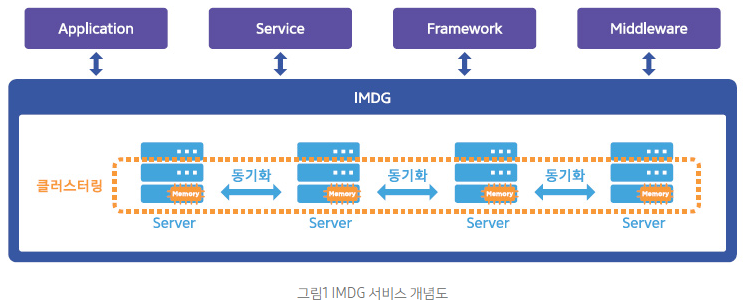

# 시스템 성능 개선을 위한 In-Memory 기술 활용 'In-Memory Data Grid 활용 사례'

 

> 출처: https://www.samsungsds.com/global/ko/support/insights/In-Memory-Data-Grid.html

 

## 1. 들어가며

### 시스템 성능 개선을 위한 요구사항

기업이 관리하고 활용하는 데이터는 지속적으로 증가하고 있으며, 이들 데이터에 대한 실시간 처리 요구 또한 증대하고 있다. 글로벌 기업들은 고객의 수요 동향을 파악하고, 공장 생산을 관리해야 하며, 복잡한 공급망을 비롯하여 최신 트렌드 분석, 고객 민원에 대한 응답속도 개선, 영업이력 관리 등 엄청난 양의 데이터를 수집하고 분석해야 한다.

시장조사기관 Forrester에 따르면 한 기업이 핵심 비즈니스 어플리케이션에 사용하는 데이터 양은 매 18개월을 주기로 두 배씩 증가한다고 한다. 급격히 증가하는 데이터를 처리하기 위해 하드웨어를 구매하고 유지 관리해야 하는 기업 입장에서는 그 비용이 만만치 않다. 더욱이 현재 하드디스크 기반 데이터 처리 방식은 데이터 양이 급증할 경우 `과부하 및 병목 현상`이 발생하면서 신속한 의사결정의 발목을 잡고 있다. 아울러 기업과 고객들은 속도가 느린 각종 분석 시스템에 불만을 표출하고 있다. 이러한 대용량 데이터와 대규모 사용자 접속을 원활히 처리하기 위해 메모리의 우수한 성능을 활용하는 것이 좋은 대응방안이 될 수 있다.

### In-Memory 기술의 필요성

`In-Memory` 기술은 방대한 양의 데이터를 하드디스크가 아닌 메모리에서 관리하고 실시간으로 분석할 수 있게 함으로써 `데이터 처리시간을 단축하고 빠른 의사결정을 지원`한다. 일반적으로 하드디스크(SATA, SSD) 성능 대비 메모리(SDRAM)의 데이터 처리속도는 수십~수백 배 이상 빠르며, 이러한 메인 메모리의 성능을 활용하여 어플리케이션 데이터를 신속하게 처리하고 관리할 수 있다.

메인 메모리는 탁월한 성능을 제공하지만 `영구적으로 데이터를 관리하기 어렵고 용량이 제한적이라는 단점이 있다`. 하지만 `IMDG(In-Memory Data Grid)` 기술의 등장으로 기존 메모리가 가지고 있던 제약이 극복되었고, 현재는 대용량 고성능 데이터 저장소로 발전하였다.

### IMDG(In-Memory Data Grid) 란?

`IMDG(In-Memory Data Grid)는 고가용성과 확장성을 제공하는 분산 메모리 시스템이다`. **_메모리를 주 데이터 저장소로 활용하기 위해서는 대용량 데이터 관리를 위한 신뢰성이 보장되어야 한다._**
이를 위해 IMDG는 분산 클러스터 기술을 활용하고 있다. 다수의 컴퓨터 메모리를 그리드로 연결하여 하나의 큰 메모리 저장소를 구축한다. 서버를 동적으로 추가하여 용량을 증설할 수 있으며, 장애 시 자동복구를 위한 데이터가 여러 서버에 분산 관리된다.

 

 

IMDG(In-Memory Data Grid)는 다음과 같은 특징을 가진다.

- 다수의 컴퓨터 메모리(RAM)를 클러스터링 하여 하나의 큰 메모리 저장소로 구축
- 데이터 유실방지 및 복구를 위해 여러 서버에 데이터를 분산, 복제 관리
- 메모리(RAM) 클러스터의 수평적 확장이 가능하여 무제한 용량 지원
- 데이터는 객체 지향 및 비 관계형 데이터 모델로 관리
- 사용자의 데이터 요청은 다수의 컴퓨터에서 병렬로 처리
- 메모리(RAM) 외 디스크, DBMS 등의 저장소에서 데이터 영구 보관 가능

IMDG는 주로 대용량 캐시 시스템으로 많이 활용되고 있으며, 점진적으로 RDBMS를 대체할 수 있는 In-Memory 기반의 데이터베이스로 발전하고 있는 플랫폼이다

## 2. IMDG(In-Memory Data Grid) 활용

### IMDG 기반의 In-Memory 분산 스토리지

초당 수백만 건의 사용자 요청을 동시에 처리하기 위해서는 디스크가 아닌 메모리 기반의 스토리지가 필수적으로 요구된다. In-Memory 분산 스토리지는 어플리케이션의 캐시 또는 공유 데이터 저장을 위해 활용될 수 있으며, DBMS, No-SQL 등의 주 데이터 저장소를 고성능으로 대체하거나 보완할 수 있다. 특히 DBMS 병목으로 인한 어플리케이션 성능저하나 장애현상이 발생할 경우 In-Memory 분산 스토리지는 좋은 해결방안을 제공한다.

- In-Memory 스토리지는 다음과 같은 주요 기능을 제공한다.
- 다양한 Client 환경을 지원하기 위한 사용자 API(Java, C++, C#, JCache, REST) 지원
- ANSI SQL(JDBC, ODBC) 기반의 DML, DDL 지원
- RDBMS(Oracle, MySQL 등)와 실시간 데이터 동기화(Hot Cache) 지원
- Off-heap 메모리(Direct Buffer)를 사용하여, GC(Garbage Collection) 소모시간 최소화
- 글로벌 원격지의 IMDG 클러스터 간의 데이터 동기화(Federation) 지원
- 사용이 용이한 관리/모니터링 도구 제공

 

 

통상적으로 In-Memory 스토리지를 활용하면 DBMS 보다 저비용의 투자로 고성능 시스템을 구축할 수 있다. DBMS 기반의 시스템 성능을 향상시키고, 사용자 응답시간을 최소화하며, DBMS 부하를 경감할 수 있다. Hot Cache 기능으로 DBMS의 변경데이터를 실시간으로 In-Memory 스토리지로 동기화 하여 동일한 형상을 유지시킨다. 사용자는 DBMS와 In-Memory DB를 병행 운영하여 어플리케이션 성능을 개선할 수 있을 뿐 아니라, 기존 시스템에 영향을 주지 않고 다양한 데이터 분석 목적으로 활용할 수 있다. 최신 기술을 기반으로 개발된 In-Memory 스토리지는 모든 범용 하드웨어, 가상머신, 클라우드 등 다양한 환경에서 실행될 수 있기에 유연한 확장성과 저비용의 장점을 가지고 있다.

### IMDG 기반의 In-Memory 데이터베이스

은행, 카드사, 증권 등 금융 업종을 예로 들어보자. 금융서비스는 수 많은 트랜잭션과 데이터의 중요도로 인해 데이터 처리의 일관성, 연속성이 절대적으로 요구되며 항상 최적의 성능을 유지해야 한다. 기존 RDBMS 기반의 2티어 아키텍처에서는 스케일 업으로 성능을 확장할 경우 많은 비용이 발생하며, 스케일 아웃은 어려운 것이 현실이다. 이에 은행 및 투자관리 회사와 같이 빅데이터를 실시간으로 다루어야 하는 금융 서비스 조직에서는 In-Memory 데이터베이스를 활용하는 것이 필수적이다. 특히 차세대 시스템을 준비 중인 금융권에서는 고성능 데이터 처리와 손쉬운 관리, 비용 효율적인 아키텍처를 중요시 하고 있다.

 

 

기존 RDBMS, NoSQL 등의 데이터 관리시스템은 하드디스크에서 데이터를 관리하기 때문에 성능 제약과 디스크 I/O 부하로 인한 장애가 발생할 수 있다. In-Memory 데이터베이스는 In-Memory를 기반으로 분산된 노드에서 병렬 처리하기 때문에 속도가 매우 빠르고 용량과 성능을 쉽게 확장할 수 있다. 일부 서버에 장애가 발생할 경우, 다른 서버들이 해당 서버의 데이터를 백업하고 있다가 이를 즉시 제공하기 때문에 중단 없는 서비스가 가능하다. 아울러 In-Memory 데이터베이스는 표준 SQL을 지원하기 때문에 기존의 아키텍처 수정을 최소화하여 RDBMS와 통합할 수 있다. 기존 데이터베이스의 스키마와 쿼리를 그대로 사용할 수 있어, 최소의 비용으로 최고의 성능 향상을 이룰 수 있다.

 

| Feature               | RDBMS | NOSQL | IMDG | S-core '8Grid™' |
| --------------------- | ----- | ----- | ---- | --------------- |
| Scale Out             | x     | O     | O    | O               |
| Availability          | x     | O     | O    | O               |
| Consistency           | O     | X     | O    | O               |
| In-Memory             | O     | X     | O    | O               |
| Persistence           | O     | O     | X    | O               |
| SQL                   | O     | X     | X    | O               |
| Key-Value             | X     | O     | O    | O               |
| Collocated Processing | X     | X     | O    | O               |

▲ [표 1] 데이터 저장소별 주요 특징

 

IMDG 기반의 In-Memory 데이터베이스는 다음과 같은 기능을 제공해야 한다.

- 표준 ANSI-99 SQL 지원
- ACID Transaction을 지원하여 데이터의 정합성 보장
- JDBC, ODBC를 사용하여 SQL DDL, DML 실행 가능
- 요청된 쿼리를 다중 서버에서 병렬 처리
- 표준 SQL 함수 및 사용자 정의 함수 지원
- RDBMS와 동일한 구조로 In-Memory DB 생성 및 데이터 초기화 가능
- 쿼리 모니터링 및 성능 테스트 도구 지원

## 3. IMDG 솔루션 적용 사례

### 그룹웨어 시스템

A기업의 그룹웨어 시스템의 포털 서비스는 다양한 사용자 기능들을 제공하면서 몇 가지 문제점에 봉착했다. 가장 큰 이슈는 사용자 수가 늘어남에 따라 캐시 사용량이 증가하였고, 이로 인해 WAS 서버의 FULL GC로 인한 서버 일시정지 및 장애가 발생할 수 있다는 것이었다. 일반적인 FULL GC로 인한 문제는 서버증설로 해결할 수 있지만, 중장기적 관점에서 FULL GC 해결뿐만 아니라 서비스의 유연한 확장성까지 고려하여, 각 어플리케이션의 데이터를 서로 공유할 수 있는 IMDG(In-Memory Data Grid) 기반의 새로운 아키텍처를 도입하기로 결정했다.

 

 

IMDG 솔루션은 크게 두 가지 목적으로 활용되었다.

1. 포털 서비스의 캐시 시스템

   A기업의 그룹웨어 시스템의 기존 아키텍처는 사용자 정의 정보를 DBMS에서 조회하여 사용자 별 서비스로 제공하였다. 하지만 DBMS 기반의 서비스에서는 사용자 수가 증가하거나 접속이 몰리는 시간대에 DBMS 부하가 높아지고, 응답속도가 지연되는 문제가 발생하였다. 이를 해결하기 위해 새로운 아키텍처에서는 IMDG 솔루션의 클러스터 메모리에 DBMS 데이터를 미리 저장하고 동기화하여, 대량의 DBMS 요청을 IMDG 솔루션에서 처리하도록 변경하였다. 그 결과 DBMS 방식 대비, WAS의 성능이 5배 빨라졌으며, DBMS 부하는 2배 이상 감소하였다. 그리고 WAS 간 메모리 데이터 공유로 어플리케이션의 확장성이 향상되었다.

2. 다양한 그룹웨어 서비스를 위한 SSO(Single Sign On)

   사용자의 로그인 상태를 다양한 어플리케이션에서 통합 관리하기 위해 사용자 세션 데이터를 기존 WAS 메모리가 아닌, IMDG 솔루션의 클러스터 메모리에 저장하여 FULL GC의 위험을 회피할 수 있게 되었다. 또한 IMDG 솔루션의 expiry 기능을 사용해 다양한 서비스의 로그인 만료 시간을 개별로 처리하지 않고 통합관리 할 수 있도록 개선하였다.

IMDG 솔루션을 도입함으로써 전체 서비스의 성능은 획기적으로 향상 되었으며, FULL GC로 인한 Stop the world 상태를 피할 수 있게 되었다. 또한 사용자 및 서비스 증가에 따른 시스템 증설 시 서비스의 중단 없이 선형적 확장이 가능하여 고 가용성을 보장할 수 있게 되었다.
