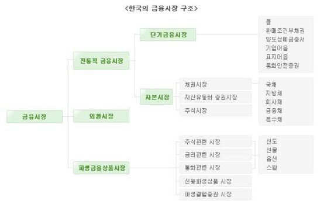
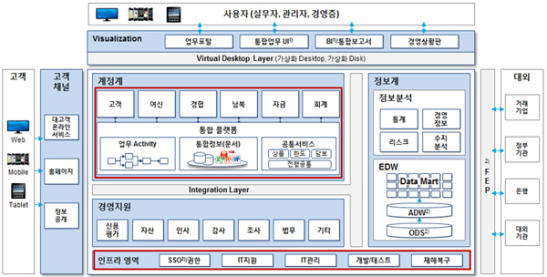
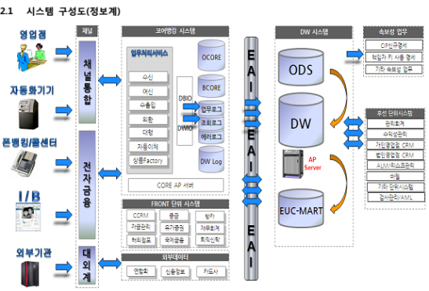
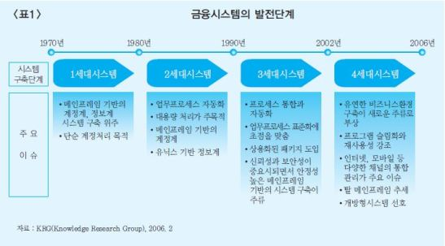
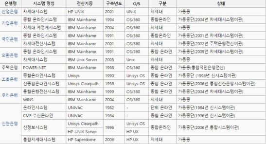
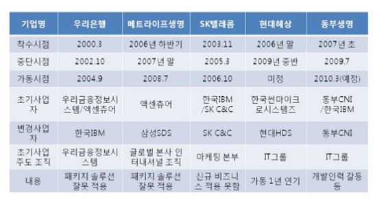
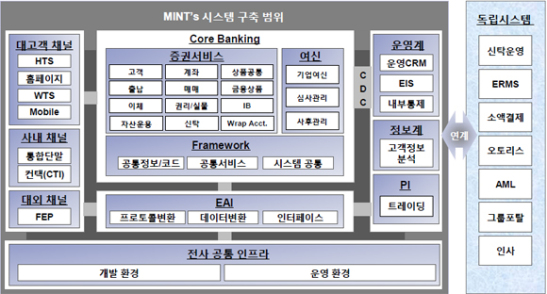
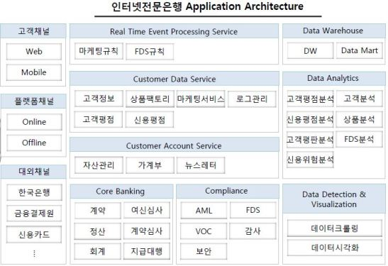

# 은행의 IT시스템에 대한 이해

 

출처 - [은행의 IT시스템에 대한 이해](https://subokim.wordpress.com/2015/05/11/it_system_of_bank/)

 

종종 금융권 쪽에서 일자리를 구하는 친구들이 공통적으로 계정계, 정보계가 뭐냐고 묻더군요. 그런데 금융권 특성상 정보를 외부로 공개하는 경우가 많지 않아 상세한 정보를 얻는데는 어려움이 많습니다.

그래서 이 쪽 종사자분들에게는 아주 ‘기초상식’이지만 ‘용어’조차 생소한 분들을 위해 ‘기본적인 내용’들을 정리해 보았습니다.

금융권이라고 하면 화재, 생명, 은행, 상호저축은행 등이 있는데요. 시스템이 조금씩 다 다릅니다. 우선 은행만 정리했습니다. 블로그를 위해 공개된 정보를 중심으로 정리하다 보니 약간 부족한 점이 있습니다. 짧은 지식이라 혹시 잘못된 내용이 있으시면 댓글로 지적을 부탁드립니다.

 

## 1. 은행 시스템은 어떻게 구성되어 있을까?

 

(한국의 금융시장 구조, 한국은행)

 

한국의 금융시장은 대부분 ‘여러가지 법’에 의해 통제되고 있습니다. 그래서 ‘은행 업무’가 대부분 동일한데 기본적으로는 고유업무, 부수업무, 겸영업무로 나뉜다고 합니다.

은행의 고유업무는 저축을 받고 돈을 빌려주는 업무로 수신(저축), 여신(대출), 외환으로 구성되어 있습니다. 부수업무는 보증을 서주거나 어음을 인수하는 등의 일이고 겸영업무는 채권회수(추심)을 대행하거나 기업 M&A를 중개하는 등 은행업은 아니지만 자본과 관련된 기타 일들을 말합니다. 하지만 은행의 거의 모든 업무는 금융위원회에 신고를 해야 해서 실제로는 정부의 관리 감독 하에서 영업을 한다고 볼 수 있습니다.

따라서 은행마다 조금씩 다르긴 하지만 대부분 아래와 같이 시스템이 구성되어 있습니다.

 

( 수출입은행 차세대 시스템, bikorea.net, 2014.11 )

 

그림을 자세히 보세요. 은행업무가 어떻게 구성되어 있는지 조금 이해가 되시나요?
여기에서 중요한 용어를 설명해보겠습니다.

 

### 1) 계정계 (Core Banking)

은행의 전통적인 핵심 업무는 통장이 중심이 됩니다. 이 통장을 계좌, 계정이라고 합니다. 한 사람이 여러 개의 통장을 만들 수도 있고 돌아가신 분의 통장도 있기 때문에 기본 데이터가 1억 건이 가뿐히 넘습니다. 통장별 거래 기록을 포함하면 수백 억 건의 데이터들이 있습니다. 계정계 데이터는 곧 돈과 거래 기록이기 때문에 장애는 바로 금전적 피해로 이어집니다. 따라서 데이터를 이중 삼중으로 백업하며 시스템이 매우 보수적으로 운영됩니다.

계정계 시스템은 ‘공통업무, 수신업무, 신탁업무, 보험업무, 카드업무, 여신업무, 외환업무, 대행업무 시스템’ 등으로 구성됩니다. 대부분 마스터테이블인 거대한 원장들이 있고, 다양한 업무 처리를 보장하는 정형화된 트랜잭션들이 있습니다. **기본적으로 원장들에 트랜잭션이 집중되는 구조이기 때문에 안정적으로 트랜잭션을 처리하기 위한 미들웨어Middleware가 발달해 있습니다.**

초기에는 IBM Mainframe 을 사용했으며 2000년대 중반 차세대 프로젝트를 통해 많은 은행들이 Unix로 이전하였습니다. 과거에는 프로그래밍 언어로 COBOL을 사용했지만, 차세대를 통해 대부분 C로 옮겨 갔습니다. Java가 최초로 도입된 것은 2013년 (전북은행)일 정도로 굉장히 보수적으로 운용됩니다.

반면 기존 시스템의 운영부담이 적은 보험회사의 경우는 일찌감치 Java를 도입하기도 하였습니다.

 

### 2) 정보계

정보계는 거래활동 및 성과를 분석하고 측정하기 위한 목적으로 구축되었습니다. 주요시스템으로 데이터웨어하우스를 기반으로 하는 수익관리, 고객관계관리, 성과관리, 위험관리 시스템 등이 있습니다. 정보계는 단순히 궁금증을 해결하는 수준이 아니라 영업정보에서 기업전략 정보까지 포함하기 때문에 계정계 만큼 중요하며 없어서는 안될 시스템입니다.

**정보계는 1980년대에 은행업무가 발전하면서 그 개념이 등장하기 시작했습니다.** 기본적으로 통계처리 기법을 많이 사용하기 때문에 대량 데이터의 결합조회(JOIN), 배치처리, 대량 데이터 전송 기술 등을 많이 사용됩니다. 최근에는 빅데이터 기술의 도입이 많이 검토되고 있습니다.

 

(신한은행의 정보계 구성도, bikorea.net, 2014)

 

### 3) 대외계

대외계는 은행 외부기관과의 연계되는 업무를 처리하기 위해 구축 되었습니다. 네트워크를 통한 연계이므로 1970년대 지로공과금을 처리하기 위한 금융공동망과 함께 역사가 시작되었다고 볼 수 있습니다. 주요 시스템으로 인터넷뱅킹, 텔레뱅킹, 펌뱅킹, ATM 등이 있습니다. 단순한 게이트웨이가 아니라 비즈니스 기능을 포함하고 있습니다. 거래내역 기록 및 검증, 프로토콜 변환, 네트워크 오류 시 재전송 기능까지 매우 복잡한 구조로 운영되고 있습니다. 주로 대용량 처리보다 정확성과 안정성에 중점을 준 트랜잭션 허브들이 도입되어 있습니다.

 

### 4) 운영계

통합관제, 네트워크 모니터링 등을 운영계라고 부릅니다.

 

### 5) 기타

이 외에 은행이라는 기업을 움직이기 위한 시스템들이 있습니다. 회계, 인사, 세무 시스템 등인데요. 흔히 백오피스라고 부르기도 하고 기업업무 시스템이라고 부르기도 합니다.

 

## 2. 기술적 특징들

 

트랜잭션이 돈 처리를 의미하는 것이기 때문에 오류에 민감합니다. 소수점 처리에도 민감합니다. 0.1원 오류가 1억 원의 피해로 이어질 수도 있습니다. 오류가 일결산에서 확인이 안되고 월결산이나 연결산에서 발견될 수도 있습니다. 따라서 거래 쪽은 빠른 개발이나 배포보다 안정적인 개발과 배포를 중요하게 생각합니다. 전체적으로 IT문화도 그렇다고 볼 수 있습니다.

은행 업무는 대부분 안정되어 있어서 변화가 적고 데이터도 대부분 정형화되어 있습니다. 그래서 프로세스 설계와 데이터 설계가 매우 중요하게 다루어집니다. 기존 시스템을 쉽게 폐기할 수 없기 때문에 계속 확장을 통해 기능을 구현하는 편입니다. 이기종 DB나 복잡하게 시스템이 얽혀 있는 N-Tier 환경이 대부분입니다. 그래서 ORM이 오래전부터 사용되었습니다. 인터넷 뱅킹이 24시간\*365일로 운영되긴 하지만 대부분 주간에는 금융거래 중심의 트랜잭션들이 일어나고 야간에는 대형 배치처리나 시스템간 데이터 전송이 많이 일어납니다.

사소한 변경이 큰 금전적 피해로 이어질 수 있기 때문에 수정 사항이 있더라도 영향도를 체크한 후에 움직이는 편이며 가능하면 시스템 수정은 기피하는 경향이 있습니다. 유지보수가 중요하기 때문에 기술지원이 안정적인 솔루션들과 피해를 책임질 수 있는 전문업체를 선호하는 경향이 있습니다. 그래서 신기술 도입이 더딘 편입니다.
그리고 차세대를 구축하는 시기에 아키텍쳐 패턴으로 SOA가 등장하여많은 시스템에 적용되기도 했습니다.

데이터 작업이 많고 처리 속도가 중요한 편이라 서버작업에는 Oracle과 Pro\*C 가 많이 사용됩니다. 최근에는 계정계를 제외하고는 Java가 많이 도입되어 있습니다.

꼭 필요하지 않으면 도전적인 기술을 사용하지 않기 때문에 기술보다는 ‘은행 업무’를 얼마나 잘 이해하고 있느냐가 경력자 채용의 중요한 기준이 됩니다. **은행업무를 모르면 비즈니스 로직을 짤 수 없기 때문입니다.(일일히 가르쳐 줄 수도 없고)**

 

## 3. 차세대 시스템이 뭐죠?

 

(금융 시스템의 발전단계,한국은행, 2007)

 

세계적으로 은행에 IT가 도입이 된 것은 1970년대였습니다. 이 때 최첨단 기술은 메인프레임에 여러 대의 터미널을 붙여서 운영하는 Full Server 운용방식이었는데, 이후 전화기, ATM, 무역금융 등이 발전하면서 은행 전산시스템도 꾸준히 고도화 되었습니다. 2000년대에 들어서 여러가지 이유로 거의 모든 시스템을 고도화 할 수 밖에 없게 되었는데 그 변경 범위가 너무 커서 차세대 프로젝트라고 이름을 붙이기 시작했습니다. 차세대가 끝난 이후에는 POST차세대로 부르면서 계속 고도화 중입니다.

 

(차세대 시스템 전후의 전산환경 변화, 위키, 2010)

 

차세대라는 용어는 이후로 보험, 증권회사 등에도 널리 사용되고 있지만 모두 같은 시스템을 지칭하는 것은 아닙니다.

 

## 4. 실패로부터 배운 교훈들

 

**변경범위가 워낙 커서 꽤 많은 차세대들이 실패했으며 이 과정에서 차세대 프로젝트들은 개발자들에게 Hell Project로 일컬어지기도 했습니다.**

 

( 중단된 차세대 프로젝트들, 전자신문, 2009 )

 

대부분 SI프로젝트가 겪을 수 밖에 없는 한계점들이 극명하게 드러나서 관련 종사자들에게 많은 교훈을 남겼습니다. 하지만 속 시원한 대안이 없어 아직도 많은 회사들이 시행착오를 겪고 있기도 합니다.

 

※ 주요기사들

- [차세대 프로젝트의 실패사례에서 배운다.(전자신문,2009.08)](http://www.press9.kr/news/articleView.html?idxno=26104)
- [금융권 차세대 시스템 개발 실패의 역사(디지털데일리, 2011.09)](http://m.ddaily.co.kr/m/m_article/?no=81987)
- [차세대 이후 금융 IT발전전략(이경조, 2011.10)](https://tobewiseys.tistory.com/46)
- [금융권 차세대 프로젝트 광풍, 구축방식 다양해져(전자신문, 2013.09)](http://www.etnews.com/201309250397)
- [왜 차세대 프로젝트는 실패하는가?(김국현 컬럼,2014.02)](https://editoy.com/posts/1921)

 

## 5. 다른 차세대들은 어떤가요?

 

아래 시스템은 메리츠 종금증권의 차세대 시스템입니다. 당연한 이야기지만 아래 시스템에서 수신(예금저축)은 찾아볼 수 없고 대신 주식을 사고파는 증권 서비스가 있습니다. 그리고 여신과 신탁 등이 있어 시스템을 보면 증권사의 업무를 짐작할 수 있습니다.

 

( 메리츠 화재의 차세대 시스템)

 

## 6. 그런데 왜 금융권에서는 Java를 많이 사용할까요?

 

어떤 대학생들이 이렇게 묻더군요.
‘node.js나 python이 최신 유행이라고 해서 배웠는데 막상 취업하려고 하니 모두 Java Spring을 할 줄 아냐고 묻더라. 왜 다들 Java Spring을 쓰나요?’

물론 은행 시스템에도 스크립트 기반의 언어가 사용되는 곳이 있습니다. 그러나 시스템이나 구현해야 할 비즈니스 특성에 따라 언어가 달라집니다. C나 COBOL은 시스템 언어라 CPU 성능을 100%까지 남김없이 끌어 내기에 좋은 언어입니다. 그러나 이식성이 떨어지므로 남은 시스템을 재활용해야 하거나 서로 다른 기종의 컴퓨터를 하나의 시스템으로 운영해야 할 때 꽤 불편합니다. 100여 대에 가까운 서버, 무거운 Batch처리나 가벼운 조회 트랜잭션, 시스템의 다양한 관리 상태에 상관없이 운영해야 하는 Enterprise 환경에서 Java Spring만한 대안이 없기 때문입니다. 극한 성능이 요구되는 환경에서는 다른 언어를 사용하기도 합니다.

참고로 금융환경에서 많이 등장하는 이슈들과 Java의 특성을 잘 이야기한 글이 있어 추천 드려봅니다. 초급자 분들이라면 꼭 한 번 정독하셨으면 좋겠습니다.

- [Sun Microsystems, JAVA Enterprise.(삼성SDS 백창현 수석, 2011.03)](http://blog.daum.net/hj21cv/33)

물론 이론적으로 이렇게 구성한다고 해도 실제 상용화될 때 기대한 대로 움직이지 않는 경우도 적지 않으니 꼭 참고만 했으면 합니다.

 

## 7. 핀테크란 뭔가요?

 

저도 현재 열심히 공부하고 있는 중입니다. 결제수단의 기술적 진화와 함께 금융분야의 변화도 함께 일어나야 할 것 같은데요. 올해 들어 인터넷전문은행의 설립에 대한 이야기가 굉장히 활발합니다. SK C&C 문용준 부장님이 Fi-ntechkorea.com에서 발표하신 자료를 첨부해봅니다.

- [인터넷전문은행(문용준 SK C&C, 2015.03)](http://www.slideshare.net/dahlmoon/fintechkoreacom)

그려주신 자료를 보면 은행 시스템의 추세가 계정계, 정보계, 대외계를 굳이 나누기 보다 업무나 기능별로 분류하고 있음을 알 수 있습니다.

 

(인터넷 전문은행, 문용준 SK C&C, 2015.03)

 
