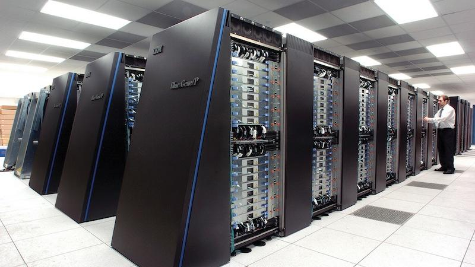
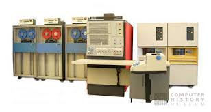

# IT 인프라 1편 서버-메인프레임

 

> 출처 - https://judo0179.tistory.com/28?category=294005

 

인프라는 무엇 일까요? 다양한 IT 직종이 있지만 그중에서 인프라는 구축한 소프트웨어의 안정적인 운영을 담당하는 핵심적인 파트라고 할 수 있습니다. 과거 인프라는 수많은 장비와 네트워크 장비들을 직접 구매하여 운영해야 했지만 클라우드 기술의 발전으로 인프라를 직접 관리하지 않고도 사용한 만큼 지불하는 형태로 많이 변경되고 있습니다.

인프라는 IT에서 핵심적인 부분이지만 다른 분야에 비해서 중요성과 많은 비용 그리고 기술의 발전이 다른 분야에 비해서 느리다는 여러 부분 때문에 부각되지 못했습니다.

하지만 여러분이 메신저앱을 통해 서로의 안부를 묻고 검색엔진에서 검색을 하고, 게임을 하는 모든 과정에서 인프라가 뒷 받침 해주지 않는다면 지금의 윤택한 삶은 있을 수 없을 것입니다.

4차 산업혁명이 진행되고 사물인터넷이 일상속에 스며듬에 따라서 수 많은 데이터들이 네트워크 망을 통해 전달되고 이러한 데이터는 서버에 의해 처리되고 저장됩니다.

하지만 개발자로서의 꿈을 위해 공부하는 학생이나 직종에 일하시는 일하시는 분들도 인프라에 대해 깊이 알지 못하는 것이 현실입니다. 물론 IT 직종에서 무엇 하나 중요하지 않은 분야도 없지만 잘 들어나지 않지만 서비스를 운영하는데 핵심적인 역할을 담당하는 인프라가 저에게 있어 가장 큰 매력으로 다가왔습니다.

지금부터 개인적으로 인프라에 대해서 공부한 내용과 알고있는 기술들을 정리하여 여러분들에게 공유하고자 합니다. 저 스스로의 개인 역량 강화 측면에서 하는것이기도 하지만 수 많은 분야의 사람들과 협업을 통해 만들어지는 IT 서비스의 경우 서로의 분야를 이해하고 알아가는 것이야 말로 성장할 수 있는 좋은 계기가 되지 않을까 싶습니다.

 

## Server란 무엇일까요?

흔히들 게임을 할 때 무슨 서버에서 만나자는 말을 많이 합니다. 일반 사용자에 있어서 서버는 온라인 속 어떤 장소를 뜻하기도 하고 개발자 입장에서는 자신이 만들 어플리케이션이 운영되는 컴퓨터라고 정도만 이해하는 것이 대부분 일 것입니다.

하지만 서버는 여러분이 생각하는 것보다 훨씬 복잡하고 다양한 종류의 서버가 존재합니다.

웹 어플리케이션을 운영하기 위한 웹 서버, 동영상을 스트리밍 하기위한 스트리밍 서버, 인증을 위한 인증 서버, 데이터 저장을 위한 데이터베이스 서버등 서비스의 방식에 따라 구성되는 서버의 종류는 매우 많이 있습니다.

개발자라면 node.js, tomcat, django를 실행하면 웹 페이지에 http://localhost:8080 식과 같은 방식으로 자신이 만들 서비스를 확인하기도 합니다. 이러한 일을 통해 여러분의 개인 PC가 서버로 변신하는 순간이 되기도 합니다.

여러분들이 일반적으로 사용하는 PC는 인텔 혹은 AMD에서 제작한 CPU가 들어있습니다. 기술의 발전에 따라 개인이 사용하는 PC의 사양이 엄청나게 올라가게 되었고 실제로 개인 PC를 서버로 운영하더라도 큰 문제는 발생하지 않습니다.

하지만 수천~수만의 사용자들이 동시에 사용하고 이러한 부하를 감당하기 위해서는 고집적으로 구성되어 있는 특수한 서버가 반드시 필요하게 됩니다. 성능도 뛰어난 것도 장점이지만 안전성도 서버에 있어서 매우 중요한 요소 입니다.

- 안전성이란 서버의 장애가 발생하여 시스템에 장애가 발생하지 않도록 하는 것을 말합니다. 이를 무중단 이라고 하는데 이러한 요구사항을 맞추기 위해서 서버에는 하드웨어 하나하나에 에러를 정정하기 위한 수 많은 기술들이 포함되어 있습니다.

- 이러한 서버의 특성 때문에 에러가 일반PC에 비해서 잘 일어나지 않기 때문에 여러분들이 사용하는 서비스가 안정적으로 구동될 수 있습니다. 하지만 이러한 서버라도 예기치 못한 에러가 발생할 수 있기 때문에 인프라 담당자는 24시간 서버를 모니터링하고, 긴급 점검과 꾸준한 보안패치도 진행해야 합니다.

서버를 만드는 제조회사는 다양합니다. 하지만 각각의 회사(벤더라고 부릅니다.)에 따라 지원하는 기술과 사용방식 운영체제, 서버 부품 등이 다 다르기 때문에 인프라 관리자는 각 벤더들의 특성을 잘 이해하여 자신이 사용하는 회사에 적용해야 합니다.

 

## 메인프레임 중앙처리의 시작

우리가 흔히 메인프레임이라고 부르는 서버는 중앙 집권식 처리를 위해 태어난 서버라고 생각해도 좋습니다.

과거 PC는 매우 고가의 장비였기 때문에 개인이 구매하여 사용한다는 것은 상상할 수 없는 일이었습니다. 이렇기 때문에 메인프레임이라는 중앙 PC를 두고 여러 사용자들이 접속하여 사용하는 방식을 사용하고 있었죠.

지금의 PC의 개념이 없었던 시절이었기 때문에 사용자는 터미널이라는 장비를 가지고 중앙 서버로 접속하여 작업했습니다.

여기서 가장 중요한 것이 여러 사용자들이 동시에 작업을 처리해야 한다는 점입니다.

- 지금에서 여러작업을 동시에 처리한다는 개념이 대단한게 있냐고 생각할 수 있지만 동시처리기능은 구현하기가 생각보다 까다롭고, 현재에도 중요한 기능입니다.

- 운영체제 입장에서 PC의 자원은 한정되어 있기 때문에 여러 작업이 동시에 들어왔을 때 일을 처리하기 위해서는 자원들과 적절한 통신과 자원을 공유하여 사용해야 합니다. 만약에 이러한 일들이 적용되지 않는다면 동시에 처리되는 일들은 절대로 원하는 결과로 이루어지지 않을 것입니다.

- 좀 더 자세히 들어간다면 우리가 어떠한 작업을 PC에 명령을 했을때 여러분의 PC에서는 CPU의 작업을 스케줄링하고 메모리 할당을 어떻게 할 것인지 관리하고, 각각의 I/O 장비를 필요로 하는 프로세스에게 우선순위를 정하고 자원을 할당하고 자원을 회수하는 일련의 작업들이 일어나야 가능한 일입니다.

- 1960년대 IBM에서 동시처리를 위해 이러한 기술을 만들었다고 합니다.

메인프레임은 1964년 IBM에서 출시한 System/360이 현대 메인프레임의 시초라고 할 수 있으며 현재도 메인프레임 시장의 최강자로 군림하고 있습니다.

동시 처리를 위해서는 아래와 같은 속성을 반드시 지켜야 합니다. (ACID)

| 속성                 | 정의                                                                       |
| -------------------- | -------------------------------------------------------------------------- |
| 원자성 (Atomicity)   | 트렌젝션은 완결된 처리가 되어야 한다. 일부만 수행되고 중단되어서는 안된다. |
| 일관성 (Consistency) | 트렌젝션은 데이터를 일관된 상태로 유지할 수 있어야 한다.                   |
| 고립성 (Isolation)   | 트렌젝션은 동시에 실행되는 다른 트렌젝션에 무관하게 실행되어야 한다.       |
| 지속성 (Durability)  | 정상 처리된 트렌젝션의 결과는 영구히 유지되어야 한다.                      |

> 트렌젝션 : IT 시스템에서 하나의 완결된 업무 처리의 단위이자 더이상 나눌 수 없는 업무 처리의 단위를 말한다.

메인프레임은 워낙 고가이기 때문에 초기 도입시 매우 큰 비용이 들어가는 부분이 단점이라고 할 수 있습니다. x86 시스템이 사용되면서 메인프레임이 사라질 것이라는 예상도 있었지만 보안문제와 더불어 워낙 높은 안전성으로 인해서 아직까지도 사용되고 있습니다.

특히 금융권과 같이 폐쇄적인 시스템의 경우 수십년 전의 구형 메인프레임이 아직까지도 운영되고 있는 것을 볼 수 있는데 이처럼 높은 안전성과 꾸준한 유지보수가 이루어 지기 때문에 현재에도 많이 사용됩니다. 즉 특정 서드파티 솔루션이 특정 벤더에서 완벽하게 동작할 수 있을 만큼의 안전성과 보안성을 갖추고 있는 것입니다.

또한 메인프레임은 제작부터 일반 PC와 매우 다르기 때문에 APT공격을 제외한 특정 벤더의 메인프레임 해킹의 성공했다는 전력은 거의 전무하다 시피 합니다. (불가능하다는 것이 아니라 그만큼 일반 x86 시스템보다 안전성이 높다는 뜻입니다.)

IT는 장애가 나면 큰일나는 분야이기 때문에 안전성을 장점을 내세우고 판매하고 있습니다. 단적인 예로 x86 서버를 사용할 때 CPU 사용률이 60%~70% 이상을 지속적으로 유지되면 큐잉(어떤 명령이 들어왔을 때 즉시 처리할 수 없는 경우 가용한 CPU가 생길 때 까지 대기하는 현상)이 발생하여 성능저하가 발생하게 되는데 메인프레임은 이러한 현상에도 과부화로 인한 성능 저하나 안전성이 떨어지지 않습니다.

심지어 CPU 사용량이 100%가 지속되는 작업에도 유닉스나 x86 서버계열에서 발생하는 시스템 다운이나 비정상 종료와 같은 일들이 일어나지 않습니다. 이러한 측면에서 메인프레임의 안전성은 뛰어나다고 할 수 있습니다.

 

## 메인프레임의 특성

메인프레임이 워낙 고가의 장비이다 보니 수용할 수 있는 처리용량도 큰 것도 사실이지만 메인프레임 하나만으로 모든 서비스를 운영할 수 없을 것입니다.

만약 어느 시점에 서버의 처리용량의 한계로 인하여 서버를 증설해야 한다면 다음 2가지 전략을 고려할 수 있습니다.

- 높은 처리량을 제공하는 신형 메인프레임 도입
- 같은 처리량의 메인프레임 확장

만약에 자금력이 많다면 신형 메인프레임을 도입하는 것이 가장 좋겠지만 당장 몇 개월 뒤에 서비스가 어떻게 될 지 모르는 IT시장에서 무리하게 고가의 장비를 구입하는 것은 무리가 있을 것입니다. 따라서 대부분 수평적 확장을 위한 2번째 대안을 선택하는 것이 대부분이며 이는 메인 프레임 뿐만 아니라 다른 대부분의 인프라를 운영하는 대부분이 이 방식을 채용합니다.

또한 개발한 특정 어플리케이션을 검증하기 위한 검증용 시스템의 경우 별도의 시스템을 따로 구축하기 보다는 메인프레임에서 LPAR(Logical PARtition) 기술을 통해서 하나의 메인프레임에서 물리적으로 분리해주는 기술도 있습니다. 이러한 기술 덕분에 분리된 시스템 간에 영향을 미치지 않고 독립적인 운영이 가능해졌습니다.

지금은 이러한 파티션 기술이 발달하여 쉽게 사용할 수 있지만 최초의 시작은 메인프레임에서 시작했다고 할 수 있습니다.

이렇게 여러 메인프레임이 동시성 제어를 위해서는 CF라는 별도의 장비가 필요합니다. CF는 각각의 메인프레임에 연결하여 사용할 수 있는데, 최대 32대 까지 묶을 수 있습니다. 이를 **병렬 SYSPLEX** 라고 합니다.

- CF는 애플리케이션을 직접 구동하지 않습니다. 메인프레임에서 말하는 클러스터는 리눅스나 유닉스에서 말하는 개념과는 조금 다르다고 할 수 있습니다.

- 리눅스, 유닉스에서 사용하는 MC/SG 혹은 RHCS의 경우 복수의 노드가 있을경우 프라이머리, 세컨더리 역할을 부여하여 하드웨어나 운영체제의 문제가 있을 경우 다른 서버로 대체하여 스플릿 브레인 (클러스터로 묶여 있는 복수의 노드가 동일한 자원에 대해서 서로 자신이 프라이머리로 인식하여 데이터의 정합성이 깨지는 현상)이 생기지 않도록 하는 것이 주 목적입니다.

- CF는 동시성 제어를 위해 연결된 시스템의 락, 개별 시스템 상호간의 정합성 보장을 위한 캐시관리, 데이터 목록 정보 관리의 3가지 정보를 관리하게 됩니다. 이를 통해 모든 메모리의 변경사항을 추적 관리하여 서로 다른 장비들이 마치 하나인 것 처럼 동작한다는 점에서 차별화를 이루게 된다는 특징을 가지고 있습니다.

- 하지만 이러한 CF의 특성 때문에 노드가 늘어날 수록 노드간의 연결을 위해 사용되는 CTC 링크와 CF의 증설이 같이 이루어져야 하기 때문에 많은 비용이 소모될 수 밖에 없습니다. 하지만 안전성과 신뢰성이 매우 뛰어나기 때문에 메인프레임이 아직까지도 계속 사용됩니다.
