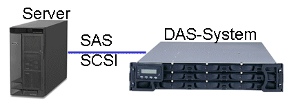
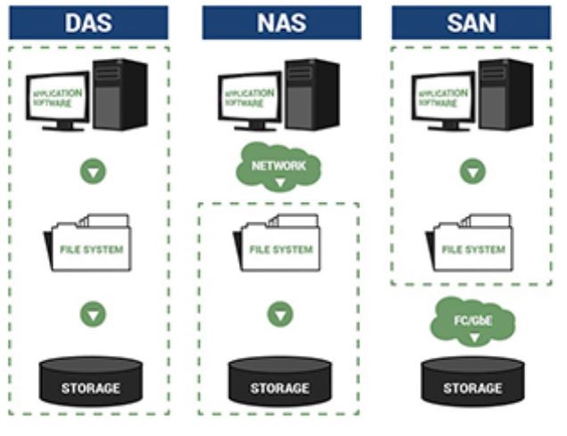
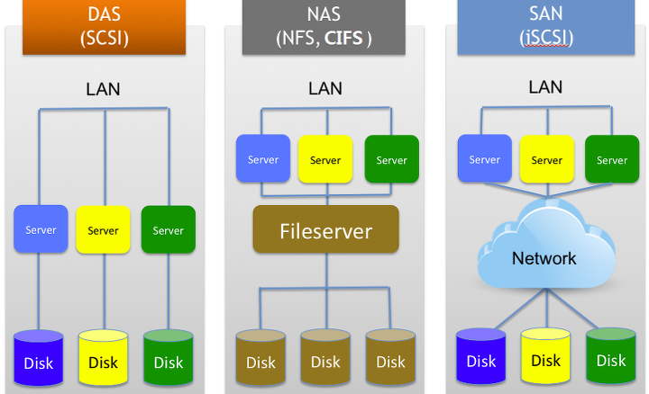
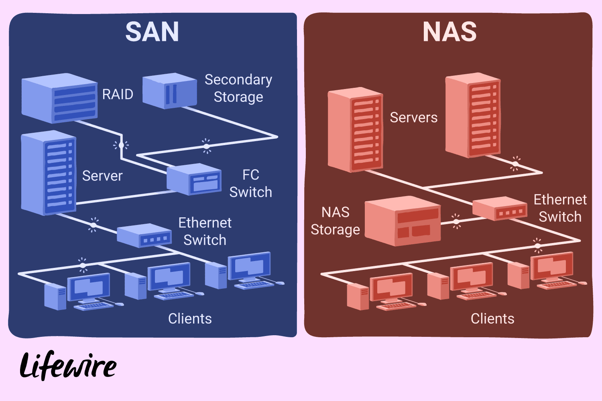
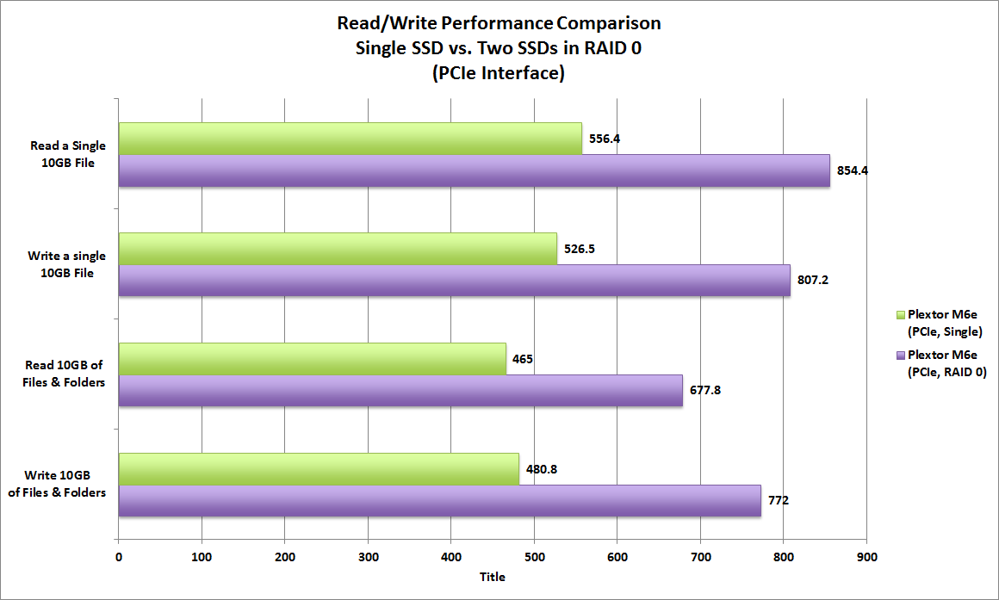
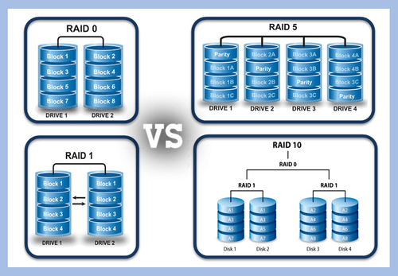
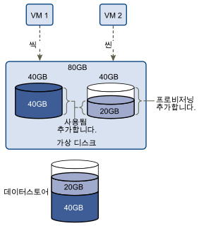

# IT 인프라 3편 스토리지

 

> 출처 - https://judo0179.tistory.com/31?category=294005

 

지난 시간에 이어서 오랜만에 찾아왔습니다. 오늘은 IT 인프라 3편 스토리지에 대해서 알아보는 시간을 가지도록 하겠습니다.

우리가 일반적으로 사용하는 컴퓨터에는 SSD 혹은 HDD가 설치되어 있습니다. SSD와 HDD는 관심있으신 분들이라면 알만한 내용이기 때문에 차이가 무엇인지는 잠시 접어두고 인프라 관점에서 바라보는 스토리지에 대해서 알아보록 합시다.

스토리지에서도 등급이 존재한다는 사실을 알고 계신가요? 일반적으로 하이엔드, 미드레인지, 엔트리급으로 나뉘어 지는데 지금은 엔트리급도 성능이 많이 좋아진 상태입니다. 물론 단계가 올라갈 수록 데이터 안전성을 위한 더 많은 기술들이 들어가는 것은 사실입니다.

식스 9 즉 99.99999% 라고 표현하는 하이엔드급의 스토리지가 있다면 미드레인지급은 파이브 9 즉 99.9999%의 가용성을 보여준다고 할 수 있십니다.

- 식스 9의 경우 1년의 32초, 파이브 9은 1년에 5분 15초의 다운타임을 허용한다고 할 수 있는데 이러한 수치는 절대적으로 믿을수는 없습니다.

- 제조사에서 광고하는 수치가 절대적으로 맞아 떨어진다면 인프라 엔지니어가 있을 필요가 없을 정도로 서버가 안정화 되어 있어야 하는데 무수히 많은 이유로 저러한 시간을 맞추지 못하고 디스크가 고장나는 경우가 대부분입니다.

- SSD의 경우 NAND FLASH 메모리를 사용하기 때문에 속도가 빠르다는 장점이있지만 SLC, MLC, TLC, QLC에 따른 성능차이와 안전성 차이가 나는것이 한계이고, 가격도 HDD의 용량대비 가격이 높게 형성되어 있는 것이 문제입니다.

- 우리는 이러한 장애가 언제나 발생할 수 있다 라는 가정하에 인프라를 설계하여 HA(고가용성)을 만족해야 합니다.

 

## 스토리지의 구성방식

위에 방식에서는 스토리지는 등급에 따라 분류했다면 이번에는 구성 방식에 따라 다음 3가지 방식으로 나눌 수 있습니다.

- DAS

  

  - 스토리지와 서버가 직접으로 연결되는 시스템을 말합니다.

  - 케이블에 상관없이 정통적으로 서버와 직접 연결됩니다.

- SAN

  

  - SAN 스위치를 통해서 서버와 스토리지를 연결하는 방식을 말합니다.

  - SAN 스위치를 통하기 때문에 성능과 확장성을 보장받을 수 있다는 장점을 가지고 있습니다.

- NAS

  

  - 네트워크를 통해 서버와 스토리지와 연결되어 통신하는 방식을 말합니다.

  - SAN과 NAS의 차이가 연결방의 차이가 다르다는 점과, 스위치를 통해서 연결한다는 측면에서는 유사해 보이지만 실제 내부적으로 사용하는 프로토콜 측면에서 차이가 있습니다.

  - NAS의 경우 개인용으로도 많이 보급되어 일상에서 흔히 볼 수 있는 시스템이 되었으며, 다양한 제조사와 오픈소스 NAS 소프트웨어도 활성화 되어있습니다.

 

## 스토리지 도입하기

스토리지를 도입하기 이전에 가장먼저 생각해야 할 것이 예산일 것입니다. 예산에 따라서 특정 목적에 맞게 스토리지를 구입하는 것이 좋다고 할 수 있습니다.

전통적으로 스토리지 전문업체를 살펴본다면 IBM, EMC, Netapp, HDS, HP같은 업체들이 있겠지만 플래시 메모리가 빠른 속도로 발전하면서 퓨어스토리지, 솔리드파이어등의 신생 업체가 대두대고 있으며 중국 업체도 새롭게 떠오르고 있습니다.

사실 스토리지는 서버보다 더 많은 부품과 솔루션으로 무장되어 있기 때문에 고르기가 쉽지 않은 부분이 존재합니다.

- 데이터를 실질적으로 저장하는 부분이기 때문에 스토리지 손상으로 인한 백업 및 복구 솔루션은 물론 빠른 처리속도와 안전성을 보장해야 하는 여러 특성이 포함되어 있기 때문입니다.

다음 5가지 항목을 체크하여 도입할 것을 권장합니다.

1. 성능

   - IOPS, 스토리지 컨트롤러 처리 대역폭, 캐시 용량과 같은 물리적인 성능을 뜻합니다.

2. 확장성

   - 디스크의 최대 장착 개수를 말합니다.

3. 호환성

   - 서버의 인터페이스 및 운영체제의 지원여부를 말합니다.

   - SATA, M.2, MSATA, SCSI 등 스토리지와 연결할 수 있는 인터페이스가 다양하며, 운영체제별로 지원하는 부분이 상의할 수 있기 때문에 반드시 확인하고 넘어가야 하는 부분이라고 할 수 있습니다.

4. 가용성

   - 가장 중요한 무중단 서비스를 운영하기 위해서 서비스 특성에 따라서 RAID, 이중화 구성, 캐시 미러링(스토리지 캐시의 데이터를 보호하기 위해 서버가 스토리지에 데이터를 캐시에 저장하는 시점에 다른 컨트롤러로 미러링하는 기술), 백업기능 활성화 방법이 있을 수 있습니다.

   - 이러한 방법들은 너무나 다양하기 때문에 각 방법에 따른 특성을 잘 고려하여 도입해야 합니다.

   - 최근에는 AWS의 백업 솔루션을 많이 사용하는 추세입니다.

5. 활용성

   - 스토리지 내부에 데이터를 복제하거나 백업 하는 등의 스토리지 자체 솔루션을 이용하여 데이터를 사용자가 원하는 목적에 맞게 활용할 수 있는 수준을 다르게 가져간다는 것을 의미합니다.

 

## 스토리지 비교하기

스토리지는 서버에 비해서 일반화 하기가 매우 어려운 부품중에 하나입니다.

가장 쉬운 기준은 용량이 될 수 있습니다.

- 자신이 사용거나 사용되는 산출량을 계산하여 도입시에 적정량의 스토리지의 용량을 선택하면 됩니다.

- 많은 스토리지가 지속적으로 필요하다면 외장형 SAN 스토리지를 사용한다면 PB 이상의 고용량을 무제한으로 구성할 수 있습니다.

- 디스크의 용량이 커질 수록 디스크의 갯수도 늘어나게 되는데 I/O 측면에서 디스크의 갯수가 많아질 수록 성능이 향상된다고 알려져 있습니다.

- 하지만 스토리지 도입시 단순 용량이나 성능을 IOPS, 즉 초당 I/O의 지표만으로 판단하지 않습니다.

  - IOPS 수치는 서버 사양과 설정값, 읽기, 쓰기 비율 등 측정 조건에 따라 큰 차이가 발생하기 때문입니다.

  - 4k 와 같이 작은 블록 사이즈로 100% 랜덤 읽기를 진행하면 수치가 좋게 나오는데, 만약 블록 사이즈를 크게해서 측정하면 IOPS는 떨어지지만 처리량은 올라갈 수도 있습니다.

  - 이런 경우에는 초당 전송량 (MB/s)을 같이 비교합니다.

일반적으로 디스크의 초당 입출력 속도를 나타내는 IOPS 지표를 보편적으로 사용하나, 디스크의 처리속도는 CPU, 메모리에 비해서 느린속도로 동작하기 때문에 디스크의 성능이 업무 성능에 차지하는 비중이 높고, 병목현상이 발생할 가능성이 높습니다.

 

## 스토리지 검증방법

스토리지를 도입하기 이전에 어떤 부분을 고려해야 하는지 알아보도록 하겠습니다.

일반적으로 용량관점에서 본다면 도입시 자신이 얼마나 많은 용량이 필요로 하는지 확인해야 합니다.

데이터가 수십 TB이고 파일을 공유하는 입장이라면 확장성이 뛰어난 외장형 SAN 스토리지 도입을 고려할 수 있습니다.

- 현재 디스크의 직접도가 향상됨에 따라서 TB 용량이 탑재된 디스크가 시장에 출시되고 있기 때문에 이러한 외장형 SAN 스토리지를 도입하게 된다면 용량확장성은 PT 급 혹은 거의 무한히 용량을 확장할 수 있다는 장점을 가지고 있습니다.

하지만 디스크는 CPU나 메모리에 비해서 I/O 성능이 떨어지고, 디스크의 성능은 어플리케이션 성능에 많은 비중을 차지하며, 다른 부품에 비해 병목현상이 나타날 수 있는 가능성이 상대적으로 높기 때문에 제조사에서 홍보하는 성능기준비치를 절대적으로 믿지 않으며 다음과 같은 방법을 통해 검증합니다.

- **BMT** : 서버/스토리지/네트워크/소프트웨어를 도입하기 전에 동일한 조건에서 기능과 성능, 가용성 항목에서 테스트하는 것으로 제품 선정에 목적이 있다.

- **POC** : 제품 선정보다는 제품 자체의 기능 검증이 주된 목적이며, 해당 IT 운영에 필요한 기능과 목적에 부합한지 사전에 검증하는 것이다.

- **IOPS** : 초당 입/출력 처리량을 뜻한다. HDD, SSD 등과 같은 저장장치의 성능 지표를 확인하기 위해서 사용하나, 서버사양, 설정값, 읽기 쓰기 비율 등 측정조건에 따라 차이가 크기 때문에 절대적인 지표로 사용하지 않습니다. 이와 비슷하게 MB/s (초당전송량)과 같이 단위 시간 동안 얼마나 많이 처리하는지 확인하는 방법도 있습니다.

- **응답시간** : 디스크는 쓰기 작업에서 스토리지 캐시에 쓰고 나중에 디스크에 쓰기 작업이 일어나기 때문에, 디스크의 읽기 응답시간 보다 쓰기 응답시간이 빠르다는 특징을 가지고 있습니다.

 

## 스토리지 기술

### RAID

Redundant Array of Inexpensive/Independent Disk

저장장치를 여러개 묶어 고용량 / 고성능 저장장치 한 개와 같은 효과를 얻기 위해 개발된 기법입니다.

초기 디스크의 용량이 작고 가격도 비싸다는 단점을 해소하기 위해서 저렴하고 용량이 작은 디스크 여러개를 하나로 사용하기 위해서 나왔으나 현재는 Independent의 약자로 해석합니다.

기본적으로 미러링과 스트라이핑 기법으로 나뉘어 지며 이를 통해 무정지 혹은 고성능을 위해 RAID를 사용합니다.

RAID는 데이터의 안전성과 성능향상에 목적이 있기 때문에 절대로 데이터를 백업하는 용도로 사용하서는 안됩니다.

- 백업을 위해서는 별도의 백업 스토리지나 솔루션을 구축해야 합니다.

- 데이터 안전성을 목적으로 RAID는 목적에 절대로 부합하지 않으며, 디스크가 고장나서 교체해야 할 경우 무중단 서비스 구축, 즉 예기치 못한 디스크 오류로 부터 예방 (스트라이프 방식 제외)입니

RAID를 구현할때는 하드웨어 방식과 소프트웨어 방식 2가지 방식이 있습니다.

- 하드웨어 방식은 별도의 RAID 컨트롤러를 장착하는 방식으로 속도와 안전성이 모두 최고급이라고 할 수 있으나 고가의 RAID 컨트롤러를 PCIe 슬롯에 장착해야 한다는 단점을 가지고 있습니다.

- 10만원 미만의 저가의 RAID 컨트롤러는 디스크를 컨트롤하기 위한 위한 별도의 작은 CPU/메모리가 없기 때문에 소프트웨어 레이드와 유의미한 차이가 없으며, 이러한 카드를 FakeRAID 카드라고 부릅니다.

- 메인보드에 흔히 포함되어 장착하는 레이드 컨트롤러도 대부분 이러한 방식을 채택하고 있습니다. 이러한 레이드 컨트롤러를 사용할 경우 레이드0, 레이드 1과 같은 단순한 레이드 방식의 경우 성능차이가 크게 나지 않지만 레이드 5, 레이드 6 혹은 병합방식으로 사용하는 경우 페리티연산이 크게 작용하기 때문에 성능이 크게 차이날 수 있습니다.

- 소프트웨어 방식의 경우 OS RAID 라고도 하며, OS을 설치하고 소프트웨어적으로 레이드를 묶는 방식을 말합니다.

- 이러한 방식의 경우 OS에서 관리하기 떄문에 다양한 방법으로 RAID를 구성할 수 있으며, 용량이 다른 두 제품의 경우 RAID를 구성하고 남는 공간에 단일 파티션이나 다른 RAID Array를 구성할 수 도 있습니다.

동작 방식에 따라 0~6으로 분류하나 주로 사용되는 방식은 0, 1, 5, 6이 주로 사용되며, 각 레이드 방식을 혼합해서 사용하는 경우도 있습니다.

**Hot Spare** 의 경우 전체 멤버 디스크에서 1개의 디스크를 Spare로 지정해서, 평상시에는 대기하다가 디스크가 고장났을 때 자동으로 디스크의 리빌딩 하여 RAID 볼륨을 복구하고 고장난 디스크는 멤버디스크에서 빠지게 됩니다.

### RAID 주의점

레이드 5의 경우 8개 이상의 대량의 디스크를 스토리지로 묶으면 패리티 연산 오류 발생확률이 높아져서 레이드 0보다 안전성이 급격하게 떨어지기 때문에 대용량의 디스크를 사용한다면 반드시 RAID 6나 RAID 10 사용하기를 권장합니다.

하드디스크가 고장난 확률은 디스크 개수만큼, 운영시간만큼 배가됩니다.

레이드를 구성할 때 동일 모델, 같은 시기에 생산된 디스크를 사용할 것을 추천합니다. 하지만 아이러니하게도 이런 상황에서 디스크하나가 고장나게 되면 다른 디스크도 비슷한 시기에 고장날 가능성이 매우 높기 때문에 반드시 유의해야 합니다.

- 동일한 생산라인에서 비슷한 시기에 생산된 제품이라면 동일 환경하의 불량률 역시 비슷하기 때문입니다.

디스크가 고장나서 리빌딩 작업을 통해 복구하는 도중에 부하를 주는 행위는 절대적으로 피해야 합니다. 이런 경우 리빌딩 시간도 오래걸리며, 연산작업에 오류가 발생활 확률이 매우 높아집니다. 또한 리빌딩 도중에 디스크가 고장나는 경우 데이터 복구가 사실상 불가능한 상황이 올 수 있기 때문에 추가 백업 솔루션은 필수 입니다.

레이드 1의 경우 데이터의 안전성이 매우 중요한 곳에서 사용하는 경우가 대부분입니다. 이때 만약 하나의 디스크가 고장나서 사용 불능이 되는 경우 가장 먼저 해야 하는 것은 안전한 곳으로의 데이터 백업입니다. 이 경우 리빌딩 도중에 나머지 디스크가 고장날 확률도 높기 때문입니다.

하드웨어 레이드 컨트롤러를 사용하는 경우 정상동작하는 환경이라면 펌웨어 업데이트와 깉이 변경이 일어나는 행위는 절대 금지입니다.

- 간혹 새로운 펌웨어 업데이트가 버그픽스 패치라고 할 지라도 펌웨어 업데이트 이후에 레이드가 풀리거나 깨질 수 있는 상황이 생길 수 있기 때문입니다.

- 이와 비슷하게 디스크를 임의로 탈착하거나 다른 하드웨어로 변경이 일어날 수 있는 환경이라면 반드시 데이터 백업을 먼저 진행하고 작업을 진행해야 합니다.

디스크 S.M.A.R.T 체크를 꾸준히 확인하여 디스크 상태를 확인해야 합니다.

- 디스크 관리 소훌로 인하여 데이터를 복구하지 못하는 상황이 생길 수 있기 때문입니다.

 

## 데이터 안전하게 저장하기

데이터를 실질적으로 안전하게 보관하기 위해서는 백업이 필수입니다.

스토리지에서 제공하는 다양한 솔루션은 크게 2가지로 내부 복제 / 외부 복제로 나눌 수 있습니다.

- 내부 복제란 같은 스토리지에서 원본과 같은 데이터를 복제하는 방식입니다.

  - 원본 데이터를 사용하다가 사용자의 실수로 인해서 데이터가 깨지거나 할 경우 데이터를 즉시 복구하기 위해서 사용합니다.

  - 테스트를 하고나서 데이터를 초기화 하기위해서 사용하기도 합니다.

- 외부 복제란 원본과 다른 곳에 있는 스토리지로 같은 데이터를 복제하는 방식입니다.

  - 외부 복제는 동기 / 비동기 방식으로 나뉘어질 수 있는데 각각 장단점이 존재하며, 실제 기업에서는 재난과 같은 천재지변의 상황에서도 데이터를 안전하게 저장하기 위해서 비동기 방식을 주로 사용합니다.

복제 시점에 따라서 실시간으로 복제할 수도 있고 특정 시간때 복제할 수 도 있습니다.

데이터를 안전하게 저장하기 위해서 사용하는 복제의 경우 데이터를 더 많은 곳에 활용하고자 한다면 스토리지의 비용은 계속해서 늘어난다는 단점을 가지고 있습니다.

- 특히 데이터 전체를 full copy 하는 경우 원본 스토리지의 용량과 같은 용량의 스토리지가 필요하기 때문에 복제를 어떻게 구성하고 운영하는가가 스토리지 구성의 핵심이 됩니다.

이러한 복제의 문제점을 보완하고자 스냅샷이라는 기법이 있습니다.

- 스냅샷은 원본 데이터를 가리키는 주소값만 갖는 포인터와 변경 이력만 관리하는 복제 개념이기 때문에 데이터를 저장하는데 많은 공간이 필요하지 않고 생성속도가 매우 빠르다는 장점이 있습니다.

- 데이터를 임시로 백업하는 경우와 같은 논리적인 데이터 보호를 위해 사용합니다.

- 단, 원본데이터가 손실되면 원본을 참조하는 스냅샷에도 문제가 생기기 때문에 물리적인 보호수단으로는 사용할 수 없습니다.

스토리지에서 가장 복잡하고 중요한 부분이 복제 솔루션입니다. 복제 솔루션은 제조사마다 이름은 다르지만 위에서 언급한 기능을 제공하고 있습니다. 또한 복제하는데 걸리는 시간도 스토리지 성능지표에서 확인해야 하는 중요한 지표가 될 것입니다.

- 데이터 유실이 발생하더라도 해당 장애를 복구하기 위한 시간에 영향을 미치기 때문입니다.

 

## 씬 프로비저닝 & 씩 프로비저닝과 오토티어링

씩 프로비저닝의 경우 사용자가 요청한 용량만큼 할당하는 방식을 말합니다.

- 예를 들어 사용자가 100GB를 요청했을 경우 스토리지에도 똑같이 100GB가 할당됩니다.

- 이는 사용자가 가용공간이 많이 있든 적든에 상관없이 스토리지의 해당 용량이 반영됩니다.

씬 프로비저닝은 스토리지의 효휼적인 사용을 위해서 가상 스토리지 영역을 할당하고 사용자가 필요한 만큼 할당해주는 방식입니다.

- 씬 프로비저닝된 가상 디스크는 요청한 용량의 한도 안에서 사용자가 사용한 만큼의 용량만큼 자동으로 늘어나고 줄어들기 때문에 같은 디스크라도 효율적으로 사용할 수 있으며, 증설 시기를 늦출 수 있다는 장점이 있습니다.

오토티어링의 경우 스토리지 성능을 가격 대비 효율적으로 보장해주는 방법입니다.

- 디스크의 종류는 SSD, SAS, SATA로 나눌 수 있는데 각각의 장단점이 있기 때문에 성능 위주 혹은 용량 위주로 스토리지를 선택적으로 사용해야 합니다.

- 오토티어링을 사용하면 사용자의 개입없이 디스크 컨트롤러가 스토리지 사용패턴에 따라 자동으로 데이터가 옮겨지는 기술이라고 할 수 있습니다.
