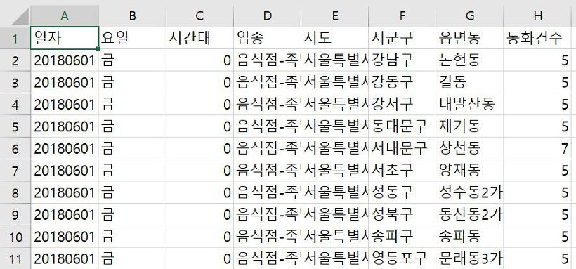
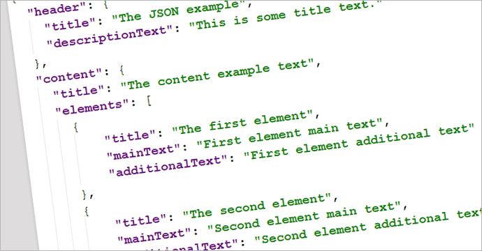

# 정형(Structured), 반정형(Semi-Structured), 비정형(Unstructured) 데이터

 

출처 - [정형(Structured), 반정형(Semi-Structured), 비정형(Unstructured) 데이터](https://deep-jin.tistory.com/entry/%EC%A0%95%ED%98%95-%EB%B0%98%EC%A0%95%ED%98%95-%EB%B9%84%EC%A0%95%ED%98%95-%EB%8D%B0%EC%9D%B4%ED%84%B0)

 

안녕하세요. 공부하다가 정형, 반정형, 비정형 데이터에 대해서 잘 정리 된 글을 보고 포스팅하러 왔어요. 사실 전 정형, 비정형 데이터만 있다고 알고 있었는데 반정형 데이터 라는 것도 존재하더군요! 포스팅을 위해 공부 하다보니 엄격하게 나누자면 Quasi-Structured Data 형태도 있다고 해요. 그러나 3개로 분류하는 게 일반적이라고 하니, 이 세가지에 대해서만 포스팅을 하겠습니다. 저는 언제나 기초가 중요하다고 생각해요. 초석이 단단해야 좋은 데이터맨이 될 수 있다고 생각합니다. 따라서, 이런 꿀팁들은 까먹기전에 정리합시다~:)

 

## 정형 데이터 (Structured Data)

 

데이터를 다루는 사람이라면 흔하게 보게 되는 형식의 데이터예요. Structured, 즉 구조화 돼 있다는 말 그대로 관계형 데이터베이스(RDB), 스프레드시트, CSV등이 있습니다.

 

▲ Structured Data(CSV형태)

 

이렇게 말이죠. 우리가 자주 보는 형태죠? :) (데이터는 SK Big data hub에서 제공하는 2018년 6월 업종 배달 현황 데이터입니다.)

 

## 반정형 데이터 (Semi-Structured Data)

 

반정형 데이터란 형태(Schema, Meta Data)가 있으며, 연산이 불가능한 데이터를 말해요. 예를들면 XML, HTML, JSON, 로그 형태등이 있습니다.

 

▲ Semi-Structured Data (JSON 형태)

 

위 그림은 JSON형태의 데이터예요. 중괄호로 묶여있고, key-value 값으로 이루어져 있습니다. JSON형태에서는 스키마라는 개념은 없지만, RDB에서의 테이블과 비슷한 역할을 하는 Collection과 RDB에서의 value값과 비슷한 역할을 하는 Document로 이루어져 있습니다. key값은 RDB에서의 컬럼 역할을 해요. 저도 mongodb를 다루는 프로젝트를 했던 경험이 있는데, 그 때 참 흥미롭게 공부했던 기억이 있습니다. :)

 

## 비정형 데이터 (Untructured Data)

 

비정형 데이터란 형태가 없으며, 연산도 불가능한 데이터를 말합니다. 예를 들면 소셜데이터(트위치, 페이스북), 영상, 이미지, 음성, 텍스트(word, PDF...) 등이 있습니다.

트위터에서는 텍스트 데이터가, 인스타그램에서는 이미지 데이터가, 유튜브에서는 영상 데이터가 하루에도 수십만건씩 만들어지고 있죠.

자, 오늘은 데이터맨이 되기 위해 꼭 알아야되는 데이터의 형태에 대해서 알아봤습니다. 감사합니다. :)
