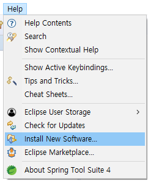
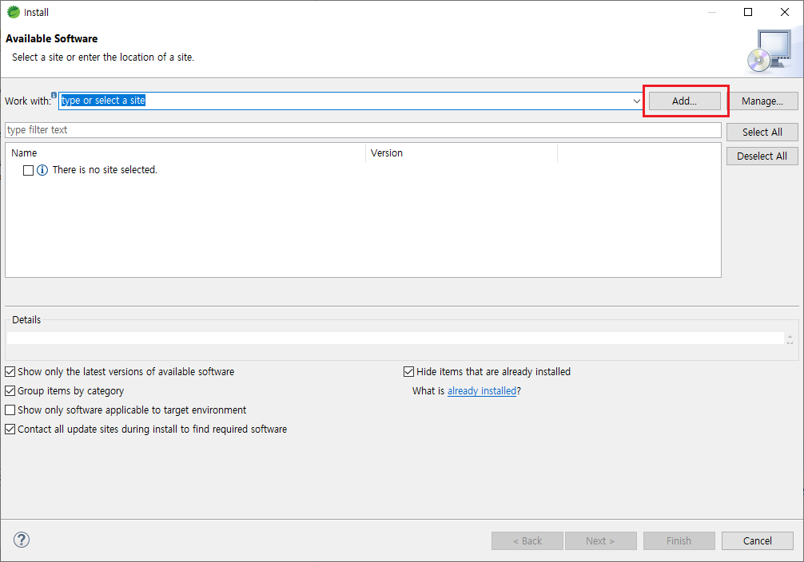
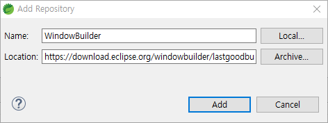
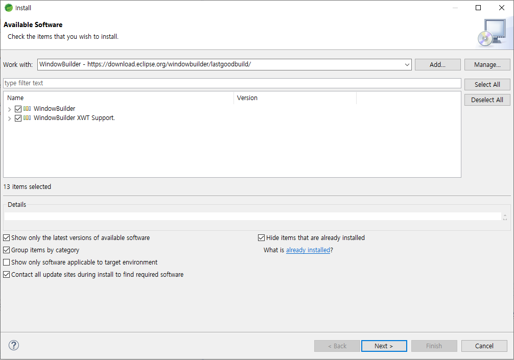

Eclipse SWT Installing WindowBuilder Pro
============================================

### 1. Installing WindowBuilder

**[Add Repository Location 참고](https://www.eclipse.org/windowbuilder/download.php)

