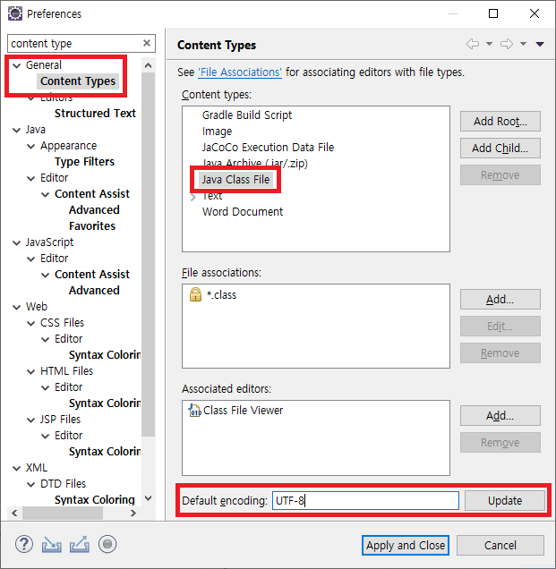
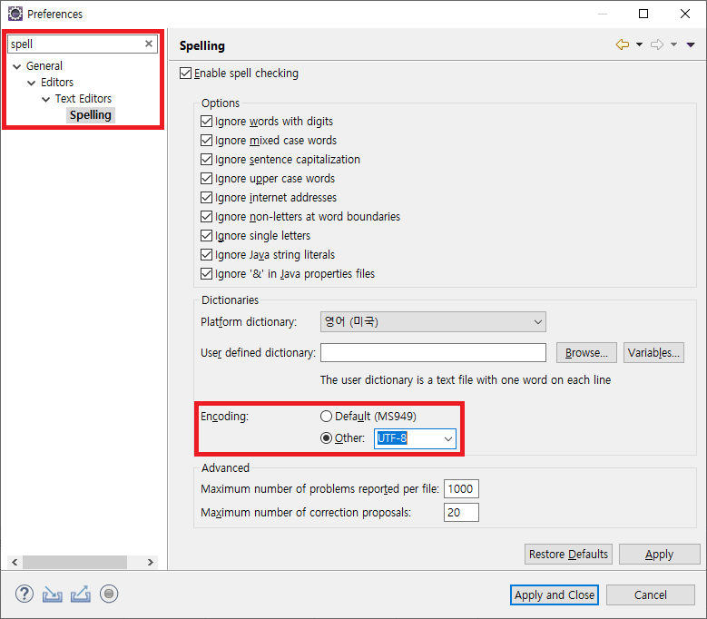
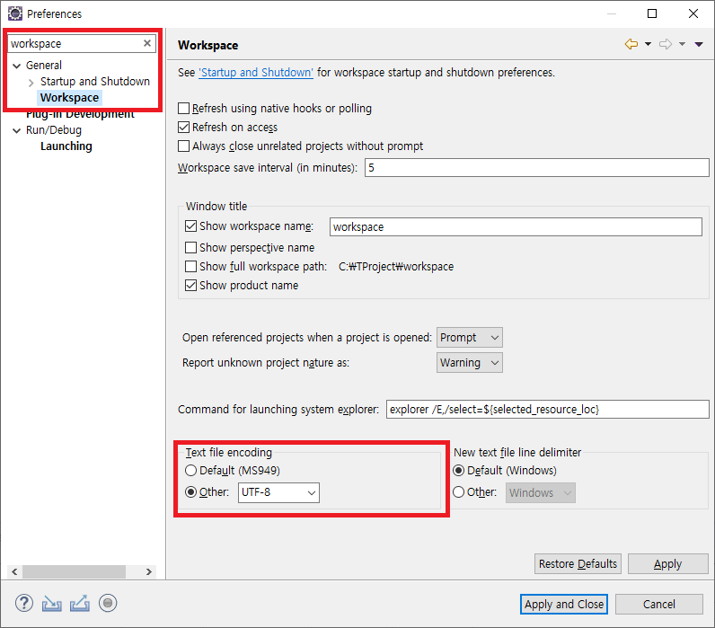
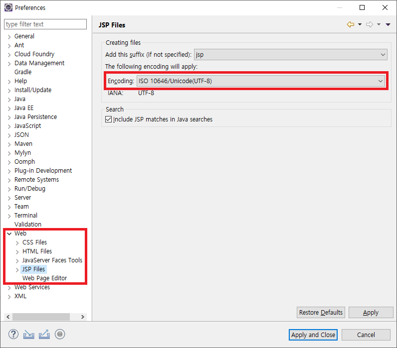
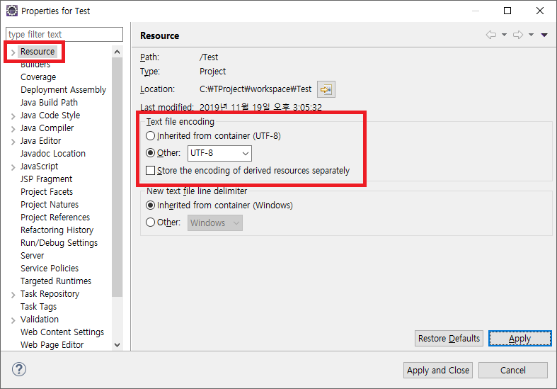

# Eclipse UTF-8 인코딩(Encoding) 설정

 

이클립스 프로젝트를 import 하여 작업을 진행할 때 한글이나 특정 문자가 깨지는 경우가 있습니다.

이런 경우 import 프로젝트는 `UTF-8` 로 설정이 되어 있지만 로컬 이클립스의 인코딩이 `EUC-KR` 또는 `MS949` 로 설정되어 있을 때 발생합니다.

한글이나 특정 문자를 복구하기 위해서는 로컬 이클립스의 인코딩을 `UTF-8`로 설정되면 됩니다.

 

## 이클립스 인코딩(Encoding) 설정

 

### 1. Window > Preferences > General > Content Types - Java Class File > Default encoding

 

### 2. Window > Preferences > General > Editors > Spelling > Encoding 에서 UTF-8 선택

 

### 3. Window > Preferences > General > Workspace > Text file encoding 에서 UTF-8 선택

 

### 4. Window > Preferences > Web > JSP Files 에서 Encoding : ISO 10646/Unicode(UTF-8) 선택

※ CSS, HTML 도 동일하게 설정

 

### 5. 프로젝트 인코딩(Encoding) 변경

Project > Properties > Resource > Text file encoding 에서 UTF-8 선택

 
