# Eclipse 최적화 설정

<br/>

### 1. 실행 메모리 설정

이클립스 실행 폴더의 `eclipse.ini` 파일의 내용을 보면, 여러 옵션들이 있지만, 아래 2가지 옵션만 수정을 해도 문제가 없다.

```
[변경전]
-Xms256m
-Xmx1024m
```

```
[변경후]
-Xms1024m
-Xmx1024m

# 너무 메모리를 많이 할당해도 좋지 않다.(램 8G 기준)
```

<br/>

### 2. 자동 빌드 해제

`Project > Build Automatically` 체크 해제

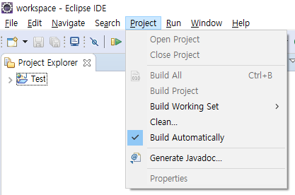

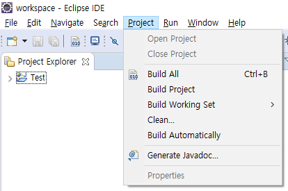

`Project > Build ALL` 혹은 `Ctrl + B` 를 통해 수동으로 가능

<br/>

### 3. 메모리 사용 상태 표시

Window > Preferences > General 에서 `Show heap status` 체크


이클립스 하단에 heap 사용 상태가 나타나고, 쓰레기통 아이콘을 클릭하면 `Garbage Collector`가 실행되고, `Garbage Collector`는 heap 메모리를 정리해 준다.

<br/>

### 4. Spell checking 해제

Window > Preferences > General > Editors > Text Editors > Spelling 에서 `Enable spell checking` 해제

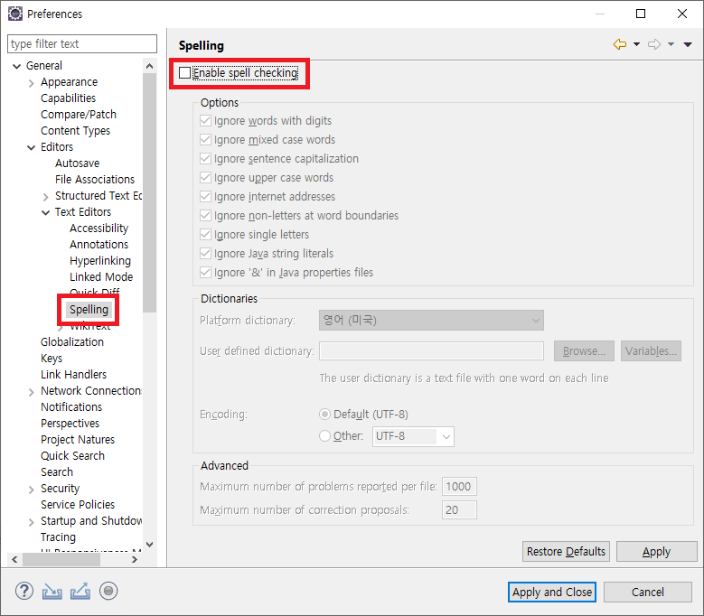

<br/>

### 5. Eclipse 실행속도 개선

Window > Preferences > General > Startup and Shutdown 에서 디폴트로 선택되는 플러그인 중 불필요한 것 체크 해제.

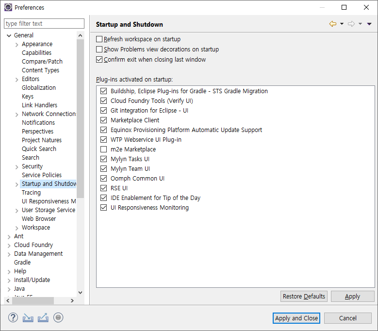

<br/>

### 6. Automatic Updates Off

Window > Preferences > Install/Updates > `Automatic Updates` 체크 해제

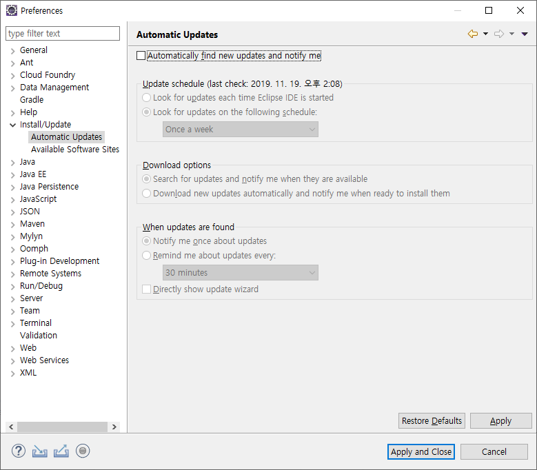

<br/>

### 7. 코드 자동 완성 기능 해제

Window > Preferences > Java > Editor > Content Assist 에서 Auto Activation - `Enable auto activation` 체크 해제

`ctrl + space`를 사용해서 수동으로 가능

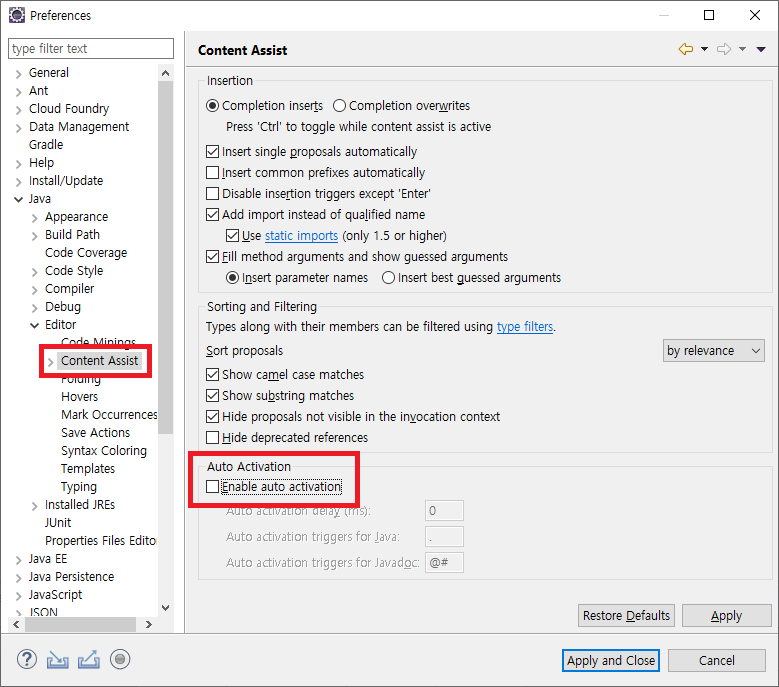

<br/>

### 8. 소스 자동 폴딩 해제

Window > Preferences > Java > Editor > Folding 에서 `Enable folding` 체크 해제

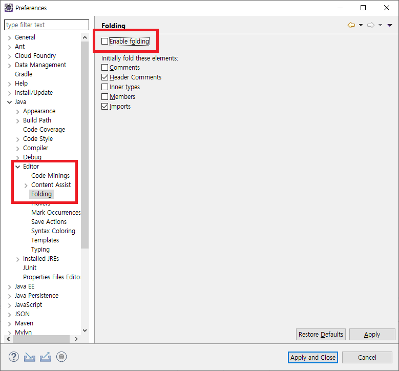

<br/>

### 9. Validation 유효성 체크 해제

Window > Preferences > Web > JSP Files > Validation > Validate JSP fragments 체크 해제

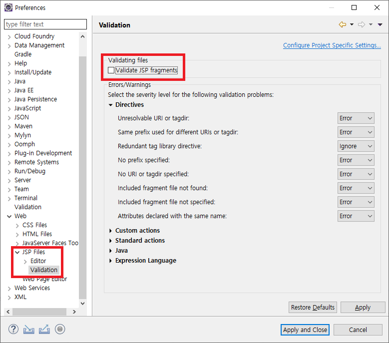

Window > Preferences > Validation 에서 필요 없는 것 체크 해제

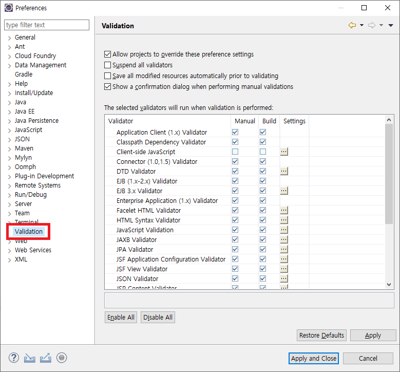

<br/>

### 10. 불필요한 플러그인 삭제

Window > Preferences > Install/Update

설치 한 후 사용하지 않는 플러그인은 삭제한다.

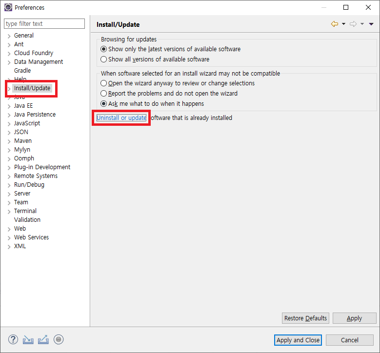

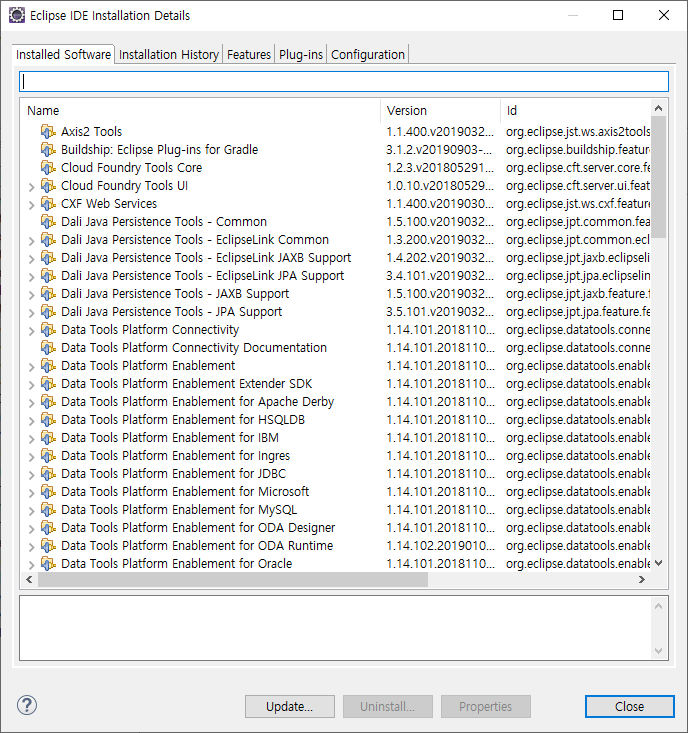

<br/>
