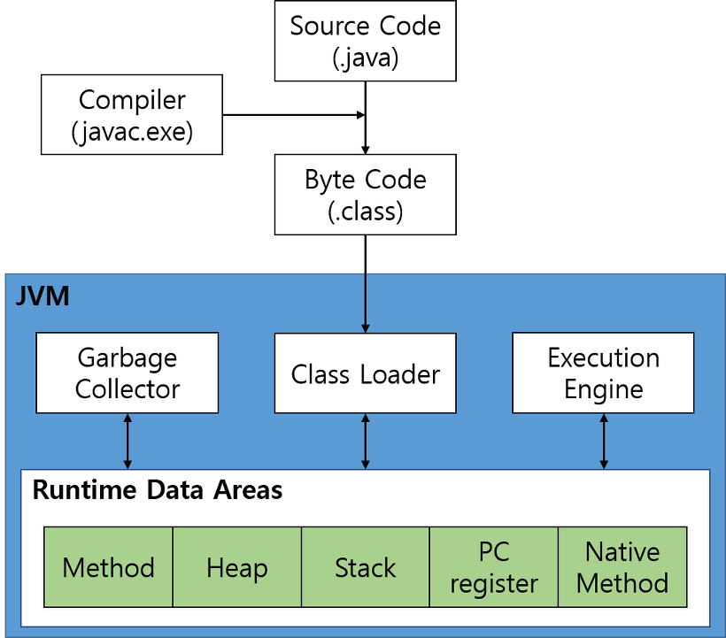
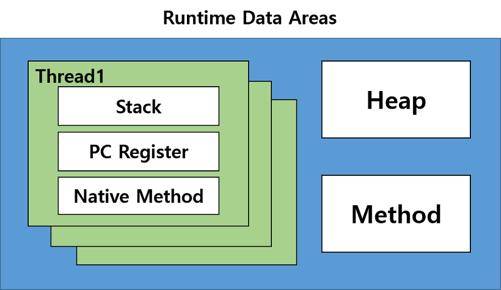

# JVM 구조 및 메모리

<br/>

출처 - [JVM 구조 및 메모리](https://lazymankook.tistory.com/79)

<br/>



▲ [그림 1] JVM 구조

<br/>

JVM 구조에 대해 자세히 알기 위해선 위 그림 1의 구조를 알고 있어야 한다.

<br/>

### 1. Class Loader

Java의 컴파일러가 자바의 소스코드(.java 파일)를 빌드하면 바이트코드 파일(.class 파일)이 생성된다. 각 운영체제의 JVM의 Class Loader가 이 바이트코드 파일을 Runtime Data Areas에 로딩하여 프로그램을 구동한다.

Class Loader의 **로딩은 런타임에** 일어나는데, 클래스에 처음 접근될 때 일어난다. 이를 이용해 Lazy Loading Singleton 같은 것들을 구현하기도 한다. 참고로 **Class Loading 시간엔 thread-safe**하다.

<br/>

### 2. Execution Engine

Class Loader가 Runtime Data Areas에 불러온 바이트코드를 실행한다. **바이트코드를 실행할 때 기계어로 변경해 명령어 단위로 실행**하는데, 1바이트의 OpCode와 피연산자로 구성된다.
Execution Engine은 2가지 방식으로 명령어를 실행한다.

Interpreter: 명령을 순차적으로 읽으며 실행한다. 파일 이름을 인자로 받으며, main 함수를 포함해야한다. 컴파일된 .class 파일을 다음과 같이 실행할 수 있다.

```
java [file_name_without_extension]
```

JIT (Just In Time) Compiler: Interpreter의 느린 단점을 없애고자 나온 컴파일러이다. **JIT Compiler는 유사한 바이트코드를 매번 다시 컴파일하지 않고, 캐싱해둬서 컴파일에 필요한 총 시간을 단축한다.**

Oracle은 Hotspot Compiler라는 컴파일러를 사용하는데, 프로파일링을 통해 가장 우선순위가 높은 부분(hotspot)을 찾아 네이티브 코드로 컴파일한다. 컴파일된 메소드의 바이트코드가 더 이상 필요하지 않다고 판단되면 Hotspot Virtual Machine은 캐시에서 네이티브 코드를 삭제하고 Interpreter 모드에서 실행한다.

<br/>

### 3. Garbage Collector

Heap 영역에서 참조되지 않는 오브젝트를 제거하는 역할을 한다. JVM의 Garbage Collector에 대한 설명은 다음 글에 작성할 예정이다.

<br/>

### 4. Runtime Data Areas

OS로부터 할당받은 JVM의 메모리 영역이다. 자바 애플리케이션을 실행하는데 필요한 데이터를 담는다. Runtime Data Areas는 그림 1처럼 5개의 영역으로 나뉜다.

- Method Area

  Class Loader가 적재한 클래스(또는 인터페이스)에 대한 메타데이터 정보가 저장된다. Non-Heap 영역으로 Permanent 영역에 저장된다. JVM 옵션 중 PermSize (Permanent Generation의 크기)를 지정할 때 고려해야 할 요소이다. Method Area는 아래의 정보들을 저장한다.

  1. Type Information

     - Interface 여부
     - 패키지 명을 포함한 Type 이름
     - Type의 접근 제어자
     - 연관된 Interface 리스트

  2. Runtime Constant Pool

     - Type, Field, Method로의 모든 레퍼런스를 저장
     - JVM은 Runtime Constant Pool을 통해 실제 메모리 상 주소를 찾아 참조한다.

  3. Field Information

     - Field의 타입
     - Field의 접근 제어자

  4. Method Information

     - Constructor를 포함한 모든 Method의 메타데이터를 저장
     - Method의 이름, 파라미터 수와 타입, 리턴 타입, 접근 제어자, 바이트 코드, 지역 변수 section의 크기 등을 저장

  5. Class Variable

     - static 키워드로 선언된 변수를 저장
     - 기본형이 아닌 static 변수의 실제 인스턴스는 Heap 메모리에 저장

- Heap Area

  new 연산자로 생성된 객체를 저장하는 공간이다. 참조하는 변수나 필드가 존재하지 않으면 GC의 대상이 된다.

- Stack Area

  Thread마다 별개의 Frame으로 저장하며, 아래의 정보들을 저장한다.

  1. Local Variable Area

     - 지역변수, 매개변수, 메소드를 호출한 주소 등 Method 수행 중 발생하는 임시데이터를 저장한다.
     - 4바이트 단위로 저장되며, int, float 등 4바이트 기본형은 1개의 셀, double 등 8바이트의 기본형은 2개의 셀을 차지한다. bool은 보통 1개의 셀을 차지한다.

  2. Operand Stack

     - Method의 workspace이다. 어떤 명령을 어떤 피연산자로 수행할 지 나타낸다.

  3. Frame Data

     - Constant Pool Resolution, Method Return, Exception Dispatch 등을 포함한다. 또한 참조된 Exception의 테이블도 가지고 있다. Exception이 발생하면 JVM은 이 테이블을 참고하여 어떻게 Exception을 처리할 지 정한다.

- PC Register

  Thread가 현재 실행하고 있는 부분의 주소를 저장한다. OS는 PC(Program Counter) Register를 참고하여 CPU 스케줄링 시 해당 Thread가 다음에 어떤 명령어를 수행해야 하는지 알 수 있다.

- Native Method Stack

  자바 외 언어(C/ C++ 등)로 작성된 네이티브 코드를 위한 메모리 영역이다.

Runtime Data Area의 위 5가지 영역 중 1, 2 번은 모든 Thread가 공유하는 영역이고, 3, 4, 5 번은 Thread 마다 각각 존재하는 영역이다. 이를 그림으로 표현하면 아래 그림 2와 같다.

<br/>



▲ [그림 2] Thread 별 메모리 구조

<br/>

- 참고

  JVM 구조 및 메모

      https://jeong-pro.tistory.com/148
      https://www.holaxprogramming.com/2013/07/16/java-jvm-runtime-data-area/

  JVM Stack

      https://www.quora.com/What-is-a-JVM-stack
