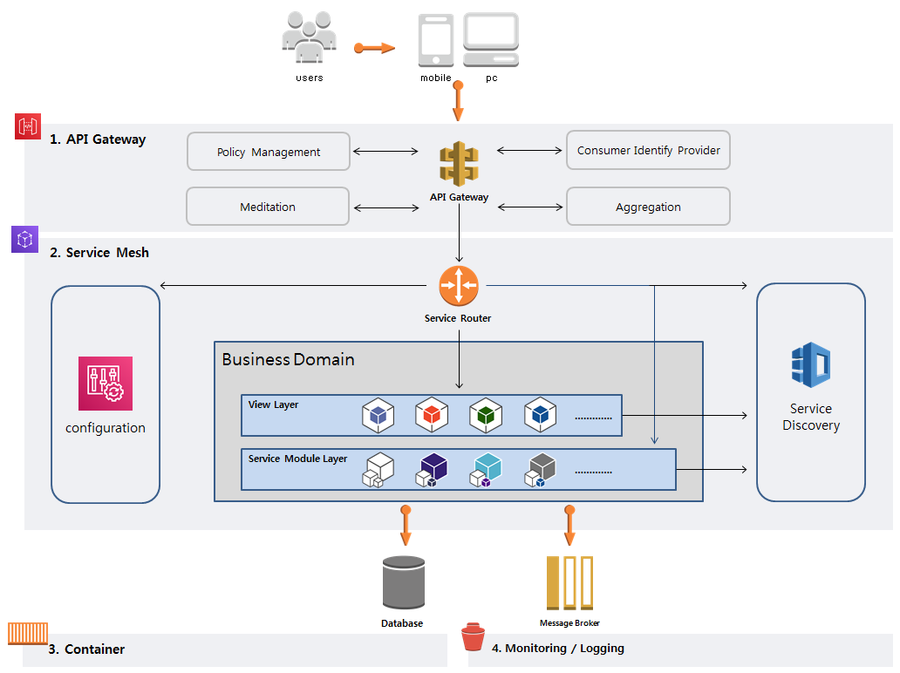
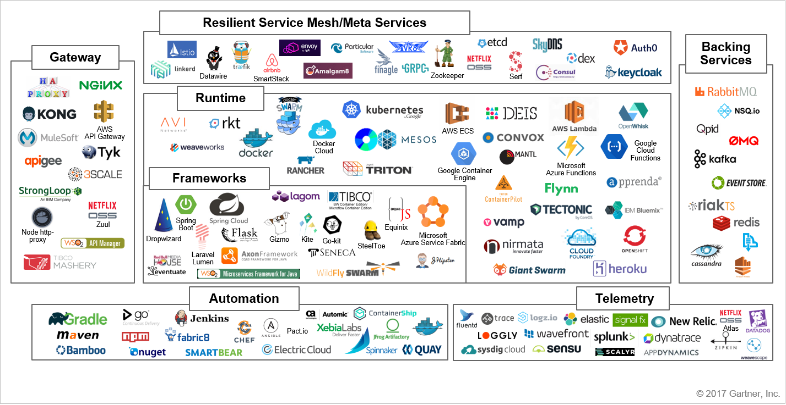

# [MSA 개념 정립하기] MSA의 표준 아키텍처

 

출처 - [나라의 IT 잡아먹기 / [MSA 개념 정립하기] MSA의 표준 아키텍처](https://waspro.tistory.com/431?category=857035)

 

본 포스팅에서는 MSA를 구성하는 표준 아키텍처에 대해 살펴보도록 하겠습니다.

Microservice는 SOA(Service Oriented Architecture)의 경량화 버전으로 (Service: 특정 기능의 집합, service의 범위 정의가 중요) 모놀리틱 아키텍처(monolithic architecture)를 쪼개서 독립적으로 구분합니다.

Microservice는 독립적으로 디플로이/확장될 수 있는 서비스들을 조합하여 large 어플리케이션을 구성하는 아키텍처 패턴입니다.

일반적으로 Service Discovery, API Gateway, Orchestration, Choreography, Context Boundary등의 서비스들의 조합으로 이루어져있습니다.

Netflix, Twitter, Amazon, Nike 등의 회사에서 채택한 아키텍처로 소개되면서 '14년 초반부터 현재까지 주목 받고 있습니다. 아키텍처 관련 기술 표준은 없으며 SW벤더들이 기존 제품군(SOA, PaaS, ...)을 Microservices를 지원하기 위한 플랫폼으로서 rebrand하는 추세로 전환되고 있습니다.

 

>  **MSA 아키텍처 표준 구성 요소**  

 

**[그림 1] MSA를 구성하는 기본 구성 요소**

 

위 이미지는 일반적인 MSA 아키텍처 패턴의 흐름입니다. 표준이라고 정의 할 수 있는 패턴이 없기에 개인적으로 가장 많이 사용하고 대중적인 요소만 담은 아키텍처 패턴입니다.

유저들은 모바일 또는 PC등으로 인터넷에 접속합니다.

1. **API Gateway는 API를 통해 접근하는 모든 서비스들에게 Policy Management, Mediation, Aggregation, Consumer Identify Provider를 제공합니다.**
   일반적으로는 사용자가 접근하면 인증을 처리하는 역할 및 원하는 서비스로 바인딩하는 역할을 수행합니다.
   API Gateway를 External Gateway로 부르기도 합니다.

2. **Service Mesh는 MSA의 핵심이라고 할 수 있습니다.**
   Service Discovery의 동적 서비스 확장, Service Router의 로그밸런싱, Configuration의 설정 통합관리 등은 API의 유입을 통제하는 중요한 기능이라 할 수 있습니다.
   비즈니스 로직이 수행되며 이는 Database or Message Broker 등의 Backing Service로 연결됩니다.
   Service Mesh를 Internal Gateway라고 부르기도 합니다.

3. **그밖에 실제 마이크로 서비스가 적대되는 Container와 Monitoring / Logging / Tracing등의 모듈로 구성됩니다.**

 

**비즈니스 도메인**

비즈니스 도메인의 분석은 애플리케이션을 개발할때 가장 중요한 부분 중 하나입니다.
소프트웨어 시스템과 관련있는 주요 엔티티를 식별하고, 모든 엔티티는 비즈니스를 개념적으로 바라보는 관점에서 찾아야 하며, 이것을 비즈니스 모델이라고 합니다.

아래 이미지는 대표 Microservice 기반 기술입니다.

 

