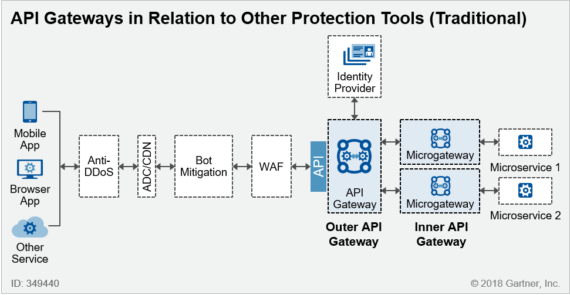

# [MSA 개념 정립하기] API Gateway

 

출처 - [나라의 IT 잡아먹기 / [MSA 개념 정립하기] API Gateway](https://waspro.tistory.com/433?category=857035)

 

본 포스팅에서는 MSA의 External LoadBalancer인 API Gateway에 대해 알아보겠습니다.

MSA에서 API Gateway는 Public으로 Client에게 공개되어야 하는 실제 유입점이라고 할 수 있습니다.

클라이언트는 시스템 내, 외부 연계 등 다양한 형태로 접근할 수 있으며, 다양한 종류의 API를 호출할 수 있습니다.

이때 API Gateway는 Access Control, API Contract, Rate Limit등의 설정, 분석, 개발환경을 제공하는 역할을 수행합니다.

대표적인 제품으로

|             |     오픈소스 직접 구현     |           상용 솔루션 활용            |           Public Cloud 서비스            |
| :---------: | :------------------------: | :-----------------------------------: | :--------------------------------------: |
| API Gateway | Kong Apigee 3scale | Kong Apigee 3scale (Ent 버전) | AWS API Gateway Azure API Management |

등이 있습니다.

OSS를 사용할 경우 기술 자유도와 자산화를 할 수 있다는 장점이 있지만, MSA를 구현하기 위한 노력과 투자가 필요하며, CSP의 경우 MSA를 구현하기 쉽고 인프라를 CSP에서 관리 해 줄수 있다는 차이가 있습니다.
상용 솔루션은 그 중간 정도로 개발 가이드와 컨설팅이 제공되어 MSA를 구현해 나갈 수 있습니다.

지금부터 살펴 볼 다양한 API Gateway의 활용 방안을 알아보고, 다양한 아키텍처 패턴을 도출해 보도록 하겠습니다.

 

**[API Gateway의 정의]**

API 게이트웨이 및 마이크로 게이트웨이는 API 및 마이크로서비스 아키텍처에서 핵심적인 역할을 담당합니다.

접근 제어 및 트래픽을 모니터링하고 보안 기능을 제공하여 전체적인 마이크로 서비스를 보호하는 그 유입점을 담당하기 때문이죠.

초기 API Gateway는 모놀로씩 API Gateway에 의존하여 진행되었지만, 다수의 공급 업체가 분산환경과 탄력적인 다중 인스턴스 아키텍처를 지원하기 위해 대기 시간이 짧고 크기가 작은 마이크로게이트를 도입하기 시작했습니다.
IAM 등의 보안 기능의 경우 네트워크의 다른 계층에서 담당하여 마이크로게이트웨이의 기능을 더 줄임으로써 확장 기능을 강조하여 빠르게 확장할 수 있도록 변경하였습니다.

 

**[API Gateway와 다양한 Security System]**

API 게이트웨이 및 마이크로게이트는 전체 Secutiry 아키텍처의 일부입니다.
아래 이미지는 API 게이트웨이와 다른 Security 애플리케이션 아키텍처 구성 요소 간의 구성도입니다.
API 게이트웨이 또는 마이크로게이트웨이 이외에도 적절한 보호 장치에는 일반적으로 별도의 IAM 시스템이 포함됩니다.
또한 DDoS 보호, 웹 응용 프로그램 방화벽(WAF), 응용 프로그램 Delivery Controller(ADC), CDN(Content Delivery Network) 등을 포함 할 수 있습니다.

 

[그림 1] API 게이트웨이와 기타 보호 도구 간의 관계 예 (전통적) @ 2018 Gartner, Inc.

 

API 게이트웨이는 런타임 API 조정의 중요한 계층을 제공합니다.

마이크로서비스 아키텍처에서 External API Gateway가 IAM 등의 보안기능에 초점이 맞추어져 있다면, 마이크로 게이트웨이 또는 Inner 게이트웨이의 주된 역할은 마이크로서비스 간 통신을 관리하는 것입니다.

Microgateway는 가벼운 분산 API 프록시로서 서비스 엔드 포인트를 결정합니다.
주요 microgateway 기능에는 소스 제어하에 관리되는 last-mile 인증 및 권한 부여, 트래픽 관리, 모니터링 및 스크립팅 가능한 정책 구성이 포함됩니다.

 

**[API Gaterway의 사용 사례 및 요구 사항]**

API 게이트웨이 사용 사례와 요구 사항은 매우 다양합니다.
다양한 요구가 계속 확대되고 있으며 일반적으로 다음 중 하나에 대한 지원을 요구할 수 있습니다.

① External and internal APIs

② Traditional APIs

③ Miniservices

④ Microservices

⑤ Web or mobile application use cases

⑥ Service-to-service use cases

⑦ Internet of Things (IoT) use cases

 

**[광범위한 엔터프라이즈 Security 아키텍처에서 API 게이트웨이의 역할]**

완전한 엔터프라이즈 웹 애플리케이션 아키텍처는 ADC, WAF, API 게이트웨이, HTTP 서버, 애플리케이션 서버, 데이터베이스 서버 및 IAM 시스템을 포함한 하나 이상의 애플리케이션 계층 구성 요소의 조합입니다.
클라우드 호스팅 또는 인터넷 연결 응용 프로그램의 경우 CDN이 자주 사용됩니다.
CDN 공급자는 자체적으로 전세계에 분산되어있는 많은 데이터 센터 또는 존재하는 지점,로드 밸런서, 콘텐츠 캐시 및 콘텐츠 가속기를 모아 놓은 것입니다.

 

[그림 2] API 게이트웨이와 기타 보호 도구 간의 관계 (CDN 중심) @ 2018 Gartner, Inc.

 

ADC 또는 WAF와 마찬가지로 API 게이트웨이도 특정 보안 기능의 역할을 수행 할 수있는 리버스 프록시입니다.
때로는 API 게이트웨이가 보안 제어를 위한 가장 효과적인 방법인지 여부는 의문이기는 하지만, API 게이트웨이는 API 통신 및 트래픽 관리를 용이하게 구현할 수 있습니다.
Amazon Web Services (AWS) 및 Microsoft Azure에서 각각의 API 게이트웨이 및 WAF 오퍼링을 통해 보여 주듯이 클라우드 서비스 공급자 (CSP)는 종종 해당 생태계 내에서보다 강력하거나 단순한 통합을 제공합니다.
그러나 클라우드 서비스에서는 대기 시간이 여전히 중요한 요소 일 수 있습니다.

Open Authorization (OAuth) 및 OpenID Connect (OIDC)는 최신 API를 보호하는데 사용되는 IAM 표준입니다.
일부 조직에는 SAML (Security Assertion Markup Language)으로 보호되는 기존 서비스도 있습니다.
특정 OAuth / OIDC IAM 요구 사항은 유스케이스에 따라 크게 다릅니다.
API는 네이티브 모바일 앱에 의해 호출되거나 서비스 - 서비스 상호 작용에 사용되는 웹 브라우저를 통해 액세스 할 수 있습니다.
액세스 토큰은 외부 IAM 시스템의 ID 공급자에 의해 생성 될 수 있습니다.
그런 다음 토큰을 외부 게이트웨이로 전달하여 액세스를 제어하고 세분화 된 권한 부여에 사용되는 특성을 전달할 수 있습니다.

 

**[다양한 API Gateway 비교]**

API 게이트웨이와 마이크로 게이트 솔루션을 제공하는 업체가 많이 있습니다.

지금부터는 각 제품 별 상세한 API Gateway 분석을 진행하도록 하겠습니다.

API Gateway를 제공하는 업체는

Amazon API Gateway

Apigee Edge, Apigee Edge Microgateway

Axway API Gateway

CA Technologies API Gateway, CA Technologies Microgateway

IBM DataPower Gateway, IBM API Connect Microgateway

Kong Enterprise Edition

Microsoft Azure API Management

MuleSoft Mule

NGINX Plus R15

Red Hat 3scale APIcast API gateway

Software AG webMethods API Gateway

TIBCO Software API Exchange Gateway, TIBCO Mashery Enterprise, TIBCO Project Mashling

WSO2 API Manager/WSO2 API Cloud, WSO2 API Microgateway

등이 있습니다.

하단의 이미지는 각 API Gateway별로 Protection 기능을 얼마나 포함하고 있는지에 대한 평가표입니다.

 

[그림 3] API 게이트웨이 비교 @ 2018 Gartner, Inc.

 

---

 

**① Amazon API 게이트웨이**

Amazon API Gateway는 주로 Lambda, AWS's fPaaS를 비롯한 다양한 AWS 서비스를 통합하고 활용하는데 사용됩니다. ID 및 액세스 관리 기능은 여러 AWS 제품과의 통합을 통해 지원됩니다.

㉠ OAuth 인증 서버 지원, OpenID 제공 업체 지원 및 SAML 서비스 제공 업체 지원을 위한 Amazon Cognito 지원

㉡ SAML ID 제공자 지원을 위한 AWS IAM 지원

㉢ 람다 인증 기관 지원

 

보안 기능은 여러 AWS 제품에 분산되어 있습니다. 모든 보안 기능을 구현하려면 다음을 포함하여 다른 AWS 서비스를 사용해야 합니다.

㉠ AWS WAF : 익스플로잇 완화

㉡ Amazon CloudFront : 필드 레벨 암호화는 API 메시지 데이터를 암호화

㉢ Amazon GuardDuty : 행동 분석 및 위협 탐지

 

Amazon API 게이트웨이의 강점 및 약점은 다음과 같습니다.

강점

㉠ Amazon API 게이트웨이는 AWS에서 제공하는 서비스를 배포하는 AWS 고객에게 유용합니다.

㉡ Amazon API 게이트웨이는 프로그래밍 가능하고 자동화가 가능하여 DevSecOps 원칙을 적용하는 조직에 적합합니다. 물론 게이트웨이 구성을 자동화하고 다른 AWS 서비스와 효과적으로 통합하려면 이러한 조직에 필요한 엔지니어링 리소스가 있어야 합니다.

㉢ AWS와 Amazon API 게이트웨이가 활용하는 다른 서비스를 이미 사용하고있는 조직에서는 친숙한 서비스를 이용할 수 있습니다.

Amazon API 게이트웨이는 Red Hat 3scale API Management와 통합되어 Amazon 및 Red Hat 게이트웨이에서 정책 집행 및 모니터링을 수행합니다.

 

약점

㉠ Amazon API 게이트웨이는 클라우드 서비스로만 사용할 수 있습니다. 따라서 사용자와 API가 On-premise 인 환경에서 사용할 수 없습니다.

㉡ 조직에서 Amazon API 게이트웨이가 동작하는 AWS 환경에 익숙하지 않은 경우 여러 구성 인터페이스를 사용하는 것이 어려울 수 있습니다.

㉢ AWS는 기본적으로 OAuth를 지원하지 않습니다. OAuth는 Cognito를 사용하여 구성 할 수 있지만 이 프로세스는 IaaS API 액세스를 위해 기본적으로 OAuth를 지원하는 서비스 (IaaS) 플랫폼으로 다른 인프라와 관련하여 복잡성을 필요로 합니다.

㉣ Amazon API 게이트웨이의 기본 보안은 특정 트래픽 관리 기능으로 제한됩니다. 다른 보안 기능을 사용하려면 AWS 서비스 또는 외부 기능을 사용해야 합니다.

㉤ AWS는 현재 고유 또는 통합을 통해 특정 Bot mitigation 기능을 제공하지 않습니다. 그러나 Amazon GuardDuty는 행동 분석을 통해 일부 Bot 활동 및 악용 사례를 발견 할 수 있습니다.

 

---

 

**② 프티 에지 (Apigee Edge)와 프티 에지 마이크로 게이트 웨이 (Apgee Edge Microgateway)**

Google은 2016년 Apigee를 인수했습니다. Apigee Edge API 관리 플랫폼에는 API 런타임 / 게이트웨이와 개발자 포털이 포함되어 있습니다.
선택적으로 수익 창출 및 클라우드 전용 분석 서비스인 Apigee Sense가 포함됩니다. Apigee Edge Microgateway는 Apigee Edge와 번들로 제공됩니다.

Apigee Edge 플랫폼의 API 게이트웨이는 광범위한 IAM 지원을 제공합니다.

CI/CD (Continuous Integration / Continuous Deployment) 파이프 라인에서의 자동화 지원에 초점을 맞춘 Apigee의 확장성에 대한 집중은 DevSecOps 프랙티스를 사용하는 조직에 유용합니다.

Bot mitigation 및 행동 분석은 Apigee Sense와 별도로 제공됩니다. Apigee Edge의 데이터 토큰화 기능은 필요한 경우 Google Cloud Data Loss Prevention (DLP) API를 통해 제공됩니다.

 

Apigee Edge의 강점 및 약점은 다음과 같습니다.

강점

㉠ Apigee 관리 클라우드 서비스 배포를 통해 조직은 선택한 여러 지리적 클라우드 지역에서 API 런타임 구성 요소를 사용할 수 있습니다.

㉡ Apigee Edge 플랫폼의 API 게이트웨이는 IAM 영역에서 최고 점수를 제공하는 제품 중 하나입니다. 보안 토큰 서비스 (STS)는 특히 융통성이 있으며 SOAP-REST 및 REST-SOAP 변환의 자동화에 대한 지원에 강점이 있습니다. Apigee Edge는 보안 영역에서 가장 높은 점수를 받는 솔루션 중 하나입니다. 기본적으로 또는 Apigee Sense와 함께 모든 기능을 제공합니다.

㉢ Apigee는 컨테이너 배포를 포함하여 소프트웨어 및 클라우드 서비스 옵션을 모두 제공합니다.

 

약점

㉠ Bot mitigation 및 행동 분석을 위해서는 추가 Apigee Sense 라이센스가 필요합니다.

㉡ 사설 클라우드 구축을 위한 Apigee Edge에는 Apigee Sense를 추가 할 수 없습니다.

㉢ Apigee Edge Microgateway는 기본적으로 데이터 보안 기능을 제공하지 않습니다. 민감한 데이터, 데이터 마스킹, 토큰 화 및 암호화를 사용하여 메시지를 차단하려면 모두 사용자 지정 코드 또는 플러그인이 필요합니다.

 

---

 

**③ Axway API 게이트웨이**

Axway는 2012년에 Vordel을 인수 한 설립 된 API 게이트웨이 공급 업체입니다. Axway API Gateway는 기본 런타임 게이트웨이입니다.

Axway API Manager는 API 게이트웨이에 셀프 서비스 API 등록, 소비 및 관리 기능을 제공합니다.
2017년에 소개된 새로운 Axway AMPLIFY API Central Service는 조직이 API의 중앙 카탈로그를 관리하고 (NGINX를 기반으로 한) 마이크로 게이트를 배포 할 수있는 public 클라우드 서비스입니다.

Axway API 게이트웨이는 컨테이너화되거나 클라우드 서비스로 사용할 수 있는 소프트웨어로 제공되지만 마이크로 게이트 배포 아키텍처 용으로 설계되지 않았습니다.

Axway는 사용자 정의 가능한 XML 및 JavaScript Object Notation (JSON) 검증을 통해 컨텐츠 검사 및 위협 보호 기능을 제공합니다.
Axway는 임베디드 ModSecurity 모듈을 통해 고급 기능을 제공합니다.
또한 이 제품은 안티 바이러스 솔루션과의 통합을 지원하여 API 트래픽의 맬웨어 분석을 수행합니다.
또한 게이트웨이는 OPSEC (Open Platform for Security) 프레임 워크를 통해 Check Point Software Technologies의 방화벽과 통합 될 수 있습니다.

 

Axway API 게이트웨이의 강점 및 약점은 다음과 같습니다.

강점

㉠ Axway는 레거시 IAM 환경을 지원해야하는 대기업 조직을 대상으로합니다.

㉡ Axway는 다양한 제 3자 SSO 쿠키를 지원합니다.

㉢ Axway는 Secure FTP (SFTP) 파일 전송과 관련된 B2B 사용 사례에서 강력합니다.

 

약점

㉠ Axway API Gateway는 마이크로서비스 간의 상호 작용을 관리하는데 적합하지 않습니다.

㉡ Axway는 모든 기본 OAuth 및 OIDC 기능을 제공하지만 Microsoft Azure Active Directory Graph API와 같은 최신 데이터 저장소 형식 및 일부 최신 확장 기능에 대한 지원이 부족합니다.

㉢ Axway는 DDoS 보호, Bot mitigation 또는 행동 분석을 제공하지 않습니다.

 

---

 

**④ CA Technologies API 게이트웨이 및 Microgateway**

CA Technologies는 2013 년에 Layer7을 인수했으며 API 관리 및 생성 자동화 도구에 계속 투자해 왔습니다.
CA API 게이트웨이와 CA Microgateway는 CA Mobile API 게이트웨이, CA API 개발자 포털 및 CA API 관리 SaaS를 포함하는보다 큰 제품군의 일부입니다.
CA Microgateway의 버전 1.0은 2017 년 9 월에 출시되었습니다.
CA API 게이트웨이는 조직에서 설치할 수 있는 소프트웨어 또는 클라우드 서비스로 제공되며 두 게이트웨이는 Docker 컨테이너로 사용할 수 있습니다.

CA는 API 게이트웨이와 마이크로 게이트 모두에서 기본적으로 완전한 보안 기능을 제공합니다.
트래픽 관리, 컨텐츠 검사 및 위협 보호 및 데이터 보안 분야에서는 게이트웨이와 마이크로 게이트 사이에 거의 완벽한 기능 패리티가 있으며 데이터 암호화는 예외입니다.
CA의 혈통에 따라 제품의 악용 완화도 광범위합니다.
두 제품 모두 ICAP (Internet Content Adaptation Protocol) 지원을 통해 수많은 안티 바이러스 솔루션과 통합 될 수 있으며 현재 지원되는 벤더 통합에는 McAfee, Sophos 및 Symantec이 포함됩니다.
또한 CA는 FIPS (Federal Information Processing Standard) 140-2를 비롯한 광범위한 보안 인증 목록을 보유하고있어 규정 준수 및 규제 요구 사항을 충족하는 제품을 원하는 조직에 호소력을 높일 수 있습니다.

 

CA Technologies API 게이트웨이의 강점 및 약점은 다음과 같습니다.

강점

㉠ CA API 게이트웨이는 IAM 분야에서 최고 점수를 제공하는 제품 중 하나입니다. OAuth와 OIDC에 대한 보다 완전한 지원을 제공합니다. 예를 들어, 대부분의 다른 게이트웨이 제품보다 더 많은 최신 OAuth 확장을 지원합니다. 이러한 확장은 액세스 자격 증명 손상과 같은 위협으로부터 API를 보호하고 운영 프로세스 간소화에 중요 할 수 있습니다. CA API 게이트웨이의 STS는 대부분의 다른 STS보다 많은 토큰 형식도 지원합니다.

㉡ CA API 게이트웨이는 특히 비 HTTP 통신 프로토콜을 지원합니다.

㉢ CA API Gateway는 보안 분야에서 가장 높은 점수를 얻은 솔루션 중 하나입니다. DDoS 보호를 제외하고 기본적으로 모든 기능을 제공합니다.

㉣ CA API Gateway는 고급 악용 완화 및 동작 분석 기능을 제공하므로 대부분의 API 게이트웨이 경쟁 업체와 차별화됩니다. 이 기술은 때때로 "XML 방화벽" 또는 "API 방화벽"으로 브랜드화됩니다. 사용자 정의 위협 보호 규칙 또는 "단언"을 정의하여 API 공격을 탐지하고 차단하는 기능을 제공합니다.

 

약점

㉠ CA Microgateway는 대규모 배치에서 아직 입증되지 않았습니다.

㉡ CA API 게이트웨이는 Microsoft Azure Active Directory Graph API 및 GraphQL과 같은 일부 최신 데이터 액세스 메커니즘을 지원하지 않습니다.

㉢ CA는 광범위한 DoS 보호 기능을 제공하지만 DDoS 보호는 기본적으로 또는 다른 서비스와의 통합을 통해 제공되지 않습니다.

 

---

 

**⑤ IBM DataPower Gateway 및 API Connect Microgateway**

IBM은 2015 년에 StrongLoop 마이크로 게이트를 인수했습니다.
IBM DataPower Gateway 및 IBM API Connect Microgateway는 별도로 제공되거나 IBM API Connect (전체 API 라이프 사이클 관리)의 일부로 제공됩니다.
IBM API Connect Microgateway는 Node.js를 사용하여 빌드되므로 노드 모듈을 쉽게 통합 할 수 있습니다.
특히 SAML 및 OIDC 요구 사항을 지원하기 위해 마이크로 게이트의 일부로 사용할 수있는 여러 모듈을 사용할 수 있습니다.
microgateway는 NGINX를 리버스 프록시로 사용하고 Redis는 다중 인스턴스 속도 제한을 사용합니다.
IBM은 오픈 소스 코드 저장소에 대한 기여를 통해 microgateway를 지원합니다.
두 게이트웨이의 코드 기반이 다르긴 하지만 UI가 통일됩니다.

IBM DataPower Gateway는 강력한 익스플로잇 완화 및 다양한 데이터 보안 기능을 기본적으로 제공합니다.
FIPS 140-2 인증 하드웨어 보안 모듈 (HSM)은 키 관리 옵션으로도 제공됩니다.
또한 IBM DataPower Gateway는 단일 메시지 및 다중 메시지 XML에 대한 광범위한 DoS 보호 기능을 제공합니다.
DataPower Gateway의 Bot mitigation는 Ping Identity (이전 Elastic Beam)와의 파트너쉽을 통해 제공됩니다.
DDoS 보호는 Cloudflare와의 제휴를 통해 제공됩니다.

 

IBM DataPower Gateway 및 API Connect Microgateway의 강점 및 약점은 다음과 같습니다.

강점

㉠ IBM DataPower Gateway는 IAM 영역에서 가장 높은 점수를 제공하는 제품 중 하나입니다. 예를 들어, STS는 특히 광범위한 토큰 유형과 독점적 인 세션 쿠키를 지원합니다.

㉡ IBM은 XSS (cross-site scripting) 및 SQL 주입에 대한 사전 구축 된 보호 기능과 함께 사용자 정의 가능한 JSON 및 XML 위협 보호 기능을 제공합니다.

㉢ IBM DataPower Gateway는 하드웨어, OS 및 API 런타임 처리 스택이 처음부터 보안에 중점을두고 구축 된 특수 목적의 물리적 네트워크 어플라이언스 폼 팩터를 제공하는 유일한 제품입니다.

 

약점

㉠ IBM API Connect Microgateway는 본 분석에서 측정 된 트래픽 관리, 컨텐츠 검사 및 위협 보호 또는 데이터 보안 기능 중 일부를 기본적으로 제공하지 않습니다. 일부 기능을 제공하려면 사용자 정의 JavaScript가 필요합니다.

 

---

 

**⑥ Kong 엔터프라이즈 에디션**

Kong (이전 Mashape)은 2010년에 설립되었으며 오픈 소스 API 및 마이크로 서비스 관리 솔루션을 제공합니다.
Kong은 NGINX를 기반으로 합니다.
Kong Enterprise Edition (EE)은 중대형 글로벌 조직을 대상으로 합니다.
여기에는 API 게이트웨이, Kong Dev Portal 및 Kong Vitals (분석 및 모니터링 용)가 포함됩니다.
다른 공급 업체와 달리 이러한 기능은 별도로 판매되지 않으며 독립적인 설치가 필요하지 않습니다.
단일 통합 코드 기반을 활용합니다.
Kong Community Edition (CE)은 무료 오픈 소스 소프트웨어이지만 Kong EE의 모든 기능을 포함하지는 않습니다.
예를 들어 Kong CE에는 웹 기반 관리 UI와 역할 기반 관리 기능이 없습니다.

Kong EE는 사용자 정의 또는 다른 기능과의 통합을 통해 대부분의 보안 기능을 기본적으로 충족시킵니다.
예외는 제공되지 않는 DDoS입니다.
이 공급 업체는 취약성 완화를 위해 WAF 공급 업체인 Wallarm와 API 보안 공급 업체 인 Ping Identity (이전 Elastic Beam)와 파트너 관계를 맺고 Bot Mitigation을 지원합니다.
데이터 보안을 위해서는 사용자 정의 플러그인을 사용해야합니다.

 

Kong Enterprise Edition의 강점 및 약점은 다음과 같습니다.

강점

㉠ Kong은 마이크로 서비스 사용 사례를 해결하기 위해 개발되었으며 DevSecOps 배포 시나리오를 지원합니다.

㉡ Kong은 API 게이트웨이 또는 마이크로 서비스 게이트웨이로 배포 할 수 있는 게이트웨이 용 단일 코드 기반을 가지고 있습니다.

㉢ Kong은 최신 OAuth / OIDC 확장의 대부분을 지원하며 OAuth / OIDC 흐름을 가장 광범위하게 지원합니다.

㉣ Kong은 컨텍스트 기반 인증을 지원하며 "적응형 액세스"라고도 합니다.

 

약점

㉠ Kong은 SAML, XML과 JSON 간 변환 또는 SOAP와 REST 간의 변환을 지원하지 않습니다. 따라서 전통적인 IAM 인프라가있는 조직에는 적합하지 않습니다.

㉡ Kong은 기본적으로 또는 통합을 통해 DDoS 보호를 제공하지 않습니다.

 

---

 

**⑦ Microsoft Azure API Management**

Microsoft는 2013 년에 Apiphany를 인수했습니다.
Microsoft Azure API Management에는 API 게이트웨이와 개발자 포털이 포함됩니다.
Azure 포털은 관리 인터페이스입니다.
Azure API 관리 기능은 다른 Azure 플랫폼 기능을 활용할 수 있습니다.
예를 들어 Azure Logic Apps를 사용하여 Azure API Management에 통합 할 수 있는 조정 정책을 관리 할 수 ​​있습니다.
모니터링 및 경고는 Azure 포털을 통해 관리 할 수도 있습니다.

다른 CSP와 마찬가지로 Microsoft Azure는 보안 기능을 여러 제품에 보급합니다.
모든 보호 기능을 얻으려면 Azure API 관리를 Azure DDoS 방지, WAF가 포함 된 Azure 응용 프로그램 게이트웨이 및 Azure AD (Azure Active Directory)와 같은 다른 Azure 서비스와 함께 사용해야 합니다.

또한 Microsoft는 고급 악용완화를 위해 WAF 공급 업체인 Barracuda Networks와 파트너 관계를 맺고 있습니다.
Azure Application Gateway는 가상 어플라이언스로 제공되는 다목적 ADC입니다.
WAF 기능 세트는 ModSecurity 및 OWASP (Open Web Application Security Project) ModSecurity 코어 규칙 세트 (CRS)를 기반으로합니다.
Microsoft는 또한 Azure 보안 기능과 고유한 Azure 기능 및 일부 타사 기능을 위한 중앙 콘솔을 통해 보안에 대한 전체론적 접근 방식을 취하고 있습니다.

 

Microsoft Azure API Management의 강점 및 약점은 다음과 같습니다.

강점

㉠ Microsoft Azure API Management의 프리미엄 계층은 전 세계 다른 Azure 데이터 센터에 게이트웨이를 배포하는 것을 지원합니다.

㉡ Microsoft Azure API Management는 대부분의 제품보다 컨텍스트 기반 인증에 대한 광범위한 지원을 제공합니다.

㉢ Microsoft Azure API Management는 사용하기 쉽습니다.

㉣ Microsoft는 Azure Application Gateway for WAF와의 통합을 통해 완화를 악용하는 고유한 접근 방식을 취합니다. 이러한 접근 방식은 구성 및 유지 관리가 쉬운 익스플로잇 완화를 원하는 조직에 적합 할 수 있습니다. 사용자 지정은 현재 개별 CRS 규칙을 전환하는 것으로 제한되어 있지만 사용자 지정 규칙 만들기는 향후 릴리스에서 추가 될 수 있습니다. 고급 공격 완화를 위해 Microsoft는 Barracuda Networks와 파트너 관계를 맺습니다.

 

약점

㉠ Microsoft Azure API Management는 소프트웨어가 아닌 클라우드 서비스로만 제공됩니다.

㉡ Microsoft Azure API 관리는 HTTP / HTTPS 프로토콜만 지원합니다.

㉢ Microsoft는 Azure API Management로 Bot mitigation 또는 행동 분석을 제공하지 않습니다.

㉣ 게이트웨이는 민감한 데이터 또는 마스크 데이터로 메시지를 차단할 수 있지만 데이터 토큰화 옵션을 포함하지 않습니다.

 

---

 

**⑧ MuleSoft Mule**

Salesforce는 2018년 5월 2일 MuleSoft를 인수했습니다.
MuleSoft는 다양한 배포 옵션을 지원합니다.
Mule은 Anypoint Platform의 런타임 엔진이며 API 게이트웨이로 배포할 수 있습니다.

2018년 2월 Anypoint Edge Security가 출시됨에 따라 MuleSoft는 가장 완벽한 보안 기능 세트 중 하나를 기본적으로 제공합니다.
Anypoint Edge Security는 표준 구독에 포함되어 있습니다.
MuleSoft는 Bot Mitigation 분야에서는 약점을 나타냅니다.
그러나 클라우드 서비스 플랫폼의 다른 클라이언트 및 위협 정보 피드에서 데이터를 집계하여 악의적인 Bot을 포함 할 수 있는 위협을 탐지하는 Anypoint 플랫폼을 사용하여 사내 행동 분석을 제공합니다.
Mule은 FIPS 140-2 호환 모드에서도 실행될 수 있습니다.

 

MuleSoft Mule의 강점 및 약점은 다음과 같습니다.

강점

㉠ MuleSoft는 비 HTTP / HTTPS 프로토콜에 대한 평균보다 강력한 지원을 제공합니다.

㉡ MuleSoft는 경쟁 업체 중 보안을 위한 가장 완벽한 기능 세트 중 하나를 제공합니다.

 

약점

㉠ MuleSoft는 OpenID 공급자 지원을 위해 제3자 솔루션에 의지합니다.

㉡ MuleSoft는 기본적으로 OAuth / OIDC 확장을 몇 가지만 지원합니다.

㉢ MuleSoft는 특정 Bot mitigation 기능이 없습니다. 그러나 Anypoint 플랫폼은 잠재적인 악의적인 Bot을 식별하는 데 유용한 동작 분석을 제공합니다.

 

---

 

**⑨ NGINX Plus**

NGINX는 ADC, HTTP 서버, WAF 및 API 마이크로 게이트와 같은 다양한 역할을 수행 할 수 있는 고성능 다목적 응용 프로그램 계층 소프트웨어입니다.
디자인의 모듈화로 인해 사용자 지정 코딩 또는 타사 플러그 인을 사용할 수 있습니다.
IBM, Kong 및 Red Hat 3scale을 비롯한 여러 비 보안 및 보안 업체가 NGINX를 다른 응용 프로그램 계층 솔루션으로 확장했습니다.

보안과 관련하여 NGINX Plus는 인증된 모듈 공급 업체와의 통합을 제공하여 보안 기능을 확장합니다.
여기에는 Bot mitigation를위한 Stealth Security 및 Signal Sciences와의 통합, 악용 완화를위한 Signal Science, Trustwave ModSecurity 및 Wallarm WAF와의 통합이 포함됩니다.

DDoS 보호는 Cedexis (현재 Citrix의 일부)를 통해 제공됩니다.

 

NGINX Plus의 강점 및 약점은 다음과 같습니다.

강점

㉠ NGINX는 핵심 기능을 매우 효율적으로 제공합니다.

㉡ NGINX는 여러 가지 비 HTTP / HTTPS 메시지 형식을 지원합니다.

 

약점

㉠ NGINX는 컨텍스트 기반 인증을 지원하지만 기본적으로 IAM 기능을 거의 제공하지 않습니다.

㉡ NGINX는 XML-JSON 변환 또는 SOAP-REST 변환을 제공하지 않습니다.

㉢ NGINX는 데이터 보안 분야에서 부족하지만, 기능은 커스텀 루아코드로 구축되거나 써드 파티 제품과의 통합을 통해 추가 될 수 있습니다.

㉣ 트래픽 관리를 제외하고 이 분석에서 측정 된 대부분의 보안 기능은 NGINX Plus의 기본 기능이 아닙니다. NGINX 또는 인증 된 모듈 공급 업체의 추가 라이센스가 필요합니다.

 

---

 

**⑩ Red Hat 3scale APIcast API 게이트웨이**

Red Hat은 2016년에 3scale을 인수했습니다. Red Hat 3scale API 관리 플랫폼은 두 가지 기능 영역으로 구성됩니다.

- APIcast API 게이트웨이 (정책 적용)

- API 관리자 (정책 결정 및 커뮤니티 관리)

각 제품은 온 프레미스 또는 클라우드에 배포할 수 있습니다.
Red Hat 3scale API 관리 플랫폼은 NGINX를 핵심 소프트웨어로 활용하고 중요한 추가 기능으로 그 기반을 강화합니다.
APIcast API 게이트웨이 구성 요소는 현재 오픈 소스입니다. 나중에 2018년에 나머지 솔루션을 오픈소스화 할 계획이 있습니다.

Red Hat은 컨테이너화 및 클라우드 서비스 옵션을 포함하여 다양한 최신 배포 토폴로지를 지원합니다.
예를 들어, API 게이트웨이는 서비스 메쉬의 일부로 사이드카 패턴 (마이크로서비스 컨테이너에 인접한 컨테이너에 배포 됨)으로 배치 될 수 있습니다.

Red Hat은 기본적으로 또는 다른 도구와의 통합을 통해 거의 모든 범위의 보안 기능을 제공합니다.
여기에는 악용 완화를 위한 NGINX WAF 모듈과 데이터 보안을 위한 Red Hat Fuse가 포함됩니다.
Red Hat Fuse는 메시지 데이터를 변환 할 수 있습니다. 이 기능은 데이터 마스킹 및 토큰화와 같은 데이터 보안 기능을 제공하는 데 사용할 수 있습니다.
XML 및 SOAP 지원은 Red Hat Fuse를 통해 제공됩니다. 또한 Ping Identity (이전 Elastic Beam)와 파트너 관계를 맺고 고급 악용 완화 및 Bot mitigation 기능을 제공합니다.

 

Red Hat 3scale APIcast API 게이트웨이의 강점 및 약점은 다음과 같습니다.

강점

㉠ Red Hat 3scale은 처음부터 microgateway 배치를 지원하도록 설계되었습니다. 따라서 API 게이트웨이와 microgateway 배포 시나리오 모두에 공통 코드 기반을 활용합니다.

㉡ Red Hat 3scale API 관리 플랫폼은 Amazon API 게이트웨이와 통합되어 Amazon 및 Red Hat 게이트웨이에서 강화 된 정책 적용 및 모니터링을 제공합니다.

㉢ Red Hat 3scale APIcast API 게이트웨이는 상대적으로 완전한 IAM 기능 세트를 제공합니다. 그러나 가장 최근의 OAuth 확장 및 일부 기존 프로토콜에 대한 지원이 부족합니다.

㉣ Red Hat 3scale APIcast API 게이트웨이는 기본적으로 또는 다른 도구와의 통합을 통해 거의 모든 보안 기능을 제공합니다.

 

약점

㉠ Red Hat 3scale APIcast API 게이트웨이는 ID 공급자로 사용될 때 컨텍스트 기반 인증을 지원하지 않습니다. 이는 타사 ID 공급자를 사용하는 Red Hat의 권장 사항과 일치합니다.

㉡ 내부 직원이 API에 액세스하는 것을 중재하려는 조직은 Red Hat 3scale APIcast API 게이트웨이 STS가 Kerberos를 지원하지 않는다는 점에 유의해야합니다.

㉢ Red Hat 3scale APIcast API 게이트웨이는 기본적으로 또는 다른 공급 업체와의 제휴를 통해 DDoS 보호를 제공하지 않습니다. 조직에서는 웹 API에 대한 DDoS 공격의 위험을 줄이기 위해 별도의 공급 업체를 선택해야 합니다.

 

---

 

**⑪ Software AG webMethods API 게이트웨이**

Software AG webMethods API Gateway는 다음을 포함하는 Software AG의 API 관리 플랫폼의 일부입니다.

- WebMethods API 포털

- CentraSite (API 및 기타 관련 서비스 및 자산을위한 레지스트리 및 저장소)

- WebMethods CloudStreams (API 소비를 모니터링하고 제어 함)

Software AG는 보안 영역이 제한되어 있습니다. 대부분의 기본 트래픽 관리 기능을 제공하지만 DDoS 보호 기능은 없습니다.
악용 완화에 유용할 수 있는 사용자 정의 필터, 규칙 및 동작을 생성 할 수있는 API 게이트웨이 런타임 내에 위협 방지 계층을 제공합니다.
게이트웨이는 또한 ICAP를 통해 안티 바이러스 솔루션과 통합 될 수 있습니다.
행동 분석, 데이터 토큰 화 및 데이터 암호화와 같은 추가 보안 기능은 webMethods Integration Server 제품을 통해 제공됩니다.

 

Software AG webMethods API 게이트웨이의 강점 및 약점은 다음과 같습니다.

강점

㉠ Software AG의 엔터프라이즈 서비스 버스 아키텍처는 광범위한 기존 인프라를 지원합니다 (STS는 Kerberos 티켓을 수용합니다).

㉡ Software AG의 webMethods Microservices Container 오퍼링을 사용하여 게이트웨이의 공간을 줄일 수 있습니다. Software AG는 2018 년에 추가적인 마이크로 게이트 구성 요소를 제공 할 계획입니다.

㉢ Software AG는 비싼 타사 서비스 사용을 최소화 할 수 있도록 API에 대한 소비 관리 기능을 제공합니다.

 

약점

㉠ webMethods API Gateway는 Microsoft Azure AD Graph API 및 GraphQL과 같은 일부 최신 데이터 액세스 메커니즘을 지원하지 않습니다.

㉡ Software AG webMethods API Gateway는 webMethods Integration Server의 사용과 일부 보안 사용 사례에 대한 추가 사용자 정의가 필요합니다.

 

---

 

**⑫ TIBCO API 교환 게이트웨이, TIBCO Mashery Enterprise 및 TIBCO Project Mashling**

TIBCO Software는 2015년에 Mashery를 인수했습니다.
TIBCO는 Mashery 클라우드 서비스 게이트웨이를 API 트래픽 관리자로 지칭합니다.
TIBCO는 Private 게이트웨이 배포를 위해 Mashery Local을 추가하여 Mashery 클라우드 서비스를 확장했습니다.
Mashery Local의 게이트웨이에는 TIBCO의 오픈 소스 microgateway인 Mashling에 대한 지원 라이센스가 함께 제공됩니다.
TIBCO는 온-프레미스 전용 또는 추가 보안 기능이 필요한 사용 사례에 대해 API Exchange Gateway를 계속 제공합니다.
TIBCO Mashery 개발자 포털은 Mashery 및 API Exchange Gateway와 함께 작동합니다.

TIBCO의 보안 기능은 API Exchange Gateway에서 가장 강력합니다.
API Exchange Gateway에는 DDoS 보호, Bot mitigation, 동작 분석 및 데이터 토큰 화가 없지만 다른 보안 기준을 충족합니다.
XML 및 SQL 주입 완화를위한 사전 작성된 정책을 제공합니다. 또한 ICAP를 통한 안티 바이러스 솔루션과 통합됩니다.

Mashery Enterprise는 온-프레미스 API Exchange Gateway의 대부분의 보안 기능을 유지 관리하지만 클라우드 서비스로 DDoS 보호 기능을 추가합니다.
Mashling은 기본적으로 대부분의 보안 기능이 부족하지만 설계 상 확장 가능합니다.
고객은 보안 기능을 포함하여 기능을 확장하기 위해 Go 기반의 "레서피"를 만들 수 있습니다.
TIBCO는 모든 제품에서 Bot Mitigation 및 행동 분석이 부족하지만 기계 학습을 활용하는 TIBCO의 제품 로드맵은 이러한 문제를 해결할 수 있습니다.

 

TIBCO API 교환 게이트웨이, TIBCO Mashery Enterprise 및 TIBCO Project Mashling의 강점 및 약점은 다음과 같습니다.

강점

㉠ TIBCO Mashery API 제어 센터 고객은 클라우드 서비스 API 트래픽 관리자를 통해 트래픽을 라우팅할지 또는 온 프레미스 API Exchange 게이트웨이를 통해 트래픽을 라우팅할지 여부를 엔드 포인트별로 선택할 수 있습니다. 또한 조직의 georouting 및 edge-caching 요구 사항에 따라 API 트래픽을 라우팅해야하는 위치를 제어 할 수 있습니다.

㉡ TIBCO Project Mashling은 기본적으로 IoT 통신 프로토콜을 지원합니다. 예를 들어, 이는 기본적으로 제한된 응용 프로그램 프로토콜 (CoAP)을 지원하는 조사 된 두 개의 API 게이트웨이 중 하나였습니다.

 

약점

㉠ TIBCO Project Mashling은 Mashery를 기반으로 IAM 기능을 최소화했습니다. 이는 성능을 강조하기위한 디자인 선택입니다.

Mashery 관리 기능은 클라우드 서비스로만 제공되며 온-프레미스 솔루션을 찾는 조직에게는 문제가 될 수 있습니다.

㉡ TIBCO 게이트웨이 오퍼링 중 어느 것도 최근 OIDC 확장을 지원하지 않습니다.

㉢ TIBCO Project Mashling은 대부분의 보안 기능을 기본적으로 갖추고 있지 않습니다. 이는 주로 이벤트 기반 마이크로 서비스의 성능과 유연성을 강조하는 디자인 선택입니다. 그러나 사용자 정의 Go 코딩을 통해 보안 기능을 확장 할 수 있습니다.

 

---

 

**⑬ WSO2 API 관리자, WSO2 API 클라우드 및 WSO2 API Microgateway**

WSO2는 모든 범위의 API 게이트웨이 배포 옵션을 제공합니다.
WSO2 API Manager 및 WSO2 API Cloud는 동일한 코드 기반의 소프트웨어 및 클라우드 서비스 버전입니다.
MQTT 및 AMQP (Advanced Message Queuing Protocol) 지원과 같은 일부 기능은 WSO2 Enterprise Integrator (또는 WebSockets)를 통해 제공 될 수 있습니다.
WSO2는 WSO2 Identity Server를 통해 추가 IAM 기능을 제공합니다.
WSO2 Identity Server의 고급 키 관리 부분 만 필요한 게이트웨이 고객에게는 WSO2 API 관리자의 내장 키 관리자를 직접 대체 할 수있는 특별한 IAM 키 관리자 서버 프로필 설치가 있습니다.
WSO2의 새로운 Ballerina 프레임 워크를 활용하기 위해 다시 작성된 WSO2 API Manager 3.X는이 연구가 작성된대로 시험판에 있었습니다.

WSO2는 온-프레미스, 클라우드 서비스 및 마이크로 게이트 제공을 통해 보안 기능에 기능 패리티를 제공합니다.
DDoS 보호 및 특정 Bot mitigation 기능을 제외한 대부분의 보안 기능을 기본적으로 제공합니다.
그러나 API를 대상으로하는 악의적인 Bot 트래픽은 WSO2의 행동 기반 스트림 프로세서로 완화 될 수 있습니다.
WSO2는 허위 및 비정상 트래픽을 식별 할 수있는 기본 규칙과 패턴을 제공합니다.
규칙은 사용자 정의 할 수 있으며 관리 서비스는 이러한 사용자 지정을 지원할 수 있습니다.
토큰 화 및 암호화와 같은 일부 데이터 보안 기능에는 사용자 정의 플러그 인이 필요합니다.

 

WSO2 API 관리자, WSO2 API 클라우드 및 WSO2 API Microgateway의 강점 및 약점은 다음과 같습니다.

강점

㉠ 모든 WSO2 API 게이트웨이 오퍼링은 오픈 소스입니다.

㉡ WSO2 게이트웨이는 최근의 OAuth 및 OIDC 확장에 대한 지원이 평균보다 강합니다. 또한 강력한 STS 기능을 제공하며 로드맵에는 RESTful STS 기능이 있습니다.

㉢ WSO2는 모든 배포 유형에서 보안 기능 패리티를 제공합니다. 대부분의 경우 WSO2가 기본적으로 제공하지 않는 기능은 사용자 지정 코드 및 규칙을 통해 보완 될 수 있습니다.

 

약점

㉠ Microsoft Azure AD Graph API 및 GraphQL과 같은 최신 데이터 저장 형식을 지원하려면 사용자 지정이 필요합니다.

㉡ WSO2는 기본적으로 또는 다른 공급 업체와의 파트너십을 통해 DDoS 방지를 제공하지 않습니다. 조직에서는 웹 API에 대한 DDoS 공격의 위험을 줄이기 위해 별도의 공급 업체를 선택해야 합니다.

㉢ WSO2는 자사 제품에 대한 보안 인증이 없습니다. 그러나 규정 준수는 인증 된 게이트웨이를 보유하고 주어진 애플리케이션 아키텍처 내에서 게이트웨이를 올바르게 배치 및 구성하는 것에 대한 것보다 적습니다. 게이트웨이는 이식성 및 HIPAA 또는 PCI DSS 준수가 충족 되어야 하는 규제 환경에서 사용됩니다.

 

---

 

이렇게 다양한 API Gateway를 기준으로 솔루션을 선정하는 것은 어려운 일입니다.
기본적으로 솔루션 구축 비용에 대한 검토와 지원되지 않는 기능에 대한 면밀한 검토가 필요합니다.
기능상 부족한 부분에 대해서는 Filter 또는 별도의 리소스를 사용해야하기 때문에 이는 전체적인 업무패턴을 충분히 분석하고 결정할 필요가 있습니다.

API Gateway를 적용한 사례는 다양합니다.

① 카카오 광고 플랫폼 적용 사례

카카오 광고 플랫폼에서 Netflix Zuul를 선택하여 API Gateway를 구성하였습니다. 선택의 이유는 스프링 프레임워크를 사용하고 Netflix에서 제공해주는 OSS이기 때문이라고 합니다.

② 배달의 민족 적용 사례

배달의 민족에서 Netflix Zuul을 선택하여 API Gateway를 구성하였습니다. 선택의 이유는 카카오 광고 플랫폼 사례와 마찬가지로 Java 프로젝트이고, MSA를 가장 잘 하고 있는 서비스인 Netflix에서 제공하기 때문입니다.

③ 11번가 적용 사례

11번가 또한 Spring Cloud의 Netflix OSS 기반으로 구성하였습니다. Front end 구성을 위해 필요한 API가 API Gateway를 통해 호출되며, API Gateway를 통과한 API들은 Routing되어 각 서비스에 전달되는 구조입니다. Zuul을 선택하여 API Gateway가 구성되고, 추가적으로 필요한 기능은 Hystrix, Ribbon, Eureka등을 사용하여 구성하였습니다.

대부분 IT 기술력을 갖춘 회사에서는 완전한 OSS 제품을 사용하여 MSA를 구축 운영하고 있습니다.

다만 OSS의 소스를 직접 분석 설계하기 어려운 기관은 상용 또는 CSP를 사용하여 이를 커버해야 합니다.

지금까지 살펴본 MSA의 유입 지점에서 API를 사용하여 통신하는 모든 서비스들에게 Mediation 방안을 제공해주는 API Gateway에 대해 알아보았습니다.
엑세스 제어와 트래픽 관리 그리고 마이크로서비스간의 중재 및 API Aggregation을 제공하는 MSA의 핵심 요소입니다.

다양한 반영 패턴과 수많은 API Gateway OSS, CSP를 분석하고 적절한 제품을 선정하여 반영하는 일은 무엇보다 중요하다고 볼 수 있습니다.

기존 레가시 시스템을 전환할 경우 ESB/EAI를 통해 노출된 REST API관리, 데이터 가상화, MBaaS에 대한 관리, 마이크로서비스 관리 그리고 api 중심 아키텍처를 설계하는데 중요한 역할을 담당합니다.

다음 시간에는 MSA의 Inner LoadBalancer인 Service Mesh를 통한 Configuration, Router, Service Discovery 등에 대해 살펴보겠습니다.
