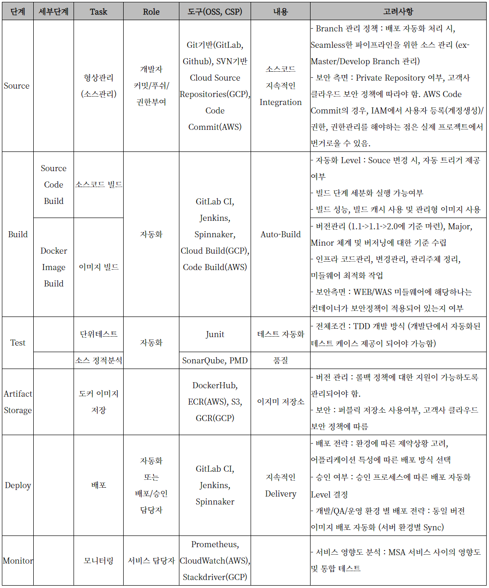

# [MSA 개념 정립하기] Automation (CI/CD)

 

출처 - [나라의 IT 잡아먹기 / [MSA 개념 정립하기] Automation (CI/CD)](https://waspro.tistory.com/447?category=857035)

 

본 포스팅에서는 CI/CD를 활용한 MSA Automation에 대해 알아보겠습니다.

CI/CD는 애플리케이션의 통합 및 테스트 단계에서부터 제공 및 배포에 이르는 애플리케이션의 라이프사이클 전체에 걸쳐 지속적인 자동화와 지속적인 모니터링을 제공합니다. 이러한 구축 사례는 “CI/CD 파이프라인”이라 부르며 개발 및 운영팀의 애자일 방식 협력을 통해 지원됩니다.

다만 마이크로서비스에서의 Continuous Integration/Continuous Delivery는 일반 모놀로딕 애플리케이션과 차별점이 있습니다. 바로 Docker가 그 과정에 포함되면서인데요. Docker Image를 활용한 자동 빌드/배포 환경을 구축하고 Cloud 환경에서 어떤게 이용되는지 지금부터 하나씩 차근차근 살펴보겠습니다.

>  **CI/CD 란?**  

Continuous Integration(이하 CI)는 개발자를 위한 자동화 프로세스인 지속적인 통합을 의미합니다. CI를 성공적으로 구현할 경우 애플리케이션에 대한 새로운 코드 변경 사항이 정기적으로 빌드 및 테스트되어 공유 리포지토리에 병합되므로 여러명의 개발자가 동시에 애플리케이션 개발과 관련된 코드 작업을 할 경우 서로 충돌할 수 있는 문제를 해결할 수 있습니다.

Continuous Delivery, Continuous Deployment(이하 CD)는 지속적인 서비스 제공 및 지속적인 배포를 의미하며 이 두 용어는 상호 교환적으로 사용됩니다. 두 가지 의미 모두 파이프라인의 추가 단계에 대한 자동화를 뜻하지만 때로는 얼마나 많은 자동화가 이루어지고 있는지를 설명하기 위해 별도로 사용되기도 합니다.

지속적인 제공은 개발자들이 애플리케이션에 적용한 변경 사항이 버그 테스트를 거쳐 리포지토리(예: GitHub 또는 컨테이너 레지스트리)에 자동으로 업로드되는 것을 뜻하며, 운영팀이 이 리포지토리에서 애플리케이션을 실시간 운영환경으로 배포할 수 있습니다. 이는 개발팀과 비즈니스팀 간의 가시성과 커뮤니케이션 부족 문제를 해결해 줍니다. 지속적인 제공은 최소한의 노력으로 새로운 코드를 배포하는 것을 목표로 합니다.

지속적인 배포(또 다른 의미의 “CD”: Continuous Deployment)는 개발자의 변경 사항을 리포지토리에서 고객이 사용 가능한 운영환경까지 자동으로 릴리스하는 것을 의미합니다. 이는 애플리케이션 제공 속도를 저해하는 수동 프로세스로 인한 운영팀의 프로세스 과부하 문제를 해결합니다. 지속적인 배포는 파이프라인의 다음 단계를 자동화함으로써 지속적인 제공이 가진 장점을 활용합니다.

CI/CD가 지속적 통합 및 지속적 제공의 구축 사례만을 지칭하는 것일 수도 있고, 지속적 통합, 지속적 제공, 지속적 배포라는 3 가지 구축 사례 모두를 의미하는 것일 수도 있습니다. 좀 더 복잡하게 설명하면 "지속적 제공"은 때로 지속적 배포의 과정까지 포함하는 방식으로 사용되기도 합니다.

결과적으로 CI/CD는 파이프라인으로 표현되는 실제 프로세스를 의미하고, 애플리케이션 개발에 지속적인 자동화 및 지속적인 모니터링을 추가하는 것을 의미합니다. 이 용어는 사례별로 CI/CD 파이프라인에 구현된 자동화 수준 정도에 따라 그 의미가 달라집니다. 대부분의 기업들은 CI를 먼저 추가한 다음 클라우드 네이티브 애플리케이션의 일부로서 배포 및 개발 자동화를 구현해 나갑니다.

실제 사례에서 지속적 배포는 개발자가 애플리케이션에 변경 사항을 작성한 후 몇 분 이내에 애플리케이션을 자동으로 실행할 수 있는 것을 의미합니다. (자동화된 테스트를 통과한 것으로 간주) 이를 통해 사용자 피드백을 지속적으로 수신하고 통합하는 일이 훨씬 수월해집니다. 이러한 모든 CI/CD 적용 사례는 애플리케이션 배포의 위험성을 줄여주므로 애플리케이션 변경 사항을 한 번에 모두 릴리스하지 않고 작은 조각으로 세분화하여 더욱 손쉽게 릴리스할 수 있습니다. 그러나 자동화된 테스트는 CI/CD 파이프라인의 여러 테스트 및 릴리스 단계를 수행할 수 있어야 하기 때문에 많은 선행 투자가 필요합니다.

 

 

>  **효과적인 CI/CD를 구축하기 위한 방법**  

① 제품 로드맵을 사용하여 팀 간의 종속성을 조정합니다. 2팀은 1팀이 의존성을 해결하기를 기다리는 동안 지속적인 진행을 보장해야 합니다.

② 속도, 코드 품질, 테스트 범위, 감지 시간, 해결 시간, 인프라/구성 및 결함 탈출 속도로 인한 문제와 같은 측정 항목을 선택합니다. 이는 전반적인 품질, 주기 시간 및 납기 일관성을 개선하는 데 필요한 피드백을 제공합니다.

③ 지속적인 개선 방법을 구현하여 작업 합리화 및 낭비를 줄이는 것이 중요합니다. 중간 목표를 세우고, 각 변화를 측정하고, 결과를 점검하고, 시정 조치를 취하고, 성공을 축하하는 것이 중요합니다.

④ 초기 팀이 수립 될 때까지 빠른 속도, 결함 감소, 빌드 및 테스트 자동화와 같은 명확한 효율성 목표를 달성 할 때까지 다른 팀에 민첩성 사용을 확대하도록 요구합니다.

 

[그림 1] Agile 및 DevOps를 채택하여 지속적인 제공 달성을 위한 솔루션 경로 @Gartner (2017년 11월)

 

CD (Continuous Delivery)는 소규모 사이클에서 소중한 소프트웨어를 계속 생산하면서 소프트웨어가 언제든지 안정적으로 출시 될 수 있도록 보장하는 소프트웨어 엔지니어링 방식입니다. 신뢰할 수 있는 위험성이 낮은 릴리스를 통해 CD는 사용자 피드백, 시장 변화 및 비즈니스 전략 변경을 통합하여 소프트웨어를 지속적으로 적용 할 수 있게 합니다. 이 접근 방식은 개발자가 코드를 작성하여 소프트웨어 제품의 실제 릴리스로 사용자에게 전달하는 지점에서 파이프 라인의 완전한 자동화를 촉진하기 위한 엔지니어링 원칙을 필요로 합니다.

개발자 기술을 향상시키고 CD 문화를 지원하기 위해 프로세스, 관행 및 아키텍처를 변경함으로써 새로운 기능을 개발해야합니다.

하단의 이미지는 CD를 달성하려는 기술 전문가를 위한 지침을 제공하기위한 것입니다.

 

[그림 2] 지속적인 전달을 위한 단계 @Gartner (2017년 11월)

 

고객의 요구와 고객 입력 또는 피드백의 양을 충족시키기 위해 각 애플리케이션의 변경 사항을 얼마나 신속하게 전달해야하는지에 따라 달라집니다. 모든 애플리케이션이 Amazon, Netflix, Slack 또는 Facebook이 매일 여러 번 완료하는 지속적인 배포 기능을 요구하는 것은 아닙니다. 모든 기업에서 지속적인 배포가 적절하지 않을 수 있지만 DevOps 관행은 CD를 달성하는 데 필수적입니다.

생산 준비 완료 코드를 지속적으로 제공 할 수 있는 경우에만 "변경"버튼을 누르기 만하면 변경 사항이 고객에게 가치를 제공 할 것이라는 확신을 가질 수 있습니다. 즉, 비즈니스가 요구할 때 솔루션을 배포 할 수 있도록 지속적으로 제공합니다.

>  **1 단계 : 애자일 방식의 개발**  

현재 성숙도 평가 : 지속적인 전달을 시작하기에 앞서, 어느 방향으로 가고 싶은지 결정하기 전에 자신이 어디에 있는지 알 필요가 있습니다.

기준 측정 기준 설정 : 목표를 성공적으로 달성했는지 어떻게 알 수 있습니까?

민첩한 방법론 배포 : 민첩한 방법론을 채택하기 위해 자신과 동료를 교육하고 훈련시키는 방법은 무엇입니까? 다음 단계로 나아갈만큼 능숙 해 졌을 때 어떻게 알 수 있습니까?

단계 1.1 : 현재 성숙 단계 평가

민첩한 개발 방법론을 채택한 조직은 향상된 품질, 신속한 가치 제공 또는 진화하는 사용자 요구 사항에 대한 대응 능력과 같은 하나 이상의 목표를 달성하기 위해 노력하고 있습니다. 대부분의 조직은 처음 두 단계 중 하나에 해당합니다.

 

[그림 3] 애플리케이션 조식 성숙도 @Gartner (2017년 11월)

 

응용 프로그램, 데이터 및 분석, 엔터프라이즈 아키텍처 및 기술 혁신, 인프라 및 운영, 프로그램 및 포트폴리오 관리, 소싱 및 공급 업체 관계,

보안 및 위험 등의 평가를 완료하면 도구에서 점수를 계산합니다. 결과는 애플리케이션 조직 성숙도 모델의 다섯 가지 구성 분야에서 애플리케이션 조직의 성숙도를 보여주는 스파이더 다이어그램으로 표시됩니다. 결과를 사용하여 조직의 성숙도를 높이려면 다음 단계를 결정하십시오.

1.2 단계 : 기본 측정 항목 설정

현재 프로세스를 제한하는 문제를 완전히 이해하지 못한다면 개선 할 수 없습니다. 팀은 민첩성을 높이고 CD를 사용할 수있는 DevOps 기술을 채택하기 위해 데이터 수집에 대한 과학적 접근 방식을 사용해야 합니다. 프로세스 변경이 긍정적이고 도움이되었을 때 팀은 분별 할 수 있어야합니다. 팀은 자신과 능력을 평가하고 변경 준비가되었는지 확인하고 향후 진행 상황을 측정 할 수있는 기준을 설정해야합니다.

모든 소프트웨어 개발 팀 구성원은 "소프트웨어 개발 프로젝트의 비즈니스 성과를 향상시키기 위해 개발자 및 프로세스 효율성 측정 방법을 사용하려면 어떻게해야합니까?"라는 질문에 대답 할 수 있어야합니다. 소프트웨어 개발 프로젝트를 측정하고 분석하는 방법을 이해하는 것은 기본적인 성숙 표준입니다. "민첩성, 개발 및 지속적인 개발을위한 올바른 측정법 선택" 은 모든 팀이 자신의 활동 성공을 평가하는 데 필요한 경험적 데이터를 수집하는 데 도움이되는 다양한 측정 및 측정을 제공합니다.

이 솔루션 경로를 탐색 할 때 정기적으로이 조사를 참조하여 새 메트릭이 필요한지 또는 기존 메트릭을 삭제해야하는지 확인해야합니다. 이 메트릭을 지속적 개선 프로세스의 일부로 사용하여 목표에 도달하지 못하는 문제를 파악하고 해결하십시오. 측정 항목은 진행 상황을 평가하는 데 도움이되는 경우에만 유용합니다.

1.3 단계 : 민첩한 방법론 배포

애자일은 커다란 초기 디자인을 피하고 배울 때 상황이 변할 것이라는 것을 인식합니다. 그렇다고해서 계획을 세울 필요가 없다는 의미는 아닙니다. 예를 들어 제품 백 로그 및 로드맵, 민첩한 팀, 도구 및 인프라 스트럭처가 필요합니다. Agile은 전통적인 변경 관리 프로세스로 인해 발생하는 낭비를 제거하여 고객이 실제로 필요한 것을 쉽게 적용하고 제공 할 수 있도록 지원합니다.

또한 애자일은 ROI를 시작하기 위해 몇 달 또는 몇 년을 기다리는 대신 매번 릴리즈 할 때마다 ROI를 캡처 할 수 있습니다.

Agile은 낭비를 제거하여 작업 소프트웨어 구축에 집중할 수 있도록 도와줍니다.

>  **2 단계 : 애자일 방식의 개발 성숙도 증가**  

2.1 단계 : 기민한 기술적 관행 및 인프라 구현

민첩한 기술 관행 및 프로세스는 품질 향상에 도움이되므로 전달 속도 및 예측 가능성에 긍정적인 영향을 미칩니다. 많은 사례들이 TDD (Test-Driven Development), CI, 수락 테스트 자동화 및 쌍 프로그래밍과 같은 익스트림 프로그래밍 (XP)의 일부로 보급되었습니다. 이를 통해 애자일 개발 팀은 각 스프린트가 끝날 때 "배송 가능한 제품"을 제공하는 데 필요한 속도, 일관성 및 품질을 달성 할 수있었습니다.

 

[그림 4] 스크럼이 충분하지 않음 - XP에서 스크럼 구현 @Gartner (2017년 11월)

 

CD를 구동하는 Agile Manifesto의 핵심 원칙 중 하나는 "기술적 탁월성에 대한 지속적인 관심과 우수한 디자인으로 민첩성이 향상됩니다." TDD는 애자일 개발 팀이 품질을 기반으로 속도와 일관성을 달성 할 수 있도록 지원합니다.

데이터베이스 시스템은 여러 응용 프로그램 릴리스에 대한 모든 변경 사항을 나타냅니다. 일시적인 응용 프로그램과 달리 이러한 데이터베이스는 포함 된 데이터가 유지되어야하기 때문에 단순히 제거하고 대체 할 수 없습니다. 애자일 팀은 데이터베이스 변경이 속도를 제한하는 제한 조건이된다는 것을 빠르게 알게됩니다.

지속적인 통합이란 기능 소프트웨어를 예정된 반복 가능하고 자동화 된 방식으로 통합, 구축, 테스트 및 제공하여 "정의 완료"가 충족되는지 확인하는 것입니다.

애자일 팀은 일반적으로 고객 및 사용자와 효과적으로 협업하여 올바른 솔루션을 구축하는 데 어려움을 겪고 있습니다. Behavior-driven development (BDD)는 최종 사용자, 제품 소유자, 비즈니스 분석가, 개발자 및 테스터 간의 공유 된 이해를 증진시킵니다. TDD 및 BDD와 같은 사례의 사용은 응용 프로그램 테스트에 대한 계층화 된 접근 방식의 두 부분 일뿐입니다.

2.2 단계 : 모놀리틱 레거시 애플리케이션

 

[그림 5] 모 놀리 식 레거시 애플리케이션 @Gartner (2017년 11월)

 

클라이언트는 종종 자동화 된 배포를 DevOps 및 CD와 혼동합니다. 응용 프로그램 릴리스 자동화는 오류가 발생하기 쉽고 속도가 빨라지지만 CD와 같지 않으며 최대 값을 제공하지 않습니다. CD는 변경 사항이 적용될 때 응용 프로그램이 올바르게 작동하도록 지속적인 통합과 지속적인 테스트가 필요합니다. 이를 위해 애플리케이션은 느슨하게 결합 된 아키텍처를 가져야합니다. 이를 통해 개별 모듈에서 작업하는 개발 팀은 해당 모듈을 변경, 컴파일 및 테스트하고 다른 모든 모듈과 함께 변경 사항을 응용 프로그램에 패키징 할 수 있습니다.

현대의 애플리케이션 시스템은 느슨하게 결합 된 서비스에 의존합니다. 최신 응용 프로그램은 서비스를 구현, 소비 및 통합합니다. 최신 응용 프로그램은 웹, 모바일 및 데스크톱 클라이언트를 비롯한 여러 클라이언트 유형을 지원해야하며 이러한 다중 채널 응용 프로그램은 API를 통해 노출되는 서비스를 사용하여 구현하는 것이 가장 좋습니다. 조직에서는 클라우드 컴퓨팅의 민첩성 이점을 활용하기 위해 클라우드로 애플리케이션을 전환하고 있습니다. 클라우드 컴퓨팅에는 서비스 기반 아키텍처가 필요합니다. 디지털 비즈니스는 또한 많은 조직이 새로운 비즈니스 채널을 찾고 웹 API를 사용하는 새로운 통합 모델을 지원하도록 유도하고 있습니다.

최신 응용 프로그램 아키텍처는 CD 기능에 직접적인 영향을줍니다. 이 아키텍처는 애플리케이션 설계, 개발 및 배포의 유연성에 직접적인 영향을줍니다.

- 독립적으로 개발, 테스트 및 배치 할 수있는 개별 구성 요소

- 공유 가능한 백엔드 로직을 API에 배치하여 재사용 가능한 구성 요소 생성

- 웹 API 및 마이크로 서비스 아키텍처를 제공하고 애플리케이션 통합, 클라우드, 모바일 및 IoT (Internet of Things)와 같은 시나리오를 지원하는 서비스 플랫폼

그림 7에서 볼 수 있듯이 프로세스, 아키텍처 및 플랫폼 인프라에 SOA 원칙을 수용하면 복잡성을 제어하고 변경 사항을 격리하며 유연성을 높이고 민첩성을 향상 시키며 비용을 절감 할 수 있습니다.

① Refactor Legacy Architecture

지난 수십 년 동안 개발 된 응용 프로그램은 단일 구조이므로 이러한 시스템을 마이크로서비스와 같은 보다 현대적인 아키텍처로 리팩터링하는 것은 쉽지 않습니다. 이러한 레거시 모놀리식 응용 프로그램을 리팩터링하는 반복적이고 점증적인 방식을 선택해야 합니다. 그 결과는 모듈식 아키텍처가 있는 응용 프로그램뿐 아니라 격리되어 테스트 및 릴리스 될 수있는 응용 프로그램 일뿐만 아니라 마이크로 서비스를 비롯한 최신 아키텍처 패러다임의 관문 역할을하는 개발 인프라입니다.

② Modernize Data Architecture

디지털 전환은 실시간 의사 결정, 프로세스 개선 및 자동화 된 작업을 지원할 수있는 포괄적인 최신 데이터 아키텍처를 필요로합니다. 현대적이고 민첩한 데이터 관리 및 분석 아키텍처는 실시간 데이터 파이프 라인, 셀프 서비스 데이터 준비 및 기계 학습을 지원해야합니다.

③ Modernize Web and Mobile Architecture

모바일 엔드포인트의 다양성 및 사용자 기대치 상승과 같은 현대적 추세는 기술 전문가가 새로운 요구 사항을 충족시키기 위해 웹 응용 프로그램을 채택하도록 유도합니다. 모바일 장치에서 웹 사이트 및 웹 응용 프로그램에 액세스하는 사용자가 증가함에 따라 개발 팀은 다중 채널 사용자 경험 (UX)을 제공해야합니다. 개발 팀은 이러한 변화에 발 맞추기 어려워 웹 및 모바일 개발의 변화에 ​​적응할 수있는 최신 웹 응용 프로그램을 만들 수있는 능력이 필요합니다. 좋은 플랫폼, 디자인 및 아키텍처는 팀과 코드가보다 민첩 해지기 위해 필수적입니다.

④ Adopt Service and API Architecture

최신 응용 프로그램 시스템은 느슨하게 결합 된 서비스에 의존하기 때문에 조직은 거의 모든 새로운 응용 프로그램 구현 또는 통합 프로젝트의 일부로 응용 프로그램 서비스를 만들고 소비합니다. 최신 응용 프로그램은 서비스를 구현, 소비 및 통합합니다. 이러한 응용 프로그램은 웹, 모바일 및 데스크톱 클라이언트를 포함하여 API를 통해 제공되는 서비스를 사용하여 가장 잘 구현되는 여러 클라이언트 유형을 지원해야합니다.

⑤ Architect for the Cloud

시스템이 더 많이 분산되고 응용 프로그램이 빠르게 클라우드로 이동하고 업계에서 다중 언어 프로그래밍 및 지속성을 채택하고 있습니다. 기술자에게는 복원력 있고 안정적인 시스템을 설계, 구현 및 운영하는 것이 더욱 어려워진다는 것을 의미합니다. 기업의 경우, 디지털 비즈니스 및 글로벌 비즈니스 운영을 지원하기위한 상시 서비스에 대한 기대는 신뢰할 수 있고 탄력적 인 시스템의 필요성을 더 크게 만듭니다.

 

[그림 6] 클라우드 네이티브 애플리케이션이 준비해야 할 사항 @Gartner (2017년 11월)

 

클라우드 환경에서 실행되도록 응용 프로그램을 설계하려면 실패를 포용하고 제한적이고 더 큰 자원에 비해 풍부하고 민첩한 자원을 활용하는 사고 방식이 필요합니다. 특히 애플리케이션 아키텍처는 확장에 비해 확장 할 수있는 리소스를 필요로합니다. 이러한 클라우드 기반 접근 방식은 클라우드 서비스 공급자가 거의 실시간으로 필요에 맞게 리소스를 확장 할 수있는 이점을 활용하는 데 중점을두고 있습니다.

>  **3 단계 : 인프라 자동화**  

DevOps는 개발 팀이 응용 프로그램 업데이트 빈도를 높일 수 있도록 도와줍니다. 개발, 인프라, 운영 및 보안 팀은 솔루션을 보다 신속하게 제공해야하는 부담이 점점 커지고 있습니다. 기업은 소프트웨어 제품 및 서비스를 더 빨리 시장에 출시하여 얻은 시장 점유율로 전환된다는 것을 알고 있습니다. 환경을 구축하고 구성하기 위해 며칠, 몇 주 또는 몇 달 동안 기다리는 것이 허용 될 수있는 시간은 오래 전에 사라졌습니다.

불행히도 민첩한 채택은 전통적으로 인프라 및 운영을 생략하여 전달 속도를 높일 수있는 능력에 영향을 미쳤습니다. 개발 팀은 개발 프로세스를 신속하게 진행할 수 있지만 더 빨리 제공 할 수있는 능력은 여전히 ​​제한적이라는 사실을 알고 있습니다. 인프라 및 자동화의 가용성은 CD에있어 매우 중요합니다. 아래 이미지와 같이 DevOps는 환경 프로비저닝, 구성, 배포 및 모니터링 작업을 포함하도록 민첩한 가치와 관행을 확장함으로써 이러한 장애를 제거합니다.

 

[그림 7] DevOps Continuum @Gartner (2017년 11월)

 

3.1 단계 인프라를 민첩하게 만듭니다.

자동화를 통해 SDLC 도구 지원을 제공하고 비 생산 환경을 자체 프로비저닝 할 수있는 기능은 여러 가지가 있습니다. 단순한 하드웨어 가상화를 통한 애플리케이션 개발 라이프 사이클 관리 (ADLM) 통합에서 사설 클라우드 및 공개 호스팅 SaaS 벤더 제품과 같은 솔루션을 완성하는데 이르기까지 다양합니다.

 

[그림 8] 인프라 및 운영을 위한 지속적인 통합 @Gartner (2017년 11월)

 

3.2 단계 DevOps 구현에 사용할 컨테이너 평가

개발 및 인프라 팀은 소프트웨어 솔루션을 보다 신속하게 제공해야한다는 압박을 받고 있습니다. 개발 및 인프라 팀이 새로운 아키텍처 및 DevOps 모델을 관리하고 지원하는데 도움이되는 툴링이 필요합니다. Docker와 같은 컨테이너를 사용하면 개발자팀이 보다 효과적이고 민첩한 방식으로 작업 할 수 있습니다.

 

[그림 9] Docker : 올바른 장소, 올바른 시간 @Gartner (2017년 11월)

 

- Docker에서 관리하는 컨테이너를 사용하여 응용 프로그램을 패키지화하고 제공하면 DevOps 관행을 채택하기 위해 고군분투하는 조직, 특히 지속적인 소프트웨어 배포가 어려움을 겪을 수 있습니다.

- 애플리케이션 서비스를 제공하는 모든 조직이 Gilt, Yelp 또는 Spotify의 웹 규모에서 작동하는 것은 아니지만 Docker는 사용자 정의 응용 프로그램을 제공하는 모든 조직의 개발, 구축 및 테스트에 즉각적인 가치를 제공합니다. Docker 및 컨테이너는 개발 및 테스트, CI, 운영배포 및 개인 플랫폼을 서비스(PaaS)로 구축하는데 사용되는 Docker를 중점적으로 다룹니다.

- 컨테이너는 어디에서나 실행할 수 있지만 운영 환경에서는 안정적으로 실행해야합니다. 많은 공용 클라우드 공급자는 Docker 컨테이너의 배포를 단순화하기 위해 컨테이너를 서비스 (CaaS)라고도하는 관리되는 컨테이너 서비스를 제공합니다.

개발자의 랩톱에서 운영 인프라로 컨테이너를 마이그레이션하고 다중 호스트 서버에 분산 된 다중 컨테이너 시스템으로 확장하는 것은 다소 어려운 과제입니다. Cloud Foundry Foundation 또는 Red Hat의 OpenShift와 같은 PaaS의 Kubernetes, Apache Mesos, Docker swarm 또는 컨테이너 오케스트레이션 기술과 같은 컨테이너 오케스트레이션 제품은 이러한 요구 사항을 충족 할 수 있습니다.

3.3 단계 클라우드 포옹

퍼블릭 클라우드 서비스가 성숙함에 따라 기업들은 계속해서 "클라우드 우선"전략 및 아키텍처에 적극적으로 투자하고 투자 할 것입니다. 모든 산업과 업계 종사자는 클라우드 배치 모델 (SaaS, IaaS (infrastructure as a service) 및 PaaS)의 모든 계층에서 클라우드 서비스를 채택하고 있습니다.

① 서비스로서의 어플리케이션 플랫폼 (aPaaS)

aPaaS는 런타임 클라우드 응용 프로그램 실행 환경이며 주로 사용자 정의 응용 프로그램 개발을 위해 개발자를 대상으로하는 통합 클라우드 서비스 집합입니다. aPaaS는 클라우드 응용 프로그램을 만들고 개발, 테스트 및 운영환경에 배포하기위한 표준화되고 반복적이며 자동화 된 프로세스를 통해 생산성을 높여 개발자에게 매력적입니다.

② 서비스로서의 인프라

클라우드 IaaS 제공자에게는 다양한 선택 사항이 있습니다. 조직의 기술 및 비즈니스 요구에 맞는 서비스를 선택하는 것이 중요합니다.

③ 클라우드 데이터베이스 서비스

대규모 데이터베이스 및 데이터를 클라우드로 이동하는데 드는 시간과 비용은 클라우드 채택 속도를 늦출 수있는 부담이되고 있습니다. 조직에서 사내 구축 형 시스템을 클라우드로 마이그레이션하기 시작하면 기술 전문가는 마이그레이션 할 데이터베이스, 도구가 무엇인지, 가장 성숙한 공급자와 구현 방법을 파악하는 방법을 알아야합니다.

3.4 단계 응용 프로그램 성능 모니터링

개발 팀은 생산뿐만 아니라 개발 및 테스트에서 애플리케이션을 모니터링하는 애플리케이션 성능 모니터링 (APM) 전략에 라이프 사이클 방식을 통합해야합니다. 개발 및 테스트 중에 성능 및 품질 목표를 달성하지 못한 응용 프로그램은 운영환경에서 "고정"될 수 없습니다. 높은 수준에서 모든 시스템의 모니터링은 아래와 같이 반복되는 5개의 단계와 때로는 동시 단계로 구성된 주기로 볼 수 있습니다.

 

[그림 10] 모니터링 프레임 워크 @Gartner (2017년 11월)

 

DevOps 중심의 린 (lean) 및 민첩한 실행 (최소 실행 가능 제품, 연속 전달 및 카나리아 롤아웃 등)의 채택이 늘어남에 따라 APM은 최신 릴리스의 효능에 대해 신속한 정량적 피드백을 제공해야합니다. 뿐만 아니라 이러한 빈번한 운영 업데이트와 관련된 성능 및 가용성의 변경 사항을 신속하게 분류 할 수 있도록 데이터를 즉시 사용할 수 있어야합니다.

>  **CI/CD Workflow**  

소프트웨어 시스템은 다양한 방법으로 통합되고 구축 될 수 있습니다. 최신 통합 개발 환경(IDE)은 코드베이스를 컴파일하고, 테스트를 실행하고, 검사 도구를 사용하여 코드 분석을 수행하고, 배포 단위를 생성하는 기능을 제공합니다. 유감스럽게도 IDE 내에서 수행되는 빌드는 종종 수동으로 집중적으로 발생하며 오류가 발생하여 일관성없는 결과를 초래합니다. "내 컴퓨터에서 작동합니다"라는 말은 다른 시스템에서 시스템을 빌드하고 실행하면 오류가 발생할 수 있다는 의미입니다.

CI는 정기적으로 기능 소프트웨어를 생산하기 위해 자동화되고 반복 가능한 구축 및 배포 프로세스를 활용하는 소프트웨어 개발 팀에서 사용하는 실습입니다. 효과적인 CI 실습은 소프트웨어 시스템 구축을 넘어서서 확장됩니다. 다른 라이프 사이클 활동도 자동화 할 수 있지만 CI는 팀의 소프트웨어 개발 프로세스를 개선하기위한 논리적 인 첫 번째 단계입니다.

 

[그림 11] CI 추가를 위한 청사진 @Gartner (2016년 1월)

 

㉠ 매일 코드를 소스 코드 저장소에 체크인하십시오.

㉡ 코드를 최신 버전 관리 시스템(VCS)에 위탁하십시오.

㉢ CI 오케스트레이션 엔진을 사용하여 개발자가 소스 코드를 만들고 수정할 때 구성 요소를 작성 및 테스트합니다.

㉣ CI 오케스트레이션 엔진을 응용 프로그램 개발 수명주기 관리 (ADLM) 및 테스트 도구와 통합하십시오.

㉤ 보고서, 알림 및 대시 보드를 제공하여 피드백을 전달함으로써 팀이 추세를 모니터링하고 이에 대처할 수 있습니다.

CI 파이프 라인은 개발 팀이 내부 데모, 테스트 시나리오 또는 응용 프로그램 릴리스 등 어떤 용도로든 사용할 수있는 고품질 응용 프로그램 버전을 유지 관리하기위한 요구 사항입니다.

>  **지속적인 통합을 위한 사전 작업**  

자동화 된 파이프 라인을 사용하여 응용 프로그램 시스템을 구축하려면 먼저 구성 요소가 서로 의존하는 방법, 구성 방법 및 패키지 방법을 이해해야합니다. 각 응용 프로그램의 현재 빌드 프로세스에는 이미 이 정보가 상당 부분 반영되어 있으므로 시작할 때 문서화해야합니다. 현재 빌드 프로세스를 문서화하고 자동화를 준비하는 경우 다음과 같은 단계를 완료해야합니다.

① Maturity Level 확인

응용 프로그램 패키지를 작성하고 종속성을 관리하는 방법은 프로세스를 빌드하는 것과 관련하여 조직의 성숙도를 나타냅니다. 예를 들어, 낮은 수준의 성숙도를 가진 조직은 개발자가 자신의 구성 요소를 만들고이를 문서화되지 않은 우연한 방법으로 함께 패키지화 할 수 있습니다. 성숙도가 높은 사용자는 종속성 및 카탈로그 아티팩트를 관리하는 완전 자동화 된 빌드 프로세스를 사용합니다.

Level 1 : Initial

Level 2 : Process Defined

Level 3 : Process Refined

Level 4 : Process Partially Automated

Level 5 : Process Optimally Automated

② CI 파이프 라인의 정의

CI의 주요 목적은 보다 신속하게 팀원들에게 피드백을 제공하기 위해 통합하는 것입니다. 따라서 CI의 주요 지시문은 소프트웨어 시스템이 항상 컴파일 되어야하며 테스트가 항상 성공적으로 실행되어야 한다는 것입니다. CI는 코드 통합의 문제점을 극복하고 SDLC (Software Development Life Cycle)의 모든 단계를 통해 위험을 최소화하는 가치 제안을 제공합니다. 자주 통합함으로써 효과적인 CI 실무는 계획되고 반복 가능한 방식으로 기능적 소프트웨어 시스템을 생산합니다. 잦은 통합으로 고객 및 주요 프로젝트 이해 관계자는 정기적으로 시스템을 평가하고 개발 팀에 중요한 피드백을 제공 할 수 있습니다.

다음은 사용자를 안내하는 워크 플로 또는 CI 파이프 라인을 보여줍니다. 파이프 라인은 VCS에 대한 소스 코드를 커밋하는 개발자로 시작하며 고급 테스트 또는 릴리스에 적합한 빌드 아티팩트로 끝납니다. 파이프 라인을 통해 아티팩트가 흐르면이 프로세스는 단순 조건부 논리를 사용하여 아티팩트가 "파이프"를 통해 계속되어야하는지 또는 프로세스가 종료되어야하는지 판단합니다.

 

[그림 12] 샘플 CI 파이프 라인 @Gartner (2016년 1월)

 

다음은 위 이미지를 바탕으로 상세 처리 파이프라인의 처리 프로세스입니다.

① 준비상태를 나타내기 위해 VCS의 소스에 태그를 지정합니다.

② 앞에서 설명한 태그를 사용하여 VCS에서 소스를 복사하십시오.

③ 필요한 경우 응용프로그램 실행파일을 작성하기 위해 소스코드를 컴파일하고 링크하십시오.

④ 단위 테스트를 실행합니다.

⑤ 정적 분석 및 코드 검토 검사를 실행합니다.

⑥ 응용 프로그램을 설치 가능한 실행 파일로 패키지하십시오.

⑦ 설치 지침을 작성하고, 로그를 변경하고 매니페스트 (즉, 빌드로 읽거나 쓰여진 모든 파일)를 빌드하십시오.

⑧ 응용 프로그램을 테스트 환경에 설치하십시오.

⑨ 자동 테스트 실행 : 설치된 응용 프로그램에 대해 시스템 및 기능 테스트를 실행합니다.

단계가 성공적으로 완료되지 않으면 CI 프로세스가 중지됩니다. 모든 경우에 프로세스에는 이해 관계자에게 빌드의 성공 또는 실패를 알리는 단계가 있습니다.

파이프라인을 사용하면 얻을 수있는 이점 중 하나는 프로세스가 인스턴스로 실행될 수 있다는 것 입니다. 여러 세트의 아티팩트가 파이프 라인을 통해 서로 영향을주지 않고 병렬로 실행됩니다. 예를 들어, 한 세트의 소스코드가 작성중이지만 다른 소스 코드 세트가 제공하는 아티팩트는 테스트 단계에 있을 수 있습니다. 파이프 라인의 각 인스턴스에는 자체 속성, 실패 및 성공이 있습니다.

또 다른 이점은 CI가 코드베이스를 보호하기위한 빌드 파이프 라인의 첫 번째 단계로 사용될 수 있다는 것입니다. 예를 들어, 일부 빌드 프로세스는 코드가 단위 테스트를 컴파일하거나 성공적으로 통과시키지 않으면 개발자의 커밋을 거부하거나 사유화하는 게이트 된 체크인 프로세스를 구현할 수 있습니다.

파이프 라인에서의 활동을 제어하고 조정하는 것은 CI 오케스트레이션 엔진의 임무입니다. CI 오케스트레이션 엔진은 소스 저장소를 모니터링 한 다음 새 코드를 체크인 할 때마다 사전 구성된 일련의 이벤트를 수행합니다. CI 오케스트레이션 엔진의 몇 가지 예가 Jenkins, Travis CI, Bamboo, CircleCI 및 TeamCity입니다.

③ CI를 사용하여 CD 구현 실행

DevOps와 CD는 개발자가 코드를 작성한 시점부터 소프트웨어 제품이 최종 사용자에게 실제로 릴리스 될 때까지 전달 파이프 라인의 자동화를 옹호합니다. 전체 기능 및 시스템 테스트와 같은 CD 프로세스를 개발 단계에 적용하면 개발 및 인프라 팀을 통합하는 데 필요한 대규모 문화 변경없이 CD 관행과 관련된 많은 이점을 얻을 수 있습니다.

 

[그림 13] DevOps CD에서 CI의 역할 @Gartner (2016년 1월)

 

CD에 대한 설명은 CI와 비슷합니다. CI는 DevOps CD 파이프 라인의 첫 단계 일뿐입니다. CI 및 CD 모두 파이프 라인 모델을 사용하지만 개발자의 주요 목표와 개발자에게 문제를 알리는데 소요되는 시간이 다릅니다.

CI의 주요 목표는 코드변경이 시스템에 가해 짐에 따라 개발자에게 즉각적인 피드백을 제공함으로써 작업 소프트웨어의 CD를 용이하게하는 것입니다.

CD의 주된 책임은 일반적으로 개발자에게 문제를 알리는 피드백을 제공하는 속도가 느린 품질의 소프트웨어를 배포하는 것입니다.

조직이 DevOps 및 CD 관행을 채택함에 따라 신뢰할 수 있고 확장 가능한 CI 솔루션을 먼저 구현하는 것이 중요합니다.

>  **CI/CD를 위한 진행 단계 정리**  

CI/CD는 애플리케이션 개발 단계를 자동화하여 애플리케이션을 보다 짧은 주기로 고객에게 제공하는 방법입니다. CI/CD의 기본 개념은 지속적인 통합, 지속적인 서비스 제공, 지속적인 배포입니다. CI/CD는 새로운 코드 통합으로 인해 개발 및 운영팀에 발생하는 문제(일명 "통합 지옥(integration hell)")를 해결하기 위한 솔루션입니다.

1 단계 : 현재 빌드 프로세스 문서화 및 벤치마킹

현재 빌드, 테스트 및 배포 프로세스 문서화

현재 프로세스 벤치마킹

2 단계 : 자동화 된 반복 가능한 빌드 프로세스 만들기

최적화되고 반복 가능한 프로세스 설계

구성 및 협약을 기반으로 빌드 작성

추적성 및 충실도 관리

3 단계 : 개발 프로세스 및 실습 조정

황금률 준수

개발자가 단위 테스트를 작성하도록 보장

주 지점에 자주 공개

4 단계 : CI 환경 만들기

CI 프로세스로 투명성 강화

결과 대시 보드

다중 알림 채널 제공

고객 피드백 장려 및 촉진

빌드를 빠르게 유지하기

빌드 유형 이해

실패로부터 복구 할 수있는 설계

5 단계 : 분석, 검사 및 고급 테스트 프로세스 추가

정적 코드 분석 및 코드 검사 도구 포함

자동화 된 기능 및 시스템 테스트 기능 추가

6 단계 : 테스트 환경에 배포

테스트 환경 프로비저닝 및 구성

7 단계 : 후속 조치

정기적 인 메트릭스 데이터 검토를 통해 개선 기회 파악

지속적으로 프로세스 모니터링 및 향상

인프라 요구 사항을 정기적으로 검토

사용하는 도구를 신중하게 선택하고 작동 방식 및 유지 관리 방법을 이해해야 합니다. 예를들어, 빌드가 자주 발생하지 않으면 간단한 유지 관리 문제가 문제가되기 전에 몇 달 또는 몇 년이 걸릴 수 있습니다. 이는 아티팩트가 커지고 로그 파일이 커집니다. 팀은 더 이상 필요하지 않은 이슈를 자동으로 삭제하거나 파일을 아카이브하는 프로세스가 없다는 것을 빨리 알게됩니다. CI 파이프 라인을 구현할 때 어떤 유지보수 프로세스가 발생해야하는지와 얼마나 자주 수행해야 하는지를 결정하고 자동화 하는것이 중요합니다.
