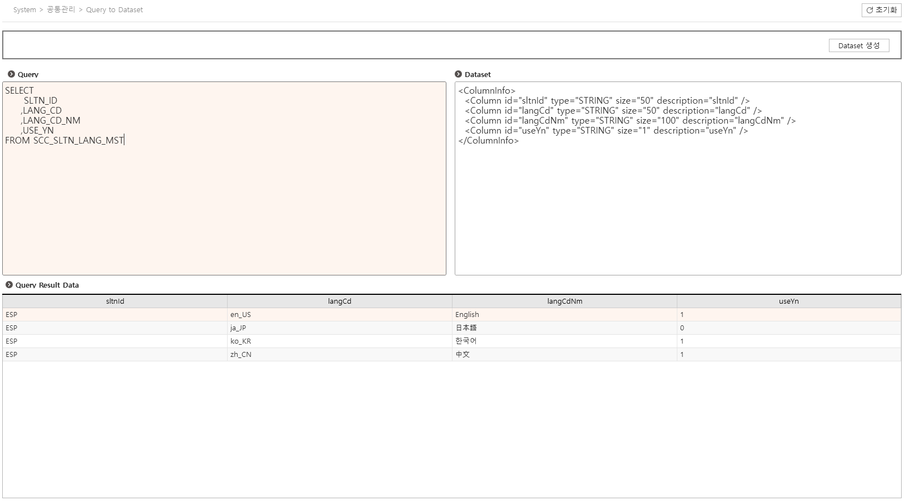
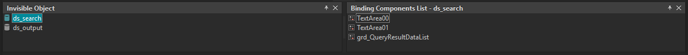
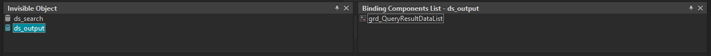
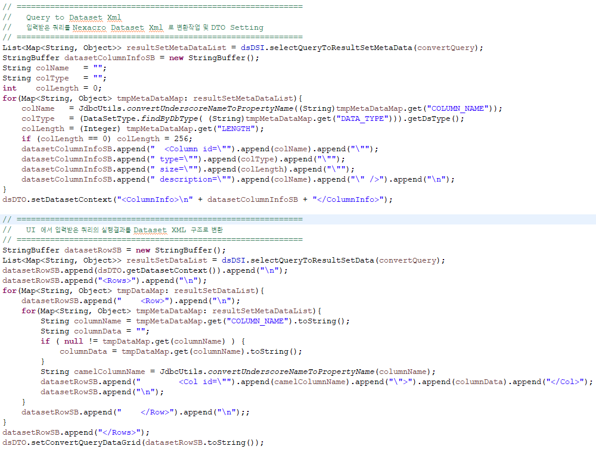

# nexacro 동적 그리드(Grid) 생성 가이드(Guide)






### 1. 요구사항

```
  - 요청 Query 는 고정이 아닌 사용자에 의해 다양한 Query 가 요청 될 수 있다.
  - 다양한 요청 Query의 실행 결과를 UI 의 Grid 에 출력을 한다.
```

### 2. 처리방법

```
  - Server 에서 UI 로부터 입력받은 Query 를 처리 후 UI Dataset 구조에 맞게 xml 형태로 변환하여 UI Response 로 전송한다.
  - UI 에서는 Server 로부터 응답받은 Dataset 구조의 데이터를 그리드에 Load 한다.
```

### 3. Process Flow

```
  1. UI Design

      아무것도 없는 비어 있는 Dataset 을 생성 후 Grid Component 와 Binding 한다.

  2. UI Event

      this.fn_create = function(convertQuery)
      {
          this.ds_search.clearData();
          var nRow = this.ds_search.addRow();
          this.ds_search.setColumn(nRow, "convertQuery", convertQuery);

          var objDatas =  {
              svcid		: "svcConvertQueryToDataset",
              sController	: "SCC0100M00",
              inds		: [	"dsSrchDTO=ds_search:A" ],
              outds		: [ "ds_search=dsDTO" ]
          };

          //공통 transaction 함수 호출   //function callback
          this.gfn_trans(this, objDatas, "fn_callback");
      }

      this.fn_callback = function(strSvcId, nErrorCode, strErrorMsg)
      {

          if (nErrorCode < 0) return;

          switch (strSvcId)
          {
              case "svcConvertQueryToDataset" :
                  this.ds_output.loadXML(this.ds_search.getColumn(0, "convertQueryDataGrid"));
                  //trace(this.ds_output.saveXML());
                  this.grd_QueryResultDataList.createFormat();
                  break;
              default:
                  break;
          }
      }

  3. Server Process

      Query 조회 후 아래와 같은 Dataset XML 구조의 데이터를 생성, 응답 Response 에 담는다.

      <ColumnInfo>
          <Column id="sltnId" type="STRING" size="50" description="sltnId" />
          <Column id="langCd" type="STRING" size="50" description="langCd" />
          <Column id="langCdNm" type="STRING" size="100" description="langCdNm" />
          <Column id="useYn" type="STRING" size="1" description="useYn" />
      </ColumnInfo>
      <Rows>
          <Row>
              <Col id="sltnId">ESP</Col>
              <Col id="langCd">en_US</Col>
              <Col id="langCdNm">English</Col>
              <Col id="useYn">1</Col>
          </Row>
          <Row>
              <Col id="sltnId">ESP</Col>
              <Col id="langCd">ja_JP</Col>
              <Col id="langCdNm">日本語</Col>
              <Col id="useYn">0</Col>
          </Row>
          <Row>
              <Col id="sltnId">ESP</Col>
              <Col id="langCd">ko_KR</Col>
              <Col id="langCdNm">한국어</Col>
              <Col id="useYn">1</Col>
          </Row>
          <Row>
              <Col id="sltnId">ESP</Col>
              <Col id="langCd">zh_CN</Col>
              <Col id="langCdNm">中文</Col>
              <Col id="useYn">1</Col>
          </Row>
      </Rows>

  4. UI CallBack

      this.ds_output.loadXML(this.ds_search.getColumn(0, "convertQueryDataGrid"));

      this.grd_QueryResultDataList.createFormat();
```
