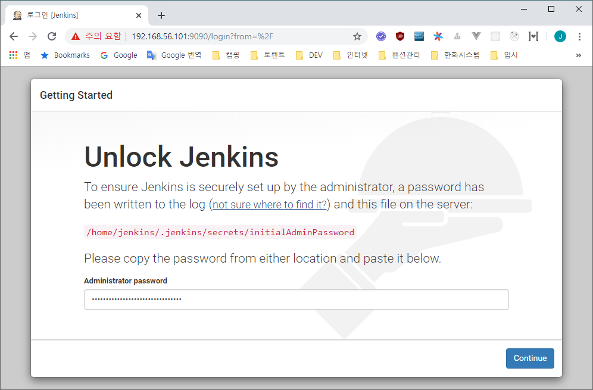
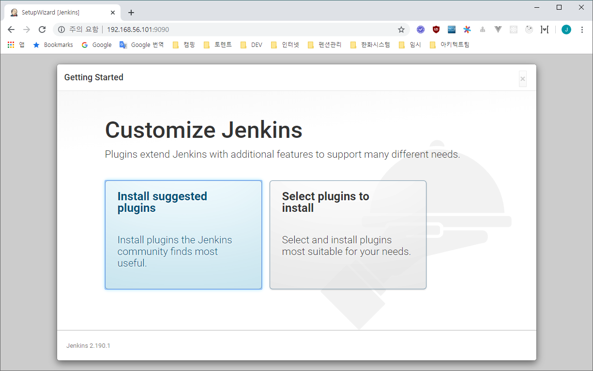
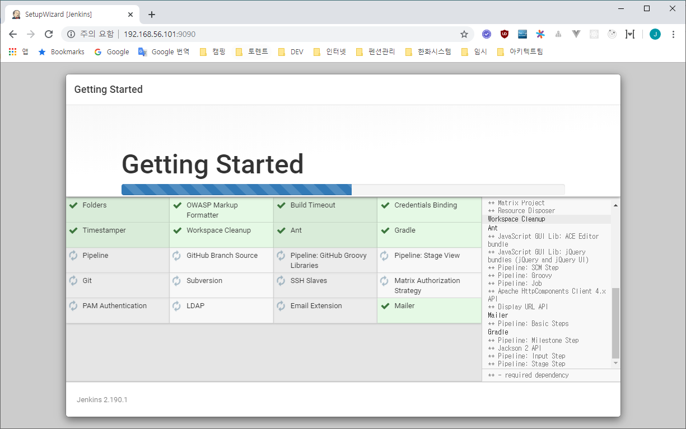
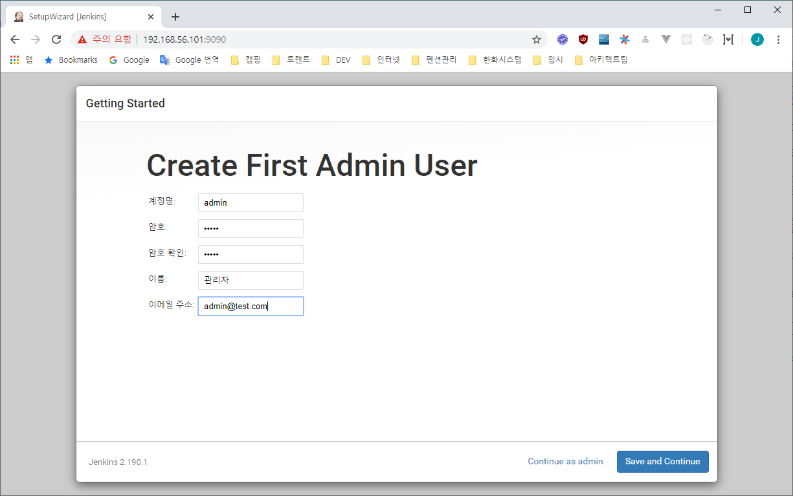
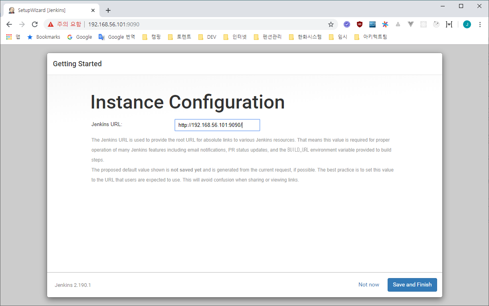
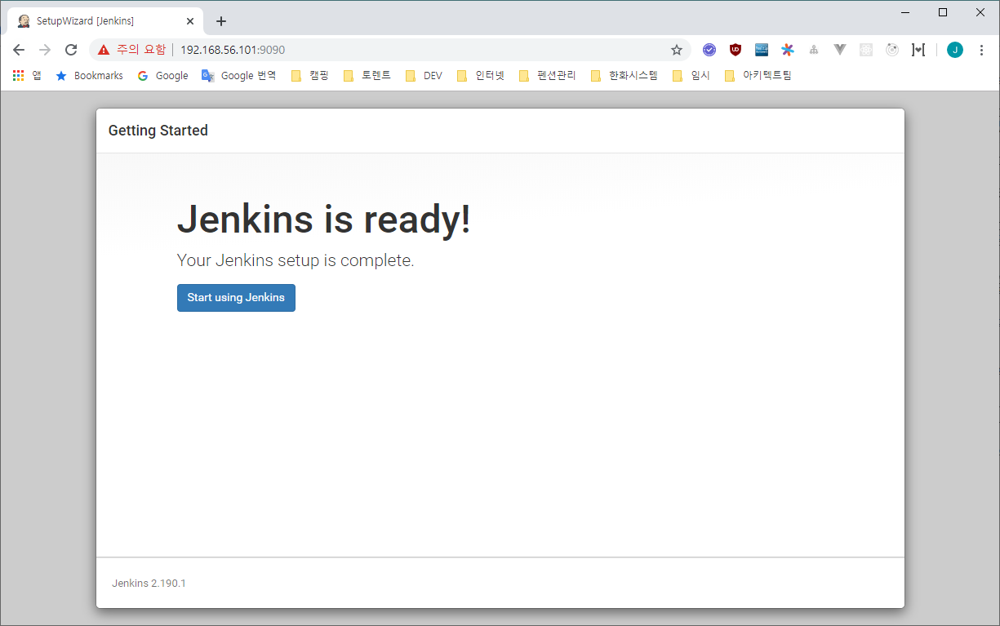
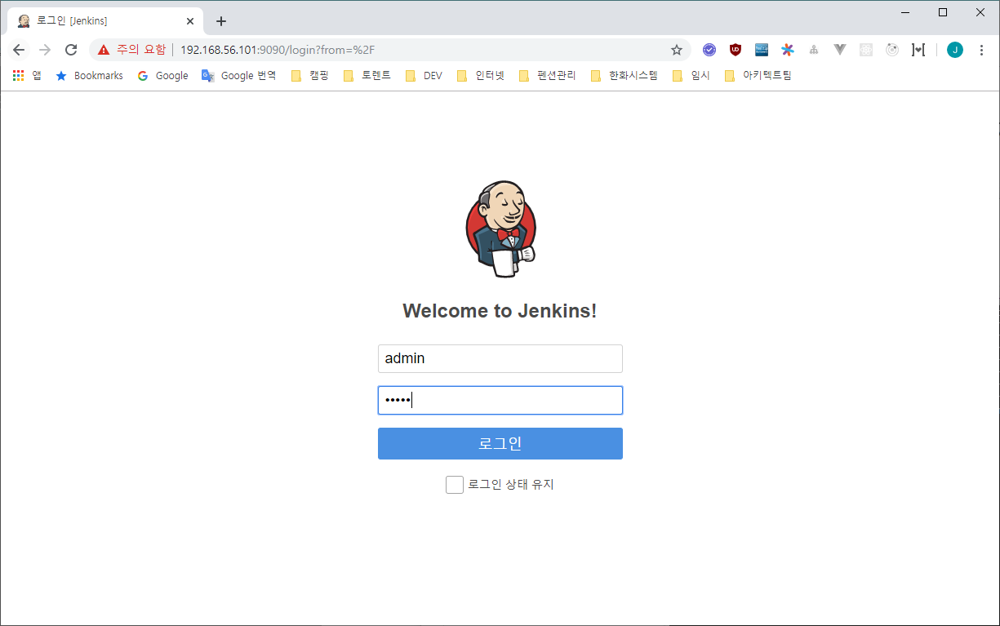
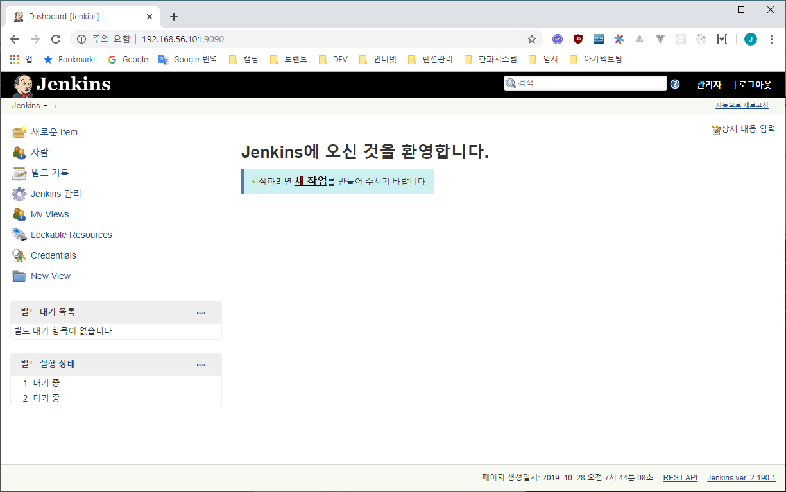

# Ubuntu 18.04 jenkins.war 설치.

<br/>

### jenkins Web Site

- https://jenkins.io/
- https://jenkins.io/download/
- http://mirrors.jenkins.io/war-stable/latest/jenkins.war

<br/>

## 1. jenkins 계정 생성.

```sh
root@ubuntu-deploy:~# useradd jenkins -m -s /bin/bash
root@ubuntu-deploy:~#
```

```sh
root@ubuntu-deploy:~# cat /etc/passwd | grep jenkins
jenkins:x:1002:1002::/home/jenkins:/bin/bash
root@ubuntu-deploy:~#
```

```sh
root@ubuntu-deploy:~# passwd jenkins
Enter new UNIX password:
Retype new UNIX password:
passwd: password updated successfully
root@ubuntu-deploy:~#
```

<br/>

## 2. jenkins.war 다운로드 & 설정

<br/>

### jenkins.war 다운로드

```sh
jenkins@ubuntu-deploy:~$ mkdir /app/jenkins
jenkins@ubuntu-deploy:~$ cd /app/jenkins
jenkins@ubuntu-deploy:/app/jenkins$ wget http://mirrors.jenkins.io/war-stable/latest/jenkins.war
```

<br/>

### jenkins start shell 만들기

```sh
jenkins@ubuntu-deploy:/app/jenkins$ vi /app/jenkins/start.sh
```

```sh
#/bin/sh

echo 'jenkins.war start...'
nohup java -jar /app/jenkins/jenkins.war --httpPort=9090 > /app/jenkins/logs/jenkins.log 2>&1&
echo 'jenkins.war start... success running...'
```

```sh
jenkins@ubuntu-deploy:/app/jenkins$ chmod +x start.sh
jenkins@ubuntu-deploy:/app/jenkins$ ll
total 76428
drwxr-xr-x 3 jenkins jenkins     4096 Oct 25 07:18 ./
drwxr-xr-x 5 root    root        4096 Oct 25 06:56 ../
-rw-rw-r-- 1 jenkins jenkins 78245883 Sep 25 13:05 jenkins.war
drwxrwxr-x 2 jenkins jenkins     4096 Oct 25 07:17 logs/
-rwxrwxr-x 1 jenkins jenkins      180 Oct 25 07:18 start.sh*
jenkins@ubuntu-deploy:/app/jenkins$


```

<br/>

### jenkins stop shell 만들기

```sh
jenkins@ubuntu-deploy:/app/jenkins$ vi /app/jenkins/stop.sh
```

```sh
#/bin/sh

echo 'jenkins.war kill...'
#ps -ef | grep jenkins.war | grep -v grep | awk '{print "kill -9", $2}' | sh
kill -9 `ps -ef | grep jenkins.war | awk '{print $2}'`
echo 'jenkins.war kill... success'
```

```sh
jenkins@ubuntu-deploy:/app/jenkins$ chmod +x stop.sh
jenkins@ubuntu-deploy:/app/jenkins$ ll
total 76432
drwxr-xr-x 3 jenkins jenkins     4096 Oct 25 07:20 ./
drwxr-xr-x 5 root    root        4096 Oct 25 06:56 ../
-rw-rw-r-- 1 jenkins jenkins 78245883 Sep 25 13:05 jenkins.war
drwxrwxr-x 2 jenkins jenkins     4096 Oct 25 07:17 logs/
-rwxrwxr-x 1 jenkins jenkins      180 Oct 25 07:18 start.sh*
-rwxrwxr-x 1 jenkins jenkins      127 Oct 25 07:20 stop.sh*
jenkins@ubuntu-deploy:/app/jenkins$
```

<br/>

## 3. 방화벽 등록

<br/>

```sh
root@ubuntu-deploy:/app/svn/repository/conf# firewall-cmd --list-ports
3690/tcp
root@ubuntu-deploy:/app/svn/repository/conf# firewall-cmd --zone=public --add-port=9090/tcp --permanent
success
root@ubuntu-deploy:/app/svn/repository/conf# firewall-cmd --reload
success
root@ubuntu-deploy:/app/svn/repository/conf# firewall-cmd --list-ports
3690/tcp 9090/tcp
root@ubuntu-deploy:/app/svn/repository/conf#
```

<br/>

## 4. jenkins 실행 및 중지

<br/>

### jenkins 실행

```sh
jenkins@ubuntu-deploy:/app/jenkins$ ./start.sh
```

<br/>

### jenkins 중지

```sh
jenkins@ubuntu-deploy:/app/jenkins$ ./stop.sh
```

<br/>

## 5. jenkins 실행 및 설정

<br/>

```sh
jenkins@ubuntu-deploy:/app/jenkins$ ./start.sh
```

```
jenkins 실행 후 브라우저 접속
http://192.168.56.101:9090/
```

최초 Jenkins 접속 시 Jenkins Unlock 화면이 로딩이 된다.

화면에 친절히 설명되어 있는데로 `initialAdminPassword` 파일을 오픈 후 unlock password 를 복사 하여 붙여 놓고 Continue 버튼을 눌러 다음 단계로 넘어 간다.

```
cat /home/jenkins/.jenkins/secrets/initialAdminPassword
b2fc8b98c2fb4e989ad1dd902c41f8cd

```
















