# react-router :: Part 1. 리엑트 라우터 사용해보기

<br/>
<br/>

> ### SPA 란?

Single Page Application (싱글 페이지 어플리케이션) 의 약자입니다. 말 그대로, 페이지가 1개인 어플리케이션이란 뜻입니다. 전통적인 웹어플리케이션의 구조는, 여러 페이지로 구성되어있습니다. 유저가 요청 할 때 마다 페이지가 새로고침되며, 페이지를 로딩 할 때 마다 서버로부터 리소스를 전달받아 해석 후 렌더링을 합니다. HTML 파일, 혹은 템플릿 엔진 등을 사용해서 어플리케이션의 뷰가 어떻게 보여질지도 서버에서 담당했죠.

요즘은 웹에서 제공되는 정보가 정말 많기 때문에 속도적인 측면에서 문제가 있었고, 이를 해소하기 위하여 캐싱과 압축을 하여 서비스가 제공되는데요. 이는 사용자와 인터랙션이 많은 모던 웹 어플리케이션에서는 충분하지 않을 수도 있습니다. 렌더링하는것을 서버쪽에서 담당한다는것은, 그 만큼 렌더링을 위한 서버 자원이 사용되는것이고, 불필요한 트래픽도 낭비되기 때문이지요.

그래서 우리는 리액트 같은 라이브러리 혹은 프레임워크를 사용해서 뷰 렌더링을 유저의 브라우저가 담당하도록 하고, 우선 어플리케이션을 브라우저에 로드 한 다음에 정말 필요한 데이터만 전달받아 보여주지요.

싱글페이지라고 해서, 한 종류의 화면만 있냐구요? 그건 아닙니다. 예를들어 블로그를 만든다면, 홈, 포스트 목록, 포스트, 글쓰기 등의 화면이 있겠지요. 또한 이 화면에 따라 주소도 만들어줘야 합니다. 주소가 있어야, 유저들이 북마크도 할 수 있고 서비스에 구글을 통해 유입될 수 있기 때문이죠. 다른 주소에 따라 다른 뷰를 보여주는것을 라우팅 이라고 하는데요, 리액트 자체에는 이 기능이 내장되어있지 않습니다. 따라서 우리가 직접 브라우저의 API 를 사용하고 상태를 설정하여 다른 뷰를 보여주어야 합니다.

이번에 배우게 될 react-router 는, 써드파티 라이브러리로서, 비록 공식은 아니지만 (페이스북 공식 라우팅 라이브러리는 존재하지 않습니다) 가장 많이 사용되고 있는 라이브러리인데요. 이 라이브러리는 클라이언트 사이드에서 이뤄지는 라우팅을 간단하게 해줍니다. 게다가 서버 사이드 렌더링도 도와주는 도구들이 함께 딸려옵니다. 추가적으로 이 라우터는 react-native 에서도 사용 될 수 있습니다.

만약에 여러분이 여러 화면으로 구성된 웹 어플리케이션을 만들게 된다면, react-router 는 필수 라이브러리입니다.

<br/>
<br/>

> ### SPA 의 단점

SPA 의 단점은, 앱의 규모가 커지면 자바스크립트 파일 사이즈가 너무 커진다는 것 입니다. 유저가 실제로 방문하지 않을수도 있는 페이지에 관련된 렌더링 관련 스크립트도 불러오기 때문이죠. 하지만 걱정하지마세요. 우리가 2장에서 배울 Code Splitting 을 사용한다면 라우트 별로 파일들을 나눠서 트래픽과 로딩속도를 개선 할 수 있습니다.

<br/>
<br/>

> ### 1-1. 프로젝트 구성하기

### 프로젝트 생성 및 라이브러리 설치

먼저 create-react-app 으로 프로젝트를 생성하세요.

```
$ create-react-app react-router-tutorial
$ cd react-router-tutorial
```

그 다음엔, 해당 프로젝트 디렉토리로 이동하여 리액트 라우터를 설치하세요.

```
[yarn]
$ yarn add react-router-dom
$ yarn add cross-env --dev

[npm]
$ npm install react-router-dom
$ npm install cross-env --dev
```

- react-router-dom: 브라우저에서 사용되는 리액트 라우터 입니다.
- cross-env: 프로젝트에서 NODE_PATH 를 사용하여 절대경로로 파일을 불러오기 위하여 환경 변수를 설정 할 때 운영체제마다 방식이 다르므로 공통적인 방법으로 설정 할 수 있게 해주는 라이브러리입니다.

<br/>
<br/>

### 프로젝트 초기화 및 구조 설정

파일 제거

- src/App.js
- src/App.css
- src/App.test.js
- src/logo.svg

<br/>
<br/>

### 디렉토리 생성

- src/components: 컴포넌트들이 위치하는 디렉토리입니다.
- src/pages: 각 라우트들이 위치하는 디렉토리 입니다.
- src/client: 브라우저 측에서 사용할 최상위 컴포넌트 입니다. 우리가 추후 서버사이드 렌더링을 구현 할 것이기 때문에 디렉토리를 따로 구분하였습니다. (서버사이드 렌더링을 할 때에는 서버 전용 라우터를 써야합니다.) 여기서 라우터를 설정합니다.
- src/server: 서버측에서 사용 할 리액트 관련 코드를 여기에 넣습니다.
- src/shared: 서버와 클라이언트에서 공용으로 사용되는 컴포넌트 App.js 가 여기에 위치합니다.
- src/lib: 나중에 웹 연동을 구현 할 때 사용 할 API와 코드스플리팅 할 때 필요한 코드가 여기에 위치합니다.

<br/>
<br/>

### NODE_ENV 설정

우리가 코드들을 불러올 때 ‘../components/Something’ 이런식으로 불러와야 하는 코드를 ‘components/Something’ 이렇게 불러 올 수 있도록 프로젝트의 루트경로를 설정하겠습니다. package.json 파일의 script 부분을 다음과 같이 수정하세요.

`package.json`

```json
"scripts": {
    "start": "cross-env NODE_PATH=src react-scripts start",
    "build": "cross-env NODE_PATH=src react-scripts build",
    "test": "react-scripts test --env=jsdom",
    "eject": "react-scripts eject"
  }
```

<br/>
<br/>

### 컴포넌트 준비하기

먼저, App 컴포넌트를 만들어주세요. 어떤 주소로왔을때 무엇을 보여줄 지, 나중에 여기서 정의를 하도록 하겠습니다. 지금은 일단 비어있는 컴포넌트를 만드세요.

`src/shared/App.js`

```javascript
import React, { Component } from "react";

class App extends Component {
  render() {
    return <div>Hello React-Router</div>;
  }
}

export default App;
```

그 다음엔, Root 컴포넌트를 만드세요. 이 컴포넌트는 우리의 웹어플리케이션에 BrowserRouter를 적용합니다. 나중에 리덕스를 적용 하게 될 때, 여기서 Provider 를 통하여 프로젝트에 리덕스를 연결시켜줍니다.

`src/client/Root.js`

```javascript
import React from "react";
import { BrowserRouter } from "react-router-dom";
import App from "shared/App";

const Root = () => (
  <BrowserRouter>
    <App />
  </BrowserRouter>
);

export default Root;
```

이제 우리가 만든 파일에 맞춰서 index.js 를 수정하세요.

`src/index.js`

```javascript
import React from "react";
import ReactDOM from "react-dom";
import Root from "./client/Root";
import registerServiceWorker from "./registerServiceWorker";
import "./index.css";

ReactDOM.render(<Root />, document.getElementById("root"));
registerServiceWorker();
```

이제 개발서버를 실행시켜서 페이지에 Hello React Router 가 잘 뜨는지 확인하세요.

```
$ npm start
```

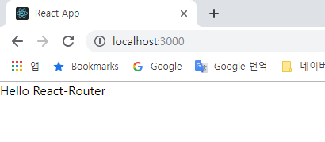

자 이제 기본적인 설정이 완료되었으니 본격적으로 리액트 라우터를 사용해봅시다!

<br/>
<br/>

> ### 1-2. Route 와 파라미터

### 기본 라우트 준비하기

자 그럼 우리의 첫 라우트 Home을 만들어보겠습니다.
이 라우터는 주소에 아무 path 도 주어지지 않았을 때 기본적으로 보여주는 라우트입니다.

`src/pages/Home.js`

```javascript
import React from "react";

const Home = () => {
  return (
    <div>
      <h2>홈</h2>
    </div>
  );
};

export default Home;
```

그리고 같은 형식으로 About 도 만드세요. 이 페이지는 /about 경로로 들어왔을 때 보여줄 페이지입니다.

`src/pages/About.js`

```javascript
import React from "react";

const About = () => {
  return (
    <div>
      <h2>About</h2>
    </div>
  );
};

export default About;
```

이제 이 컴포넌트를 불러와서 한 파일로 내보낼 수 있도록 인덱스를 만들어주세요.

`src/pages/index.js`

```javascript
export { default as Home } from "./Home";
export { default as About } from "./About";
```

<br/>
<br/>

### 라우트 설정하기

자 이제 라우트에 맞춰서 컴포넌트를 보여줍시다. App 컴포넌트를 다음과 같이 작성하세요.

`src/shared/App.js`

```javascript
import React, { Component } from "react";
import { Route } from "react-router-dom";
import { Home, About } from "pages";

class App extends Component {
  render() {
    return (
      <div>
        <Route exact path="/" component={Home} />
        <Route path="/about" component={About} />
      </div>
    );
  }
}

export default App;
```

라우트를 설정 할 때에는 Route 컴포넌트를 사용하고, 경로는 `path` 값으로 설정합니다.

첫번째 라우트 `/` 의 경우에는 Home 컴포넌트를 보여주게 했고, 두번째 라우트 `/about` 에서는 About 컴포넌트를 보여주게 했습니다.

첫번째 라우트의 경우엔 `exact` 가 붙어있지요? 이게 붙어있으면 주어진 경로와 정확히 맞아 떨어져야만 설정한 컴포넌트를 보여줍니다.

먼저 우리의 라우트가 제대로 보여지는지 확인하세요.

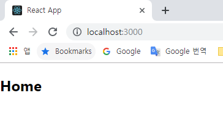

Home 이 잘 보여졌다면 /about 경로로 들어가보세요.

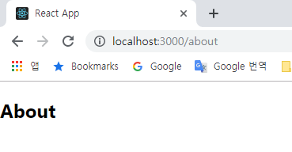

잘 보여졌죠? 지금의 경우에는 개발서버쪽에서 `historyApiFallback` 설정을 통하여 어떤 요청으로 들어오던 저희 어플리케이션이 불러와져있는 index.html 을 보여주도록 설정하기 때문입니다.

링크를 이렇게 직접 입력해서 들어갈 때에는, 서버라우트를 한번 타게 됩니다. 그러면 서버쪽에서 리액트앱으로 연결시켜줘야하죠. 실제 서버에서는, 우리가 설정한 라우트에 들어왔을때 리액트 앱이 보여지는 페이지를 보여주게 하거나, 혹은 API 등 사전 준비된 라우트를 제외한 모든 요청을 리액트 앱쪽으로 연결시켜주는 작업을 해야합니다. 그렇게 하지 않으면 서버측에서는 연결 할 라우트가 없어서 404 Not Found 페이지만 뜰 것입니다.

테스팅을 완료했다면 한번 Home 라우트의 `exact` 를 지워보세요.

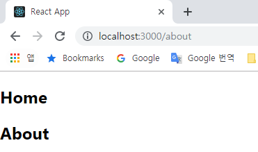

두 컴포넌트가 같이 보여졌죠? exact 를 하지 않으면, `/about` 에도 `/` 가 있기 때문에, 매칭이 되어서 보여지는거랍니다. 확인을 하셨다면 다시 exact 를 적으세요.

<br/>
<br/>

### 라우트 파라미터 읽기

라우트의 경로에 특정 값을 넣는 방법을 알아보겠습니다. 방법은 두가지가 있는데요, `params` 를 사용하는 것 과, `query` 를 사용하는 것 입니다.

라우트로 설정한 컴포넌트는, 3가지의 props 를 전달받게 됩니다:

- `history` 이 객체를 통해 `push`, `replace` 를 통해 다른 경로로 이동하거나 앞 뒤 페이지로 전환 할 수 있습니다.
- `location` 이 객체는 현재 경로에 대한 정보를 지니고 있고 URL 쿼리 (`/about?foo=bar` 형식) 정보도 가지고있습니다.
- `match` 이 객체에는 어떤 라우트에 매칭이 되었는지에 대한 정보가 있고 params (`/about/:name` 형식) 정보를 가지고있습니다.

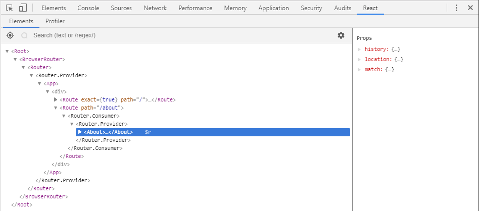

URL 쿼리의 경우엔 컴포넌트 내에서 동적으로 사용 할 수 있고, params 의 경우엔 사용하기 전에 꼭 라우트에서 지정을 해주어야합니다.

<br/>
<br/>

### params

그러면, 먼저 params 부터 사용을 해봅시다.

App 컴포넌트에서 다음과 같이 `/about/:name` 라우트를 추가하세요.

`src/shared/App.js`

```javascript
import React, { Component } from "react";
import { Route } from "react-router-dom";
import { Home, About } from "pages";

class App extends Component {
  render() {
    return (
      <div>
        <Route exact path="/" component={Home} />
        <Route path="/about" component={About} />
        <Route path="/about/:name" component={About} />
      </div>
    );
  }
}

export default App;
```

URL 의 params 를 설정 할 때에는 `:foo` 의 형식으로 설정합니다. 이렇게 하면 foo 라는 params 가 생기는것이지요.

설정을 하셨다면, About 컴포넌트는 다음과 같이 수정해보세요.

`src/pages/About.js`

```javascript
import React from "react";

const About = ({ match }) => {
  return (
    <div>
      <h2>About {match.params.name}</h2>
    </div>
  );
};

export default About;
```

우리가 name 이라는 params 를 만들었으니, 이 값은 `match.params.name` 을 통하여 확인 할 수 있습니다.

한번 브라우저에서 /about/foo 경로로 들어가보세요.

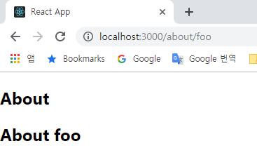

이런, About 컴포넌트가 중복됐군요.

어떻게 해결해야할까요? 네. `exact` 를 사용하면 되겠죠? 이를 해결하는 또 다른 방법이있습니다. 바로 `Switch` 컴포넌트를 사용하는건데요, 라우트들을 이 컴포넌트에 감싸면 `매칭되는 첫번째 라우트만 보여주고 나머지는 보여주지 않습니다.`

다음과 같이 Switch 를 불러온다음에 about 라우트 두개를 감싸주세요.

`src/shared/App.js`

```javascript
import React, { Component } from "react";
import { Route, Switch } from "react-router-dom";
import { Home, About } from "pages";

class App extends Component {
  render() {
    return (
      <div>
        <Route exact path="/" component={Home} />
        <Switch>
          <Route path="/about/:name" component={About} />
          <Route path="/about" component={About} />
        </Switch>
      </div>
    );
  }
}

export default App;
```

주의 하실 점은, 먼저 비교 할 라우트를 위에 작성하셔야 한다는 점 입니다. 만약에 /about 을 /about/:name 보다 위에 넣어준다면, name 을 입력해주어도 나타나지 않을거에요.

<br/>
<br/>

### URL 쿼리

리액트 라우터 v3 에서는 URL 쿼리를 해석해서 객체로 만들어주는 기능이 자체적으로 있었는데요, 쿼리를 파싱하는 방식은 여러가지가 있어서, 개발자들이 여러가지를 방식을 사용 할 수 있도록 이 기능을 더이상 내장하지 않습니다. 따라서 URL 쿼리를 해석하는것은 우리의 몫입니다.

쿼리를 해석하기 위해선, 라이브러리를 설치해주세요. 자체적으로 구현하는 방법도 있겠지만 라이브러리를 사용하는것이 훨씬 간편합니다.

```
$ npm install query-string
```

그리고, About 의 코드를 다음과 같이 작성하세요.

`src/pages/About.js`

```javascript
import React from "react";
import queryString from "query-string";

const About = ({ location, match }) => {
  const query = queryString.parse(location.search);
  console.log(query);

  return (
    <div>
      <h2>About {match.params.name}</h2>
    </div>
  );
};

export default About;
```

그리고 나서 /about/foo?detail=true 경로로 들어가서 개발자콘솔을 확인해보세요.

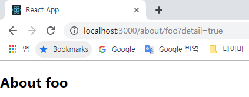

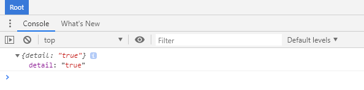

detail 값이 객체에 생겼지요?

그러면, 이 값에 따라서 조건부 렌더링을 해보도록 하겠습니다.

`src/pages/About.js`

```javascript
import React from "react";
import queryString from "query-string";

const About = ({ location, match }) => {
  const query = queryString.parse(location.search);

  const detail = query.detail === "true";

  return (
    <div>
      <h2>About {match.params.name}</h2>
      {detail && "detail: blahblah"}
    </div>
  );
};

export default About;
```

이제 ?detail=true 가 주소 뒤에 붙어야만, ‘detail: blahblah’ 문자열이 나타나게 됩니다.

URL 쿼리를 만들 때 주의하실 점은, 받아오는 값들은 모두 문자열이라는 것 입니다. 따라서 비교를 해야 할 땐 boolean 을 불러오던 숫자를 불러오던, 문자열 형태로 비교를 하거나, 알맞는 형태로 변환을 시킨다음에 비교를 하세요.

<br/>
<br/>

> ### 1-3. 라우트 이동하기

### Link 컴포넌트

앱 내에서 다른 라우트로 이동 할 때에는, 일반 `<a href...>foo</a>` 형식으로 하면 안됩니다. 왜냐하면, 이렇게하면 `새로고침을 해버리기 때문`이지요.

새로고침을 하기 위해선, 리액트 라우터에 있는 Link 컴포넌트를 사용해야합니다. 이 컴포넌트를 사용하면 페이지를 새로 불러오는걸 막고, 원하는 라우트로 화면 전환을 해줍니다.

그럼, 한번 사용해볼까요?

components 디렉토리에 Menu 라는 컴포넌트를 다음과 같이 만들어보세요:

`src/comonents/Menu.js`

```javascript
import React from "react";
import { Link } from "react-router-dom";

const Menu = () => {
  return (
    <div>
      <ul>
        <li>
          <Link to="/">Home</Link>
        </li>
        <li>
          <Link to="/about">About</Link>
        </li>
        <li>
          <Link to="/about/foo">About Foo</Link>
        </li>
      </ul>
      <hr />
    </div>
  );
};

export default Menu;
```

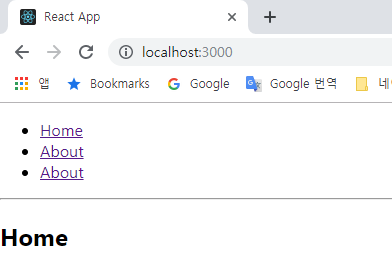

페이지가 새로 로딩되지 않으면서 잘 전환이 되나요?

이 컴포넌트에 전달되는 props 들은 컴포넌트 내부의 DOM 에도 전달이 되므로, 일반 DOM 엘리먼트에 설정 하는 것 처럼 className, style 혹은 onClick 등의 이벤트를 전달 해 줄 수 있습니다.

<br/>
<br/>

### NavLink 컴포넌트

NavLink 컴포넌트는 Link 랑 비슷한데요, 만약에 설정한 URL 이 활성화가 되면, 특정 스타일 혹은 클래스를 지정 할 수 있습니다.

`src/comonents/Menu.js`

```javascript
import React from "react";
import { NavLink } from "react-router-dom";

const Menu = () => {
  const activeStyle = {
    color: "green",
    fontSize: "2rem"
  };

  return (
    <div>
      <ul>
        <li>
          <NavLink exact to="/" activeStyle={activeStyle}>
            Home
          </NavLink>
        </li>
        <li>
          <NavLink exact to="/about" activeStyle={activeStyle}>
            About
          </NavLink>
        </li>
        <li>
          <NavLink to="/about/foo" activeStyle={activeStyle}>
            About Foo
          </NavLink>
        </li>
      </ul>
      <hr />
    </div>
  );
};

export default Menu;
```

Route 를 지정 할 때 처럼, 중첩될수도 있는 라우트들은 `exact` 로 설정을 하셔야 합니다. 만약에 활성화 되었을 때 특정 클래스를 설정하고 싶다면 `activeClassName` 을 설정하시면 됩니다.

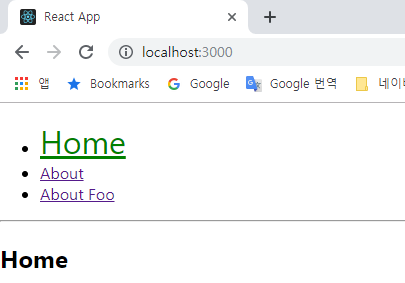

<br/>
<br/>

> ## 1-4. 라우트 속의 라우트

react-router 가 버전 4로 업데이트 되면서 달라진 점 중 하나는, Route 내부에 Route 를 설정하는 방식이 달라졌다는 것 입니다.

이전에는, 다음과 같은 형식으로 라우트를 선언하고:

```
<Route path="foo" component={Foo}>
    <Route path=":id" component={Bar}/>
</Route>
```

Foo 컴포넌트에서 props.children 의 자리에 Bar 컴포넌트가 들어가는 형식이였습니다. 그래서 모든 라우트는 최상위에서 정해주어야 했죠.

하지만 이제는 다릅니다. v4 에서는, props.children 을 사용하지 않고 라우트에서 보여주는 컴포넌트 내부에 또 Route 를 사용 할 수 있게 됐습니다. 한번 해볼까요?

먼저 Post 라는 페이지 컴포넌트를 만드세요. 이 컴포넌트에서는 params.id 를 받아와서 렌더링해줍니다.

`src/pages/Post.js`

```javascript
import React from "react";

const Post = ({ match }) => {
  return <div>포스트 {match.params.id}</div>;
};

export default Post;
```

그 다음엔 Posts 페이지 컴포넌트를 만드세요. 이 컴포넌트에 Link 에서 현재 주소 뒤에 id 를 붙여서 이동하도록 설정하세요. 그리고 Link 리스트 하단에는 Route 를 통해 조건에 따라 원하는 결과를 보여주도록 설정하겠습니다.

`src/pages/Posts`

```javascript
import React from "react";
import { Link, Route } from "react-router-dom";
import { Post } from "pages";

const Posts = ({ match }) => {
  return (
    <div>
      <h2>Post List</h2>
      <ul>
        <li>
          <Link to={`${match.url}/1`}>Post #1</Link>
        </li>
        <li>
          <Link to={`${match.url}/2`}>Post #2</Link>
        </li>
        <li>
          <Link to={`${match.url}/3`}>Post #3</Link>
        </li>
        <li>
          <Link to={`${match.url}/4`}>Post #4</Link>
        </li>
      </ul>
      <Route
        exact
        path={match.url}
        render={() => <h3>Please select any post</h3>}
      />
      <Route path={`${match.url}/:id`} component={Post} />
    </div>
  );
};

export default Posts;
```

상단부터 코드 설명을 하겠습니다. Post 컴포넌트를 불러올때 ‘./Post’ 에서 바로 불러오는게 아닌 ‘pages’ 를 통해 불러왔습니다. 지금 상황에서는 상대경로에서 불러오는게 더 자연스러울수도 있긴 합니다. 하지만, 우리는 2장에서 코드스플리팅을 해보게 될 텐데, 이 과정에서 페이지를 불러오는 방식이 통일되어야 제대로 작동하므로 pages 에서 불러오도록 설정하였습니다.

Link 를 설정하는 부분에서는, match.url 이 사용되었는데요, 이 url 은 현재의 라우트의 경로를 알려줍니다.

이 부분에서는 그냥 to=”/posts/1″ 으로 설정을 해도 됩니다. 하지만, 이렇게 하는 경우에 나중에 현재의 라우트 경로가 바뀌게 되면 자동으로 바뀐다는 장점이 있습니다.

하단에 Route 를 설정 할 때 첫번째 라우트는 match.url 로 설정하였습니다. 이 의미는, 포스트의 id 가 주어지지 않았을 때를 의미합니다. 그리고 여기서는 component 대신에 render 가 되었지요? 이 render 는 지금처럼 인라인 렌더링을 가능케 해줍니다.

두번째 라우트에선 현재 라우트의 주소에 :id 가 붙었을 시에 Post 컴포넌트를 보여주도록 설정했습니다.

완성하였다면, 페이지 인덱스를 수정하세요.

`src/pages/index.js`

```javascript
export { default as Home } from "./Home";
export { default as About } from "./About";
export { default as Posts } from "./Posts";
export { default as Post } from "./Post";
```

그 다음엔 App 에서 /posts 경로를 위한 라우트를 설정하세요.

`src/shared/App.js`

```javascript
import React, { Component } from "react";
import { Route, Switch } from "react-router-dom";
import { Home, About, Posts } from "pages";
import Menu from "components/Menu";

class App extends Component {
  render() {
    return (
      <div>
        <Menu />
        <Route exact path="/" component={Home} />
        <Switch>
          <Route path="/about/:name" component={About} />
          <Route path="/about" component={About} />
        </Switch>
        <Route path="/posts" component={Posts} />
      </div>
    );
  }
}

export default App;
```

마지막으로, Menu 컴포넌트에서 /posts 로 연결하는 링크를 넣고 잘 작동하는지 확인해보세요.

`src/components/Menu.js`

```javascript
import React from "react";
import { NavLink } from "react-router-dom";

const Menu = () => {
  const activeStyle = {
    color: "green",
    fontSize: "2rem"
  };

  return (
    <div>
      <ul>
        <li>
          <NavLink exact to="/" activeStyle={activeStyle}>
            Home
          </NavLink>
        </li>
        <li>
          <NavLink exact to="/about" activeStyle={activeStyle}>
            About
          </NavLink>
        </li>
        <li>
          <NavLink to="/about/foo" activeStyle={activeStyle}>
            About Foo
          </NavLink>
        </li>
        <li>
          <NavLink to="/posts" activeStyle={activeStyle}>
            Posts
          </NavLink>
        </li>
      </ul>
      <hr />
    </div>
  );
};

export default Menu;
```

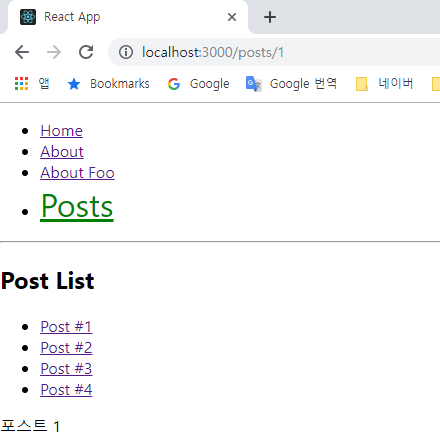

<br/>
<br/>

### 헷갈리는 값들

라우트가 받는 props 중에서, 상당히 헷갈리는 값들이 있습니다.

- location.pathname
- match.path
- match.url

비슷한것들 같은데, 대체 어떻게 다를까요?

한번 Post 와 Posts 에서 이 값들을 화면에 렌더링해보겠습니다.

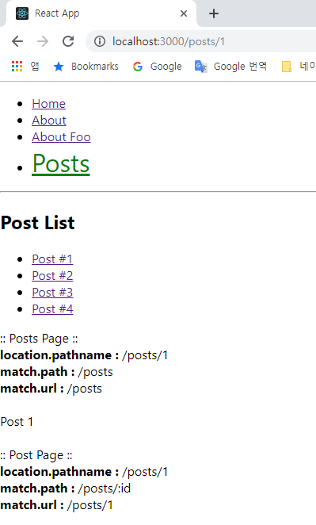

`location.pathname` 은 현재 브라우저상의 위치를 알려줍니다. 이 값은 어떤 라우트에서 렌더링하던 동일합니다.

`match` 관련은 설정한 Route 와 직접적으로 관계된 값만 보여줍니다.

- Posts 를 보여주는 라우트에선 :id 값을 설정하지 않았으니 path 와 url 이 둘다 /posts 입니다.
- Post 를 보여주는 라우트에선 path 의 경우엔 라우트에서 설정한 path 값이 그대로 나타납니다. url 의 경우엔 :id 부분에 값이 들어간 상태로 나타납니다.

어때요? 이렇게 보니까 더 이상 헷갈리지 않지요?

<br/>
<br/>

> 참조
>
> - [리액트 라우터, 코드 스플리팅, 그리고 서버사이드 렌더링 :: 목차](https://velopert.com/3411)
> - [react-router :: 1장. 리액트 라우터 사용해보기](https://velopert.com/3417)
