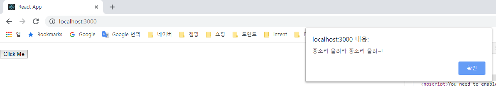
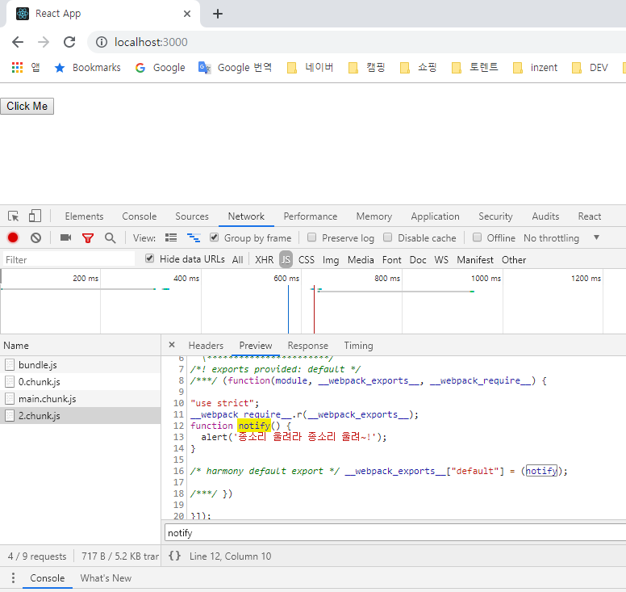
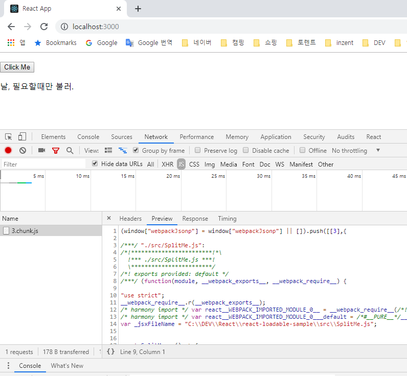
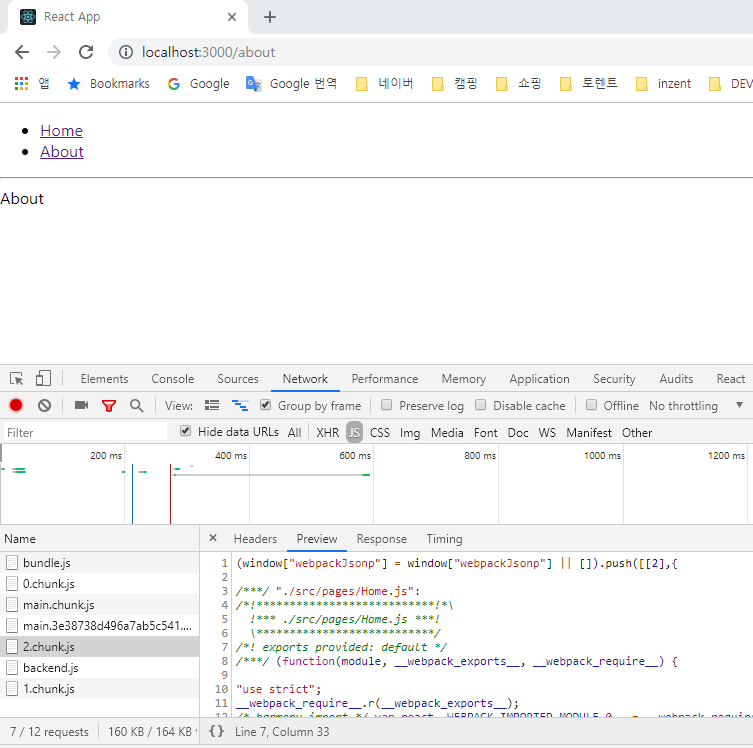
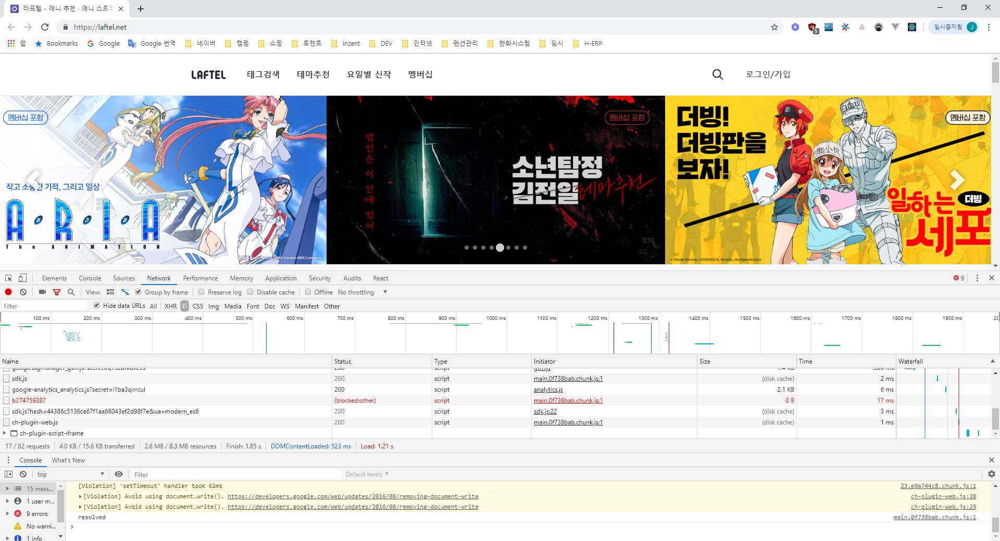

# 리액트 프로젝트 코드 스플리팅 정복하기

코드 스플리팅, 뭐 별거있나요? 그냥 웹팩에서 하라는대로 하면 되는걸요. 하지만! 리액트에서 코드 스플리팅이랑 서버사이드 렌더링을 함께 해보신 경험이 있으시다면, 이 두가지 작업을 함께 하는 경우, 굉장히 번거로워질 수도 있다는 것을 아실 것 입니다. 이 포스트에서는, 리액트에서 코드 스플리팅을 하는 방법을 기초부터 이해를 해보고, react-loadable 을 사용하면 서버사이드 렌더링과 함께 사용 할 시 어떻게 도와줄 수 있는지 알아보도록 하겠습니다.

> 잠깐, 코드 스플리팅이 뭔가요?
>
> 우리가 자바스크립트로 애플리케이션을 개발하게 되면, 기본적으로는 하나의 파일에 모든 로직들이 들어가게 됩니다. 그럼, 프로젝트의 규모가 커질수록 자바스크립트 파일 용량도 커지겠죠? 용량이 커지면, 인터넷이 느린 환경에서는 페이지 로딩속도도 느려질 것입니다.
>
> 코드 스플리팅을 하게 되면, 지금 당장 필요한 코드가 아니라면 따로 분리시켜서, 나중에 필요할때 불러와서 사용 할 수 있습니다. 이를 통하여, 페이지의 로딩 속도를 개선 할 수 있죠.

참고: 이 프로젝트에서 사용된 코드는 [loadable-sample](https://github.com/vlpt-playground/loadable-sample) 에서 확인 할 수있습니다.

<br/>
<br/>

### 1. 진짜 기본적인 코드 스플리팅

일단 이 코드 스플리팅은 리액트 앱에만 해당되는 것은 아니고, 웹팩으로 구성된 다른 프로젝트에도 적용을 할 수 있습니다. 다만, 이 포스트는 리액트에 집중 할 것이므로, 리액트 앱에서 이 작업을 해보도록 하겠습니다.

<br/>
<br/>

### 프로젝트 생성

우선, create-react-app 으로 리액트 앱을 생성해주세요

```
$ create-react-app react-loadable-sample
$ cd react-loadable-sample
$ yarn start # 혹은 npm start
```

개발 서버도 실행하시고, 에디터로 프로젝트도 열으세요.

<br/>
<br/>

### 코드 스플리팅 할 함수 준비하기

src 디렉토리에 notify.js 라는 파일을 만드세요.

`src/notify.js`

```javascript
function notify() {
  alert("종소리 울려라 종소리 울려~");
}

export default notify;
```

그리고, App 컴포넌트에서는 기존에 내용들을 다 비우고 다음과 같이 버튼하나 만들고 거기에 메소드를 하나 연결해줘서 방금 우리가 만든 함수를 호출하도록 하겠습니다.

`src/App.js`

```javascript
import React, { Component } from "react";
import notify from "./notify";

class App extends Component {
  handleClick = () => {
    notify();
  };
  render() {
    return (
      <div>
        <button onClick={this.handleClick}>Click Me</button>
      </div>
    );
  }
}

export default App;
```

그러면 이렇게 버튼 누르면 alert 가 뜨겠죠?



이 notify 함수는 사실상 저 버튼을 클릭 할 때 까지 필요가 없는 코드잖아요? 그러면 한번, 이 코드를 스플리팅 해보겠습니다.

<br/>
<br/>

### 함수를 코드스플리팅 해보기

notify 를 사용하기 위해서 기존에는 상단에서 `import notify from './notify';` 이런식으로 불러와줬었는데요 이걸 지우고 다음과 같이 handleClick 메소드에서 import 를 함수로 호출해서 불러와서 사용해보겠습니다.

`App.js`

```javascript
import React, { Component } from "react";

class App extends Component {
  handleClick = () => {
    import("./notify").then(({ default: notify }) => {
      notify();
    });
  };
  render() {
    return (
      <div>
        <button onClick={this.handleClick}>Click Me</button>
      </div>
    );
  }
}

export default App;
```

import 를 함수로 사용하면, Promise 를 반환합니다. import() 함수는 아직 표준은 아니지만 stage-3 단계에 있는 dynamic import 라는 문법입니다. 현재는, webpack 에서 지원해주고 있는 함수이기에 여러분의 프로젝트에서 별도의 설정 없이 바로 사용 할 수 있습니다. 이 함수는 모듈을 비동기적으로 `CommonJS` 형태로 불러오니, 따로 default 를 명시해주어야 합니다. 위에서 사용한 코드에서는 "default 를 notify 를 부르겠다" 라고 설정을 해주었습니다.

> 이 포스트에서는 Webpack v4 가 사용됩니다.

이렇게 하고나서, 개발자도구에서 Network 탭을 열은다음에, 버튼을 눌러보세요.

그렇게 하시면, 다음과 같이 1.chunk.js 라는 파일을 불러오게 되고, 그 안에 notify 관련 코드가 들어있는 것을 확인 할 수 있을겁니다. 이렇게 분리된 파일을 청크 파일 이라고 부릅니다.



import 를 함수로 사용해주면, 웹팩이 알아서 코드를 분리를 하여 따로 저장을하고, import 가 호출 될 때 불러와서 사용 할 수 있게 해줍니다.

<br/>
<br/>

### 2. 컴포넌트를 코드 스플리팅해보기

그러면 한번 똑같은 원리로, 컴포넌트를 코드 스플리팅해보겠습니다.

SplitMe 컴포넌트를 작성해보세요!

`src/SplitMe.js`

```javascript
import React from "react";

const SplitMe = () => {
  return <div>날, 필요할때만 불러.</div>;
};

export default SplitMe;
```

그리고, 기존에 App.js 에서 notify 관련은 없애주고, 만약에 버튼이 눌리면 이 SplitMe 를 불러온다음에 결과물을 컴포넌트의 state 에 넣는 방식을 사용하여 필요할때만 불러와서 렌더링을 해보겠습니다.

`src/App.js`

```javascript
import React, { Component } from "react";

class App extends Component {
  state = {
    SplitMe: null
  };
  handleClick = () => {
    import("./SplitMe").then(({ default: SplitMe }) => {
      this.setState({
        SplitMe
      });
    });
  };
  render() {
    const { SplitMe } = this.state;
    return (
      <div>
        <button onClick={this.handleClick}>Click Me</button>
        {SplitMe && <SplitMe />}
      </div>
    );
  }
}

export default App;
```

handleClick 이 호출되면, 비동기적으로 SplitMe 를 불러와서 state 에 담습니다. 그리고, render 함수에서는 state 안에 있는 SplitMe 가 유효 할 때만 렌더링을 해줍니다. 이로서, 컴포넌트 관련 코드를 다른 파일로 분리시키고, 필요할 때 불러와서 사용 할 수 있게 됩니다.



<br/>
<br/>

### 3. HoC 를 사용하여 더 쉽게 코드 스플리팅하기

만약에 스플리팅해야 하는 컴포넌트들이 많아졌다고 가정해봅시다. 많은 컴포넌트들을 위와같은 형식으로 state 에 하나하나 담기엔.. 좀 번거로울수도 있습니다. 이 작업을 HoC 를 사용하여 좀 더 편하게 처리하는 방법을 알아보겠습니다.

HoC 를 잘 모르신다면 [컴포넌트에 날개를 달아줘, HoC](https://velopert.com/3537) 튜토리얼을 참고하세요.

보통 HoC 는 컴포넌트를 내보내는 단계에서 사용하는데, 여기서는 불러온다음에 사용을 합니다.

<br/>
<br/>

### HoC 만들기

우선, withSplitting.js 라는 파일을 만들어서 다음 함수를 작성해주세요.

`src/withSplitting.js`

```javascript
import React, { Component } from "react";

const withSplitting = getComponent => {
  // 여기서 getComponent 는 () => import('./SplitMe') 의 형태로 함수가 전달되야합니다.
  class WithSplitting extends Component {
    state = {
      Splitted: null
    };

    constructor(props) {
      super(props);
      getComponent().then(({ default: Splitted }) => {
        this.setState({
          Splitted
        });
      });
    }

    render() {
      const { Splitted } = this.state;
      if (!Splitted) {
        return null;
      }
      return <Splitted {...this.props} />;
    }
  }

  return WithSplitting;
};

export default withSplitting;
```

이 함수에서는, 코드 스플리팅 할 때 반복되는 로직을 함수화해줌으로서, 우리가 나중에 코드 스플리팅된 컴포넌트를 렌더링 하는 것 만으로 코드를 불러와서 사용 할 수 있게 해줍니다.

더 이상 App 의 state 에 컴포넌트 자체를 담을 필요 없고, 그냥 평상시 하던 것 처럼 조건부로 렌더링만 해도, 자동으로 스플리팅 되는거죠.

<br/>
<br/>

### HoC 사용하기

App.js 는 다음과 같이 수정해주세요.

`src/App.js`

```javascript
import React, { Component } from "react";
import withSplitting from "./withSplitting";

const SplitMe = withSplitting(() => import("./SplitMe"));

class App extends Component {
  state = {
    visible: false
  };
  handleClick = () => {
    this.setState({
      visible: true
    });
  };
  render() {
    const { visible } = this.state;
    return (
      <div>
        <button onClick={this.handleClick}>Click Me</button>
        {visible && <SplitMe />}
      </div>
    );
  }
}

export default App;
```

컴포넌트가 훨씬 깔끔해졌죠? 코드 스플리팅해야 하는 코드는 그냥 상단에서

```
const SplitMe = withSplitting(() => import('./SplitMe'));
```

이런식으로 입력만 해주면 됩니다.

그냥 렌더링하는 방식으로 코드를 불러 올 수 있으므로, 여러분들이 리액트 라우터와 함께 사용 할 때도 위와 같은 방식으로 하면 됩니다.

<br/>
<br/>

### 4. 리액트 라우터와 함께 사용하기

라우터 설치 및 적용
리액트 라우터를 잘 모르신다면 리액트 라우터 v4 튜토리얼을 먼저 참고하세요.

우선, 리액트 라우터를 설치하세요.

```
$ yarn add react-router-dom # 혹은 npm i react-router-dom
```

그리고, index.js 에서 라우터를 적용하세요.

`src/index.js`

```javascript
import React from "react";
import ReactDOM from "react-dom";
import "./index.css";
import App from "./App";
import registerServiceWorker from "./registerServiceWorker";
import { BrowserRouter } from "react-router-dom";

ReactDOM.render(
  <BrowserRouter>
    <App />
  </BrowserRouter>,
  document.getElementById("root")
);
registerServiceWorker();
```

<br/>
<br/>

### 페이지 생성 및 라우트 설정

이제, 페이지 컴포넌트 두개를 만들어보세요.

`src/pages/About.js`

```javascript
import React from "react";

const About = () => {
  return <div>About</div>;
};

export default About;
```

`src/pages/Home.js`

```javascript
import React from "react";

const Home = () => {
  return <div>Home</div>;
};

export default Home;
```

그리고, index.js 파일을 pages 디렉토리에 만들어주겠습니다. 이 index.js 파일에서는, Home 과 About 을 withSplitting 으로 감싸서 다시 내보내주세요.

`pages/index.js`

```javascript
import withSplitting from "../withSplitting";

export const Home = withSplitting(() => import("./Home"));
export const About = withSplitting(() => import("./About"));
```

사실 이 작업은 App.js 에서 해도 무방한데, 그냥 조금 더 깔끔하게 사용하기 위해 여기서 미리 해준겁니다. 큰 차이는 없습니다.

이제 App.js 에서 방금 내보내준 페이지 컴포넌트들을 불러와서 라우트 설정을 해주세요.

`src/App.js`

```javascript
import React, { Component } from "react";
import { Route, Link } from "react-router-dom";
import { About, Home } from "./pages";

class App extends Component {
  render() {
    return (
      <div>
        <ul>
          <li>
            <Link to="/">Home</Link>
          </li>
          <li>
            <Link to="/about">About</Link>
          </li>
        </ul>
        <hr />
        <Route exact path="/" component={Home} />
        <Route path="/about" component={About} />
      </div>
    );
  }
}

export default App;
```



리액트 라우터와 함께 사용한다고 해서, 어려워지진 않죠? 달라지는 건 하나도 없습니다!

<br/>
<br/>

### 5. 서버 사이드 렌더링과 함께 할 때 문제점

코드 스플리팅을 서버사이드 렌더링과 함께 구현한다면 발생 할 수 있는 문제점들이 있는데, 이에 대하여 알아보겠습니다.

### 문제 i. 서버에서는 리렌더링이 없음

서버 사이드 렌더링에서는 리렌더링이란게 없습니다. 서버사이드 렌더링에서는 우리가 컴포넌트를 문자열 형식으로 렌더링하는데.. 도중에 state 가 바뀐다고 해서 문자열이 혼자 바뀌지는 않습니다. 이에 대한 해결 방법으로는 서버에서는 코드스플리팅을 아예 적용하지 않는 방법이 있습니다. 우리가 pages/index.js 에서는 코드 스플리팅된 페이지 컴포넌트를 내보내주었었는데요, 이 index.js 파일을 두 종류를 만들어서, 프로덕션 브라우저 코드에서만 코드 스플리팅된 index.js 를 사용하도록 하면 이 문제를 쉽게 해결 할 수 있습니다. 이는 웹팩의 NormalModuleReplacementPlugin 라는 플러그인을 사용하여 적용 할 수 있습니다.

예시 코드:

- [webpack.config.prod.js](https://github.com/vlpt-playground/zzakzzak-e-tutorial/blob/master/config/webpack.config.prod.js#L389)
- [pages](https://github.com/vlpt-playground/zzakzzak-e-tutorial/tree/master/src/pages)

### 문제 ii. 페이지 깜박임 현상

위 문제를 해결하고 나면 발생 할 수 있는 문제점은, 페이지 깜박임 현상입니다. 이 현상은 코드 스플리팅과 서버사이드 렌더링을 함께 하게 될 때 다음 흐름으로 진행되기 때문에 발생합니다:

1. 서버에서 HTML 을 생성해서 클라이언트에게 전달해줍니다.
2. 클라이언트는 전달받은 HTML 을 페이지에 일단 보여줍니다.
3. JavaScript 가 실행이 됩니다. 처음에는 스플리팅된 코드가 아직 로딩되어있지 않은 상태입니다. 따라서, null 이 렌더링되면서 기존에 보여줬었던게 사라집니다.
4. 컴포넌트를 로딩 한 다음에는 다시 렌더링을 합니다.

위와 같은 흐름으로 작동하기 때문에, 깜박임 현상이 발생하게 되는데요.. 이를 방지하기 위해선 제가 자주 사용하는 방법은 사전에 어떤 경로로 들어왔을때 어떤 컴포넌트를 불러와야하는지 따로 정의해놓고, 코드 로딩이 끝난다음에 ReactDOM.render 함수를 호출 하는 것 입니다.

예시 코드:

- [index.js](https://github.com/vlpt-playground/zzakzzak-e-tutorial/blob/master/src/index.js#L13-L40)
- [asyncComponent.js](https://github.com/vlpt-playground/zzakzzak-e-tutorial/blob/master/src/lib/asyncComponent.js#L29-L33)

### 문제 ii. 페이지 깜박임 현상

위 문제를 해결하고 나면 발생 할 수 있는 문제점은, 페이지 깜박임 현상입니다. 이 현상은 코드 스플리팅과 서버사이드 렌더링을 함께 하게 될 때 다음 흐름으로 진행되기 때문에 발생합니다:

1. 서버에서 HTML 을 생성해서 클라이언트에게 전달해줍니다.
2. 클라이언트는 전달받은 HTML 을 페이지에 일단 보여줍니다.
3. JavaScript 가 실행이 됩니다. 처음에는 스플리팅된 코드가 아직 로딩되어있지 않은 상태입니다. 따라서, null 이 렌더링되면서 기존에 보여줬었던게 사라집니다.
4. 컴포넌트를 로딩 한 다음에는 다시 렌더링을 합니다.

위와 같은 흐름으로 작동하기 때문에, 깜박임 현상이 발생하게 되는데요.. 이를 방지하기 위해선 제가 자주 사용하는 방법은 사전에 어떤 경로로 들어왔을때 어떤 컴포넌트를 불러와야하는지 따로 정의해놓고, 코드 로딩이 끝난다음에 ReactDOM.render 함수를 호출 하는 것 입니다.

예시 코드:

- [index.js](https://github.com/vlpt-playground/zzakzzak-e-tutorial/blob/master/src/index.js#L13-L40)
- [asyncComponent.js](https://github.com/vlpt-playground/zzakzzak-e-tutorial/blob/master/src/lib/asyncComponent.js#L29-L33)

### 또 다른 해결방법은 react-loadable

위 문제점들은 위에서 언급한 해결 방법으로 해결하는것도 좋지만.. 이 포스트에서는 react-loadable 을 통하여 해결하는 방법에 대해서 알아보도록 하겠습니다. 위 해결방법들의 장점은, 프로젝트를 개발하는 우리가 처음부터 끝까지 구현하는것이므로 원리를 완벽하게 파악 할 수 있다는 장점이 있지만 단점으로는 라우트 기반으로밖에 스플리팅하지 못하고, main.js 의 로딩이 끝나야 나머지 청크파일 로딩을 시작하므로 아주 조금은 비효율적입니다.



위 페이지는 [라프텔](https://laftel.net/) 의 자바스크립트 로딩 파일 기록인데요, 제가 이 프로덕트를 개발 할 땐 위에서 언급했던 해결 방식처럼 필요한 자바스크립트 파일들을 미리 불러온다음에 ReactDOM.render 를 호출하는 방식으로 구현을 했었습니다. 이 로직이 작동하려면 main.js 파일을 먼저 불러온다음에 브라우저가 자바스크립트를 호출하는 시간까지 합해서, 약 780ms 가 걸렸습니다. 그때가 되서야 청크파일 로딩을 시작하는 것 입니다.

이게 조금의 찝찝함은 있긴 한데, 사용자 입장으로서는 느낄 수 있는 차이점은 없습니다. 페이지에서 보여지는건 변화가 없지만, 다만 렌더링된 DOM 에 이벤트가 달라붙는 시점이 한 2300ms 늦어질 수도 있다는 점이 있죠. 물론, 만약에 인터넷이 3G 여서 느린 상황이라면 2300ms 가 1~2초가 될 수도 있긴 하겠죠!

> 이 방식은 제가 작년 10월에 나름 고민에 고민을해서 고안해낸 방법인데, 이제와서 보니 airbnb 도 이런 방식으로 작성을 하고 있었나보네요! [(참고)](https://medium.com/airbnb-engineering/server-rendering-code-splitting-and-lazy-loading-with-react-router-v4-bfe596a6af70)

react-loadable 을 사용한다면, 페이지 로딩을 할 때 부터 청크파일들을 다른 자바스크립트파일들과 동일한 시점에서 로딩을 시작 할 수 있습니다. 위에서 언급한 문제들을 그냥 엄청나게 쉽게 해결해주기도 하고, 라우트기반이 아니여도 쉽게 서버사이드 렌더링과 함께 코드 스플리팅을 할 수 있다는, 큰 장점이 있습니다.

> 하지만 저는 react-loadable 을 엄청나게 좋아하지는 않습니다. 왜냐하면 위 사항들을 가능케 하기 위해서 따로 babel 플러그인도 설정해야하고 라이브러리단에서 처리하는게 너무 많아서 내부적으로 어떻게 작동하는지 100% 파악하기가 조금은 어렵습니다. 조금 기분나쁜 흑마법같긴하죠. 그냥 취향에 조금 안맞아서.. 라우팅 기반 스플리팅만 하고 작성 할 코드가 조금 많아진다 하더라도 react-loadable 없이 구현하는것을 조금 더 선호합니다.

<br/>
<br/>

### 6. react-loadable 사용하기

### 설치 및 기본적인 사용법

react-loadable 을 사용하는건, 우리가 이전에 만들었던 withSplitting HoC 랑 방식이 매우 유사합니다. 일단 설치부터 해볼까요?

```
$ yarn add react-lodable # 혹은 npm i react-loadable
```

그리고 우리가 기존에 작성했던 src/pages/index.js 를 다음과 같이 수정해보세요.

`src/pages/index.js`

```javascript
import React from "react";
import Loadable from "react-loadable";

const Loading = () => {
  return <div>로딩중...</div>;
};

export const Home = Loadable({
  loader: () => import("./Home"),
  loading: Loading
});
export const About = Loadable({
  loader: () => import("./About"),
  loading: Loading
});
```

Loadable 의 특징으로는, 유용한기능이 굉장히 많습니다. 예를들어서, 로딩중일때 렌더링 할 컴포넌트를 따로 지정 할 수 있습니다.

### Preloading

조금 맘에 드는 기능인데, 우리가 만든 withSplitting 에서도 쉽게 구현 할 수 있는 기능이긴 합니다. 렌더링이 되지 않아도, 특정 함수를 호출하여 미리 불러오는것이죠! 예를들어, Link 를 누르기전에 거기에 마우스를 올렸을 때 컴포넌트를 불러올 수 있다면, 사용자가 클릭하기도전에 스크립트 로딩이 시작되기 때문에... 사용자 경험이 더 좋아질 수 있습니다.

한번 App.js 코드를 다음과 같이 작성해보세요:

`src/App.js`

```javascript
import React, { Component } from "react";
import { Route, Link } from "react-router-dom";
import { About, Home } from "./pages";

class App extends Component {
  handleMouseOver = () => {
    About.preload();
  };
  render() {
    return (
      <div>
        <ul>
          <li>
            <Link to="/">Home</Link>
          </li>
          <li>
            <Link to="/about" onMouseOver={this.handleMouseOver}>
              About
            </Link>
          </li>
        </ul>
        <hr />
        <Route exact path="/" component={Home} />
        <Route path="/about" component={About} />
      </div>
    );
  }
}

export default App;
```

이렇게 하면 About 쪽에 마우스를 대면 컴포넌트 로딩이 시작됩니다.

조금 욕심이 나니까.. 우리가 이전에 만들었던 withSplitting 에도 똑같은 기능을 구현한다면 어떻게 해야 하는지 알아볼까요?

`src/withSplitting.js`

```javascript
import React, { Component } from "react";

const withSplitting = getComponent => {
  // 여기서 getComponent 는 () => import('./SplitMe') 의 형태로 함수가 전달되야합니다.
  class WithSplitting extends Component {
    static Splitted = null; // 기본값은 null 이지만
    static preload() {
      // preload 가 호출되면 위 static Splitted 가 설정도고
      getComponent().then(({ default: Splitted }) => {
        WithSplitting.Splitted = Splitted;
      });
    }
    state = {
      Splitted: WithSplitting.Splitted // 컴포넌트가 생성되는 시점에서 static Splitted 를 사용하게 되므로 null 이나 컴포넌트를 사용하게됨
    };

    constructor(props) {
      super(props);
      getComponent().then(({ default: Splitted }) => {
        this.setState({
          Splitted
        });
      });
    }

    render() {
      const { Splitted } = this.state;
      if (!Splitted) {
        return null;
      }
      return <Splitted {...this.props} />;
    }
  }

  return WithSplitting;
};

export default withSplitting;
```

이 외에도 [딜레이를](https://github.com/jamiebuilds/react-loadable#avoiding-flash-of-loading-component) 설정하거나, [타임아웃을](https://github.com/jamiebuilds/react-loadable#avoiding-flash-of-loading-component) 설정하는 기능도 있긴 한데, 딱히 엄청 쓸모있지는 않습니다. 필요하면 직접 구현 할 수도 있는것이여서요.

<br/>
<br/>

### 7. react-loadable 은 서버사이드 렌더링을 어떻게 하길래?

큰 고민 없이, 그냥 매뉴얼이서 하라는대로 하면 되는데요.. 이 포스트에서는, 서버사이드 렌더링까지 함께 구현하지는 않고, 어떤 방식으로 구현되는지만 이해해보고, 서버사이드 렌더링까지 다루는 예제는 다음번에 다뤄보도록 하겠습니다.

### 서버 실행 후 preloadAll

```javascript
Loadable.preloadAll().then(() => {
  app.listen(3000, () => {
    console.log("Running on http://localhost:3000/");
  });
});
```

preloadAll 이라는 함수를 통하여 스플리팅된 컴포넌트들을 미리 다 불러온 상태로 서버를 시작하도록 합니다.

### Loadable 에서 모듈 경로 지정

서버사이드 렌더링을 하려면 Loadable 을 사용할 때 경로들을 지정해주어야 하는데요,

```javascript
Loadable({
  loader: () => import("./Bar"),
  modules: ["./Bar"],
  webpack: () => [require.resolveWeak("./Bar")]
});
```

이건 react-loadable/babel 을 적용하면 자동으로 modules 랑 webpack 부분을 설정해준다고 하네요.

### 렌더링을 할 때 어떤 컴포넌트들이 사용되는지 트래킹

react-loadable 에서는 렌더링을 할 때 어떤 컴포넌트들이 사용되는지 트래킹을 합니다. 이 과정에서 Loadable.Capture 라는게 사용됩니다.

```javascript
import Loadable from "react-loadable";

app.get("/", (req, res) => {
  let modules = [];

  let html = ReactDOMServer.renderToString(
    <Loadable.Capture report={moduleName => modules.push(moduleName)}>
      <App />
    </Loadable.Capture>
  );

  console.log(modules);

  res.send(`...${html}...`);
});
```

그럼, 이렇게 사용된 컴포넌트들을 수집하여 무엇을 하느냐...

이를 통하여 스플리팅된 컴포넌트들의 URL 경로를 받아올 수 있게 됩니다. 그리고, html 을 설정 할 때 직접 주입을 해 줄 수 있습니다.

```javascript
import Loadable from "react-loadable";
import { getBundles } from "react-loadable/webpack";
import stats from "./dist/react-loadable.json";

app.get("/", (req, res) => {
  let modules = [];

  let html = ReactDOMServer.renderToString(
    <Loadable.Capture report={moduleName => modules.push(moduleName)}>
      <App />
    </Loadable.Capture>
  );

  let bundles = getBundles(stats, modules);

  res.send(`
    <!doctype html>
    <html lang="en">
      <head>...</head>
      <body>
        <div id="app">${html}</div>
        <script src="/dist/manifest.js"></script>
        ${bundles
          .map(bundle => {
            return `<script src="/dist/${bundle.file}"></script>`;
            // alternatively if you are using publicPath option in webpack config
            // you can use the publicPath value from bundle, e.g:
            // return `<script src="${bundle.publicPath}"></script>`
          })
          .join("\n")}
        <script src="/dist/main.js"></script>
      </body>
    </html>
  `);
});
```

### 클라이언트에서 preloadReady 를 통하여 기다리기

클라이언트에서는, preloadReady 함수를 사용하여 모든 스크립트가 로딩될 때 까지 기다립니다.

```javascript
// src/entry.js
import React from "react";
import ReactDOM from "react-dom";
import Loadable from "react-loadable";
import App from "./components/App";

Loadable.preloadReady().then(() => {
  ReactDOM.hydrate(<App />, document.getElementById("app"));
});
```

### 정리

리액트 코드 스플리팅은 어떻게 이뤄지는지, 그리고 서버 사이드 렌더링과 함께 사용 할 시 어떤 문제점이 발생 할 수 있고 이에 대한 해결방안을 배웠고, react-loadable 도 살짝 다뤄봤습니다.

서버사이드 렌더링을 하지 않는다면, 그냥 위에서 사용했던 withSplitting 같은 HoC 를 만들어서 사용하는것도 충분합니다. 하지만, 서버사이드 렌더링과 함께 하게 구현해야 한다면, react-loadable 을 사용하시는게 솔직히 시간을 많이 아낍니다. 제공되는 기능이 많기 때문에 조금 부담스럽긴 하지만 확실히 잘 만든 라이브러리이긴 합니다. 여러분의 시간을 많이 아껴줄 거예요.

서버사이드 렌더링과 코드스플리팅을 하게 될 때 발생하는 문제점들을 react-loadable 보다 더 깔끔하게 해결하는 솔루션은 딱히 없는 것 같습니다. 그렇다고 무조건 사용해야하는 것은 아니지만... ㅎㅎ

그럼, 다음 포스트, (솔직히 언제 작성 될 지는 모르겠지만) 서버 사이드 렌더링 + 코드 스플리팅 실제 구현 편을 기다려주세요~

<br/>
<br/>

> 참조
>
> - [리액트 프로젝트 코드 스플리팅 정복하기](https://velog.io/@velopert/react-code-splitting#4.-%EB%A6%AC%EC%95%A1%ED%8A%B8-%EB%9D%BC%EC%9A%B0%ED%84%B0%EC%99%80-%ED%95%A8%EA%BB%98-%EC%82%AC%EC%9A%A9%ED%95%98%EA%B8%B0)
