# 리액트 프로젝트에 ESLint 와 Prettier 끼얹기

ESLint 와 Prettier 는 여러분이 JavaScript 개발을 하게 될 때 여러분들의 개발자 경험을 향상시켜줄, 유용한 도구들 입니다. ESLint 는 자바스크립트 문법검사를 해주는데, 그 문법 검사에 대한 조건에 다양한 옵션을 정해줄 수 있습니다. Prettier 는 코드를 자동으로 정리를 해주는데 다른 도구들과의 주요 차이점은 코드 정리 규칙을 세부적으로 설정 할 수 있다는 점 입니다.

이 포스트에서는, 이 두가지 도구들을 리액트 프로젝트에서 함께 사용하는 방법에 대해서 알아보도록 하겠습니다.

> 에디터는 VSCode 를 사용하겠습니다. Webstorm 이나 Atom 에서도 유사한 방식으로 할 수 있으니.. 따로 알아보시길 바랍니다. :)

<br/>
<br/>

### VSCode Extensions 설치

VSCode 에서 ESLint 와 Prettier 를 사용하기 위해선 다음 두 익스텐션들을 설치해주어야 합니다.

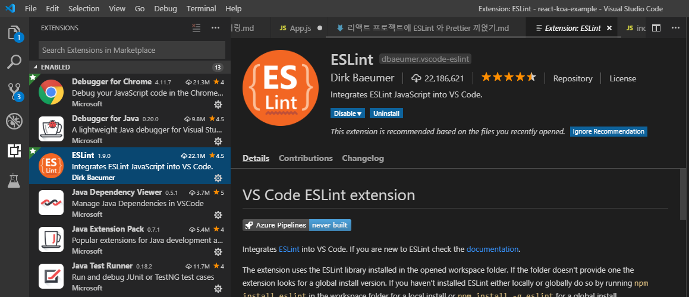

링크: https://marketplace.visualstudio.com/items?itemName=dbaeumer.vscode-eslint

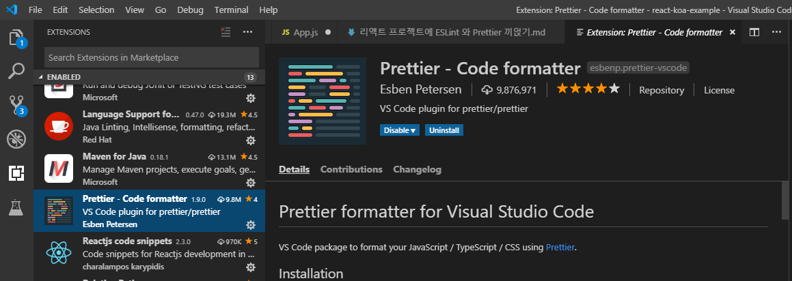

링크: https://marketplace.visualstudio.com/items?itemName=esbenp.prettier-vscode

<br/>
<br/>

### ESlint 작동 확인

익스텐션들을 설치 후 에디터를 재시작하고 나서 만약에 App.js 에서 이상한 코드를 작성하게 된다면 하단에 다음과 같은 오류가 뜰 겁니다.

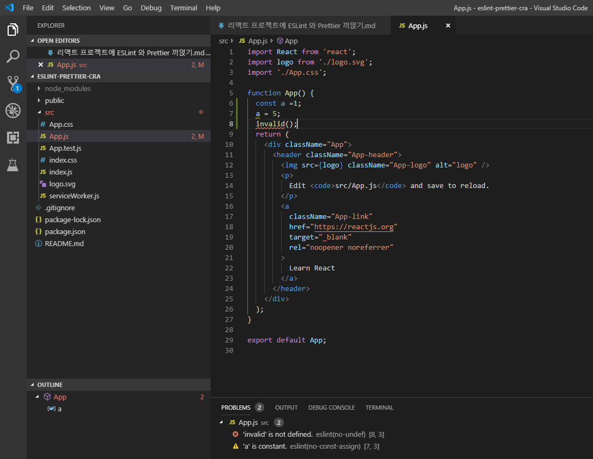

위 코드에선 제가 const 로 선언한 레퍼런스에 값을 재설정 해주었더니 노란색 줄이 나타났습니다 (경고)
그리고, 있지도 않은 invalid 를 사용하려고 했습니다 (오류)

JavaScript 를 최근 입문하셨다면, 기본적으로 설정된 문법옵션도 충분 할 것입니다. 하지만, 조금 더 까다로우면서도 일관적인 규칙을 사용하고 싶으시다면, 다른 개발자들이 많이 사용하는 config 를 불러와서 사용하시면 됩니다.

이는, npm 에서 `eslint-config` 로 시작하는 패키지를 설치해서 사용하면 되는데요, 현재 기준 가장 많이 사용되는건 `airbnb 에서 정의한 자바스크립트 규칙`입니다.

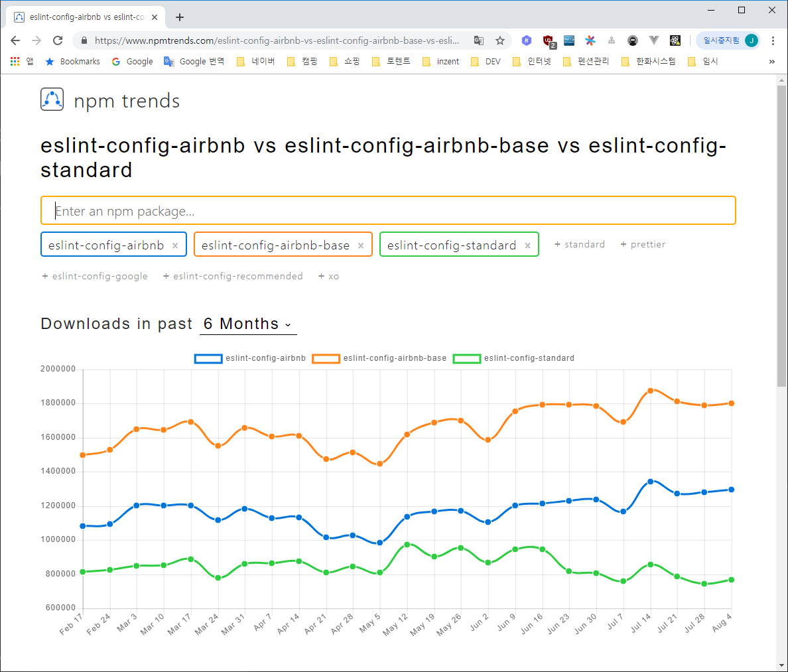

[npm trends](https://www.npmtrends.com/eslint-config-airbnb-vs-eslint-config-airbnb-base-vs-eslint-config-standard)

> 위 통계에서 airbnb vs airbnb-base 의 차이는, airbnb-base 에는 리액트 관련 규칙이 들어있지 않다는 점 입니다.

<br/>
<br/>

### eslint-config-airbnb 적용

그럼 한번, airbnb 코드 스타일을 적용해보겠습니다!

eslint-config-airbnb 를 설치하려면 사전에 설치해야 하는 다른 패키지들이 있습니다. 다음 명령어를 입력해보면 확인 가능한데요:

```
$ npm info "eslint-config-airbnb@latest" peerDependencies

{ eslint: '^4.19.1 || ^5.3.0',
  'eslint-plugin-import': '^2.18.0',
  'eslint-plugin-jsx-a11y': '^6.2.3',
  'eslint-plugin-react': '^7.14.2' }
```

CRA v2 기준, 위 패키지들이 올바른 버전으로 이미 설치가 되어있으니, eslint-config-airbnb 외에 따로 설치할 것이 없으니 그냥 다음 명령어로 설치하시면 됩니다:

```
[yarn]
$ yarn add eslint-config-airbnb

[npm]
$ npm i eslint-config-airbnb
```

그런데 만약에 리액트 프로젝트를 CRA v2 를 통해서 만든게 아니라면 위 패키지들을 직접 설치해주시거나, 다음 명령어를 통하여 한꺼번에 설치하시길 바랍니다.

(CRA v2 사용했으면 이 부분 생략!)

```
$ npx install-peerdeps --dev eslint-config-airbnb
```

ESLint 의 세부 설정은 `package.json` 파일의 `eslintConfig` 부분에서 설정 할 수 있습니다.<br/>
(또는 .eslintrc 파일에서도 할 수 있습니다.)

package.json 을 열어보시면 하단에 다음과 같은 코드가 있을텐데요:

```json
  "eslintConfig": {
    "extends": "react-app"
  },
```

여기에 있는 extends 부분을 이렇게 고치시면됩니다:

```json
  "eslintConfig": {
    "extends": ["react-app", "airbnb"]
  },
```

이렇게 하고 나서 App.js 열어보시면 빨간줄이 엄청나게 그어져 있을 것입니다.

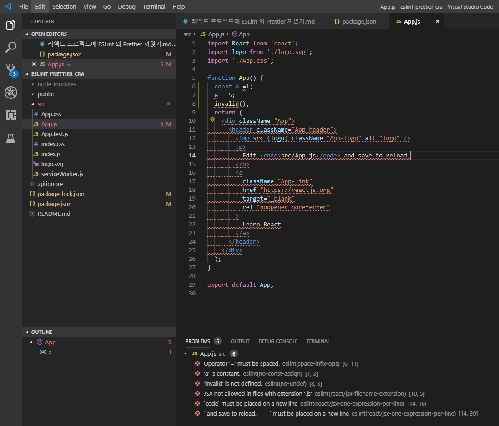

네.. airbnb 규칙은 꽤 까다롭습니다. 이걸, 모두 따라줄 필요는 없습니다. 지금 뜬 오류들은 이런 것들이 있습니다:

- state, 메소드 없으면 class 형 컴포넌트 만들지 말고 stateless 컴포넌트로 만들 것
- JSX 코드는 .jsx 확장자로 할 것
- JSX 안에서 한 줄에 하나만 표현할 것

<br/>
<br/>

### 설정 커스터마이징

따라하기에 너무 불편하거나 불필요한 코드스타일은 제외시킬 수 있습니다. 한번 위에서 뜬 오류들을 끄는 방법에 대해서 알아보겠습니다.

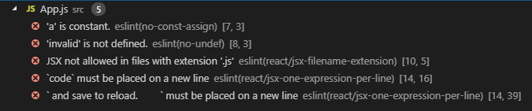

오류의 뒷부분엔 이렇게 에러의 이름이 나타나는데요, 이 이름을 가지고 해당 오류를 끄거나, 경고처리만 해줄 수가 있습니다.

package.json 울 열어서 `eslintConfig` 안에 `rules` 라는 필드를 추가하세요.

그리고, 끄고 싶은 에러는 0, 그리고 경고처리만 하고 싶은 에러는 1로 넣으세요. 우리는 위 에러들은 다 끌꺼니까 0으로 값을 설정하겠습니다.

```json
  "eslintConfig": {
    "extends": ["react-app", "airbnb"],
    "rules": {
      "react/prefer-stateless-function": 0,
      "react/jsx-filename-extension": 0,
      "react/jsx-one-expression-per-line": 0
    }
  },
```

<br/>
<br/>

### ESLint 설정의 env 에 browser 추가

만약에 eslint-airbnb-config 를 적용하셨다면, src/index.js 에서 document 를 사용하려고 하는 부분에서 아마 `no-undef` 라는 오류가 뜰 것입니다.

이를 방지하기 위해선, package.json 에서 eslintConfig 의 `env` 객체에 browser 값을 true 로 설정하셔야 합니다.

```json
  "eslintConfig": {
    "extends": "airbnb",
    "rules": {
      "react/prefer-stateless-function": 0,
      "react/jsx-filename-extension": 0,
      "react/jsx-one-expression-per-line": 0
    },
    "env": {
      "browser": true
    }
  },
```

이렇게 하고 나면 document, window 등의 브라우저 내장 객체들을 조회 할 때도 ESLint 오류 없이 작업 할 수 있습니다.

<br/>
<br/>

### ESLint 검사 무시하기

가끔씩은 ESLint 검사자체를 무시하고 싶은 상황도 발생 할 수 있습니다. 예를 들어, serviceWorker.js 파일의 경우 ESLint 규칙을 어기고 있는데 고칠 필요는 딱히 없죠. 이런 경우는 파일의 최상단에

```javascript
/* eslint-disable */
```

이 한줄을 입력하시면 해당 파일을 ESLint 에서 검사하지 않게 됩니다. 원할땐 특정 구간만 무시 할 수도 있습니다. 이에 대해선 [여기](https://eslint.org/docs/user-guide/configuring#disabling-rules-with-inline-comments) 를 참고하세요.

<br/>
<br/>

### ESLint 오류 자동으로 고치기

일부 ESLint 오류는 자동으로 고쳐질 수 있습니다. 한번 App.js 에서 컴포넌트 상단에 다음 코드를 넣어서 오류를 발생시켜보세요:

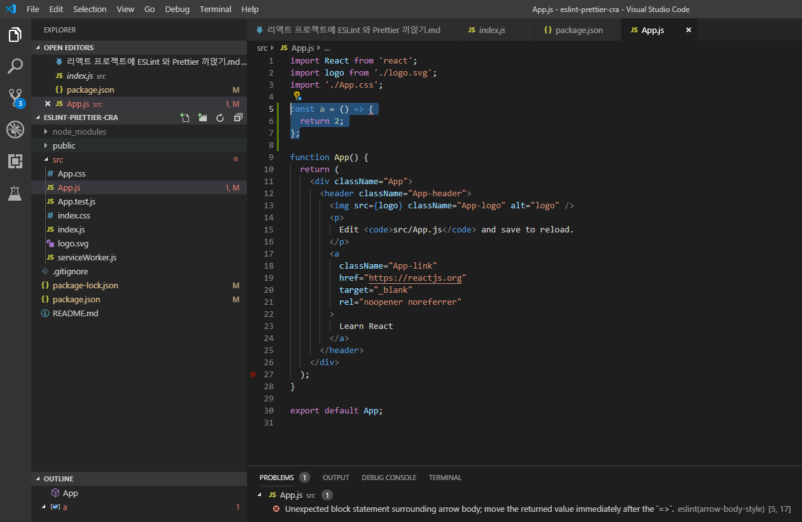

여기서 하단의 문제 부분에 오류가 난 부분을 우클릭해보세요:

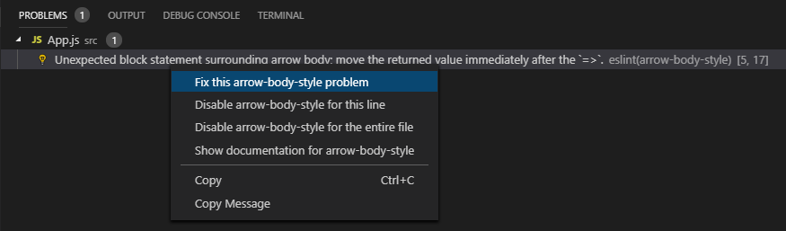

"Fix this arrow-body-style problem" 을 누르시면 자동으로 고쳐집니다.

결국, 이렇게 변하게 되겠죠:

```javascript
const a = () => 2;
```

이렇게 하나하나 클릭하지 않아도, `F1` 키를 누르고 `ESLint: fix` 를 입력하셔서 해당 작업을 수행하시면 고칠수 있는 오류들을 모두 자동으로 고쳐줍니다.

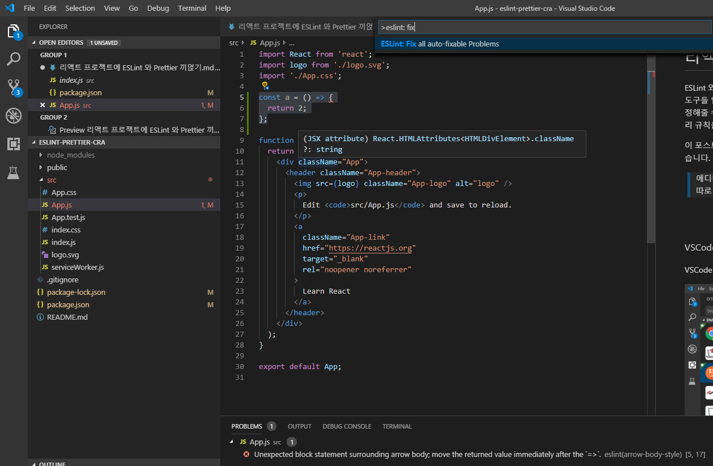

### Prettier 익스텐션 사용하기

[Prettier](https://prettier.io/) 는 정해진 규칙에 따라 자동으로 코드 스타일을 정리해주는 도구입니다. 원래 Prettier 은 CLI 에서 사용하는 도구이며, npm 을 통해서 설치 할 수 있습니다 (참고). 하지만, VSCode 익스텐션으로 설치하셨을 경우엔 따로 설치하실 필요는 없습니다.

이 익스텐션을 사용하기 위해선, 우선 VSCode 에 내장되어있는 자바스크립트 포맷팅 기능을 비활성화하세요. 설정에 들어가서 "Format JavaScript" 를 검색하시고 가장 첫번째로 뜨는것을 체크해제 하시면 됩니다.

`Ctrl + ,`

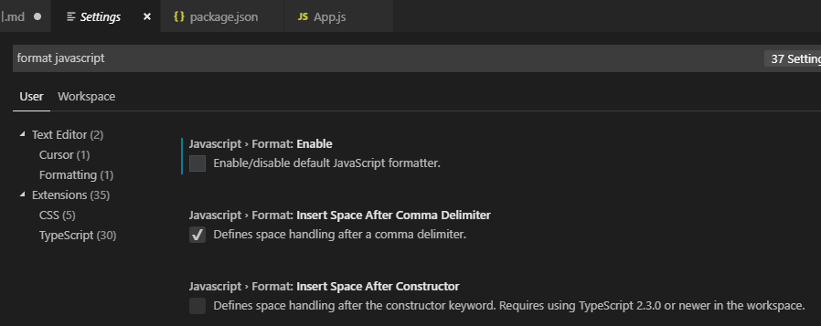

그 다음엔 원하는 자바스크립트 파일에서 `F1` 키를 누르고 `Format Document` 를 찾아서 실행하세요.

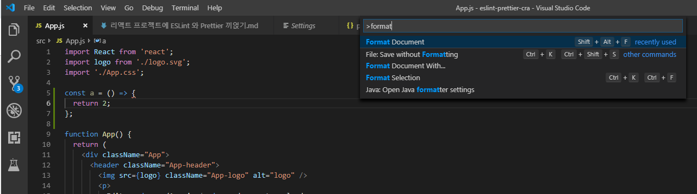

그렇게 하고나면 이런식으로 최상위에 있는 import 구문에서 ' 대신 " 를 사용하게 되어 ESLint 오류가 발생 할 것입니다.

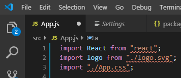

자동으로 정렬하고 코드 스타일을 고치는 과정에서 따옴표를 쌍따옴표로 변경해주었는데요, Prettier 의 특징은 이런 규칙들을 쉽게 커스터마이징 가능하다는 것 입니다.

프로젝트의 루트 디렉토리에 `.prettierrc` 라는 파일을 다음과 같이 생성하세요:

`.prettierrc`

```
{
  "singleQuote": true,
  "semi": true,
  "useTabs": false,
  "tabWidth": 2,
  "trailingComma": "all",
  "printWidth": 80
}
```

현재 이런 규칙이 설정되어있습니다:

- 문자열을 사용 할 때에는 ' 를 사용합니다.
- 코드는 ; 로 끝나야합니다.
- 탭 대신에 스페이스를 사용합니다.
- 들여쓰기 크기는 2칸입니다.
- 객체나 배열을 작성 할 때, 원소 혹은 key-value 의 맨 뒤에있는 것에도 쉼표를 붙입니다.
- 한 줄이 80칸이 넘지 않도록 합니다

다른 옵션들은 [Options](https://prettier.io/docs/en/options.html) 페이지에서 확인 가능하니 참고하세요!

저장을 하시고, 다시 App.js 를 열어서 F1 -> Format Documents 하시면 우리가 정한 설정대로 코드가 깔-끔-해집니다.

### eslint-config-prettier 적용하기

[eslint-config-prettier](https://github.com/prettier/eslint-config-prettier)은 prettier 에서 관리 해 줄 수 있는 코드 스타일의 ESLint 규칙을 비활성화 시켜줍니다. 이것을 사용하게 된다면 ESLint 는 자바스크립트 문법 관련된 것들만 관리하게 되고, 코드스타일 관련 작업은 prettier 가 담당하게 됩니다.

이 라이브러리 말고도 [prettier-eslint](https://github.com/prettier/prettier-eslint) 라는 도구도 있습니다. 이 도구는 prettier 에서 ESLint 설정을 연동해서 사용하게 해주는데요, .prettierrc 같은 파일을 생성하지 않고 온전히 ESLint 설정으로만 관리합니다.

사용률만 따지면 eslint-config-prettier 가 6배정도 더 많이 사용됩니다. 저는 둘 다 사용해봤는데 eslint-config-prettier 를 더 선호합니다. prettier-eslint 를 다루는건 예전 블로그 포스트 [(링크)](https://velopert.com/3671) 에 작성해놨으니 궁금하면 참고해보세요.

우리는 이 튜토리얼에선 `eslint-config-prettier` 를 사용하겠습니다.

이 패키지를 설치하시구요:

```
[yarn]
$ yarn add eslint-config-prettier

[npm]
$ npm i eslint-config-prettier
```

package.json 에서 적용합니다.

```json
  "eslintConfig": {
    "extends": [
      "airbnb",
      "prettier"
    ],
    "rules": {
      "react/prefer-stateless-function": 0,
      "react/jsx-filename-extension": 0,
      "react/jsx-one-expression-per-line": 0
    }
  },
```

그럼 설정 끝~ ESLint 와 Prettier 을 충돌 없이 사용 할 수 있습니다.

<br/>
<br/>

### 코드 저장시 자동으로 코드 정리하기

한번, ESLint 와 Prettier 의 현재 설정에 반하는 코드를 억지로 App.js 에 작성해보세요:

```javascript
const a = () => {
  return "2";
};
```

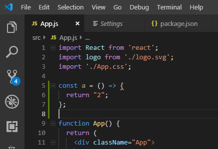

바로 return 하는건데 `{}` 를 열어줘서 ESLint 에서는 오류가 나고 있습니다. 그리고 작은따옴표를 쓰도록 prettier 에서 설정했었는데 이걸 큰따옴표로 해줬죠.

정리하는 작업을 수동으로 해줘도 되지만, 이걸 저장할 때 마다 처리하게끔 하면 굉장히 편합니다! (물론 취향에 따라 갈릴 수도 있습니다)

우선 VSCode 의 설정을 열어주세요.

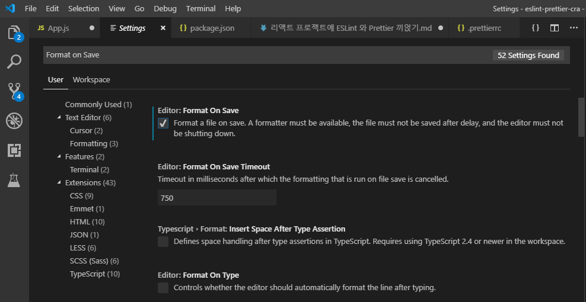

그 다음엔 ESLint 를 검색해서 Auto Fix On Save 체크를 활성화해줍니다.

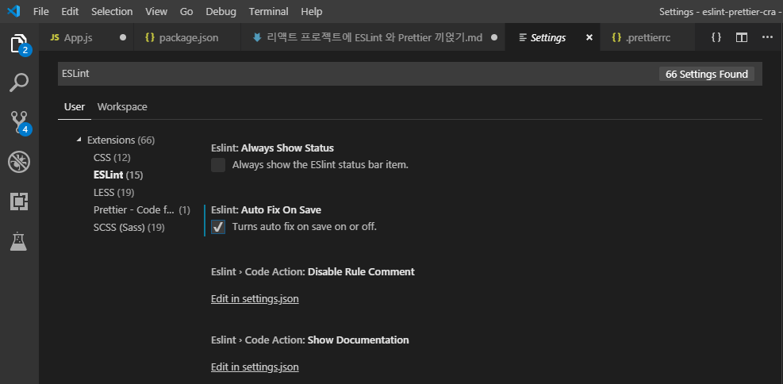

끝~ App.js 를 저장해주면 자동으로 ESLint 와 Prettier 를 통해서 코드를 정리 할 수 있게 됩니다.

<br/>
<br/>

### 정리

Prettier 랑 ESLint 를 프로젝트에 잘 적용하게 되면 앞으로 코드를 작성 할 때 일관적인 코드스타일로 깔끔한 코드를 사용 할 수가 있을 것입니다.

airbnb 규칙의 경우 조금 까다롭기 때문에 불편한 규칙들이 있다면 망설임없이 규칙들을 꺼가면서 개발하세요. 우리가 편하자고 하는건데 도구가 우리를 불편하게 하면 안됩니다.

단, 협업하는 사람이 해당 규칙을 유지하자는 주장을 고수한다면 어쩔수 없이 그대로 두긴 해야겠죠 :)

<br/>
<br/>

> 참조 - 퍼온글
>
> - [velog :: 리액트 프로젝트에 ESLint 와 Prettier 끼얹기](https://velog.io/@velopert/eslint-and-prettier-in-react)
