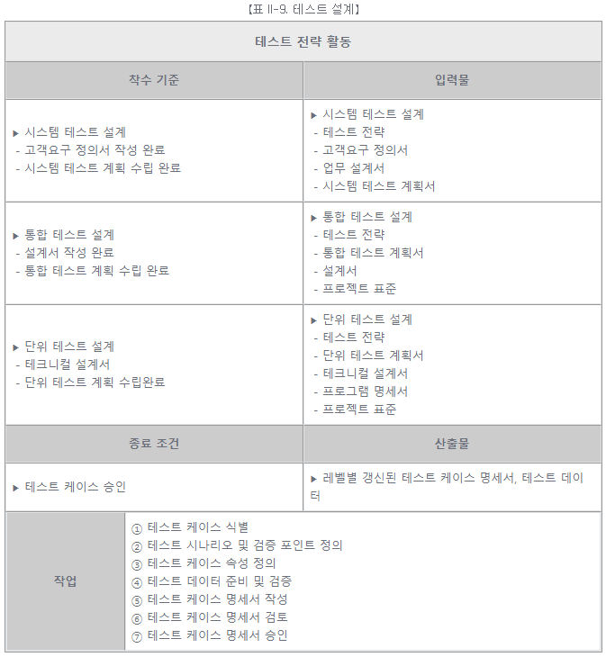
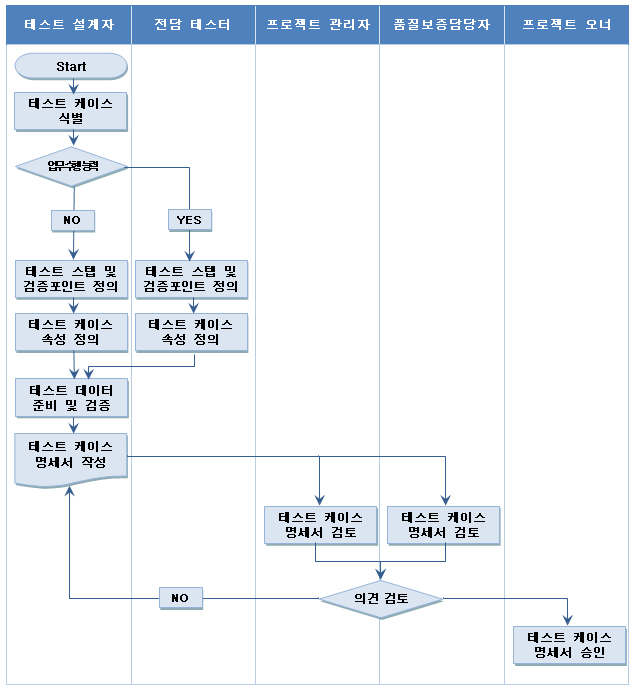

# [공개SW 테스트 가이드] 5. SW 테스트 프로세스 (2) - 테스트 설계

<br/>

출처 - [OSS / [공개SW 테스트 가이드] ⑤ SW 테스트 프로세스 (2) - 테스트 설계](https://www.oss.kr/info_test/show/54d2d3be-406a-44df-bec0-2338e701f412?search_keyword=sw+%ED%85%8C%EC%8A%A4%ED%8A%B8&page=5)

<br/>

## 5. SW 테스트 프로세스 (2)

<br/>

### ▣ 테스트 설계

일반적이고 추상적인 테스트의 목적을 구체적인 상황과 테스트 케이스로 변환하는 단계이다.

- 테스트 설계

  개발 산출물을 이용하여 테스트 케이스를 식별하고 정의하는 활동이다.

<br/>



<br/>

- 테스트 설계 활동의 상세 절차

```
① 테스트 케이스 식별

  프로젝트 특성, 테스트 전략, 해당 테스트 계획서를 기반으로 테스트 케이스를 식별하고 작성한다.

  - 단위 테스트

    ▶ 테스트 전략과 단위 테스트 계획서를 통해 테스트 범위를 정의
    ▶ 프로그램 명세서를 통해 상세 기능을 정의
    ▶ 시스템 개발 시 준수해야 하는 표준을 정의
    ▶ 각 모듈에 대한 단위 테스트 케이스를 식별하고 작성
    ▶ 식별된 테스트 케이스를 검토


  - 통합 테스트

    ▶ 테스트 전략과 통합 테스트 계획서를 통해 테스트 범위를 정의
    ▶ 설계문서를 통하여 통합관점에서의 테스트 대상 기능을 정의
    ▶ 시스템 설계 표준을 정의
    ▶ 통합 테스트 케이스를 식별하고 작성
    ▶ 식별된 통합 테스트 케이스를 검토


  - 시스템 테스트

    ▶ 테스트 전략과 시스템 테스트 계획서를 통해 테스트 범위를 정의
    ▶ 요구사항 명세서, 기능 설계서 등을 기반으로 시스템 기능을 정의
    ▶ 시스템 설계 표준을 정의
    ▶ 시스템 테스트 케이스를 식별하고 작성
    ▶ 식별된 시스템 테스트 케이스를 검토

② 테스트 시나리오 및 검증 포인트 정의

  테스트 케이스를 기반으로 테스트 케이스 시나리오와 테스트 케이스 성공/실패의 기준을 정의한다.

③ 테스트 케이스 속성 정의

  테스트 케이스 별로 작성자, 작성일, 테스트 케이스 ID, 설명, 기대결과 등의 속성을 템플릿에 정의한다.

④ 테스트 데이터(Test Data) 준비 및 검증

  상위 레벨의 테스트 케이스들을 실행 가능한 형태의 실 데이터로 준비한다.

⑤ 테스트 케이스 명세서 작성

  테스트의 효율적이고 효과적인 실행을 위하여 연관성 있는 테스트 케이스를 순서에 맞게 구성하고 테스트 케이스 명세서에 대한 속성을 정의한다.

⑥ 테스트 케이스 명세서 검토

  프로젝트 관리자 및 품질보증 담당자등과 검토 및 협의를 수행한다.

⑦ 테스트 케이스 명세서 승인

  작성된 테스트 케이스에 대한 승인을 요청한다.
```

<br/>



【그림 II-6. 테스트 설계 활동 작업 흐름도】

<br/>
