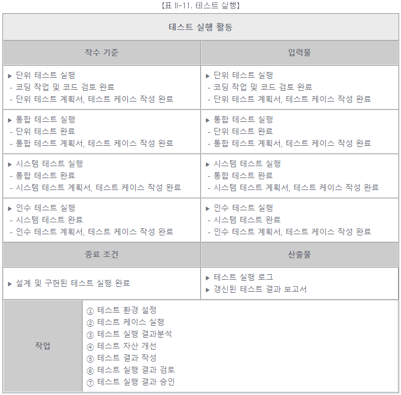
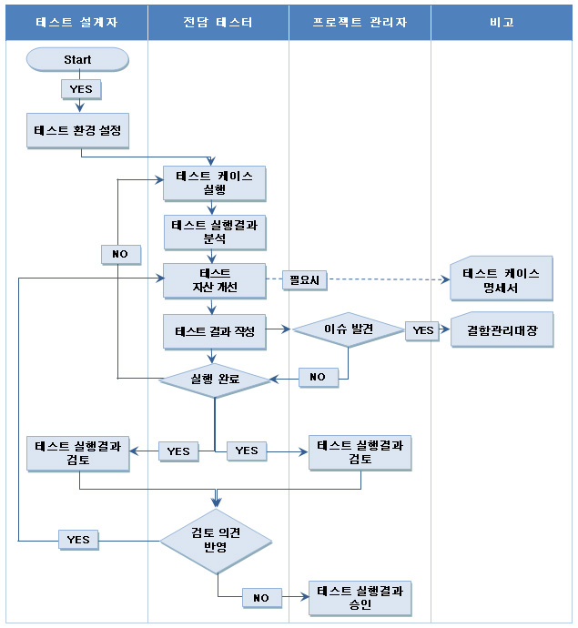

# [공개SW 테스트 가이드] 5. SW 테스트 프로세스 (4) - 테스트 실행

<br/>

출처 - [OSS / [공개SW 테스트 가이드] ⑤ SW 테스트 프로세스 (4) - 테스트 실행](https://www.oss.kr/info_test/show/8307ddd2-ace9-47e4-a006-8b861820697b?search_keyword=sw+%ED%85%8C%EC%8A%A4%ED%8A%B8&page=5)

<br/>

## 5. SW 테스트 프로세스 (4)

<br/>

### ▣ 테스트 실행

계획 및 구현된 테스트 활동을 실제로 실행하는 단계이다.

- 테스트 실행

  준비되어 있는 테스트 케이스를 각 테스트 레벨별 테스트 계획에 따라 실행하는 활동이다.

<br/>



<br/>

```
① 테스트 환경설정

  테스트 계획서에 명시된 테스트 환경을 설정한다. 테스트 환경에는 HW와 지원 SW를 포함한다.

② 테스트 케이스 실행

  해당 테스트 케이스를 실행한다. 자동화 도구를 사용할 경우, 테스트 자동화 스크립트를 실행한다.

③ 테스트 케이스 결과분석

  실패로 기록된 테스트 실행 결과를 분석하여 사용자의 단순한 에러인지 결함인지를 판단하여,
  결함 관리대장에 기록하고, 발견된 결함을 결함관리대장 양식을 이용하여 기록한 후 결함 내역,
  결함 분류, 결함 발생 단계, 결함 심각도 등의 속성을 고려하여 입력한다.

④ 테스트 자산 개선

  테스트를 수행하면서 변경된 테스트 케이스, 테스트 요구사항, 테스트 데이터 등을 업데이트 한다.

⑤ 테스트 결과 작성

  테스트 케이스 명세서에 해당 테스트 케이스 실행 결과를 작성한다.

⑥ 테스트 실행 결과 검토

  작성된 테스트 결과 및 결함조치 내역을 취합하여 프로젝트 관리자와 검토 및 협의를 수행한다.

⑦ 테스트 실행 결과 승인

  테스트 케이스에 대한 승인을 요청한다.
```

<br/>



【그림 II-8. 테스트 실행 활동 작업 흐름도】

<br/>
