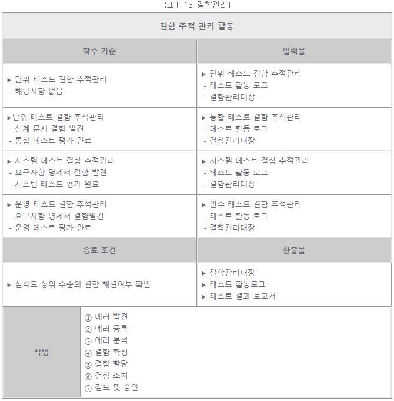
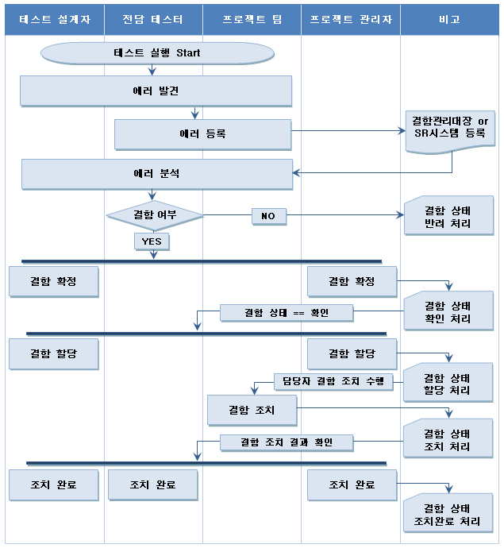

# [공개SW 테스트 가이드] 5. SW 테스트 프로세스 (6) - 결함관리

<br/>

출처 - [OSS / [공개SW 테스트 가이드] ⑤ SW 테스트 프로세스 (6) - 결함관리](https://www.oss.kr/info_test/show/eab3b712-9880-4c6e-aeb1-d2e80f4fb59e?search_keyword=sw+%ED%85%8C%EC%8A%A4%ED%8A%B8&page=4)

<br/>

## 5. SW 테스트 프로세스 (6)

<br/>

### ▣ 결함관리

결함 관리 활동을 수행하여 발생한 결함의 재발생을 막고, 유사 결함 발견 시 처리 시간을 단축하기 위한 활동이다.

<br/>



<br/>

- 결함관리 활동의 상세 절차

```
① 에러 발견

  요구사항 분석, 설계, 테스트 수행 중에 에러가 발견될 경우,
  전문 테스터와 프로젝트 팀과 의논한다.

② 에러 등록

  결함관리대장에 발견된 에러를 등록한다.

③ 에러 분석

  등록된 에러를 분석하여 단순 에러인지 실제 결함인지를 분석한다.

④ 결함 확정

  등록된 내용이 결함으로 확정 될 경우, 결함을 결함확정 상태로 설정한다.

⑤ 결함 할당

  결함을 해결할 담당자를 지정하고, 해당 결함을 할당한다. 이때 결함은 할당 상태가 된다.

⑥ 결함 조치

  결함에 대한 수정 활동을 수행하고, 수정활동이 완료된 경우 결함을 결함조치 상태로 설정한다.

⑦ 결함 조치 검토 및 승인

  수정이 완료된 결함에 대한 확인 테스트를 수행하여, 정상적으로 결함이 수정되었는지를 확인한다.
  정상적으로 조치 완료된 경우 결함을 조치완료 상태로 설정한다.
```

<br/>



<br/>
