# VirtualBox 6.0 설치하기

<br/>

**테스트 환경**

- OS : Windows 10 Pro 64 Bit
- CPU : Intel(R) Core(TM) i7-8550U CPU @ 1.80GHz
- Memory : 32GB
- Disk : 1TB

<br/>

**VirtualBox Downloads Web Site**

> https://www.virtualbox.org/wiki/Downloads

> https://download.virtualbox.org/virtualbox

> https://download.virtualbox.org/virtualbox/6.0.14/

<br/>

**VirtualBox Direct Download Link**

> https://download.virtualbox.org/virtualbox/6.0.14/VirtualBox-6.0.14-133895-Win.exe

> https://download.virtualbox.org/virtualbox/6.0.14/Oracle_VM_VirtualBox_Extension_Pack-6.0.14.vbox-extpack

<br/>

## 1. Hyper-V 비활성화

<br/>

VirtualBox를 사용하기 위해서는 Hyper-V를 비활성화해줘야 합니다.

Hyper-V는 하이퍼바이저(Hypervisor) TYPE 1이라서 설치만 되어 있어도 윈도우는 가상 머신이 됩니다.

따라서 VirtualBox에서 Intel VT-x 또는 AMD-V를 사용할 수 없어 문제가 됩니다.

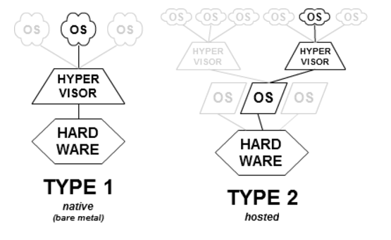

Hyper-V 활성화 여부를 확인하기 위해 'Windows 기능 켜기/끄기' 창을 실행 합니다.

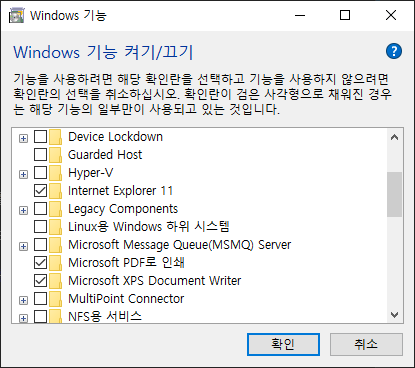

`Hyper-V 항목을 체크 해제`하고 확인을 클릭합니다. 윈도우를 재부팅을 해주어야 적용이 됩니다.

<br/>

## 2. CPU의 가상화 지원 확인

<br/>

64bit의 게스트 운영체제 설치 또는 가상 머신에서 멀티 코어 CPU의 기능을 사용하기 위해서는 바이오스에서 가상화 지원을 활성화 시켜야 합니다.

컴퓨터 부팅시 F2 또는 Del 키등을 눌러서 바이오스로 들어갑니다.

바이오스 회사마다 차이는 있지만 보통 Advanced Mode에서 가상 지원 항목을 찾을 수 있습니다.

Intel VT-x (Virtualization Technology) 또는 AMD-V (AMD Virtualization) 항목이 Disable 되어 있으면 `Enable로 변경`합니다.

<br/>

## 3. VirtualBox 설치

<br/>

VirtualBox는 다음 링크에서 다운로드 받을 수 있습니다.

> https://www.virtualbox.org/wiki/Downloads

두가지 파일을 다운로드 받아야 합니다.

**VirtualBox platform packages** 항목에 있는 **Windows hosts**를 클릭하여 **VirtualBox 설치 파일**을 다운로드 받습니다.

**VirtualBox Oracle VM VirtualBox Extension Pack**에 있는 **All supported platforms**를 클릭하여 **VirtualBox 확장 기능 패키지**를 다운로드 받습니다.

다운로드 받은 VirtualBox 설치 파일 VirtualBox-6.0.14-133895-Win.exe을 실행하여 설치를 시작합니다.

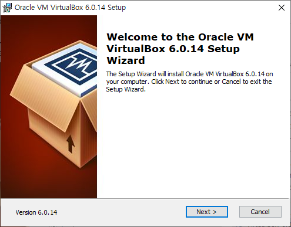

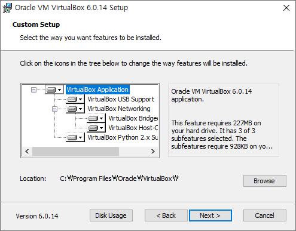

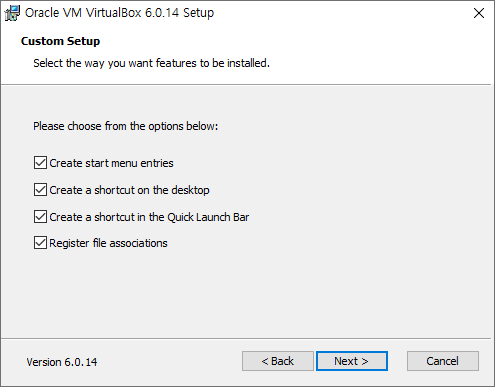

VirtualBox에서 호스트 운영체제와 게스트 운영체제 간에 통신을 위해 사용되는 네트워크 인터페이스를 설치합니다.

Yes를 클릭합니다.

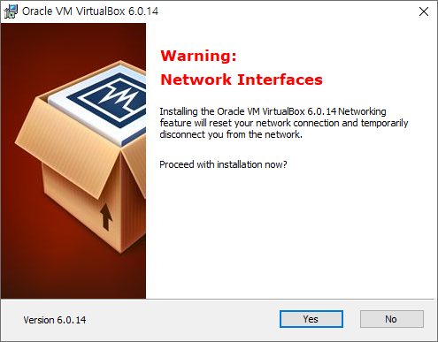

Install을 클릭합니다. 운영체제에 따라 사용자 계정 컨트롤이 보일 경우 예를 클릭합니다.

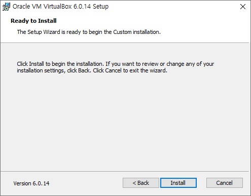

VirtualBox 관련 디바이스 드라이버 설치 여부를 물어보면 설치를 클릭합니다.

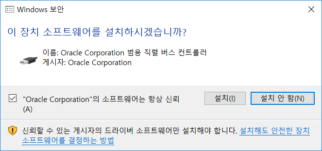

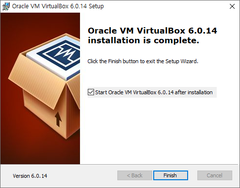

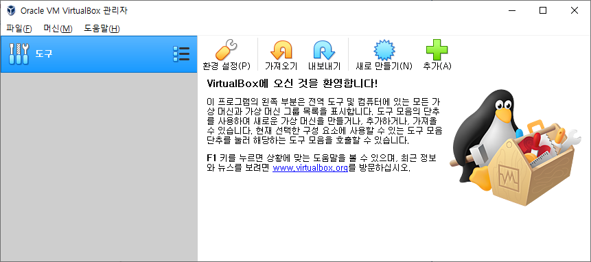

새로운 가상머신을 만들기 전에 가상머신 확장팩을 설치해야 합니다.

미리 다운로드 받아놓았던 **VirtualBox Extension Pack** 파일 `Oracle_VM_VirtualBox_Extension_Pack-6.0.14.vbox-extpack` 을 더블 클릭합니다.

**VirtualBox 확장 기능 패키지** 설치 여부를 물어보는 메시지 박스가 보여집니다.

**설치 버튼**을 클릭하여 설치를 진행합니다.

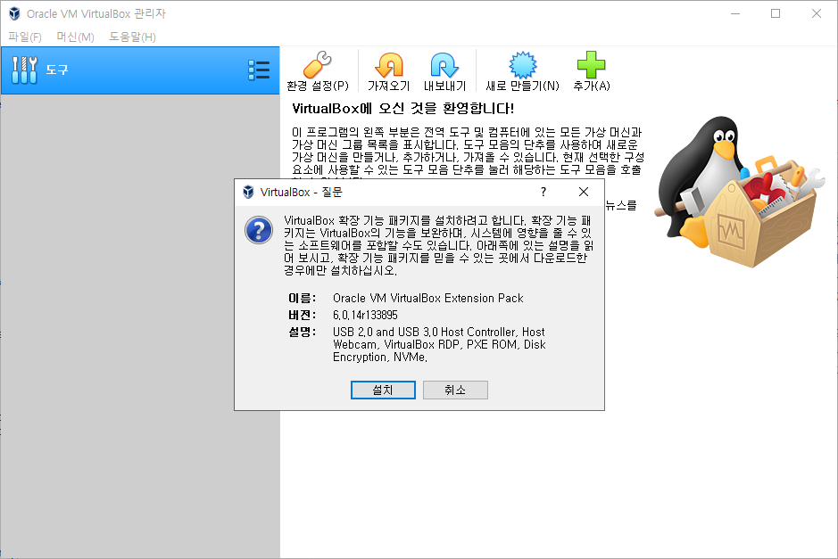

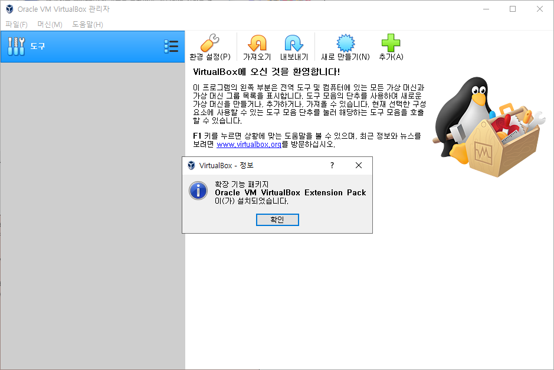

다음과 같은 에러가 발생하면 백신의 실시간 검사 기능을 중지시켜 보세요.

```
The installer failed with exit code 1: VBoxExtPackHelperApp.exe: error: Failed to rename the temporary directory to the final one: VERR_ACCESS_DENIED ('C:\Program Files\Oracle\VirtualBox\ExtensionPacks\Oracle_VM_VirtualBox_Extension_Pack-_-inst-12268' -&gt; 'C:\Program Files\Oracle\VirtualBox\ExtensionPacks\Oracle_VM_VirtualBox_Extension_Pack')


rcExit=1.


결과 코드: E_FAIL (0x80004005)

구성 요소: ExtPackManagerWrap

인터페이스: IExtPackManager {edba9d10-45d8-b440-1712-46ac0c9bc4c5}
```

Kaspersky의 경우 보호 일시 중지를 선택하면 해결됩니다.

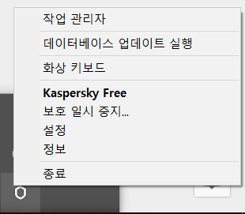

실행해서 처음 보이는 윈도우를 VirtualBox 관리자라고 부릅니다.

왼쪽에 위치하는 패널에 생성한 가상머신의 리스트가 보이게 됩니다.

현재 가상 머신을 만들지 않았기 때문에 목록은 비어 있습니다.

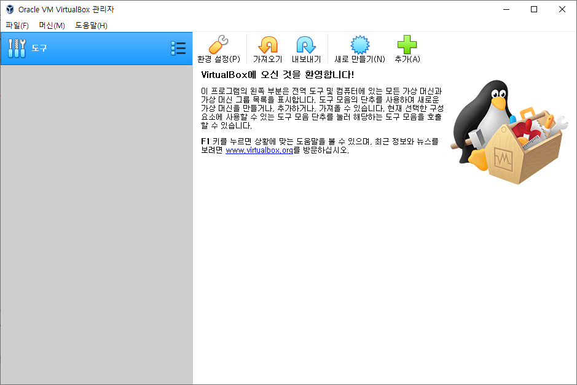

VirtualBox 관리자에서 가상 머신을 시작, 일시 중지, 전원 끄기 등을 할 수 있습니다.

생성된 각 가상 머신은 독립적으로 설정 및 실행됩니다.

<br/>

## 4. VirtualBox 환경 설정

<br/>

메뉴에서 `File > 환경 설정`을 선택합니다.

일반 항목에서 가상 머신이 저장되는 위치를 변경할 수 있습니다. HDD보다는 SSD에 저장해야 더 빠르게 동작합니다.

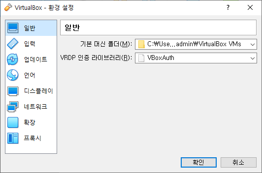

`입력` 항목의 `가상 머신` 탭을 선택합니다.

디폴트 호스트 키인 오른쪽 Ctrl키는 제대로 동작 안하기 때문에 변경해야 합니다.

`호스트 키 조합` 옆에 있는 `Right Control`을 클릭한 후 원하는 단축키를 누르고 엔터키를 누르면 설정이 변경됩니다.

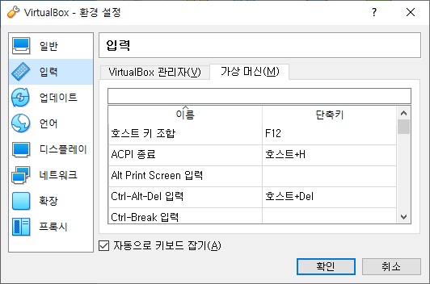

`네트워크` 항목을 선택 후 `NatNetwork`를 추가 합니다.

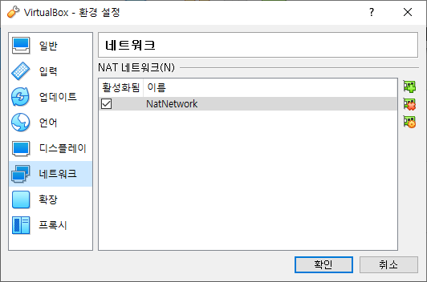

더이상 바꿀 항목이 없습니다. 확인 버튼을 클릭하여 설정을 저장합니다.
