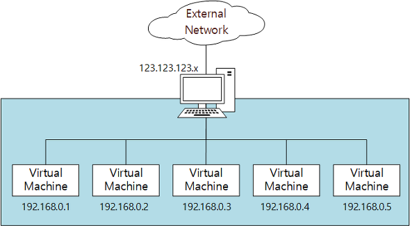
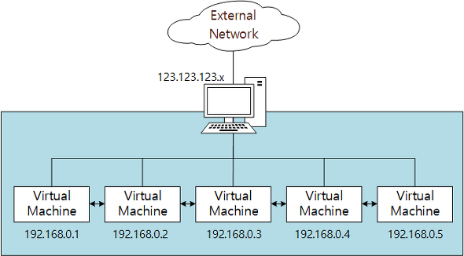
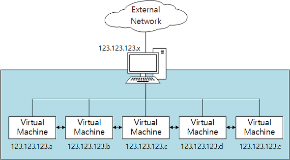
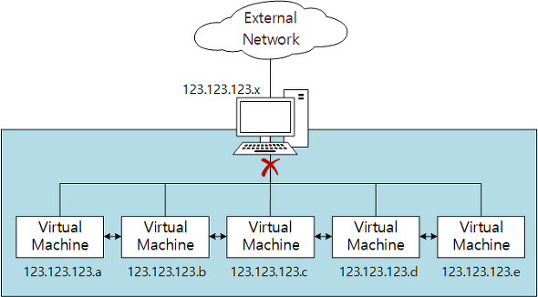
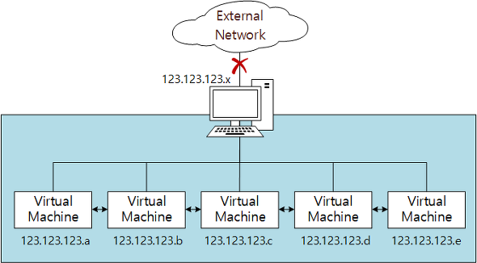

# 네트워크 설정 종류별 특징

 

참조글 링크 - [[VirtualBox] 네트워크 설정](https://jm4488.tistory.com/37)

 

### VirtualBox 네트워크 종류

- NAT
- NAT 네트워크
- 브리지 어댑터
- 내부 네트워크
- 호스트 전용 어댑터
- 일반 드라이버

 

## 1. NAT (Network Address Translation)

 

- 가상머신 내부 네트워크 -> Host PC 외부 네트워크 단방향 통신 가능
- Host PC 내의 가상 머신 간의 통신 불가능

 

## 2. NAT Network

 

- 가상머신 내부 네트워크 -> Host PC 외부 네트워크 단방향 통신 가능
- Host PC 내의 가상 머신 간의 통신 가능

 

## 3. 브리지 어댑터 (Bridged Adapter)

 

- Host PC와 동등한 수준의 네트워크 구성
- 추가의 IP 할당이 필요함

 

## 4. 내부 네트워크 (Internal Network)

- Host PC와 독립적인 내부 네트워크
- 같은 Host PC 내의 가상 머신 간 연결이 가능

 

## 5. 호스트 전용 어댑터 (Host-only Adapter)

- Host PC를 포함한 내부 네트워크 (외부 네트워크와는 단절)
- 같은 Host PC 내의 가상 머신 간 연결이 가능

 

## 6. 일반 드라이버 (Generic Driver)

- 거의 사용되지 않는 모드
- UDP Tunnel networking과 VDE(Virtual Distributed Ethernet) 지원
