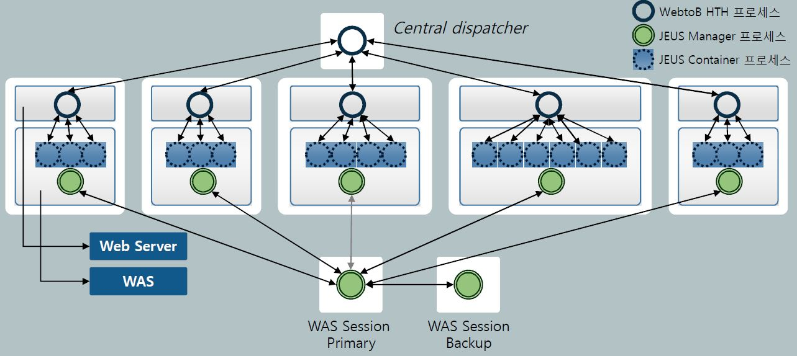

# [Web Application Server] Architecture (WEB / WAS 부문)

 

> 출처 - [나라의 IT 잡아먹기](https://waspro.tistory.com/331)

 

## 1. 아키텍쳐 설계 시 고려사항

- 관리편의성

  - 시스템 구성 및 배포에 관한 AP 수정사항 없이 파일 재배치 및 웹 서버/WAS 환경설정 변경만으로 시스템 구성이 가능해야 합니다.
  - 여러 업무별 연관성이 많아 통합 View를 제공해야 하는 조건에서는 단일 시스템에 여러 Instance를 두어 통합 관리하거나 필요 시 계정을 나누어 연계할 수 있어야 합니다.
  - 용도별로 서버를 분리함에 따라 서버 별 관리 포인트를 최소화하여 장애를 국소화할 수 있어야 합니다.

- 안정성

  - 웹 서버, WAS 모두 이중화 하여 요청이 급증하거나 돌발적인 시스템 장애 발생 시 가용성 및 확장성을 보장해야 합니다.

- 성능

  - 부하 상황, 병목 구간 등을 고려한 아키텍처 재구성이 가능해야 합니다.

- 비용절감

  - 적절한 H/W구성을 통하여 유휴장비를 용도별로 활용할 수 있어야 합니다.
  - 시스템 안정성 향상에 의한 유지보수 비용을 절감할 수 있어야 합니다.

- 확장성

  - 향후 예정되지 않은 업무 확장으로 인한 시스템 증설이 필요한 경우라도 수평/수직적 확장을 통해 시스템 확장 구성이 가능해야 합니다.
  - 단일 Node에서 업무 확장성을 고려한 충분한 시스템 Sizing이 선행되어야 합니다.

 

## 2. 일반적인 아키텍쳐

사용자의 요청은 Web서버-WAS서버-DB서버 순으로 처리된 후 응답됩니다. Web서버에는 주로 정적인 컨텐츠를, WAS서버는 동적인 컨텐츠를 처리합니다.

 

## 3. 성능을 위한 아키텍쳐

### a. WebServer

하단 이미지 1번과 같이 Client 요청을 Multi-Process / Multi-Thread 방식으로 처리하여 대용량 처리 및 성능 향상이 가능하다.

- Client 요청에 따라서 해당 요청을 처리하기 위한 Process/Thread를 기동한다.
- 동시에 들어오는 Client 요청 처리가 가능하고 리소스의 효율적인 사용으로 성능이 향상된다.

하단 이미지 2번과 같이 다수의 Client 요청을 하나의 Process가 받아 처리하는 Multiplexing 방식을 제공한다.

- 1번 방식과 마찬가지로 요청 동시 처리 및 리소스의 효율적 사용으로 성능이 향상된다.
- Manager 에 의해 엔진 및 AP Process를 관리하여 1번 방식에 비해 안정성이 향상된다.

### b. WebServer <-> WasServer

Load Balancing을 통한 요청 분산으로 성능이 향상된다.

- Load Balancing을 통한 요청 분산으로 동시에 처리할 수 있는 요청 수가 증가한다.
- 요청건수가 적은 경우 단일 H/W에 Web서버와 WAS서버를 설치하여 성능향상이 가능하다.

### c. Clustering

Web서버 Clustering과 WAS서버 Clustering을 이용하여 동시 처리 능력 향상 가능하고, Clustering을 통해 장애발생 시에도 효율적이고 안정적인 부하 분산으로 적절한 장애 대응이 가능합니다.

 

## 4. 관리 편의성을 위한 아키텍쳐

다양한 관리 툴 제공으로 운영관리 편리성을 향상한다.

- Web서버 및 WAS서버 업체는 웹 기반 관리, 로그 분석 툴을 제공하여 운영관리 편리성을 도모한다.
- 3rd Party APM을 이용하여 Web서버와 WAS서버 모니터링 및 관리가 가능하다.

 

## 5. 보안강화를 위한 아키텍쳐

### a. Firewall을 이용하여 허용된 포트 이외의 접근 금지

- Firewall을 클라이언트와 Web서버, Web서버와 WAS서버 사이에 두어서 허용된 포트 이외의 접근을 금지하여 보안을 강화한다.
- 일부 WAS서버는 Reverse Connection Pooling을 도입하여 보안을 강화하면서도 연결 편의성을 도모한다.

### b. WAS서버의 보안 서비스 제공

- WAS서버는 J2EE 어플리케이션 별로 별도의 보안 서비스 제공 (보안 도메인 개념)한다.
- 보안 표준을 준수함으로써 기존 3rd party 보안 제품과의 통합을 제공하여 보안 강화가 가능하다.

 

## 6. 장애예방 및 대처 용이성을 위한 아키텍쳐

### a. 장애 국소화

- 단일 Node : 엔진 장애 시 WAS서버 내 서버 관리자에 의한 엔진 자동 재 시작 기능을 제공한다.
- 클러스터 Node : 백업 엔진 기동을 통한 Node 백업 기능을 제공한다.

### b. WAS서버 내 자동 엔진 관리 설정으로 Thread Hang-up 자동 복구하고, 설정된 thread 관리 정책보다 thread hang-up 수치가 높으면, 관리자에게 메일을 보내고, 컨테이너를 재 시작함으로써 장애를 자동 관리하는 기능을 제공합니다.

### c. WAS서버 기능 중 JDBC Connection 누수 관리 기능

- 잘못 작성된 프로그램으로 인한 커넥션 고갈을 엔진에서 자동으로 감지하여 강제 반환시켜 주는 기능을 제공한다.

지금까지 설명한 내용들은 WEB / WAS 서버를 선택하는 필수조건이라 할수 있습니다. 각 사이트에 맞는 다양한 기능 제공 여부는 디펜던시한 내용이라 포함시키지 않았음을 알려드립니다.

이제 실제 사이트에 반영할만한 예시를 들어보겠습니다.

 

## 1안. WEB/WAS 통합 방안

주요구성요소는 다음과 같습니다.

- 전체 장비 중 2대는 JEUS 세션 서버, 나머지는 WebtoB/JEUS가 설치된다.
- WebtoB 와 JEUS가 동일 서버의 경우 Pipe 통신 적용가능하다.
- Node Clustering 적용이 가능하다.

앞서 주요항목으로 살펴봤던 사항의 측정치를 알아 보겠습니다.

- 관리편의성

  - 모든 서버에 WebtoB/JEUS가 설치, 관리 되어야 하므로 서버 별 관리포인트가 증가한다.

- 안정성

  - WebtoB 와 JEUS간 이중화가 고려되지 않아 장애발생시 문제점이 있다.
  - H/W적 이중화 구성으로 장애 발생시 영향이 낮다.
  - 기존아키텍처를 그대로 수용함으로써 위험 요소가 작다.

- 성능

  - 경험적으로 기존의 성능을 가져갈 수 있을 것이라 추정된다.

- 비용절감

  - 요청건수 증가에 따른 H/W 추가 증설 시 비용을 고려해야 한다.

- 확장성

  - 수직적/수평적 확장 가능하다.

대체적으로 기존 성능을 유지하며, 확장성이 용이하다는 장점이 있지만, 성능 향상을 꾀할 수 없고, 장애 발생 시 대처 방안에 문제점이 있다고 할 수 있다.

 

## 2안. 별도 Webserver 구축 방안

주요 구성요소는 다음과 같습니다.

- 웹 서버 중 이미지 서버를 별도로 구성하는 방안이다.
- 서버당 WebtoB HTH 개수 : 2~3개, JEUS 컨테이너 수 : 2~4개 (분석 후 정확히 산출)를 구성한다.
- 중앙집중식 세션서버(세션 클러스터링), 세션 라우팅, WebtoB-JEUS는 별도의 Load Balancing으로 사용한다.
- 이미지 서버를 2대로 클러스터링 하여 별도 분리(이미지 서버 용도의 H/W사양 고려) 한다.

앞서 주요항목으로 살펴봤던 사항의 측정치를 알아 보겠습니다.

- 관리편의성

  - 웹 서버와 WAS를 분리함으로써 역할 구분하여 보다 적절히 장애 대응할 수 있다.
  - 용도별 서버분리 세분화 (이미지 서버를 별도로 구성)한다.
  - 시스템 구성 및 배포에 관한 AP수정사항은 필요치 않으며 파일 재배치 및 웹 서버/WAS 환경설정 변경만으로 시스템 구성이 가능하다.

- 안정성

  - 웹 서버/WAS 모두 이중화 하여, 요청이 급증하거나 돌발적인 시스템 장애 발생 시 가용성 및 확장성을 보장한다.

- 성능

  - 이미지서버를 별도로 두어 성능 향상을 꾀할 수 있다.
  - AP 신규 작성 후 부하테스트를 통해 튜닝이 필요하다.

- 비용절감

  - H/W 정확한 용량산정이 이뤄지지 않을 경우 수평적 확장에 의한 H/W 비용이 발생한다.

- 확장성

  - 수평적/수직적 확장가능 (기존 서버에 컨테이너 추가 또는 신규서버에 JEUS 설치) 하다.

대체적으로 몇몇 요소에서 성능 향상 포인트를 찾을 수 있으며, 확장에 용이함을 알 수 있습니다.

 

## 3안. 도메인 분할 연결 방식

- 웹 서버가 각 WAS의 Container와 균등하게 연결되는 형태 (H/W 구성을 반영, 웹 서버2ea/WAS 3ea)이다.
- 서버당 WebtoB HTH 개수 : 2~3개, JEUS 컨테이너 수 : 2~4개 (분석 후 정확히 산출) 구성한다.
- 중앙집중식 세션서버 (세션 클러스터링), 세션 라우팅 기능을 사용한다.
- WebtoB-JEUS는 별도의 Load Balancing 사용한다.

앞서 주요항목으로 살펴봤던 사항의 측정치를 알아 보겠습니다.

- 관리편의성

  - 웹 서버와 WAS를 분리함으로써 역할 구분하여 보다 적절한 장애상황을 대응 할 수 있다.
  - 기존아키텍쳐에 비해 관리포인트가 감소한다.
  - 시스템 구성 및 배포에 관한 AP수정사항은 필요치 않으며 파일 재배치 및 웹 서버/WAS 환경설정 변경만으로 시스템 구성 가능하다.
  - 세션 라우팅 기능 사용 시 장애추적에 용이다.
  - WebtoB-JEUS Clustering 시 규칙을 정하지 않으면 향후 수평 확장 시 복잡성이 증가한다.

- 안정성

  - 웹 서버/WAS 모두 이중화 하여, 요청이 급증하거나 돌발적인 시스템 장애 발생 시 가용성 및 확장성을 보장한다.

- 성능

  - AP 신규 작성 후 부하테스트를 통해 튜닝이 필요하다.

- 비용절감

  - None

- 확장성

  - 수평적/수직적 확장가능 하다.

 

## 결론

WEB/WAS 아키텍쳐는 정답이 정해져 있지 않다. 사이트의 특성과 클라이언트의 사용패턴을 분석하고, 비용을 고려하며, 특히 클라우드 환경까지 고민한다면 확장성 측면도 무시할 수 없다.

운영자, 개발자, 엔지니어, 그리고 이를 사용하는 클라이언트의 의견이 적극 반영되어 최적을 환경을 구축하는 것은 모두의 의무이자 역할이라 할 수 있다.

위 포스팅이 앞으로 WEB/WAS를 도입하고자 고민하는 모든 사이트 고객들에게 도움이 되었으면 하는 바람이다.

고맙습니다.
